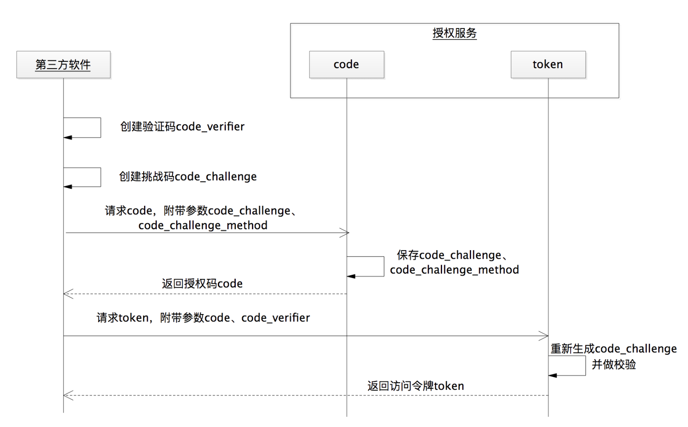
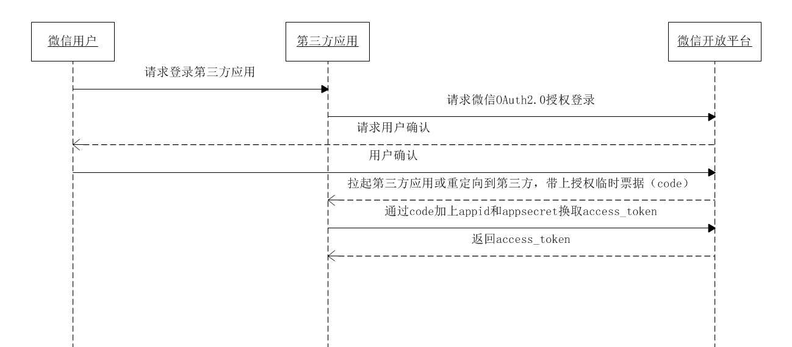
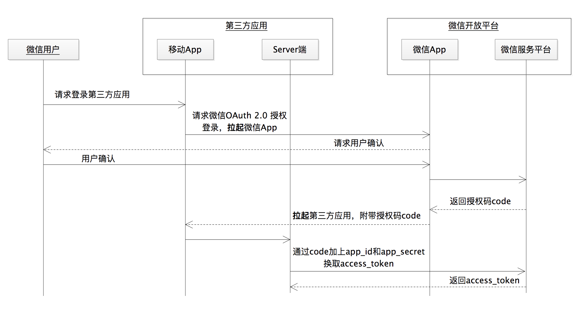

---
date: "2019-06-23"
---  
      
# 07 | 如何在移动App中使用OAuth 2.0？
你好，我是王新栋。

在前面几讲中，我都是基于Web应用的场景来讲解的OAuth 2.0。除了Web应用外，现实环境中还有非常多的移动App。那么，在移动App中，能不能使用OAuth 2.0 ，又该如何使用OAuth 2.0呢？

没错，OAuth 2.0最初的应用场景确实是Web应用，但是它的伟大之处就在于，它把自己的核心协议定位成了一个框架而不是单个的协议。这样做的好处是，我们可以基于这个基本的框架协议，在一些特定的领域进行扩展。

因此，到了桌面或者移动的场景下，OAuth 2.0的协议一样适用。考虑到授权码许可是最完备、最安全的许可类型，所以我在讲移动App如何使用OAuth 2.0的时候，依然会用授权码许可来讲解，毕竟“要用就用最好的”。

当我们开发一款移动App的时候，可以选择没有Server端的 “纯App” 架构，比如这款App不需要跟自己的Server端通信，或者可以调用其它开放的HTTP接口；当然也可以选择有服务端的架构，比如这款App还想把用户的操作日志记录下来并保存到Server端的数据库中。

那总结下来呢，移动App可以分为两类，一类是没有Server端的App应用，一类是有Server端的App应用。

<!-- [[[read_end]]] -->


这两类App在使用 OAuth 2.0 时的最大区别，在于获取访问令牌的方式：

* 如果有Server端，就建议通过Server端和授权服务做交互来换取访问令牌；
* 如果没有Server端，那么只能通过前端通信来跟授权服务做交互，比如在上一讲中提到的隐式许可授权类型。当然，这种方式的安全性就降低了很多。

有些时候，我们可能觉得自己开发一个App不需要一个Server端。那好，就让我们先来看看没有Server端的App应用如何使用授权码许可类型。

## 没有Server端的App

在一个没有Server端支持的纯App应用中，我们首先想到的是，如何可以像Web服务那样，让请求和响应“来去自如”呢。

你可能会想，我是不是可以将一个“迷你”的Web服务器嵌入到App里面去，这样不就可以像Web应用那样来使用OAuth 2.0 了么？确实，这是行得通的，而且已经有App这样做了。

这样的App通过监听运行在localhost上的Web服务器URI，就可以做到跟普通的Web应用一样的通信机制。但这种方式不是我们这次要讲的重点，如果你想深入了解可以去查些资料。因为当使用这种方式的时候，请求访问令牌时需要的app\_secret就只能保存在用户本地设备上，而这并不是我们所建议的。

到这里，你应该猜到了，问题的关键在于如何保存app\_secret，因为App会被安装在成千上万个终端设备上，app\_secret一旦被破解，就将会造成灾难性的后果。这时，有的同学突发奇想，如果不用app\_secret，也能在授权码流程里换回访问令牌access\_token，不就可以了吗？

确实可以，但新的问题也来了。在授权码许可类型的流程中，如果没有了app\_secret这一层的保护，那么通过授权码code换取访问令牌的时候，就只有授权码code在“冲锋陷阵”了。这时，授权码code一旦失窃，就会带来严重的安全问题。那么，我既不使用app\_secret，还要防止授权码code失窃，有什么好的方法吗？

有，OAuth 2.0 里面就有这样的指导方法。这个方法就是我们将要介绍的PKCE协议，全称是Proof Key for Code Exchange by OAuth Public Clients。

在下面的流程图中，为了突出第三方软件使用PKCE协议时与授权服务之间的通信过程，我省略了受保护资源服务和资源拥有者的角色：



我来和你分析下这个流程中的重点。

首先，App自己要生成一个随机的、长度在43\~128字符之间的、参数为**code\_verifier**的字符串验证码；接着，我们再利用这个**code\_verifier，**来生成一个被称为“挑战码”的参数**code\_challenge**。

那怎么生成这个code\_challenge的值呢？OAuth 2.0 规范里面给出了两种方法，就是看code\_challenge\_method这个参数的值：

 *    一种code\_challenge\_method=plain，此时code\_verifier的值就是code\_challenge的值；
 *    另外一种code\_challenge\_method=S256，就是将code\_verifier值进行ASCII编码之后再进行哈希，然后再将哈希之后的值进行BASE64-URL编码，如下代码所示。

```
    code_challenge = BASE64URL-ENCODE(SHA256(ASCII(code_verifier)))
    

```

好了，我知道有这样两个值，也知道它们的生成方法了，但这两个值跟我们的授权码流程有什么关系呢，又怎么利用它们呢？不用着急，我们接着讲。

授权码流程简单概括起来不是有两步吗，第一步是获取授权码code，第二步是用app\_id+app\_secret+code获取访问令牌access\_token。刚才我们的“梦想”不是设想不使用app\_secret，但同时又能保证授权码流程的安全性么？

没错。code\_verifier和code\_challenge这两个参数，就是来帮我们实现这个“梦想”的。

在**第一步获取授权码code的时候，我们使用code\_challenge**参数。需要注意的是，我们要同时将code\_challenge\_method参数也传过去，目的是让授权服务知道生成code\_challenge值的方法是plain还是S256。

```
    https://authorization-server.com/auth?
    response_type=code&
    app_id=APP_ID&
    redirect_uri=REDIRECT_URI&
    code_challenge=CODE_CHALLENGE&
    code_challenge_method=S256
    

```

在**第二步获取访问令牌的时候，我们使用code\_verifier参数**，授权服务此时会将code\_verifier的值进行一次运算。那怎么运算呢？就是上面code\_challenge\_method=S256的这种方式。

没错，第一步请求授权码的时候，已经告诉授权服务生成code\_challenge的方法了。所以，在第二步的过程中，授权服务将运算的值跟第一步接收到的值做比较，如果相同就颁发访问令牌。

```
    POST https://api.authorization-server.com/token?
      grant_type=authorization_code&
      code=AUTH_CODE_HERE&
      redirect_uri=REDIRECT_URI&
      app_id=APP_ID&
      code_verifier=CODE_VERIFIER
    

```

现在，你就知道了我们是如何使用code\_verifier和code\_challenge这两个参数的了吧。总结一下就是，换取授权码code的时候，我们使用code\_challenge参数值；换取访问令牌的时候，我们使用code\_verifier参数值。那么，有的同学会继续问了，我们为什么要这样做呢。

现在，就让我来和你分析一下。

我们的愿望是，没有Server端的手机App，也可以使用授权码许可流程，对吧？app\_secret不能用，因为它只能被存在用户的设备上，我们担心被泄露。

那么，在没有了app\_secret这层保护的前提下，即使我们的授权码code被截获，再加上code\_challenge也同时被截获了，那也没有办法由code\_challenge逆推出code\_verifier的值。而恰恰在第二步换取访问令牌的时候，授权服务需要的就是code\_verifier的值。因此，这也就避免了访问令牌被恶意换取的安全问题。

现在，我们可以通过PKCE协议的帮助，让没有Server端的App也能够安全地使用授权码许可类型进行授权了。但是，按照 OAuth 2.0 的规范建议，通过后端通信来换取访问令牌是较为安全的方式。所以呢，在这里，我想跟你探讨的是，我们真的不需要一个Server端吗？在做移动应用开发的时候，我们真的从设计上就决定废弃Server端了吗？

## 有Server端的App

如果你开发接入过微信登录，就会在微信的官方文档上看到下面这句话：

> 微信 OAuth 2.0 授权登录目前支持 authorization\_code 模式，适用于拥有 Server 端的应用授权。

没错，微信的OAuth 2.0 授权登录，就是建议我们需要一个Server端来支持这样的授权接入。

那么，有Server端支持的App又是如何使用OAuth 2.0 的授权码许可流程的呢？其实，在前面几讲的基础上，我们现在理解这样的场景并不是什么难事儿。

我们仍以微信登录为例，看一下[官方的流程图](https://developers.weixin.qq.com/doc/oplatform/Website_App/WeChat_Login/Wechat_Login.html)：



看到这个图，你是不是觉得特别熟悉，跟普通的授权码流程没有区别，仍是两步走的策略：第一步换取授权码code，第二步通过授权码code换取访问令牌access\_token。

这里的第三方应用，就是我们作为开发者来开发的应用，包含了移动App和Server端。我们将其“放大”得到下面这张图：



我们从这张“放大”的图中，就会发现有Server端的App在使用授权码流程的时候，跟普通的Web应用几乎没有任何差别。

大概流程是：当我们访问第三方App的时候，需要用到微信来登录；第三方App可以拉起微信的App，我们会在微信的App里面进行登录及授权；微信Server端验证成功之后会返回一个授权码code，通过微信App传递给了第三方App；后面的流程就是我们熟悉的使用授权码code和app\_secret，换取访问令牌access\_token的值了。

这次使用app\_secret的时候，我们是在第三方App的Server端来使用的，因此安全性上没有任何问题。

## 总结

今天这一讲，我重点和你讲了两块内容，没有Server端的App和有Server端的App分别是如何使用授权码许可类型的。我希望你能够记住以下两点内容。

1.  我们使用OAuth 2.0协议的目的，就是要起到安全性的作用，但有些时候，因为使用不当反而会造成更大的安全问题，比如将app\_secret放入App中的最基本错误。如果放弃了app\_secret，又是如何让没有Server端的App安全地使用授权码许可协议呢？针对这种情况，我和你介绍了PKCE协议。它是一种在失去app\_secret保护的时候，防止授权码失窃的解决方案。
2.  我们需要思考一下，我们的App真的不需要一个Server端吗？我建议你在开发移动App的时候，尽可能地都要搭建一个Server端，因为通过后端通信来传输访问令牌比通过前端通信传输要安全得多。我也举了微信的例子，很多官方的开放平台在提供OAuth 2.0服务的时候，都会建议开发者要有一个相应的Server端。

那么，关于OAuth 2.0 的使用还有哪些安全方面的防范措施是我们要注意的呢，接下来的一讲中我们会重点跟大家介绍。

## 思考题

在移动App中，你还能想到有哪些相对安全的方式来使用OAuth 2.0吗？

欢迎你在留言区分享你的观点，也欢迎你把今天的内容分享给其他朋友，我们一起交流。