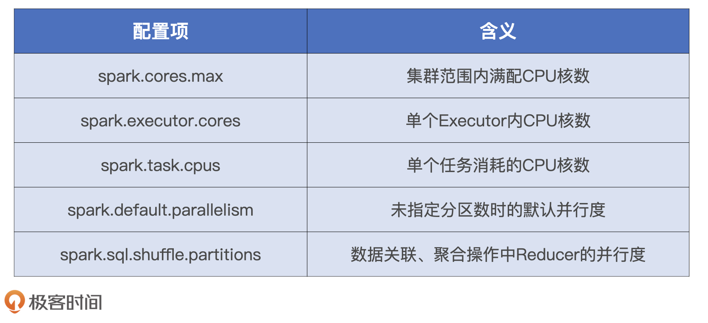
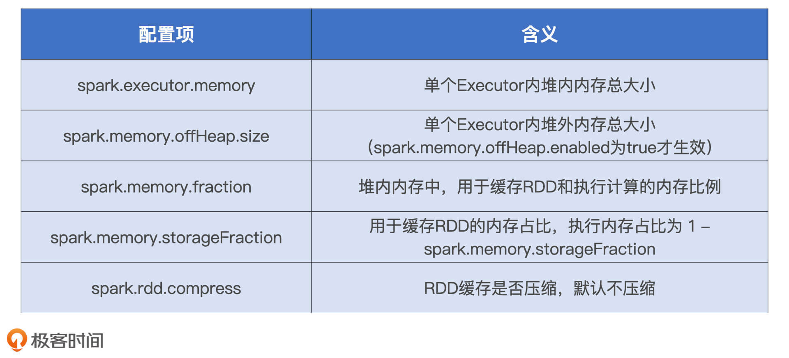
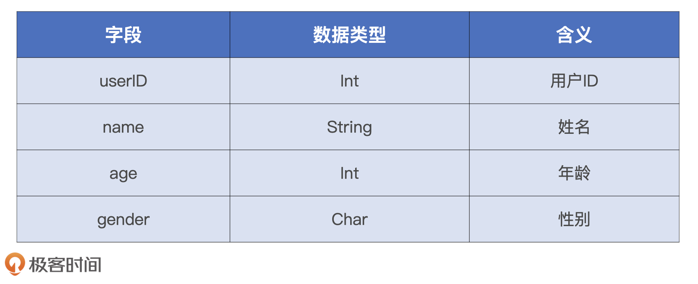
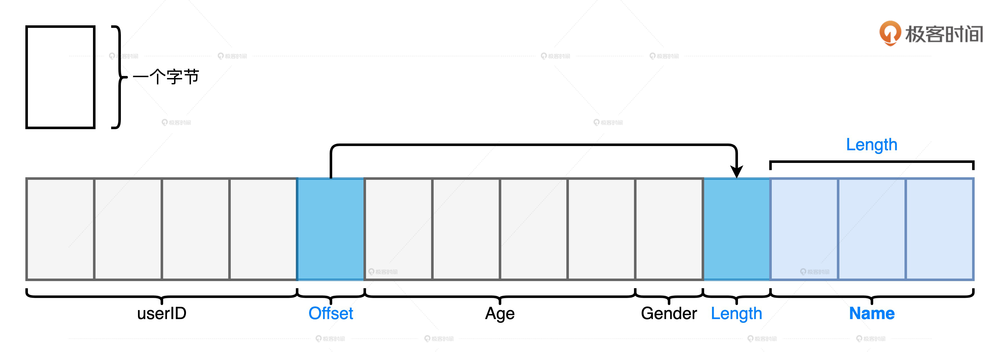
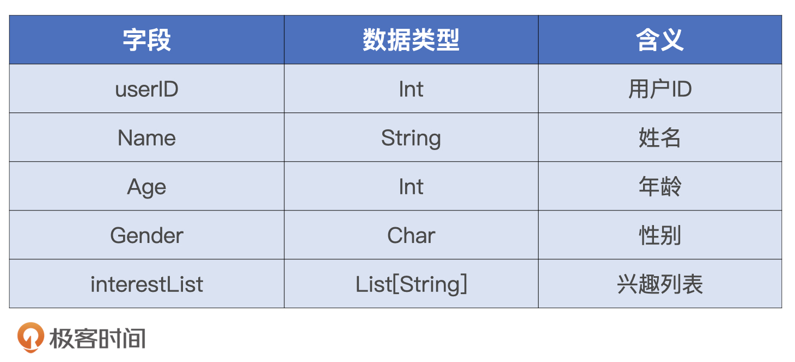
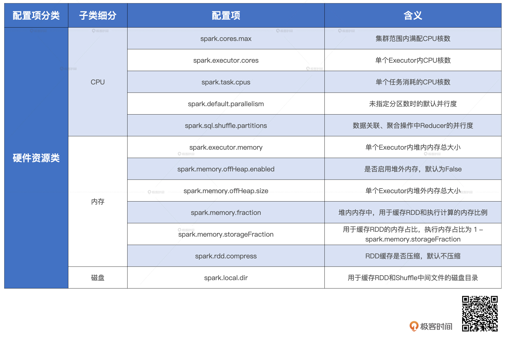

---
date: "2019-06-23"
---  
      
# 09 | 调优一筹莫展，配置项速查手册让你事半功倍！（上）
你好，我是吴磊。

对于Spark性能调优来说，应用开发和配置项设置是两个最主要也最常用的入口。但在日常的调优工作中，每当我们需要从配置项入手寻找调优思路的时候，一打开Spark官网的Configuration页面，映入眼帘的就是上百个配置项。它们有的需要设置True或False，有的需要给定明确的数值才能使用。这难免让我们蒙头转向、无所适从。

所以我经常在想，如果能有一份Spark配置项手册，上面分门别类地记录着与性能调优息息相关的配置项就好了，肯定能省去不少麻烦。

那么，接下来的两讲，我们就来一起汇总这份手册。这份手册可以让你在寻找调优思路的时候，迅速地定位可能会用到的配置项，不仅有章可循，还能不丢不漏，真正做到事半功倍！

## 配置项的分类

事实上，能够显著影响执行性能的配置项屈指可数，更何况在Spark分布式计算环境中，计算负载主要由Executors承担，Driver主要负责分布式调度，调优空间有限，因此对Driver端的配置项我们不作考虑，**我们要汇总的配置项都围绕Executors展开**。那么，结合过往的实践经验，以及对官网全量配置项的梳理，我把它们划分为3类，分别是硬件资源类、Shuffle类和Spark SQL大类。

<!-- [[[read_end]]] -->

为什么这么划分呢？我们一一来说。

**首先，硬件资源类包含的是与CPU、内存、磁盘有关的配置项。**我们说过，调优的切入点是瓶颈，定位瓶颈的有效方法之一，就是从硬件的角度出发，观察某一类硬件资源的负载与消耗，是否远超其他类型的硬件，而且调优的过程收敛于所有硬件资源平衡、无瓶颈的状态，所以掌握资源类配置项就至关重要了。这类配置项设置得是否得当，决定了应用能否打破瓶颈，来平衡不同硬件的资源利用率。

**其次，Shuffle类是专门针对Shuffle操作的。**在绝大多数场景下，Shuffle都是性能瓶颈。因此，我们需要专门汇总这些会影响Shuffle计算过程的配置项。同时，Shuffle的调优难度也最高，汇总Shuffle配置项能帮我们在调优的过程中锁定搜索范围，充分节省时间。

**最后，Spark SQL早已演化为新一代的底层优化引擎。**无论是在Streaming、Mllib、Graph等子框架中，还是在PySpark中，只要你使用DataFrame API，Spark在运行时都会使用Spark SQL做统一优化。因此，我们需要梳理出一类配置项，去充分利用Spark SQL的先天性能优势。

我们一再强调硬件资源的平衡才是性能调优的关键，所以今天这一讲，我们就先从硬件资源类入手，去汇总应该设置的配置项。在这个过程中，我会带你搞清楚这些配置项的定义与作用是什么，以及它们的设置能解决哪些问题，让你为资源平衡打下基础。下一讲，我们再来讲Shuffle类和Spark SQL大类。

## 哪些配置项与CPU设置有关？

首先，我们先来说说与CPU有关的配置项，**主要包括spark.cores.max、spark.executor.cores和spark.task.cpus这三个参数**。它们分别从集群、Executor和计算任务这三个不同的粒度，指定了用于计算的CPU个数。开发者通过它们就可以明确有多少CPU资源被划拨给Spark用于分布式计算。

为了充分利用划拨给Spark集群的每一颗CPU，准确地说是每一个CPU核（CPU Core），你需要设置与之匹配的并行度，并行度用spark.default.parallelism和spark.sql.shuffle.partitions这两个参数设置。对于没有明确分区规则的RDD来说，我们用spark.default.parallelism定义其并行度，spark.sql.shuffle.partitions则用于明确指定数据关联或聚合操作中Reduce端的分区数量。

说到并行度（Parallelism）就不得不提并行计算任务（Paralleled Tasks）了，这两个概念关联紧密但含义大相径庭，有不少同学经常把它们弄混。

并行度指的是分布式数据集被划分为多少份，从而用于分布式计算。换句话说，**并行度的出发点是数据，它明确了数据划分的粒度**。并行度越高，数据的粒度越细，数据分片越多，数据越分散。由此可见，像分区数量、分片数量、Partitions这些概念都是并行度的同义词。

并行计算任务则不同，它指的是在任一时刻整个集群能够同时计算的任务数量。换句话说，**它的出发点是计算任务、是CPU，由与CPU有关的三个参数共同决定**。具体说来，Executor中并行计算任务数的上限是spark.executor.cores与spark.task.cpus的商，暂且记为#Executor-tasks，整个集群的并行计算任务数自然就是#Executor-tasks乘以集群内Executors的数量，记为#Executors。因此，最终的数值是：#Executor-tasks \* #Executors。

我们不难发现，**并行度决定了数据粒度，数据粒度决定了分区大小，分区大小则决定着每个计算任务的内存消耗**。在同一个Executor中，多个同时运行的计算任务“基本上”是平均瓜分可用内存的，每个计算任务能获取到的内存空间是有上限的，因此并行计算任务数会反过来制约并行度的设置。你看，这两个家伙还真是一对相爱相杀的冤家！

至于，到底该怎么平衡并行度与并行计算任务两者之间的关系，我们留到后面的课程去展开。这里，咱们只要记住和CPU设置有关配置项的含义、区别与作用就行了。



## 哪些配置项与内存设置有关？

说完CPU，咱们接着说说与内存管理有关的配置项。我们知道，在管理模式上，Spark分为堆内内存与堆外内存。

堆外内存又分为两个区域，Execution Memory和Storage Memory。要想要启用堆外内存，我们得先把参数spark.memory.offHeap.enabled置为true，然后用spark.memory.offHeap.size指定堆外内存大小。堆内内存也分了四个区域，也就是Reserved Memory、User Memory、Execution Memory和Storage Memory。

内存的基础配置项主要有5个，它们的含义如下表所示：



简单来说，**这些配置项决定了我们刚才说的这些区域的大小**，这很好理解。工具有了，但很多同学在真正设置内存区域大小的时候还会有各种各样的疑惑，比如说：

* 内存空间是有限的，该把多少内存划分给堆内，又该把多少内存留给堆外呢？
* 在堆内内存里，该怎么平衡User Memory和Spark用于计算的内存空间？
* 在统一内存管理模式下，该如何平衡Execution Memory和Storage Memory？

别着急，接下来，咱们一个一个来解决。

### 堆外与堆内的平衡

相比JVM堆内内存，off heap堆外内存有很多优势，如更精确的内存占用统计和不需要垃圾回收机制，以及不需要序列化与反序列化。你可能会说：“既然堆外内存这么厉害，那我们干脆把所有内存都划分给它不就得了？”先别急着下结论，我们先一起来看一个例子。

用户表1记录着用户数据，每个数据条目包含4个字段，整型的用户ID、String类型的姓名、整型的年龄和Char类型的性别。如果现在要求你用字节数组来存储每一条用户记录，你该怎么办呢？



我们一起来做一下。首先，除姓名外其它3个字段都是定长数据类型，因此可以直接安插到字节数组中。对于变长数据类型如String，由于我们事先并不知道每个用户的名字到底有多长，因此，为了把name字段也用字节数组的形式存储，我们只能曲线救国：先记录name字段的在整个字节数组内的偏移量，再记录它的长度，最后把完整的name字符串安插在字节数组的末尾，如下图所示。



尽管存储String类型的name字段麻烦一些，但我们总算成功地用字节数组容纳了每一条用户记录。OK，大功告成！

你可能会问：“做这个小实验的目的是啥呢？”事实上，Spark开辟的堆外内存就是以这样的方式来存储应用数据的。**正是基于这种紧凑的二进制格式，相比JVM堆内内存，Spark通过Java Unsafe API在堆外内存中的管理，才会有那么多的优势。**

不过，成也萧何败也萧何，字节数组自身的局限性也很难突破。比如说，如果用户表1新增了兴趣列表字段，类型为List\[String\]，如用户表2所示。这个时候，如果我们仍然采用字节数据的方式来存储每一条用户记录，不仅越来越多的指针和偏移地址会让字段的访问效率大打折扣，而且，指针越多，内存泄漏的风险越大，数据访问的稳定性就值得担忧了。



因此，当数据模式（Data Schema）开始变得复杂时，Spark直接管理堆外内存的成本将会非常高。

那么，针对有限的内存资源，我们该如何平衡JVM堆内内存与off heap堆外内存的划分，我想你心中也该有了答案。**对于需要处理的数据集，如果数据模式比较扁平，而且字段多是定长数据类型，就更多地使用堆外内存。相反地，如果数据模式很复杂，嵌套结构或变长字段很多，就更多采用JVM堆内内存会更加稳妥。**

### User Memory与Spark可用内存如何分配？

接下来，我们再来说说User Memory。我们都知道，参数spark.memory.fraction的作用是明确Spark可支配内存占比，换句话说，就是在所有的堆内空间中，有多大比例的内存可供Spark消耗。相应地，1 \- spark.memory.fraction就是User Memory在堆内空间的占比。

因此，**spark.memory.fraction参数决定着两者如何瓜分堆内内存，它的系数越大，Spark可支配的内存越多，User Memory区域的占比自然越小**。spark.memory.fraction的默认值是0.6，也就是JVM堆内空间的60\%会划拨给Spark支配，剩下的40\%划拨给User Memory。

那么，User Memory都用来存啥呀？需要预留那么大的空间吗？简单来说，User Memory存储的主要是开发者自定义的数据结构，这些数据结构往往用来协助分布式数据集的处理。

举个例子，还记得调度系统那一讲Label Encoding的例子吗？

```
    /**
    实现方式2
    输入参数：模板文件路径，用户兴趣字符串
    返回值：用户兴趣字符串对应的索引值
    */
     
    //函数定义
    val findIndex: (String) => (String) => Int = {
    (filePath) =>
    val source = Source.fromFile(filePath, "UTF-8")
    val lines = source.getLines().toArray
    source.close()
    val searchMap = lines.zip(0 until lines.size).toMap
    (interest) => searchMap.getOrElse(interest, -1)
    }
    val partFunc = findIndex(filePath)
     
    //Dataset中的函数调用
    partFunc("体育-篮球-NBA-湖人")
    
    

```

在这个例子中，我们先读取包含用户兴趣的模板文件，然后根据模板内容构建兴趣到索引的映射字典。在对千亿样本做Lable Encoding的时候，这个字典可以快速查找兴趣字符串，并返回对应索引，来辅助完成数据处理。像这样的映射字典就是所谓的自定义数据结构，这部分数据都存储在User Memory内存区域。

因此，**当在JVM内平衡Spark可用内存和User Memory时，你需要考虑你的应用中类似的自定义数据结构多不多、占比大不大？然后再相应地调整两块内存区域的相对占比**。如果应用中自定义的数据结构很少，不妨把spark.memory.fraction配置项调高，让Spark可以享用更多的内存空间，用于分布式计算和缓存分布式数据集。

## Execution Memory该如何与Storage Memory平衡？

最后，咱们再来说说，Execution Memory与Storage Memory的平衡。在内存管理那一讲，我给你讲了一个黄四郎地主招租的故事，并用故事中的占地协议类比了执行内存与缓存内存之间的竞争关系。执行任务与RDD缓存共享Spark可支配内存，但是,执行任务在抢占方面有更高的优先级。

因此通常来说，在统一内存管理模式下，spark.memory.storageFraction的设置就显得没那么紧要，因为无论这个参数设置多大，执行任务还是有机会抢占缓存内存，而且一旦完成抢占，就必须要等到任务执行结束才会释放。

不过，凡事都没有绝对，**如果你的应用类型是“缓存密集型”，如机器学习训练任务，就很有必要通过调节这个参数来保障数据的全量缓存**。这类计算任务往往需要反复遍历同一份分布式数据集，数据缓存与否对任务的执行效率起着决定性作用。这个时候，我们就可以把参数spark.memory.storageFraction调高，然后有意识地在应用的最开始把缓存灌满，再基于缓存数据去实现计算部分的业务逻辑。

但在这个过程中，**你要特别注意RDD缓存与执行效率之间的平衡**。为什么这么说呢？

首先，RDD缓存占用的内存空间多了，Spark用于执行分布式计算任务的内存空间自然就变少了，而且数据分析场景中常见的关联、排序和聚合等操作都会消耗执行内存，这部分内存空间变少，自然会影响到这类计算的执行效率。

其次，大量缓存引入的GC（Garbage Collection，垃圾回收）负担对执行效率来说是个巨大的隐患。

你还记得黄四郎要招租的土地分为托管田和自管田吗？托管田由黄四郎派人专门打理土地秋收后的翻土、整平等杂务，为来年种下一茬庄稼做准备。堆内内存的垃圾回收也是一个道理，JVM大体上把Heap堆内内存分为年轻代和老年代。年轻代存储生命周期较短、引用次数较低的对象；老年代则存储生命周期较长、引用次数高的对象。因此，像RDD cache这种一直缓存在内存里的数据，一定会被JVM安排到老年代。

年轻代的垃圾回收工作称为Young GC，老年代的垃圾回收称为Full GC。每当老年代可用内存不足时，都会触发JVM执行Full GC。在Full GC阶段，JVM会抢占应用程序执行线程，强行征用计算节点中所有的CPU线程，也就是“集中力量办大事”。当所有CPU线程都被拿去做垃圾回收工作的时候，应用程序的执行只能暂时搁置。只有等Full GC完事之后，把CPU线程释放出来，应用程序才能继续执行。这种Full GC征用CPU线程导致应用暂停的现象叫做“Stop the world”。

因此，Full GC对于应用程序的伤害远大于Young GC，并且GC的效率与对象个数成反比，对象个数越多，GC效率越差。这个时候，对于RDD这种缓存在老年代中的数据，就很容易引入Full GC问题。

一般来说，为了提升RDD cache访问效率，很多同学都会采用以对象值的方式把数据缓存到内存，因为对象值的存储方式避免了数据存取过程中序列化与反序列化的计算开销。我们在RDD/DataFrame/Dataset之上调用cache方法的时候，默认采用的就是这种存储方式。

但是，采用对象值的方式缓存数据，不论是RDD，还是DataFrame、Dataset，每条数据样本都会构成一个对象，要么是开发者自定义的Case class，要么是Row对象。换句话说，老年代存储的对象个数基本等于你的样本数。因此，当你的样本数大到一定规模的时候，你就需要考虑大量的RDD cache可能会引入的Full GC问题了。

基于上面的分析，我们不难发现，**在打算把大面积的内存空间用于RDD cache之前，你需要衡量这么做可能会对执行效率产生的影响**。

你可能会说：“我的应用就是缓存密集型，确实需要把数据缓存起来，有什么办法来平衡执行效率吗？”办法还是有的。

**首先，你可以放弃对象值的缓存方式，改用序列化的缓存方式，序列化会把多个对象转换成一个字节数组。**这样，对象个数的问题就得到了初步缓解。

**其次，我们可以调节spark.rdd.compress这个参数。**RDD缓存默认是不压缩的，启用压缩之后，缓存的存储效率会大幅提升，有效节省缓存内存的占用，从而把更多的内存空间留给分布式任务执行。

通过这两类调整，开发者在享用RDD数据访问效率的同时，还能够有效地兼顾应用的整体执行效率，可谓是两全其美。不过，有得必有失，尽管这两类调整优化了内存的使用效率，但都是以引入额外的计算开销、牺牲CPU为代价的。这也就是我们一直强调的：性能调优的过程本质上就是不断地平衡不同硬件资源消耗的过程。

## 哪些配置项与磁盘设置有关？

在存储系统那一讲，我们简单提到过spark.local.dir这个配置项，这个参数允许开发者设置磁盘目录，该目录用于存储RDD cache落盘数据块和Shuffle中间文件。

通常情况下，spark.local.dir会配置到本地磁盘中容量比较宽裕的文件系统，毕竟这个目录下会存储大量的临时文件，我们需要足够的存储容量来保证分布式任务计算的稳定性。不过，如果你的经费比较充裕，有条件在计算节点中配备足量的SSD存储，甚至是更多的内存资源，完全可以把SSD上的文件系统目录，或是内存文件系统添加到spark.local.dir配置项中去，从而提供更好的I/O性能。

## 小结

掌握硬件资源类的配置项是我们打破性能瓶颈，以及平衡不同硬件资源利用率的必杀技。具体来说，我们可以分成两步走。

**第一步，理清CPU、内存和磁盘这三个方面的性能配置项都有什么，以及它们的含义。**因此，我把硬件资源类配置项的含义都汇总在了一个表格中，方便你随时查看。有了这份手册，在针对硬件资源进行配置项调优时，你就能够做到不重不漏。



**第二步，重点理解这些配置项的作用，以及可以解决的问题。**

首先，对于CPU类配置项，我们要重点理解并行度与并行计算任务数的区别。并行度从数据的角度出发，明确了数据划分的粒度，并行度越高，数据粒度越细，数据越分散，CPU资源利用越充分，但同时要提防数据粒度过细导致的调度系统开销。

并行计算任务数则不同，它从计算的角度出发，强调了分布式集群在任一时刻并行处理的能力和容量。并行度与并行计算任务数之间互相影响、相互制约。

其次，对于内存类配置项，我们要知道怎么设置它们来平衡不同内存区域的方法。这里我们主要搞清楚3个问题就可以了：

1.  在平衡堆外与堆内内存的时候，我们要重点考察数据模式。如果数据模式比较扁平，而且定长字段较多，应该更多地使用堆外内存。相反地，如果数据模式比较复杂，应该更多地利用堆内内存
2.  在平衡可支配内存和User memory的时候，我们要重点考察应用中自定义的数据结构。如果数据结构较多，应该保留足够的User memory空间。相反地，如果数据结构较少，应该让Spark享有更多的可用内存资源
3.  在平衡Execution memory与Storage memory的时候，如果RDD缓存是刚需，我们就把spark.memory.storageFraction调大，并且在应用中优先把缓存灌满，再把计算逻辑应用在缓存数据之上。除此之外，我们还可以同时调整spark.rdd.compress和spark.memory.storageFraction来缓和Full GC的冲击

## 每日一练

1.  并行度设置过大会带来哪些弊端？
2.  在Shuffle的计算过程中，有哪些Spark内置的数据结构可以充分利用堆外内存资源？
3.  堆外与堆内的取舍，你还能想到其他的制约因素吗？
4.  如果内存资源足够丰富，有哪些方式可以开辟内存文件系统，用于配置spark.local.dir参数？

期待在留言区看到你的思考和答案，也欢迎你把这份硬件资源配置项手册分享给更多的朋友，我们下一讲见！