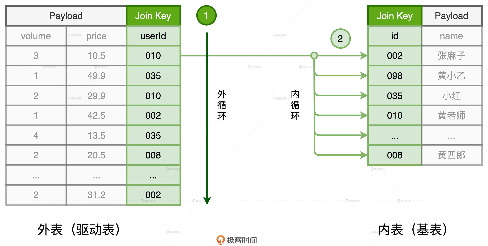
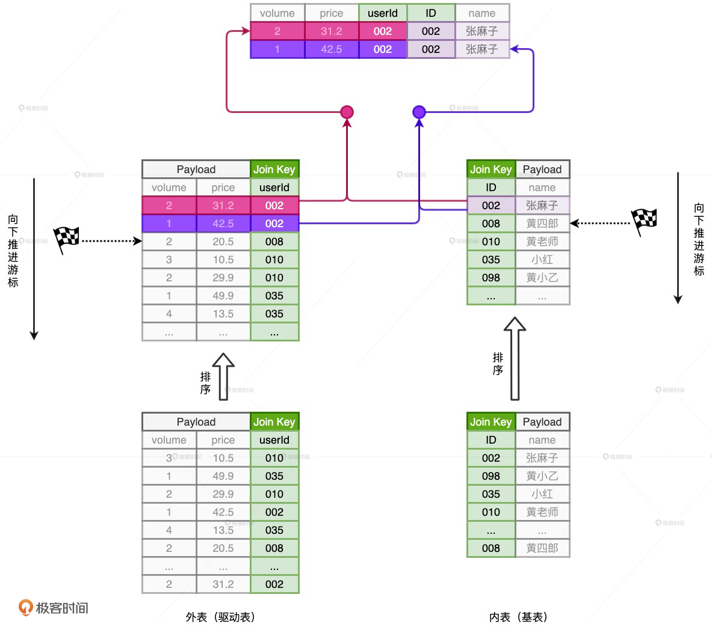
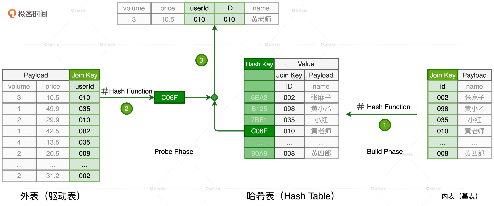
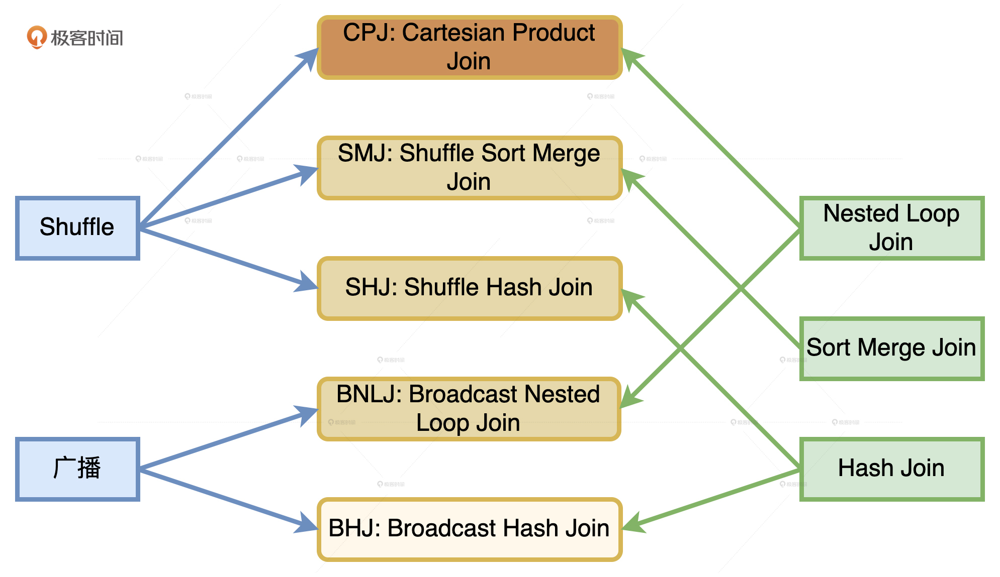
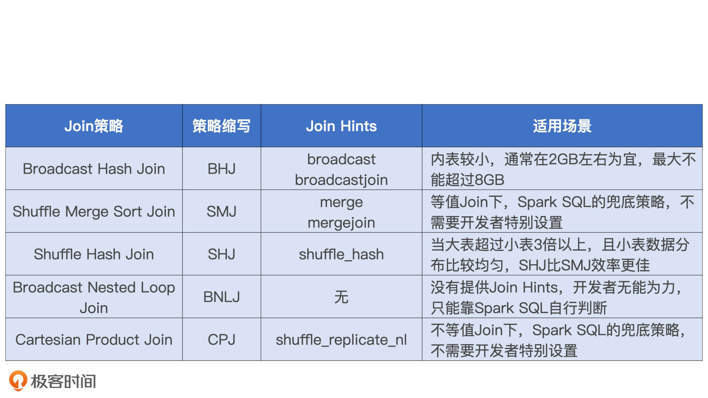
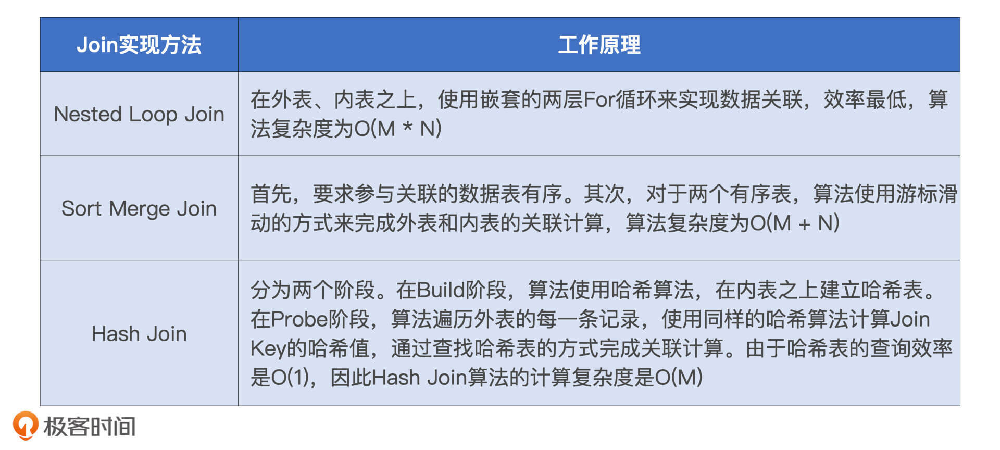
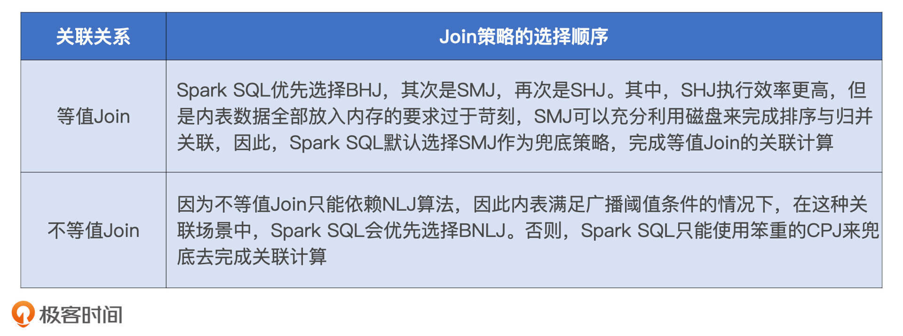

---
date: "2019-06-23"
---  
      
# 26 | Join Hints指南：不同场景下，如何选择Join策略？
你好，我是吴磊。

在数据分析领域，数据关联可以说是最常见的计算场景了。因为使用的频率很高，所以Spark为我们准备了非常丰富的关联形式，包括Inner Join、Left Join、Right Join、Anti Join、Semi Join等等。

搞懂不同关联形式的区别与作用，可以让我们快速地实现业务逻辑。不过，这只是基础，要想提高数据关联场景下Spark应用的执行性能，更为关键的是我们要能够深入理解Join的实现原理。

所以今天这一讲，我们先来说说，单机环境中Join都有哪几种实现方式，它们的优劣势分别是什么。理解了这些实现方式，我们再结合它们一起探讨，分布式计算环境中Spark都支持哪些Join策略。对于不同的Join策略，Spark是怎么做取舍的。

## Join的实现方式详解

到目前为止，数据关联总共有3种Join实现方式。按照出现的时间顺序，分别是嵌套循环连接（NLJ，Nested Loop Join ）、排序归并连接（SMJ，Shuffle Sort Merge Join）和哈希连接（HJ，Hash Join）。接下来，我们就借助一个数据关联的场景，来分别说一说这3种Join实现方式的工作原理。

假设，现在有事实表orders和维度表users。其中，users表存储用户属性信息，orders记录着用户的每一笔交易。两张表的Schema如下：

<!-- [[[read_end]]] -->

```
    // 订单表orders关键字段
    userId, Int
    itemId, Int
    price, Float
    quantity, Int
     
    // 用户表users关键字段
    id, Int
    name, String
    type, String //枚举值，分为头部用户和长尾用户
    

```

我们的任务是要基于这两张表做内关联（Inner Join），同时把用户名、单价、交易额等字段投影出来。具体的SQL查询语句如下表：

```
    //SQL查询语句
    select orders.quantity, orders.price, orders.userId, users.id, users.name
    from orders inner join users on orders.userId = users.id
    

```

那么，对于这样一个关联查询，在3种不同的Join实现方式下，它是如何完成计算的呢？

### NLJ的工作原理

对于参与关联的两张数据表，我们通常会根据它们扮演的角色来做区分。其中，体量较大、主动扫描数据的表，我们把它称作外表或是驱动表；体量较小、被动参与数据扫描的表，我们管它叫做内表或是基表。那么，NLJ是如何关联这两张数据表的呢？

**NLJ是采用“嵌套循环”的方式来实现关联的。**也就是说，NLJ会使用内、外两个嵌套的for循环依次扫描外表和内表中的数据记录，判断关联条件是否满足，比如例子中的orders.userId = users.id，如果满足就把两边的记录拼接在一起，然后对外输出。



在这个过程中，外层的for循环负责遍历外表中的每一条数据，如图中的步骤1所示。而对于外表中的每一条数据记录，内层的for循环会逐条扫描内表的所有记录，依次判断记录的Join Key是否满足关联条件，如步骤2所示。假设，外表有M行数据，内表有N行数据，那么**NLJ算法的计算复杂度是O\(M \* N\)**。不得不说，尽管NLJ实现方式简单而又直接，但它的执行效率实在让人不敢恭维。

### SMJ的工作原理

正是因为NLJ极低的执行效率，所以在它推出之后没多久之后，就有人用排序、归并的算法代替NLJ实现了数据关联，这种算法就是SMJ。**SMJ的思路是先排序、再归并。**具体来说，就是参与Join的两张表先分别按照Join Key做升序排序。然后，SMJ会使用两个独立的游标对排好序的两张表完成归并关联。



SMJ刚开始工作的时候，内外表的游标都会先锚定在两张表的第一条记录上，然后再对比游标所在记录的Join Key。对比结果以及后续操作主要分为3种情况：

1.  外表Join Key等于内表Join Key，满足关联条件，把两边的数据记录拼接并输出，然后把外表的游标滑动到下一条记录
2.  外表Join Key小于内表Join Key，不满足关联条件，把外表的游标滑动到下一条记录
3.  外表Join Key大于内表Join Key，不满足关联条件，把内表的游标滑动到下一条记录

SMJ正是基于这3种情况，不停地向下滑动游标，直到某张表的游标滑到头，即宣告关联结束。对于SMJ中外表的每一条记录，由于内表按Join Key升序排序，且扫描的起始位置为游标所在位置，因此**SMJ算法的计算复杂度为O\(M + N\)**。

不过，SMJ计算复杂度的降低，仰仗的是两张表已经事先排好序。要知道，排序本身就是一项非常耗时的操作，更何况，为了完成归并关联，参与Join的两张表都需要排序。因此，SMJ的计算过程我们可以用“先苦后甜”来形容。苦的是要先花费时间给两张表做排序，甜的是有序表的归并关联能够享受到线性的计算复杂度。

### HJ的工作原理

考虑到SMJ对排序的要求比较苛刻，所以后来又有人提出了效率更高的关联算法：HJ。HJ的设计初衷非常明确：**把内表扫描的计算复杂度降低至O\(1\)**。把一个数据集合的访问效率提升至O\(1\)，也只有Hash Map能做到了。也正因为Join的关联过程引入了Hash计算，所以它叫HJ。



HJ的计算分为两个阶段，分别是Build阶段和Probe阶段。在Build阶段，基于内表，算法使用既定的哈希函数构建哈希表，如上图的步骤1所示。哈希表中的Key是Join Key应用（Apply）哈希函数之后的哈希值，表中的Value同时包含了原始的Join Key和Payload。

在Probe阶段，算法遍历每一条数据记录，先是使用同样的哈希函数，以动态的方式（On The Fly）计算Join Key的哈希值。然后，用计算得到的哈希值去查询刚刚在Build阶段创建好的哈希表。如果查询失败，说明该条记录与维度表中的数据不存在关联关系；如果查询成功，则继续对比两边的Join Key。如果Join Key一致，就把两边的记录进行拼接并输出，从而完成数据关联。

## 分布式环境下的Join

掌握了这3种最主要的数据关联实现方式的工作原理之后，在单机环境中，无论是面对常见的Inner Join、Left Join、Right Join，还是不常露面的Anti Join、Semi Join，你都能对数据关联的性能调优做到游刃有余了。

不过，你也可能会说：“Spark毕竟是个分布式系统，光学单机实现有什么用呀？”

所谓万变不离其宗，实际上，**相比单机环境，分布式环境中的数据关联在计算环节依然遵循着NLJ、SMJ和HJ这3种实现方式，只不过是增加了网络分发这一变数**。在Spark的分布式计算环境中，数据在网络中的分发主要有两种方式，分别是Shuffle和广播。那么，不同的网络分发方式，对于数据关联的计算又都有哪些影响呢？

如果采用Shuffle的分发方式来完成数据关联，那么外表和内表都需要按照Join Key在集群中做全量的数据分发。因为只有这样，两个数据表中Join Key相同的数据记录才能分配到同一个Executor进程，从而完成关联计算，如下图所示。


如果采用广播机制的话，情况会大有不同。在这种情况下，Spark只需要把内表（基表）封装到广播变量，然后在全网进行分发。由于广播变量中包含了内表的**全量数据**，因此体量较大的外表只要“待在原地、保持不动”，就能轻松地完成关联计算，如下图所示。


不难发现，结合Shuffle、广播这两种网络分发方式和NLJ、SMJ、HJ这3种计算方式，对于分布式环境下的数据关联，我们就能组合出6种Join策略，如下图所示。



这6种Join策略，对应图中6个青色圆角矩形，从上到下颜色依次变浅，它们分别是Cartesian Product Join、Shuffle Sort Merge Join和Shuffle Hash Join。也就是采用Shuffle机制实现的NLJ、SMJ和HJ，以及Broadcast Nested Loop Join、Broadcast Sort Merge Join和Broadcast Hash Join。

**从执行性能来说，6种策略从上到下由弱变强。**相比之下，CPJ的执行效率是所有实现方式当中最差的，网络开销、计算开销都很大，因而在图中的颜色也是最深的。BHJ是最好的分布式数据关联机制，网络开销和计算开销都是最小的，因而颜色也最浅。此外，你可能也注意到了，Broadcast Sort Merge Join被标记成了灰色，这是因为Spark并没有选择支持Broadcast + Sort Merge Join这种组合方式。

那么问题来了，明明是6种组合策略，为什么Spark偏偏没有支持这一种呢？要回答这个问题，我们就要回过头来对比SMJ与HJ实现方式的差异与优劣势。

相比SMJ，HJ并不要求参与Join的两张表有序，也不需要维护两个游标来判断当前的记录位置，只要基表在Build阶段构建的哈希表可以放进内存，HJ算法就可以在Probe阶段遍历外表，依次与哈希表进行关联。

当数据能以广播的形式在网络中进行分发时，说明被分发的数据，也就是基表的数据足够小，完全可以放到内存中去。这个时候，相比NLJ、SMJ，HJ的执行效率是最高的。因此，在可以采用HJ的情况下，Spark自然就没有必要再去用SMJ这种前置开销比较大的方式去完成数据关联。

## Spark如何选择Join策略？

那么，在不同的数据关联场景中，对于这5种Join策略来说，也就是CPJ、BNLJ、SHJ、SMJ以及BHJ，Spark会基于什么逻辑取舍呢？我们来分两种情况进行讨论，分别是等值Join，和不等值Join。

### 等值Join下，Spark如何选择Join策略？

等值Join是指两张表的Join Key是通过等值条件连接在一起的。在日常的开发中，这种Join形式是最常见的，如t1 inner join t2 on **t1.id = t2.id**。

**在等值数据关联中，Spark会尝试按照BHJ > SMJ > SHJ的顺序依次选择Join策略。**在这三种策略中，执行效率最高的是BHJ，其次是SHJ，再次是SMJ。其中，SMJ和SHJ策略支持所有连接类型，如全连接、Anti Join等等。BHJ尽管效率最高，但是有两个前提条件：一是连接类型不能是全连接（Full Outer Join）；二是基表要足够小，可以放到广播变量里面去。

那为什么SHJ比SMJ执行效率高，排名却不如SMJ靠前呢？这是个非常好的问题。我们先来说结论，相比SHJ，Spark优先选择SMJ的原因在于，SMJ的实现方式更加稳定，更不容易OOM。

回顾HJ的实现机制，在Build阶段，算法根据内表创建哈希表。在Probe阶段，为了让外表能够成功“探测”（Probe）到每一个Hash Key，哈希表要全部放进内存才行。坦白说，这个前提还是蛮苛刻的，仅这一点要求就足以让Spark对其望而却步。要知道，在不同的计算场景中，数据分布的多样性很难保证内表一定能全部放进内存。

而且在Spark中，SHJ策略要想被选中必须要满足两个先决条件，这两个条件都是对数据尺寸的要求。**首先，外表大小至少是内表的3倍。其次，内表数据分片的平均大小要小于广播变量阈值。**第一个条件的动机很好理解，只有当内外表的尺寸悬殊到一定程度时，HJ的优势才会比SMJ更显著。第二个限制的目的是，确保内表的每一个数据分片都能全部放进内存。

和SHJ相比，SMJ没有这么多的附加条件，无论是单表排序，还是两表做归并关联，都可以借助磁盘来完成。内存中放不下的数据，可以临时溢出到磁盘。单表排序的过程，我们可以参考Shuffle Map阶段生成中间文件的过程。在做归并关联的时候，算法可以把磁盘中的有序数据用合理的粒度，依次加载进内存完成计算。这个粒度可大可小，大到以数据分片为单位，小到逐条扫描。

正是考虑到这些因素，相比SHJ，Spark SQL会优先选择SMJ。事实上，在配置项spark.sql.join.preferSortMergeJoin默认为True的情况下，Spark SQL会用SMJ策略来兜底，确保作业执行的稳定性，压根就不会打算去尝试SHJ。开发者如果想通过配置项来调整Join策略，需要把这个参数改为False，这样Spark SQL才有可能去尝试SHJ。

### 不等值Join下，Spark如何选择Join策略？

接下来，我们再来说说不等值Join，它指的是两张表的Join Key是通过不等值条件连接在一起的。不等值Join其实我们在以前的例子中也见过，比如像查询语句t1 inner join t2 on **t1.date > t2.beginDate and t1.date \<= t2.endDate**，其中的关联关系是依靠不等式连接在一起的。

**由于不等值Join只能使用NLJ来实现，因此Spark SQL可选的Join策略只剩下BNLJ和CPJ。**在同一种计算模式下，相比Shuffle，广播的网络开销更小。显然，在两种策略的选择上，Spark SQL一定会按照BNLJ > CPJ的顺序进行尝试。当然，BNLJ生效的前提自然是内表小到可以放进广播变量。如果这个条件不成立，那么Spark SQL只好委曲求全，使用笨重的CPJ策略去完成关联计算。

## 开发者能做些什么？

最后，我们再来聊聊，面对上述的5种Join策略，开发者还能做些什么呢？通过上面的分析，我们不难发现，Spark SQL对于这些策略的取舍也基于一些既定的规则。所谓计划赶不上变化，预置的规则自然很难覆盖多样且变化无常的计算场景。因此，当我们掌握了不同Join策略的工作原理，结合我们对于业务和数据的深刻理解，完全可以自行决定应该选择哪种Join策略。



在最新发布的3.0版本中，Spark为开发者提供了多样化的Join Hints，允许你把专家经验凌驾于Spark SQL的选择逻辑之上。**在满足前提条件的情况下，如等值条件、连接类型、表大小等等，Spark会优先尊重开发者的意愿，去选取开发者通过Join Hints指定的Join策略。**关于Spark 3.0支持的Join Hints关键字，以及对应的适用场景，我把它们总结到了如上的表格中，你可以直接拿来参考。

简单来说，你可以使用两种方式来指定Join Hints，一种是通过SQL结构化查询语句，另一种是使用DataFrame的DSL语言，都很方便。至于更全面的讲解，你可以去[第13讲](https://time.geekbang.org/column/article/360837)看看，这里我就不多说了。

## 小结

这一讲，我们从数据关联的实现原理，到Spark SQL不同Join策略的适用场景，掌握这些关键知识点，对于数据关联场景中的性能调优至关重要。

首先，你需要掌握3种Join实现机制的工作原理。为了方便你对比，我把它们总结在了下面的表格里。



掌握了3种关联机制的实现原理，你就能更好地理解Spark SQL的Join策略。结合数据的网络分发方式（Shuffle和广播），Spark SQL支持5种Join策略，按照执行效率排序就是BHJ > SHJ > SMJ > BNLJ > CPJ。同样，为了方便对比，你也可以直接看下面的表格。



最后，当你掌握了不同Join策略的工作原理，结合对于业务和数据的深刻理解，实际上你可以自行决定应该选择哪种Join策略，不必完全依赖Spark SQL的判断。

Spark为开发者提供了多样化的Join Hints，允许你把专家经验凌驾于Spark SQL的选择逻辑之上。比如，当你确信外表比内表大得多，而且内表数据分布均匀，使用SHJ远比默认的SMJ效率高得多的时候，你就可以通过指定Join Hints来强制Spark SQL按照你的意愿去选择Join策略。

## 每日一练

1.  如果关联的场景是事实表Join事实表，你觉得我们今天讲的Sort Merge Join实现方式还适用吗？如果让你来设计算法的实现步骤，你会怎么做？
2.  你觉得，不等值Join可以强行用Sort Merge Join和Hash Join两种机制来实现吗？为什么？

期待在留言区看到你的思考和答案，我们下一讲见！