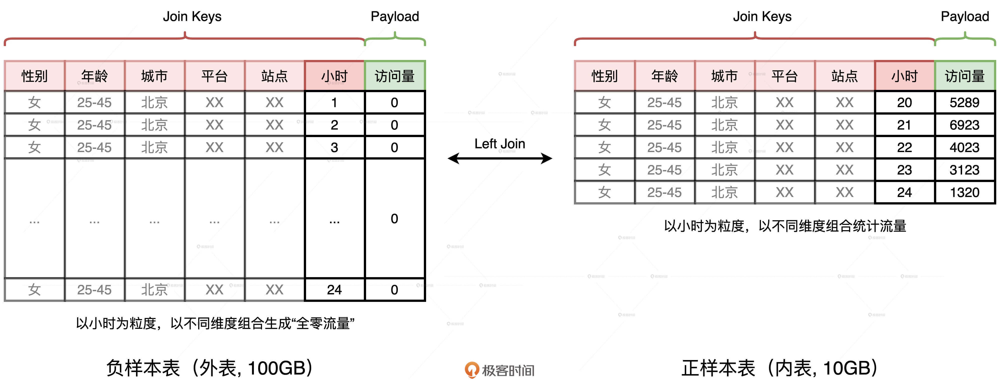
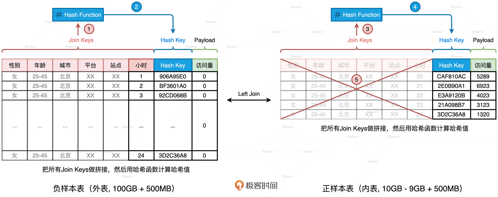
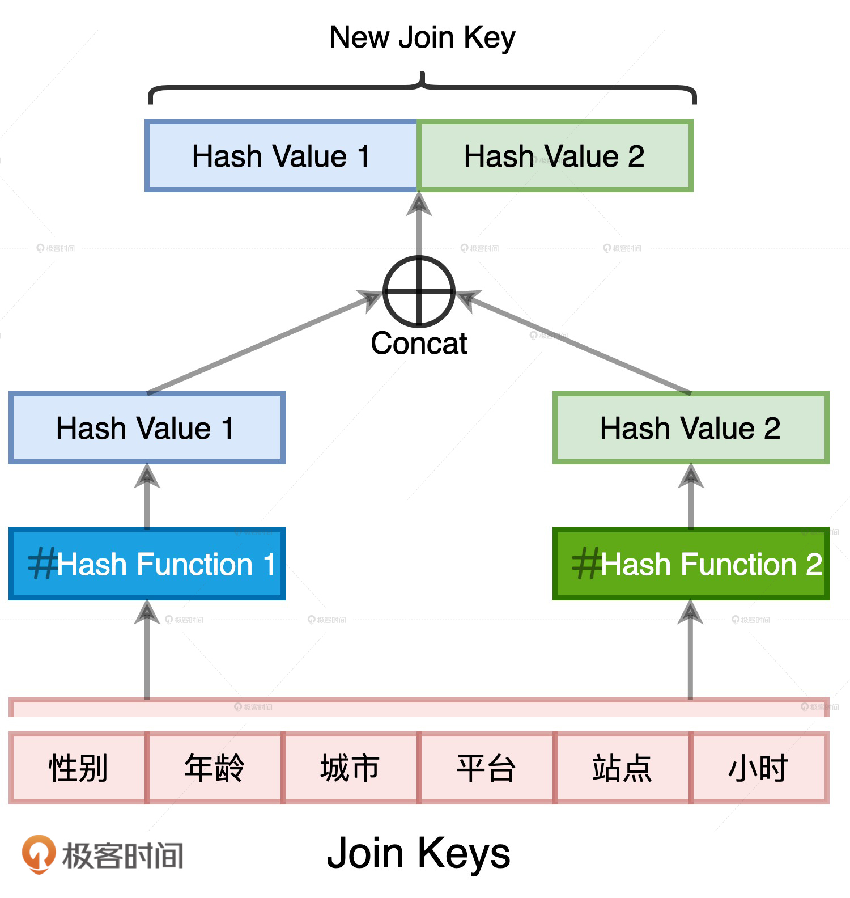

---
date: "2019-06-23"
---  
      
# 27 | 大表Join小表：广播变量容不下小表怎么办？
你好，我是吴磊。

在数据分析领域，大表Join小表的场景非常普遍。不过，大小是个相对的概念，通常来说，大表与小表尺寸相差3倍以上，我们就将其归类为“大表Join小表”的计算场景。因此，大表Join小表，仅仅意味着参与关联的两张表尺寸悬殊。

对于大表Join小表这种场景，我们应该优先考虑BHJ，它是Spark支持的5种Join策略中执行效率最高的。**BHJ处理大表Join小表时的前提条件是，广播变量能够容纳小表的全量数据。**但是，如果小表的数据量超过广播阈值，我们又该怎么办呢？

今天这一讲，我们就结合3个真实的业务案例，来聊一聊这种情况的解决办法。虽然这3个案例不可能覆盖“大表Join小表”场景中的所有情况，但是，分析并汇总案例的应对策略和解决办法，有利于我们在调优的过程中开阔思路、发散思维，从而避免陷入“面对问题无所适从”的窘境。

## 案例1：Join Key远大于Payload

在第一个案例中，大表100GB、小表10GB，它们全都远超广播变量阈值（默认10MB）。因为小表的尺寸已经超过8GB，在大于8GB的数据集上创建广播变量，Spark会直接抛出异常，中断任务执行，所以Spark是没有办法应用BHJ机制的。那我们该怎么办呢？先别急，我们来看看这个案例的业务需求。

<!-- [[[read_end]]] -->

这个案例来源于计算广告业务中的流量预测，流量指的是系统中一段时间内不同类型用户的访问量。这里有三个关键词，第一个是“系统”，第二个是“一段时间”，第三个是“用户类型”。时间粒度好理解，就是以小时为单位去统计流量。用户类型指的是采用不同的维度来刻画用户，比如性别、年龄、教育程度、职业、地理位置。系统指的是流量来源，比如平台、站点、频道、媒体域名。

在系统和用户的维度组合之下，流量被细分为数以百万计的不同“种类”。比如，来自XX平台XX站点的在校大学生的访问量，或是来自XX媒体XX频道25-45岁女性的访问量等等。

我们知道，流量预测本身是个时序问题，它和股价预测类似，都是基于历史、去预测未来。在我们的案例中，为了预测上百万种不同的流量，咱们得先为每种流量生成时序序列，然后再把这些时序序列喂给机器学习算法进行模型训练。

统计流量的数据源是线上的访问日志，它记录了哪类用户在什么时间访问了哪些站点。要知道，我们要构建的，是以小时为单位的时序序列，但由于流量的切割粒度非常细致，因此有些种类的流量不是每个小时都有访问量的，如下图所示。


我们可以看到，在过去的24小时中，某种流量仅在20-24点这5个时段有数据记录，其他时段无记录，也就是流量为零。在这种情况下，我们就需要用“零”去补齐缺失时段的序列值。那么我们该怎么补呢？

**因为业务需求是填补缺失值，所以在实现层面，我们不妨先构建出完整的全零序列，然后以系统、用户和时间这些维度组合为粒度，用统计流量去替换全零序列中相应位置的“零流量”。**这个思路描述起来比较复杂，用图来理解会更直观、更轻松一些。



首先，我们生成一张全零流量表，如图中左侧的“负样本表”所示。这张表的主键是划分流量种类的各种维度，如性别、年龄、平台、站点、小时时段等等。表的Payload只有一列，也即访问量，在生成“负样本表”的时候，这一列全部置零。

然后，我们以同样的维度组合统计日志中的访问量，就可以得到图中右侧的“正样本表”。不难发现，两张表的Schema完全一致，要想获得完整的时序序列，我们只需要把外表以“左连接（Left Outer Join）”的形式和内表做关联就好了。具体的查询语句如下：

```
    //左连接查询语句
    select t1.gender, t1.age, t1.city, t1.platform, t1.site, t1.hour, coalesce(t2.access, t1.access) as access
    from t1 left join t2 on
    t1.gender = t2.gender and
    t1.age = t2.age and
    t1.city = t2.city and
    t1.platform = t2.platform and
    t1.site = t2.site and
    t1.hour = t2.hour
    

```

使用左连接的方式，我们刚好可以用内表中的访问量替换外表中的零流量，两表关联的结果正是我们想要的时序序列。“正样本表”来自访问日志，只包含那些存在流量的时段，而“负样本表”是生成表，它包含了所有的时段。因此，在数据体量上，负样本表远大于正样本表，这是一个典型的“大表Join小表”场景。尽管小表（10GB）与大表（100GB）相比，在尺寸上相差一个数量级，但两者的体量都不满足BHJ的先决条件。因此，Spark只好退而求其次，选择SMJ（Shuffle Sort Merge Join）的实现方式。

我们知道，SMJ机制会引入Shuffle，将上百GB的数据在全网分发可不是一个明智的选择。那么，根据“能省则省”的开发原则，我们有没有可能“省去”这里的Shuffle呢？要想省去Shuffle，我们只有一个办法，就是把SMJ转化成BHJ。你可能会说：“都说了好几遍了，小表的尺寸10GB远超广播阈值，我们还能怎么转化呢？”

办法总比困难多，我们先来反思，关联这两张表的目的是什么？目的是以维度组合（Join Keys）为基准，用内表的访问量替换掉外表的零值。那么，这两张表有哪些特点呢？**首先，两张表的Schema完全一致。其次，无论是在数量、还是尺寸上，两张表的Join Keys都远大于Payload。**那么问题来了，要达到我们的目的，一定要用那么多、那么长的Join Keys做关联吗？

答案是否定的。在上一讲，我们介绍过Hash Join的实现原理，在Build阶段，Hash Join使用哈希算法生成哈希表。在Probe阶段，哈希表一方面可以提供O\(1\)的查找效率，另一方面，在查找过程中，Hash Keys之间的对比远比Join Keys之间的对比要高效得多。受此启发，我们为什么不能计算Join Keys的哈希值，然后把生成的哈希值当作是新的Join Key呢？



我们完全可以基于现有的Join Keys去生成一个全新的数据列，它可以叫“Hash Key”。生成的方法分两步：

* 把所有Join Keys拼接在一起，把性别、年龄、一直到小时拼接成一个字符串，如图中步骤1、3所示
* 使用哈希算法（如MD5或SHA256）对拼接后的字符串做哈希运算，得到哈希值即为“Hash Key”，如上图步骤2、4所示

在两张表上，我们都进行这样的操作。如此一来，在做左连接的时候，为了把主键一致的记录关联在一起，我们不必再使用数量众多、冗长的原始Join Keys，用单一的生成列Hash Key就可以了。相应地，SQL查询语句也变成了如下的样子。

```
    //调整后的左连接查询语句
    select t1.gender, t1.age, t1.city, t1.platform, t1.site, t1.hour, coalesce(t2.access, t1.access) as access
    from t1 left join t2 on
    t1.hash_key = t2. hash_key
    

```

添加了这一列之后，我们就可以把内表，也就是“正样本表”中所有的Join Keys清除掉，大幅缩减内表的存储空间，上图中的步骤5演示了这个过程。当内表缩减到足以放进广播变量的时候，我们就可以把SMJ转化为BHJ，从而把SMJ中的Shuffle环节彻底省掉。

这样一来，清除掉Join Keys的内表的存储大小就变成了1.5GB。对于这样的存储量级，我们完全可以使用配置项或是强制广播的方式，来完成Shuffle Join到Broadcast Join的转化，具体的转化方法你可以参考广播变量那一讲（[第13讲](https://time.geekbang.org/column/article/360837)）。

案例1说到这里，其实已经基本解决了，不过这里还有一个小细节需要我们特别注意。**案例1优化的关键在于，先用Hash Key取代Join Keys，再清除内表冗余数据。Hash Key实际上是Join Keys拼接之后的哈希值。既然存在哈希运算，我们就必须要考虑哈希冲突的问题。**

哈希冲突我们都很熟悉，它指的就是不同的数据源经过哈希运算之后，得到的哈希值相同。在案例1当中，如果我们为了优化引入的哈希计算出现了哈希冲突，就会破坏原有的关联关系。比如，本来两个不相等的Join Keys，因为哈希值恰巧相同而被关联到了一起。显然，这不是我们想要的结果。

消除哈希冲突隐患的方法其实很多，比如“二次哈希”，也就是我们用两种哈希算法来生成Hash Key数据列。两条不同的数据记录在两种不同哈希算法运算下的结果完全相同，这种概率几乎为零。



## 案例2：过滤条件的Selectivity较高

除了Join Keys远大于Payload的情况会导致我们无法选择BHJ，还有一种情况是过滤条件的Selectivity较高。这个案例来源于电子商务场景，在星型（Start Schema）数仓中，我们有两张表，一张是订单表orders，另一张是用户表users。订单表是事实表（Fact），而用户表是维度表（Dimension）。

这个案例的业务需求很简单，是统计所有头部用户贡献的营业额，并按照营业额倒序排序。订单表和用户表的Schema如下表所示。

```
    // 订单表orders关键字段
    userId, Int
    itemId, Int
    price, Float
    quantity, Int
     
    // 用户表users关键字段
    id, Int
    name, String
    type, String //枚举值，分为头部用户和长尾用户
    
    

```

给定上述数据表，我们只需把两张表做内关联，然后分组、聚合、排序，就可以实现业务逻辑，具体的查询语句如下所示。

```
    //查询语句
    select (orders.price * order.quantity) as revenue, users.name
    from orders inner join users on orders.userId = users.id
    where users.type = ‘Head User’
    group by users.name
    order by revenue desc
    

```

在这个案例中，事实表的存储容量在TB量级，维度表是20GB左右，也都超过了广播阈值。其实，这样的关联场景在电子商务、计算广告以及推荐搜索领域都很常见。

**对于两张表都远超广播阈值的关联场景来说，如果我们不做任何调优的，Spark就会选择SMJ策略计算。**在10台C5.4xlarge AWS EC2的分布式环境中，SMJ要花费将近5个小时才完成两张表的关联计算。这样的执行效率，我们肯定无法接受，但我们又能做哪些优化呢？你不妨先花上两分钟去想一想，然后再来一起跟我去分析。

仔细观察上面的查询语句，我们发现这是一个典型的星型查询，也就是事实表与维度表关联，且维表带过滤条件。维表上的过滤条件是users.type = ‘Head User’，即只选取头部用户。而通常来说，相比普通用户，头部用户的占比很低。换句话说，这个过滤条件的选择性（Selectivity）很高，它可以帮助你过滤掉大部分的维表数据。在我们的案例中，由于头部用户占比不超过千分之一，因此过滤后的维表尺寸很小，放进广播变量绰绰有余。

这个时候我们就要用到AQE了，我们知道AQE允许Spark SQL在运行时动态地调整Join策略。我们刚好可以利用这个特性，把最初制定的SMJ策略转化为BHJ策略（千万别忘了，AQE默认是关闭的，要想利用它提供的特性，我们得先把spark.sql.adaptive.enabled配置项打开）。

不过，即便过滤条件的选择性很高，在千分之一左右，过滤之后的维表还是有20MB大小，这个尺寸还是超过了默认值广播阈值10MB。因此，我们还需要把广播阈值spark.sql.autoBroadcastJoinThreshold调高一些，比如1GB，AQE才会把SMJ降级为BHJ。做了这些调优之后，在同样的集群规模下，作业的端到端执行时间从之前的5个小时缩减为30分钟。

让作业的执行性能提升了一个数量级之后，我们的调优就结束了吗？在调优的本质那一讲，我们一再强调，随着木桶短板的此消彼长，调优是一个不断持续的过程。在这个过程中，我们需要因循瓶颈的变化，动态地切换调优方法，去追求一种所有木板齐平、没有瓶颈的状态。

那么，当我们用动态Join策略，把SMJ策略中Shuffle引入的海量数据分发这块短板补齐之后，还有没有“新晋”的短板需要修理呢？

**对于案例中的这种星型关联，我们还可以利用DPP机制来减少事实表的扫描量，进一步减少I/O开销、提升性能。**和AQE不同，DPP并不需要开发者特别设置些什么，只要满足条件，DPP机制会自动触发。

但是想要使用DPP做优化，还有3个先决条件需要满足：

* DPP仅支持等值Joins，不支持大于或者小于这种不等值关联关系
* 维表过滤之后的数据集，必须要小于广播阈值，因此开发者要注意调整配置项spark.sql.autoBroadcastJoinThreshold
* 事实表必须是分区表，且分区字段（可以是多个）必须包含Join Key

我们可以直接判断出查询满足前两个条件，满足第一个条件很好理解。满足第二个条件是因为，经过第一步AQE的优化之后，广播阈值足够大，足以容纳过滤之后的维表。那么，要想利用DPP机制，我们必须要让orders成为分区表，也就是做两件事情：

 *    创建一张新的订单表orders\_new，并指定userId为分区键
 *    把原订单表orders的全部数据，灌进这张新的订单表orders\_new

```
    //查询语句
    select (orders_new.price * orders_new.quantity) as revenue, users.name
    from orders_new inner join users on orders_new.userId = users.id
    where users.type = ‘Head User’
    group by users.name
    order by revenue desc
    

```

用orders\_new表替换orders表之后，在同样的分布式环境下，查询时间就从30分钟进一步缩短到了15分钟。

你可能会说：“为了利用DPP，重新建表、灌表，这样也需要花费不少时间啊！这不是相当于把运行时间从查询转嫁到建表、灌数了吗？”你说的没错，确实是这么回事。如果为了查询效果，临时再去修改表结构、迁移数据确实划不来，属于“临时抱佛脚”。因此，为了最大限度地利用DPP，在做数仓规划的时候，开发者就应该结合常用查询与典型场景，提前做好表结构的设计，这至少包括Schema、分区键、存储格式等等。

## 案例3：小表数据分布均匀

在上面的两个案例中，我们都是遵循“能省则省”的开发原则，想方设法地把Shuffle Joins切换为Broadcast Joins，从而消除Shuffle。但是，总有那么一些“顽固”的场景，无论我们怎么优化，也没办法做到这一点。那么对于这些“顽固分子”，我们该怎么办呢？

我们知道，如果关联场景不满足BHJ条件，Spark SQL会优先选择SMJ策略完成关联计算。但是在上一讲我们说到，**当参与Join的两张表尺寸相差悬殊且小表数据分布均匀的时候，SHJ往往比SMJ的执行效率更高**。原因很简单，小表构建哈希表的开销要小于两张表排序的开销。

我们还是以上一个案例的查询为例，不过呢，这次我们把维表的过滤条件去掉，去统计所有用户贡献的营业额。在10台C5.4xlarge AWS EC2的分布式环境中，去掉过滤条件的SMJ花费了将近7个小时才完成两张表的关联计算。

```
    //查询语句
    select (orders.price * order.quantity) as revenue, users.name
    from orders inner join users on orders.userId = users.id
    group by users.name
    order by revenue desc
    

```

由于维表的查询条件不复存在，因此案例2中的两个优化方法，也就是AQE Join策略调整和DPP机制，也都失去了生效的前提。**这种情况下，我们不妨使用Join Hints来强制Spark SQL去选择SHJ策略进行关联计算**，调整后的查询语句如下表所示。

```
    //添加Join hints之后的查询语句
    select /*+ shuffle_hash(orders) */ (orders.price * order.quantity) as revenue, users.name
    from orders inner join users on orders.userId = users.id
    group by users.name
    order by revenue desc
    

```

将Join策略调整为SHJ之后，在同样的集群规模下，作业的端到端执行时间从之前的7个小时缩减到5个小时，相比调优前，我们获得了将近30\%的性能提升。

需要注意的是，**SHJ要想成功地完成计算、不抛OOM异常，需要保证小表的每个数据分片都能放进内存**。这也是为什么，我们要求小表的数据分布必须是均匀的。如果小表存在数据倾斜的问题，那么倾斜分区的OOM将会是一个大概率事件，SHJ的计算也会因此而中断。

## 小结

今天这一讲，我们从3个案例出发，探讨并解锁了不同场景下“大表Join小表”的优化思路和应对方法。

首先，我们定义了什么是“大表Join小表”。一般来说，参与Join的两张表在尺寸上相差3倍以上，就可以看作是“大表Join小表”的计算场景。

其次，我们讲了3个大表Join小表场景下，无法选择BHJ的案例。

第一个案例是Join Keys远大于Payload的数据关联，我们可以使用映射方法（如哈希运算），用较短的字符串来替换超长的Join Keys，从而大幅缩减小表的存储空间。如果缩减后的小表，足以放进广播变量，我们就可以将SMJ转换为BHJ，=来消除繁重的Shuffle计算。需要注意的是，映射方法要能够有效地避免“映射冲突”的问题，避免出现不同的Join Keys被映射成同一个数值。

第二个案例是，如果小表携带过滤条件，且过滤条件的选择性很高，我们可以通过开启AQE的Join策略调整特性，在运行时把SMJ转换为BHJ，从而大幅提升执行性能。这里有两点需要我们特别注意：一是，为了能够成功完成转换，我们需要确保过滤之后的维表尺寸小于广播阈值；二是，如果大表本身是按照Join Keys进行分区的话，那么我们还可以充分利用DPP机制，来进一步缩减大表扫描的I/O开销，从而提升性能。

第三个案例是，如果小表不带过滤条件，且尺寸远超广播阈值。如果小表本身的数据分布比较均匀，我们可以考虑使用Join hints强行要求Spark SQL在运行时选择SHJ关联策略。一般来说，在“大表Join小表”的场景中，相比SMJ，SHJ的执行效率会更好一些。背后的原因在于，小表构建哈希表的开销，要小于两张表排序的开销。

## 每日一练

1.  对于案例1，我们的核心思路是用哈希值来替代超长的Join Keys，除了用哈希值以外，你觉得还有其他的思路或是办法，去用较短的字符串来取代超长的Join Keys吗？
2.  对于案例2，利用AQE Join策略调整和DDP机制的关键，是确保过滤后的维表小于广播阈值。你能说说，都有哪些方法可以用来计算过滤后的维表大小吗？
3.  对于案例3，假设20GB的小表存在数据倾斜，强行把SMJ转化为SHJ会抛OOM异常。这个时候，你认为还有可能继续优化吗？

期待在留言区看到你的思考和答案，我们下一讲见！