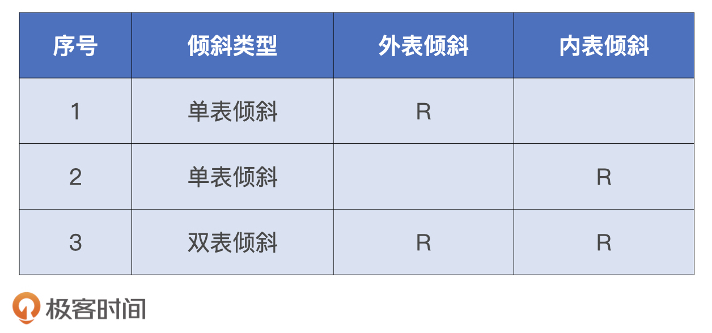
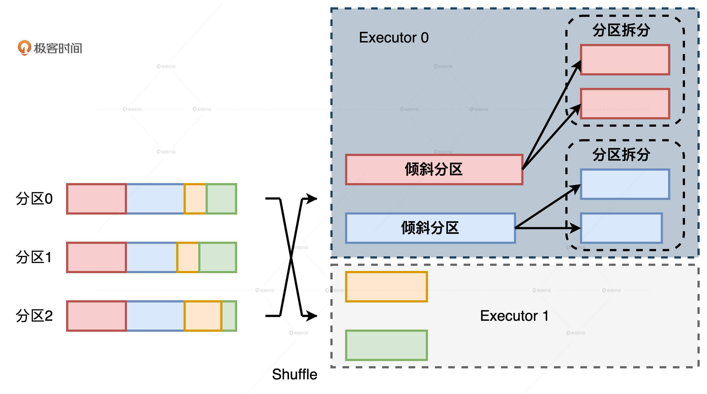
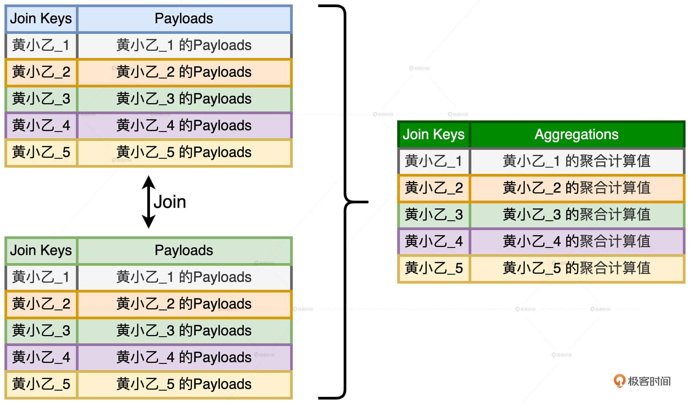

---
date: "2019-06-23"
---  
      
# 29 | 大表Join大表（二）：什么是负隅顽抗的调优思路？
你好，我是吴磊。

在上一讲，我们说了应对“大表Join大表”的第一种调优思路是分而治之，也就是把一个庞大而又复杂的Shuffle Join转化为多个轻量的Broadcast Joins。这一讲，我们接着来讲第二种调优思路：负隅顽抗。

负隅顽抗指的是，当内表没法做到均匀拆分，或是外表压根就没有分区键，不能利用DPP，只能依赖Shuffle Join，去完成大表与大表的情况下，我们可以采用的调优方法和手段。这类方法比较庞杂，适用的场景各不相同。从数据分布的角度出发，我们可以把它们分两种常见的情况来讨论，分别是数据分布均匀和数据倾斜。

我们先来说说，在数据分布均匀的情况下，如何应对“大表Join大表”的计算场景。

## 数据分布均匀

在第27讲的最后，我们说过，当参与关联的大表与小表满足如下条件的时候，Shuffle Hash Join的执行效率，往往比Spark SQL默认的Shuffle Sort Merge Join更好。

* 两张表数据分布均匀。
* 内表所有数据分片，能够完全放入内存。

实际上，这个调优技巧同样适用于“大表Join大表”的场景，原因其实很简单，这两个条件与数据表本身的尺寸无关，只与其是否分布均匀有关。不过，为了确保Shuffle Hash Join计算的稳定性，我们需要特别注意上面列出的第二个条件，也就是内表所有的数据分片都能够放入内存。

<!-- [[[read_end]]] -->

那么问题来了，我们怎么确保第二个条件得以成立呢？其实，只要处理好并行度、并发度与执行内存之间的关系，我们就可以让内表的每一个数据分片都恰好放入执行内存中。简单来说，就是先根据并发度与执行内存，计算出可供每个Task消耗的内存上下限，然后结合分布式数据集尺寸与上下限，倒推出与之匹配的并行度。更详细的内容你可以去看看[第14讲](https://time.geekbang.org/column/article/362710)。

那我们该如何强制Spark SQL在运行时选择Shuffle Hash Join机制呢？答案就是利用Join Hints。这个技巧我们讲过很多次了，所以这里，我直接以上一讲中的查询为例，把它的使用方法写在了下面，方便你复习。

```
    //查询语句中使用Join hints
    select /*+ shuffle_hash(orders) */ sum(tx.price * tx.quantity) as revenue, o.orderId
    from transactions as tx inner join orders as o
    on tx.orderId = o.orderId
    where o.status = ‘COMPLETE’
    and o.date between ‘2020-01-01’ and ‘2020-03-31’
    group by o.orderId
    

```

## 数据倾斜

接下来，我们再说说，当参与Join的两张表存在数据倾斜问题的时候，我们该如何应对“大表Join大表”的计算场景。对于“大表Join大表”的数据倾斜问题，根据倾斜位置的不同，我们可以分为3种情况来讨论。



其实，不管哪种表倾斜，它们的调优技巧都是类似的。因此，我们就以第一种情况为例，也就是外表倾斜、内表分布均匀的情况，去探讨数据倾斜的应对方法。

### 以Task为粒度解决数据倾斜

学过AQE之后，要应对数据倾斜，想必你很快就会想到AQE的特性：自动倾斜处理。给定如下配置项参数，Spark SQL在运行时可以将策略OptimizeSkewedJoin插入到物理计划中，自动完成Join过程中对于数据倾斜的处理。

* spark.sql.adaptive.skewJoin.skewedPartitionFactor，判定倾斜的膨胀系数。
* spark.sql.adaptive.skewJoin.skewedPartitionThresholdInBytes，判定倾斜的最低阈值。
* spark.sql.adaptive.advisoryPartitionSizeInBytes，以字节为单位定义拆分粒度。


Join过程中的自动倾斜处理如上图所示，当AQE检测到外表存在倾斜分区之后，它会以spark.sql.adaptive.advisoryPartitionSizeInBytes配置的数值为拆分粒度，把倾斜分区拆分为多个数据分区。与此同时，AQE还需要对内表中对应的数据分区进行复制，来保护两表之间的关联关系。

有了AQE的自动倾斜处理特性，在应对数据倾斜问题的时候，我们确实能够大幅节省开发成本。不过，天下没有免费的午餐，AQE的倾斜处理是以Task为粒度的，这意味着原本Executors之间的负载倾斜并没有得到根本改善。这到底是什么意思呢？



我们来举个例子，假设某张表在Shuffle过后有两个倾斜分区如上图，它们又刚好都被Shuffle到了同一个执行器：Executor 0。在AQE的自动倾斜处理机制下，两个倾斜分区分别被拆分变成了4个尺寸适中的数据分区。如此一来，Executor 0中所有Task的计算负载都得到了平衡。但是，相比Executor 1，Executor 0整体的计算负载还是那么多，并没有因为AQE的自动处理而得到任何缓解。

### 以Executor为粒度解决数据倾斜

你也许会说：“哪会那么凑巧，倾斜的分区刚好全都落在同一个Executor上？”确实，刚才的例子主要是为了帮你解释清楚倾斜粒度这个概念，如果实际应用中倾斜分区在集群中的分布比较平均的话，AQE的自动倾斜处理机制确实就是开发者的“灵丹妙药”。

然而，凡事总有个万一，我们在探讨调优方案的时候，还是要考虑周全：如果你的场景就和咱们的例子一样，倾斜分区刚好落在集群中少数的Executors上，你该怎么办呢？答案是：“分而治之”和“两阶段Shuffle”。

这里的分而治之与上一讲的分而治之在思想上是一致的，都是以任务分解的方式来解决复杂问题。区别在于我们今天要讲的，是以Join Key是否倾斜为依据来拆解子任务。具体来说，对于外表中所有的Join Keys，我们先按照是否存在倾斜把它们分为两组。一组是存在倾斜问题的Join Keys，另一组是分布均匀的Join Keys。因为给定两组不同的Join Keys，相应地我们把内表的数据也分为两份。


那么，分而治之的含义就是，对于内外表中两组不同的数据，我们分别采用不同的方法做关联计算，然后通过Union操作，再把两个关联计算的结果集做合并，最终得到“大表Join大表”的计算结果，整个过程如上图所示。

对于Join Keys分布均匀的数据部分，我们可以沿用把Shuffle Sort Merge Join转化为Shuffle Hash Join的方法。对于Join Keys存在倾斜问题的数据部分，我们就需要借助“两阶段Shuffle”的调优技巧，来平衡Executors之间的工作负载。那么，什么是“两阶段Shuffle”呢？

#### 如何理解“两阶段Shuffle”？

用一句话来概括，“两阶段Shuffle”指的是，通过“加盐、Shuffle、关联、聚合”与“去盐化、Shuffle、聚合”这两个阶段的计算过程，在不破坏原有关联关系的前提下，在集群范围内以Executors为粒度平衡计算负载 。


我们先来说说第一阶段，也就是“加盐、Shuffle、关联、聚合”的计算过程。显然，这个阶段的计算分为4个步骤，其中最为关键的就是第一步的加盐。加盐来源于单词Salting，听上去挺玄乎，实际上就是给倾斜的Join Keys添加后缀。加盐的核心作用就是把原本集中倾斜的Join Keys打散，在进行Shuffle操作的时候，让原本应该分发到某一个Executor的倾斜数据，均摊到集群中的多个Executors上，从而以这种方式来消除倾斜、平衡Executors之间的计算负载。

对于加盐操作，我们首先需要确定加盐的粒度，来控制数据打散的程度，粒度越高，加盐后的数据越分散。由于加盐的初衷是以Executors为粒度平衡计算负载，因此通常来说，取Executors总数#N作为加盐粒度往往是一种不错的选择。其次，为了保持内外表的关联关系不被破坏，外表和内表需要同时做加盐处理，但处理方法稍有不同。

外表的处理称作“随机加盐”，具体的操作方法是，对于任意一个倾斜的Join Key，我们都给它加上1到#N之间的一个随机后缀。以Join Key = ‘黄小乙’来举例，假设N = 5，那么外表加盐之后，原先Join Key = ‘黄小乙’的所有数据记录，就都被打散成了Join Key为（‘黄小乙\_1’，‘黄小乙\_2’，‘黄小乙\_3’，‘黄小乙\_4’，‘黄小乙\_5’）的数据记录。


内表的处理称为“复制加盐”，具体的操作方法是，对于任意一个倾斜的Join Key，我们都把原数据复制（#N – 1）份，从而得到#N份数据副本。对于每一份副本，我们为其Join Key追加1到#N之间的固定后缀，让它与打散后的外表数据保持一致。对于刚刚Join Key = ‘黄小乙’的例子来说，在内表中，我们需要把‘黄小乙’的数据复制4份，然后依次为每份数据的Join Key追加1到5的固定后缀，如下图所示。


内外表分别加盐之后，数据倾斜问题就被消除了。这个时候，我们就可以使用常规优化方法，比如，将Shuffle Sort Merge Join转化为Shuffle Hash Join，去继续执行Shuffle、关联和聚合操作。到此为止，“两阶段Shuffle” 的第一阶段执行完毕，我们得到了初步的聚合结果，这些结果是以打散的Join Keys为粒度进行计算得到的。


我们刚刚说，第一阶段加盐的目的在于将数据打散、平衡计算负载。现在我们已经得到了数据打散之后初步的聚合结果，离最终的计算结果仅有一步之遥。不过，为了还原最初的计算逻辑，我们还需要把之前加上的“盐粒”再去掉。



第二阶段的计算包含“去盐化、Shuffle、聚合”这3个步骤。首先，我们把每一个Join Key的后缀去掉，这一步叫做“去盐化”。然后，我们按照原来的Join Key再做一遍Shuffle和聚合计算，这一步计算得到的结果，就是“分而治之”当中倾斜部分的计算结果。

经过“两阶段Shuffle”的计算优化，我们终于得到了倾斜部分的关联结果。将这部分结果与“分而治之”当中均匀部分的计算结果合并，我们就能完成存在倾斜问题的“大表Join大表”的计算场景。

#### 以Executors为粒度的调优实战

应该说，以Executors为粒度平衡计算负载的优化过程，是我们学习过的调优技巧中最复杂的。因此，咱们有必要结合实际的应用案例，来详细讲解具体的实现方法。为了方便你对不同的调优方法做对比，我们不妨以上一讲跨境电商的场景为例来讲。

咱们先来回顾一下这家电商的业务需求，给定orders和transactions两张体量都在TB级别的事实表，每隔一段时间就计算一次上一个季度所有订单的交易额，具体的业务代码如下所示。

```
    //统计订单交易额的代码实现
    val txFile: String = _
    val orderFile: String = _
     
    val transactions: DataFrame = spark.read.parquent(txFile)
    val orders: DataFrame = spark.read.parquent(orderFile)
     
    transactions.createOrReplaceTempView(“transactions”)
    orders.createOrReplaceTempView(“orders”)
     
    val query: String = “
    select sum(tx.price * tx.quantity) as revenue, o.orderId
    from transactions as tx inner join orders as o
    on tx.orderId = o.orderId
    where o.status = ‘COMPLETE’
    and o.date between ‘2020-01-01’ and ‘2020-03-31’
    group by o.orderId
    ”
     
    val outFile: String = _
    spark.sql(query).save.parquet(outFile)
    
    

```

对于这样一个查询语句，我们该如何实现刚刚说过的优化过程呢？首先，我们先遵循“分而治之”的思想，把内外表的数据分为两个部分。第一部分包含所有存在倾斜问题的Join Keys及其对应的Payloads，第二部分保留的是分布均匀的Join Keys和相应的Payloads。假设我们把所有倾斜的orderId，也就是Join Key保存在数组skewOrderIds中，而把分布均匀的orderId保持在数组evenOrderIds中，我们就可以使用这两个数组，把内外表各自拆分为两部分。

```
    //根据Join Keys是否倾斜、将内外表分别拆分为两部分
    import org.apache.spark.sql.functions.array_contains
     
    //将Join Keys分为两组，存在倾斜的、和分布均匀的
    val skewOrderIds: Array[Int] = _
    val evenOrderIds: Array[Int] = _
     
    val skewTx: DataFrame = transactions.filter(array_contains(lit(skewOrderIds),$"orderId"))
    val evenTx: DataFrame = transactions.filter(array_contains(lit(evenOrderIds),$"orderId"))
     
    val skewOrders: DataFrame = orders.filter(array_contains(lit(skewOrderIds),$"orderId"))
    val evenOrders: DataFrame = orders.filter(array_contains(lit(evenOrderIds),$"orderId"))
    

```

拆分完成之后，我们就可以延续“分而治之”的思想，分别对这两部分应用不同的调优技巧。对于分布均匀的部分，我们把Shuffle Sort Merge Join转化为Shuffle Hash Join。

```
    //将分布均匀的数据分别注册为临时表
    evenTx.createOrReplaceTempView(“evenTx”)
    evenOrders.createOrReplaceTempView(“evenOrders”)
     
    val evenQuery: String = “
    select /*+ shuffle_hash(orders) */ sum(tx.price * tx.quantity) as revenue, o.orderId
    from evenTx as tx inner join evenOrders as o
    on tx.orderId = o.orderId
    where o.status = ‘COMPLETE’
    and o.date between ‘2020-01-01’ and ‘2020-03-31’
    group by o.orderId
    ”
    val evenResults: DataFrame = spark.sql(evenQuery)
    

```

对于存在倾斜的部分，我们要祭出“两阶段Shuffle”的杀手锏。首先，在第一阶段，我们需要给两张表分别加盐，对外表（交易表）做“随机加盐”，对内表（订单表）做“复制加盐”。

```
    import org.apache.spark.sql.functions.udf
     
    //定义获取随机盐粒的UDF
    val numExecutors: Int = _
    val rand = () => scala.util.Random.nextInt(numExecutors)
    val randUdf = udf(rand)
     
    //第一阶段的加盐操作。注意：保留orderId字段，用于后期第二阶段的去盐化
     
    //外表随机加盐
    val saltedSkewTx = skewTx.withColumn(“joinKey”, concat($“orderId”, lit(“_”), randUdf()))
     
    //内表复制加盐
    var saltedskewOrders = skewOrders.withColumn(“joinKey”, concat($“orderId”, lit(“_”), lit(1)))
    for (i <- 2 to numExecutors) {
    saltedskewOrders = saltedskewOrders union skewOrders.withColumn(“joinKey”, concat($“orderId”, lit(“_”), lit(i)))
    }
    

```

两张表分别做完加盐处理之后，我们就可以使用与之前类似的查询语句，对它们执行后续的Shuffle、关联与聚合等操作。

```
    //将加盐后的数据分别注册为临时表
    saltedSkewTx.createOrReplaceTempView(“saltedSkewTx”)
    saltedskewOrders.createOrReplaceTempView(“saltedskewOrders”)
     
    val skewQuery: String = “
    select /*+ shuffle_hash(orders) */ sum(tx.price * tx.quantity) as initialRevenue, o.orderId, o.joinKey
    from saltedSkewTx as tx inner join saltedskewOrders as o
    on tx.joinKey = o.joinKey
    where o.status = ‘COMPLETE’
    and o.date between ‘2020-01-01’ and ‘2020-03-31’
    group by o.joinKey
    ”
    //第一阶段加盐、Shuffle、关联、聚合后的初步结果
    val skewInitialResults: DataFrame = spark.sql(skewQuery)
    

```

得到第一阶段的初步结果之后，我们就可以开始执行第二阶段的计算了，也就是“去盐化、Shuffle与聚合”这三个操作。去盐化的目的实际上就是把计算的粒度，从加盐的joinKey恢复为原来的orderId。由于在最初加盐的时候，我们对orderId字段进行了保留，因此在第二阶段的计算中，我们只要在orderId字段之上执行聚合操作，就能达到我们想要的“去盐化”效果。

```
    val skewResults: DataFrame = skewInitialResults.select(“initialRevenue”, “orderId”)
    .groupBy(col(“orderId”)).agg(sum(col(“initialRevenue”)).alias(“revenue”))
    

```

在完成了第二阶段的计算之后，我们拿到了“两阶段Shuffle”的计算结果。最终，只需要把这份结果与先前均匀部分的关联结果进行合并，我们就能实现以Executors为粒度平衡计算负载的优化过程。

```
    evenResults union skewResults
    

```

#### 执行性能与开发成本的博弈

你可能会说：“我的天呐！为了优化这个场景的计算，这得花多大的开发成本啊！又是分而治之，又是两阶段Shuffle的，这么大的开发投入真的值得吗？”

这个问题非常好。我们要明确的是，分而治之外加两阶段Shuffle的调优技巧的初衷，是为了解决AQE无法以Executors为粒度平衡计算负载的问题。因此，这项技巧取舍的关键就在于，Executors之间的负载倾斜是否构成整个关联计算的性能瓶颈。如果这个问题的答案是肯定的，我们的投入就是值得的。

## 小结

今天这一讲，你需要掌握以Shuffle Join的方式去应对“大表Join大表”的计算场景。数据分布不同，应对方法也不尽相同。

当参与Join的两张表数据分布比较均匀，而且内表的数据分片能够完全放入内存，Shuffle Hash Join的计算效率往往高于Shuffle Sort Merge Join，后者是Spark SQL默认的关联机制。你可以使用关键字“shuffle\_hash”的Join Hints，强制Spark SQL在运行时选择Shuffle Hash Join实现机制。对于内表数据分片不能放入内存的情况，你可以结合“三足鼎立”的调优技巧，调整并行度、并发度与执行内存这三类参数，来满足这一前提条件。

当参与Join的两张表存在数据倾斜时，如果倾斜的情况在集群内的Executors之间较为均衡，那么最佳的处理方法就是，利用AQE提供的自动倾斜处理机制。你只需要设置好以下三个参数，剩下的事情交给AQE就好了。

* spark.sql.adaptive.skewJoin.skewedPartitionFactor，判定倾斜的膨胀系数。
* spark.sql.adaptive.skewJoin.skewedPartitionThresholdInBytes，判定倾斜的最低阈值。
* spark.sql.adaptive.advisoryPartitionSizeInBytes，以字节为单位，定义拆分粒度。

但是，如果倾斜问题仅集中在少数的几个Executors中，而且这些负载过高的Executors已然成为性能瓶颈，我们就需要采用“分而治之”外加“两阶段Shuffle”的调优技巧去应对。“分而治之”指的是根据Join Keys的倾斜与否，将内外表的数据分为两部分分别处理。其中，均匀的部分可以使用Shuffle Hash Join来完成计算，倾斜的部分需要用“两阶段Shuffle”进行处理。

两阶段Shuffle的关键在于加盐和去盐化。加盐的目的是打散数据分布、平衡Executors之间的计算负载，从而消除Executors单点瓶颈。去盐化的目的是还原原始的关联逻辑。尽管两阶段Shuffle的开发成本较高，但只要获得的性能收益足够显著，我们的投入就是值得的。

## 每日一练

1.  当尝试将Join Keys是否倾斜作为“分而治之”的划分依据时，你觉得我们该依据什么标准把Join Keys划分为倾斜组和非倾斜组呢？
2.  无论是AQE的自动倾斜处理，还是开发者的“两阶段Shuffle”，本质上都是通过“加盐”与“去盐化”的两步走，在维持关联关系的同时平衡不同粒度下的计算负载。那么，这种“加盐”与“去盐化”的优化技巧，是否适用于所有的关联场景？如果不是，都有哪些场景没办法利用AQE的自动倾斜处理，或是我们的“两阶段Shuffle”呢？

期待在留言区看到你的思考和答案，我们下一讲见！