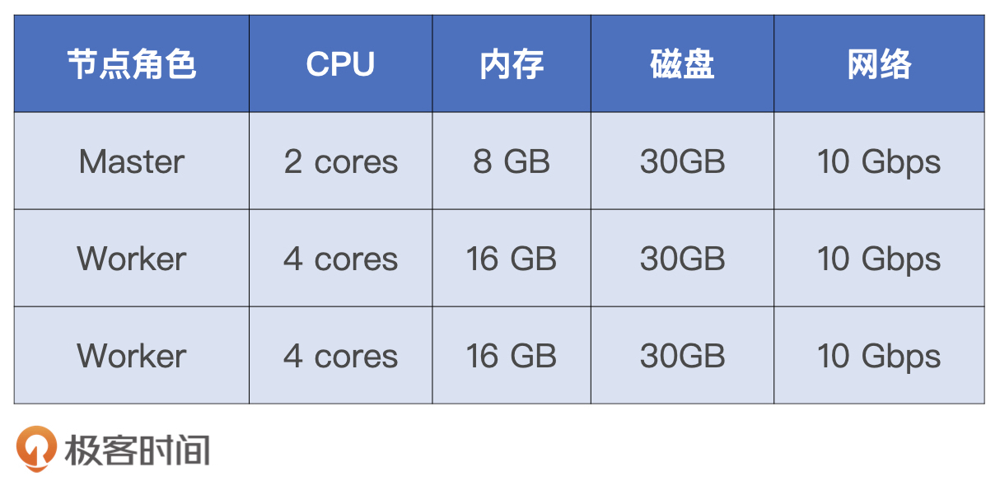
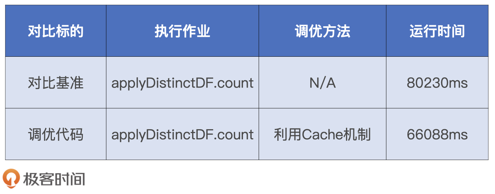
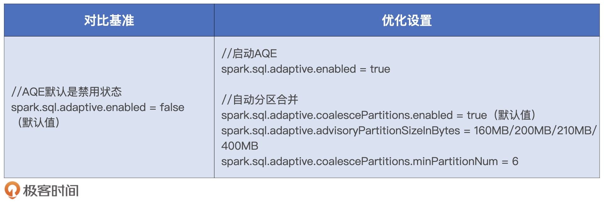
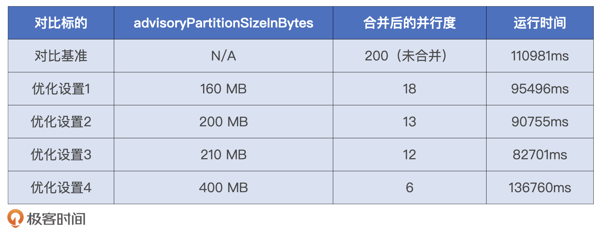
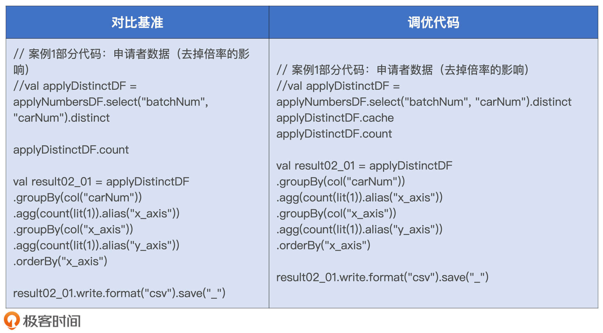
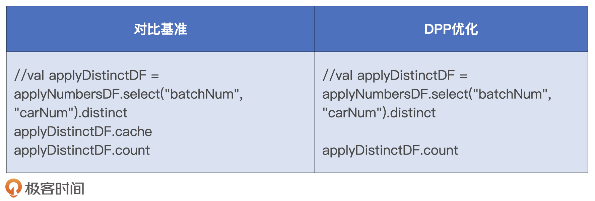

---
date: "2019-06-23"
---  
      
# 31 | 性能调优：手把手带你提升应用的执行性能
你好，我是吴磊。

在上一讲，我们一起完成了小汽车摇号趋势分析的应用开发，解决了5个案例。今天这一讲，我们逐一对这5个案例做性能调优，一起把专栏中学过的知识和技巧应用到实战中去。

由于趋势分析应用中的案例较多，为了方便对比每一个案例调优前后的性能效果，我们先来对齐并统一性能对比测试的方法论。

首先，我们的性能对比测试是以案例为粒度的，也就是常说的Case By Case。然后，在每一个案例中，我们都有对比基准（Baseline）。**对比基准的含义是，在不采取任何调优方法的情况下，直接把代码交付执行得到的运行时间。**之后，对于每一个案例，我们会采取一种或多种调优方法做性能优化，每一种调优方法都有与之对应的运行时间。最终，我们将不同调优方法的运行时间与对比基准做横向比较，来观察调优前后的性能差异，并分析性能提升/下降的背后原因。

话不多说，我们直接开始今天的课程吧！

## 运行环境

既然调优效果主要由执行时间来体现，那在开始调优之前，我们有必要先来交代一下性能测试采用的硬件资源和配置项设置。硬件资源如下表所示。



为了避免因为实验本身而等待太长的时间，我使用了比较强悍的机器资源。实际上，为了跑通应用，完成性能对比测试，你使用笔记本也可以。而且为了给后续调优留出足够空间，除了必需的运行资源设置以外，其他配置项全部保留了默认值，具体的资源配置如下表所示。

<!-- [[[read_end]]] -->


另外，由于调优方法中涉及AQE和DPP这些Spark 3.0新特性，因此，我建议你使用3.0及以上的Spark版本来部署运行环境，我这边采用的版本号是Spark 3.1.1。

接下来，我们就Case By Case地去回顾代码实现，分别分析5个案例的优化空间、可能的调优方法、方法的效果，以及它们与对比基准的性能差异。

## 案例1的性能调优：人数统计

首先，我们先来回顾案例1。案例1的意图是统计摇号总人次、中签者人数，以及去掉倍率影响之后的摇号总人次，代码如下所示。

```
    val rootPath: String = _
     
    // 申请者数据（因为倍率的原因，每一期，同一个人，可能有多个号码）
    val hdfs_path_apply = s"${rootPath}/apply"
    val applyNumbersDF = spark.read.parquet(hdfs_path_apply)
    applyNumbersDF.count
    // 中签者数据
    val hdfs_path_lucky = s"${rootPath}/lucky"
    val luckyDogsDF = spark.read.parquet(hdfs_path_lucky)
    luckyDogsDF.count
     
    // 申请者数据（去掉倍率的影响）
    val applyDistinctDF = applyNumbersDF.select("batchNum", "carNum").distinct
    applyDistinctDF.count
    

```

从上面的代码实现中，我们不难发现，短短的几行代码共有3个Actions，也就是3个不同数据集上的count操作，这3个Actions会触发3个Spark Jobs。其中，前2个Jobs都是读取数据源之后立即计数，没什么优化空间。第3个Job是在applyNumbersDF之上做去重，然后再统计计数。结合上一讲对于不同案例的讲解，我们知道，applyNumbersDF、luckyDogsDF和applyDistinctDF这3个数据集，在后续的案例中会被反复引用。

因为上述3个数据集的引用次数过于频繁，所以我们甚至都不用去计算“运行成本占比”，就可以判定：利用Cache一定有利于提升执行性能。

> 使用Cache的一般性原则：  
> 如果RDD/DataFrame/Dataset在应用中的引用次数为1，那么坚决不使用Cache  
> 如果引用次数大于1，且运行成本占比超过30\%，应当考虑启用Cache

因此，对于第3个Job，我们可以利用Cache机制来提升执行性能。调优方法很简单，我们只需在applyNumbersDF.count之前添加一行代码：applyNumbersDF.cache。

由于这个案例中性能对比测试的关注点是第3个Job，那为了方便横向对比，我们先把不相干的Jobs和代码去掉，整理之后的对比基准和调优代码如下表所示。


然后，我们把这两份代码分别打包、部署和执行，并记录applyDistinctDF.count作业的执行时间，来完成性能对比测试，我把执行结果记录到了下面的表格中。



从中我们可以看到，相较于对比基准，调优之后的执行性能提升了20\%。坦白地说，这样的提升是我们意料之中的。毕竟前者消耗的是磁盘I/O，而调优之后计数作业直接从内存获取数据。

## 案例2的性能调优：摇号次数分布

接下来，我们再来分析案例2。案例2分为两个场景，第一个场景用于统计申请者摇号批次数量的分布情况，第二个场景也是类似，不过它的出发点是中签者，主要用来解答“中签者通常需要摇多少次号才能中签”这类问题。

### 场景1：参与摇号的申请者

我们先来回顾一下场景1的代码实现。仔细研读代码，我们不难发现，场景1是典型的单表Shuffle，而且是两次Shuffle。第一次Shuffle操作是以数据列“carNum”为基准做分组计数，第二次Shuffle是按照“x\_axis”列再次做分组计数。

```
    val result02_01 = applyDistinctDF
    .groupBy(col("carNum"))
    .agg(count(lit(1)).alias("x_axis"))
    .groupBy(col("x_axis"))
    .agg(count(lit(1)).alias("y_axis"))
    .orderBy("x_axis")
     
    result02_01.write.format("csv").save("_")
    

```

因此，场景1的计算实际上就是2次Word Count而已，只不过第一次的Word是“carNum”，而第二次的Word是“x\_axis”。那么，对于这样的“Word Count”，我们都有哪些调优思路呢？

在配置项调优那一讲，我们专门介绍了Shuffle调优的一些常规方法，比如调整读写缓冲区大小、By Pass排序操作等等。除此之外，我们的脑子里一定要有一根弦：**Shuffle的本质是数据的重新分发，凡是有Shuffle操作的地方都需要关注数据分布。所以对于过小的数据分片，我们要有意识地对其进行合并**。再者，在案例1中我们提到，applyNumbersDF、luckyDogsDF和applyDistinctDF在后续的案例中会被反复引用，**因此给applyDistinctDF加Cache也是一件顺理成章的事情**。

调优的思路这么多，那为了演示每一种调优方法的提升效果，我会从常规操作、数据分区合并、加Cache这3个方向出发，分别对场景1进行性能调优。不过，需要说明的是，咱们这么做的目的，一来是为了开阔调优思路，二来是为了复习之前学习过的调优技巧。

当然了，在实际工作中，我们一般没有时间和精力像现在这样，一个方法、一个方法去尝试。那么，效率最高的做法应该是遵循我们一直强调的调优方法论，也就是**先去应对木桶的短板、消除瓶颈，优先解决主要矛盾，然后在时间、精力允许的情况下，再去应对次短的木板**。

那么问题来了，你认为上述3种调优思路分别应对的是哪些“木板”？这些“木板”中哪一块是最短的？你又会优先采用哪种调优技巧？接下来，我们就带着这些问题，依次对场景1做调优。

#### 思路1：Shuffle常规优化

刚刚咱们提到，Shuffle的常规优化有两类：一类是By Pass排序操作，一类是调整读写缓冲区。而By Pass排序有两个前提条件：一是计算逻辑不涉及聚合或排序；二是Reduce阶段的并行度要小于参数spark.shuffle.sort.bypassMergeThreshold的设置值。显然，场景1不符合要求，计算逻辑既包含聚合也包含排序。所以，我们就只有调整读写缓冲区这一条路可走了。

实际上，读写缓冲区的调优也是有前提的，因为这部分内存消耗会占用Execution Memory内存区域，所以提高缓冲区大小的前提是Execution Memory内存比较充裕。由于咱们使用的硬件资源比较强劲，而且小汽车摇号数据整体体量偏小，因此咱们还是有一些“资本”对读写缓冲区做调优的。具体来说，我们需要调整如下两个配置项：

* **spark.shuffle.file.buffer，Map阶段写入缓冲区大小**
* **spark.reducer.maxSizeInFlight，Reduce阶段读缓冲区大小**

由于读写缓冲区都是以Task为粒度进行设置的，因此调整这两个参数的时我们要小心一点，一般来说50\%往往是个不错的开始，对比基准与优化设置如下表所示。


两组对比实验的运行时间，我记录到了下面的表格中。从中我们不难发现，上述两个参数的调整，对于作业端到端执行性能的影响不大。不过，这种参数调了半天，执行效率并没有显著提升的场景，肯定让你似曾相识。这个时候，最好的办法就是我们继续借助“木桶短板”“瓶颈”以及“调优方法论”，去尝试其他的调优思路。


#### 思路2：数据分区合并

接着，我们再来说第二个思路，数据分区合并。首先，咱们先来一起分析一下，场景1到底存不存在数据分片过小的问题。为了方便分析，我们再来回顾一遍代码。因为场景1的计算基于数据集applyDistinctDF，所以要回答刚刚的问题，我们需要结合数据集applyDistinctDF的存储大小，以及Shuffle计算过后Reduce阶段的并行度一起来看。

```
    val result02_01 = applyDistinctDF
    .groupBy(col("carNum"))
    .agg(count(lit(1)).alias("x_axis"))
     
    .groupBy(col("x_axis"))
    .agg(count(lit(1)).alias("y_axis"))
     
    .orderBy("x_axis")
     
    result02_01.write.format("csv").save("_")
    

```

并行度由配置项spark.sql.shuffle.partitions决定，其默认大小为200，也就是200个数据分区。而对于数据集存储大小的估算，我们需要用到下面的函数。

```
    def sizeNew(func: => DataFrame, spark: => SparkSession): String = {
     
      val result = func
     
      val lp = result.queryExecution.logical
     
      val size = spark.sessionState.executePlan(lp).optimizedPlan.stats.sizeInBytes
     
      "Estimated size: " + size/1024 + "KB"
     
    }
    

```

给定DataFrame，sizeNew函数可以返回该数据集在内存中的精确大小。把applyDistinctDF作为实参，调用sizeNew函数，返回的估算尺寸为2.6 GB。将数据集尺寸除以并行度，我们就能得到Reduce阶段每个数据分片的存储大小，也就是13 MB（也就是2.6 GB / 200）。通常来说，数据分片的尺寸大小在200 MB左右为宜，13 MB的分片尺寸显然过小。

在调度系统那一讲（第5讲），我们说过，如果需要处理的数据分片过小，相较于数据处理，Task调度开销将变得异常显著，而这样会导致CPU利用降低，执行性能变差。因此，为了提升CPU利用率进而提升整体的执行效率，我们需要对过小的数据分片做合并。这个时候，AQE的自动分区合并特性就可以帮我们做这件事情。

不过，要想充分利用AQE的自动分区合并特性，我们还需要对相关的配置项进行调整。这里，你直接看场景1是怎么设置这些配置项的就可以了。



一旦开启AQE机制，自动分区合并特性会自动生效。表格中的配置项有两个需要我们特别注意，一个是最小分区数minPartitionNum，另一个是合并之后的目标尺寸advisoryPartitionSizeInBytes。

我们先来看最小分区数，也就是minPartitionNum。minPartitionNum的含义，指的是分区合并之后的分区数量，不能低于这个参数设置的数值。由于我们计算集群配置的Executors个数为6，为了保证每个CPU都不闲着、有活儿干，我们不妨把minPartitionNum也设置为6。

接下来是分区合并的目标尺寸，我们刚刚说过，分区大小的经验值在200 MB左右，因此我们不妨把advisoryPartitionSizeInBytes设置为200 MB。不过，为了对比不同分区大小对于执行性能的影响，我们可以多做几组实验。

配置项调整前后的几组实验效果对比如下，可以看到，调优后的运行时间有所缩短，这说明分区合并对于提升CPU利用率和作业的整体执行性能是有帮助的。仔细观察下表，我们至少有3点洞察。



* **并行度过高、数据分片过小，CPU调度开销会变大，执行性能也变差。**
* **分片粒度划分在200 MB左右时，执行性能往往是最优的。**
* **并行度过低、数据分片过大，CPU数据处理开销也会过大，执行性能会锐减。**

#### 思路3：加Cache

最后一个思路是加Cache，这个调优技巧使用起来非常简单，我们在案例1已经做过演示，因此，这里直接给出优化代码和运行结果。



可以看到，利用Cache机制做优化，作业执行性能提升得非常显著。


到此为止，我们尝试了3种调优方法来对场景1做性能优化，分别是Shuffle读写缓冲区调整、数据分区合并，以及加Cache。第1种方法针对的是，Shuffle过程中磁盘与网络的请求次数；第2种方法的优化目标，是提升Reduce阶段的CPU利用率；第3种方法针对的是，数据集在磁盘中的重复扫描与重复计算。

实际上，根本不需要做定量分析，仅从定性我们就能看出，数据集的重复扫描与计算的开销最大。因此，在实际工作中，对于类似的“多选题”，我们自然要优先选择能够消除瓶颈的第3种方法。

### 场景2：幸运的中签者

完成了场景1单表Shuffle的优化之后，接下来，我们再来看看场景2，场景2的业务目标是获取中签者的摇号次数分布。我们先来回顾场景2的代码实现，场景2的计算涉及一次数据关联，两次分组、聚合，以及最终的排序操作。不难发现，除了关联计算外，其他计算步骤与场景1如出一辙。因此，对于场景2的优化，我们专注在第一步的数据关联，后续优化沿用场景1的调优方法即可。

```
    val result02_02 = applyDistinctDF
    .join(luckyDogsDF.select("carNum"), Seq("carNum"), "inner")
    .groupBy(col("carNum")).agg(count(lit(1)).alias("x_axis"))
    .groupBy(col("x_axis")).agg(count(lit(1)).alias("y_axis"))
    .orderBy("x_axis")
     
    result02_02.write.format("csv").save("_")
    

```

参与关联的两张表分别是applyDistinctDF和luckyDogsDF，其中applyDistinctDF是去重之后的摇号数据，luckyDogsDF包含的是中签者的申请编号与批次号。applyDistinctDF包含1.35条数据记录，而luckyDogsDF仅仅包含115万条数据记录。很显然，二者之间的数据关联属于数仓中常见的“大表Join小表”。

遇到“大表Join小表”的计算场景，我们最先应该想到的调优技巧一定是广播变量。毕竟，我们一直都在不遗余力地强调Broadcast Joins的优势与收益。在这里，我再强调一次，你一定要掌握使用广播变量优化数据关联的调优技巧。毫不夸张地说，广播变量是“性价比”最高的调优技巧，且没有之一。

要利用广播变量来优化applyDistinctDF与luckyDogsDF的关联计算，我们需要做两件事情。**第一件，估算luckyDogsDF数据表在内存中的存储大小。第二件，设置广播阈值配置项spark.sql.autoBroadcastJoinThreshold。**

对于分布式数据集的尺寸预估，我们还是使用sizeNew函数，把luckyDogsDF作为实参，调用sizeNew函数，返回的估算尺寸为18.5MB。有了这个参考值，我们就可以设置广播阈值了。要把applyDistinctDF与luckyDogsDF的关联计算转化为Broadcast Join，只要让广播阈值大于18.5MB就可以，我们不妨把这个参数设置为20MB。


我把配置项调整前后的实验结果记录到了如下表格，显然，相比默认的Shuffle Sort Merge Join实现机制，Broadcast Join的执行性能更胜一筹。


## 案例3的性能调优：中签率的变化趋势

案例3的业务目标是洞察中签率的变化趋势，我们先来回顾代码。要计算中签率，我们需要分两步走。第一步，按照摇号批次，也就是batchNum分别对applyDistinctDF和luckyDogsDF分组，然后分别对分组内的申请者和中签者做统计计数。第二步，通过数据关联将两类计数做除法，最终得到每个批次的中签率。

```
    // 统计每批次申请者的人数
    val apply_denominator = applyDistinctDF
    .groupBy(col("batchNum"))
    .agg(count(lit(1)).alias("denominator"))
    
    // 统计每批次中签者的人数
    val lucky_molecule = luckyDogsDF
    .groupBy(col("batchNum"))
    .agg(count(lit(1)).alias("molecule"))
    
    val result03 = apply_denominator
    .join(lucky_molecule, Seq("batchNum"), "inner")
    .withColumn("ratio", round(col("molecule")/col("denominator"), 5))
    .orderBy("batchNum")
     
    result03.write.format("csv").save("_")
    

```

由于2011年到2019年总共有72个摇号批次，因此第一步计算得到结果集，也就是apply\_denominator和lucky\_molecule各自有72条数据记录。显然，两个如此之小的数据集做关联不存在什么调优空间。

因此，对于案例3来说，调优的关键在于第一步涉及的两个单表Shuffle。关于单表Shuffle的调优思路与技巧，我们在案例2的场景1做过详细的分析与讲解，因此，applyDistinctDF和luckyDogsDF两张表的Shuffle优化就留给你作为课后练习了。

## 案例4的性能调优：中签率局部洞察

与案例3不同，案例4只关注2018年的中签率变化趋势，我们先来回顾案例4的代码实现。

```
    // 筛选出2018年的中签数据，并按照批次统计中签人数
    val lucky_molecule_2018 = luckyDogsDF
    .filter(col("batchNum").like("2018%"))
    .groupBy(col("batchNum"))
    .agg(count(lit(1)).alias("molecule"))
    
    // 通过与筛选出的中签数据按照批次做关联，计算每期的中签率
    val result04 = apply_denominator
    .join(lucky_molecule_2018, Seq("batchNum"), "inner")
    .withColumn("ratio", round(col("molecule")/col("denominator"), 5))
    .orderBy("batchNum")
     
    result04.write.format("csv").save("_")
    

```

从代码实现来看，案例4相比案例3唯一的改动，就是在luckyDogsDF做统计计数之前增加了摇号批次的过滤条件，也就是filter\(col\("batchNum"\).like\("2018\%"\)\)。你可能会说：“案例4的改动可以说是微乎其微，它的调优空间和调优方法应该和案例3没啥区别”。还真不是，还记得Spark 3.0推出的DPP新特性吗？添加在luckyDogsDF表上的这个不起眼的过滤谓词，恰恰让DPP有了用武之地。

在DPP那一讲，我们介绍过开启DPP的3个前提条件：

* 事实表必须是分区表，且分区字段（可以是多个）必须包含Join Key
* DPP仅支持等值Joins，不支持大于、小于这种不等值关联关系
* 维表过滤之后的数据集，必须要小于广播阈值，因此，你要注意调整配置项spark.sql.autoBroadcastJoinThreshold

那么，这3个前提条件是怎么影响案例4的性能调优的呢？

首先，在上一讲，我们介绍过摇号数据的目录结构，apply和lucky目录下的数据都按照batchNum列做了分区存储。因此，案例4中参与关联的数据表applyDistinctDF和luckyDogsDF都是分区表，且分区键batchNum刚好是二者做关联计算的Join Key。其次，案例4中的关联计算显然是等值Join。

最后，我们只要保证lucky\_molecule\_2018结果集小于广播阈值就可以触发DPP机制。2018年只有6次摇号，也就是说，分组计数得到的lucky\_molecule\_2018只有6条数据记录，这么小的“数据集”完全可以放进广播变量。

如此一来，案例4满足了DPP所有的前提条件，利用DPP机制，我们就可以减少applyDistinctDF的数据扫描量，从而在整体上提升作业的执行性能。



DPP的核心作用在于**降低事实表applyDistinctDF的磁盘扫描量**，因此案例4的调优办法非常简单，只要把最初加在applyDistinctDF之上的Cache去掉即可，如上表右侧所示。同时，为了公平起见，对比基准不应该仅仅是让DPP失效的测试用例，而应该是applyDistinctDF加Cache的测试用例。与此同时，我们直接对比DPP的磁盘读取效率与Cache的内存读取效率，也能加深对DPP机制的认知与理解。

把上述两个测试用例交付执行，运行结果如下。可以看到，相较对比基准，在DPP机制的作用下，案例4端到端的执行性能有着将近5倍的提升。由此可见，数据集加Cache之后的内存读取，远不如DPP机制下的磁盘读取更高效。


## 案例5的性能调优：倍率分析

案例5也包含两个场景，场景1的业务目标是计算不同倍率下的中签人数，场景2与场景1相比稍有不同，它的目的是计算不同倍率下的中签比例。

尽管两个场景的计算逻辑有区别，但是调优思路与方法是一致的。因此，在案例5中，我们只需要对场景1的性能优化进行探讨、分析与对比，我们先来回顾一下场景1的代码实现。

```
    val result05_01 = applyNumbersDF
    .join(luckyDogsDF.filter(col("batchNum") >= "201601")
    .select("carNum"), Seq("carNum"), "inner")
    .groupBy(col("batchNum"),col("carNum"))
    .agg(count(lit(1)).alias("multiplier"))
    .groupBy("carNum")
    .agg(max("multiplier").alias("multiplier"))
    .groupBy("multiplier")
    .agg(count(lit(1)).alias("cnt"))
    .orderBy("multiplier")
     
    result05_01.write.format("csv").save("_")
    

```

仔细研读代码之后，我们发现场景1的计算分为如下几个环节：

* 大表与小表的关联计算，且小表带过滤条件
* 按batchNum列做统计计数
* 按carNum列取最大值
* 按multiplier列做统计计数

在这4个环节当中，关联计算涉及的数据扫描量和数据处理量最大。因此，这一环节是案例5执行效率的关键所在。另外，除了关联计算环节，其他3个环节都属于单表Shuffle优化的范畴，这3个环节的优化可以参考案例2场景1的调优思路与技巧，咱们也不多说了。因此，对于案例5的性能优化，我们重点关注第一个环节，也就是applyNumbersDF与luckyDogsDF的关联计算。

仔细观察第一个环节的关联计算，我们发现关联条件中的Join Key是carNum，而carNum并不是applyNumbersDF与luckyDogsDF两张表的分区键，因此，在这个关联查询中，我们没有办法利用DPP机制去做优化。

不过，applyNumbersDF与luckyDogsDF的内关联是典型的“大表Join小表”，对于这种场景，我们至少有两种方法可以将低效的SMJ转化为高效的BHJ。

**第一种办法是计算原始数据集luckyDogsDF的内存存储大小，确保其小于广播阈值，从而利用Spark SQL的静态优化机制将SMJ转化为BHJ。第二种方法是确保过滤后的luckyDogsDF小于广播阈值，这样我们就可以利用Spark SQL的AQE机制来动态地将SMJ转化为BHJ。**

接下来，我们分别使用这两种方法来做优化，比较它们之间，以及它们与对比基准之间的性能差异。在案例2场景2中，我们计算过luckyDogsDF在内存中的存储大小是18.5MB，因此，通过适当调节spark.sql.autoBroadcastJoinThreshold，我们就可以灵活地在两种调优方法之间进行切换。


将3种测试用例付诸执行，在执行效率方面，SMJ毫无悬念是最差的，而AQE的动态优化介于SMJ与Spark SQL的静态转化之间。毕竟，AQE的Join策略调整是一种“亡羊补牢、犹未为晚”的优化机制，在把SMJ调整为BHJ之前，参与Join的两张表的Shuffle计算已经执行过半。因此，它的执行效率一定比Spark SQL的静态优化更差。尽管如此，AQE动态调整过后的BHJ还是比默认的SMJ要高效得多，而这也体现了AQE优化机制的价值所在。


## 小结

今天这一讲，我们结合以前学过的知识点与调优技巧，以小汽车摇号为例Case By Case地做性能优化。涉及的优化技巧有Shuffle读写缓冲区调整、加Cache、预估数据集存储大小、Spark SQL静态优化、AQE动态优化（自动分区合并与Join策略调整）以及DPP机制。为了方便你对比，我把它们总结在了一张脑图里。不过，我更希望你能自己总结一下，这样才能记得更好。


最后我想说，很遗憾我们没能在这个实战里，把专栏中所有的调优技巧付诸实践，这主要是因为小汽车摇号应用相对比较简单，很难覆盖所有的计算与优化场景。对于那些未能付诸实战的调优技巧，只能靠你在平时的工作中去实践了。

不过，专栏的留言区和咱们的读者群，会一直为你敞开，尽管我不能做到立即回复，但我可以承诺的是，对于你的留言，我只会迟到、绝不缺席！

## 每日一练

1.  你能参考案例2场景1，完成案例3中applyDistinctDF和luckyDogsDF两张表的单表Shuffle优化吗？
2.  你能参考案例5场景1，综合运用AQE、Broadcast Join等调优技巧，对案例5场景2做性能优化吗？

期待在留言区看到你的优化结果，也欢迎你随时提问，我们下一讲见！