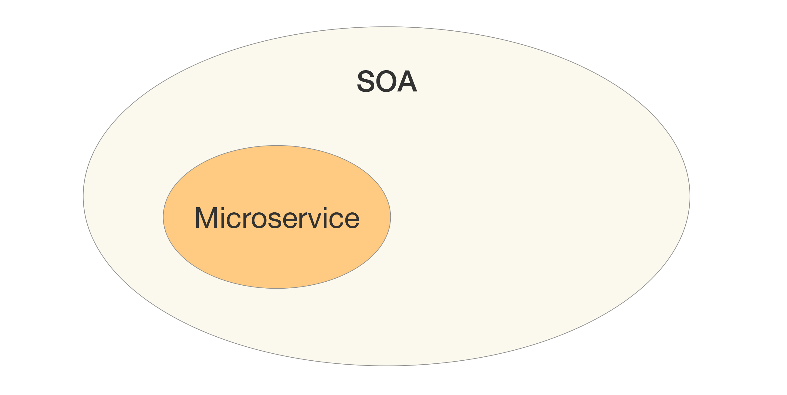
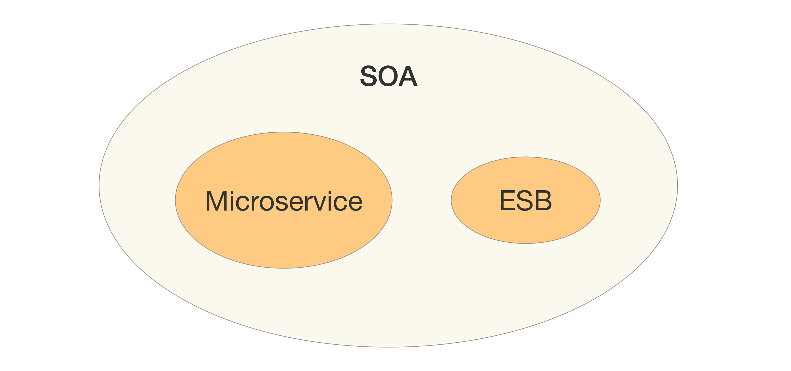
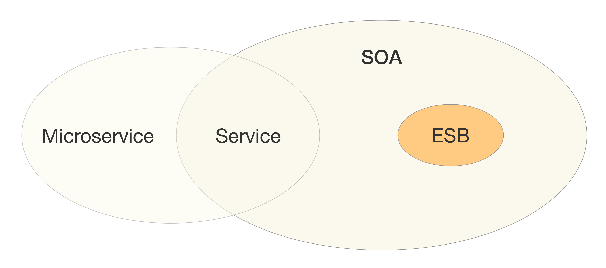
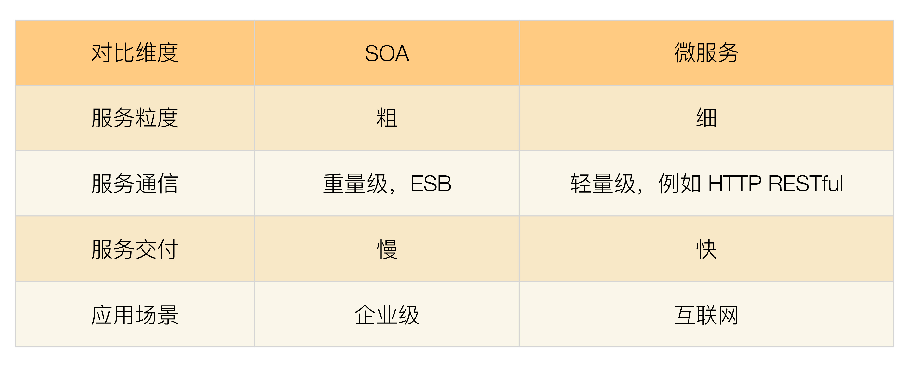
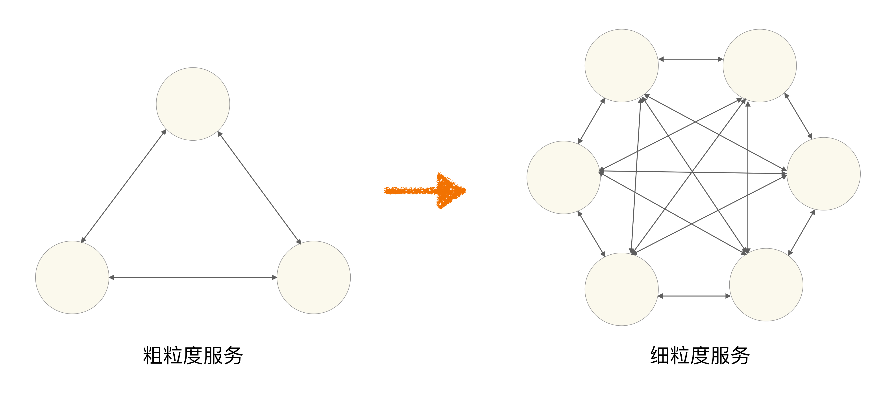
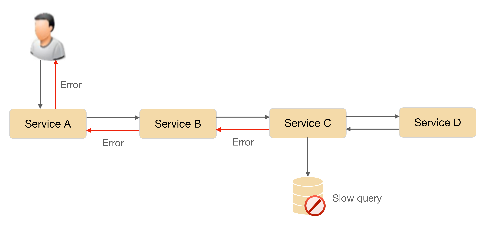
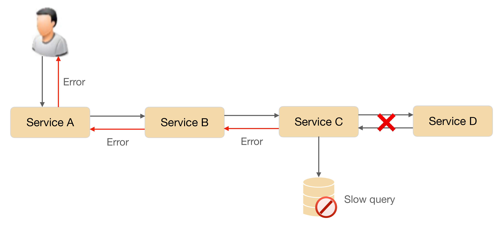

---
date: "2019-06-23"
---  
      
# 34 | 深入理解微服务架构：银弹 or 焦油坑？
微服务是近几年非常火热的架构设计理念，大部分人认为是Martin Fowler提出了微服务概念，但事实上微服务概念的历史要早得多，也不是Martin Fowler创造出来的，Martin只是将微服务进行了系统的阐述（原文链接：<https://martinfowler.com/articles/microservices.html>）。不过不能否认Martin在推动微服务起到的作用，微服务能火，Martin功不可没。

微服务的定义相信你早已耳熟能详，参考维基百科，我就来简单梳理一下微服务的历史吧（<https://en.wikipedia.org/wiki/Microservices#History）：>

* 2005年：Dr. Peter Rodgers在Web Services Edge大会上提出了“Micro-Web-Services”的概念。

* 2011年：一个软件架构工作组使用了“microservice”一词来描述一种架构模式。

* 2012年：同样是这个架构工作组，正式确定用“microservice”来代表这种架构。

* 2012年：ThoughtWorks的James Lewis针对微服务概念在QCon San Francisco 2012发表了演讲。

* 2014年：James Lewis和Martin Fowler合写了关于微服务的一篇学术性的文章，详细阐述了微服务。

<!-- [[[read_end]]] -->

由于微服务的理念中也包含了“服务”的概念，而SOA中也有“服务”的概念，我们自然而然地会提出疑问：**微服务与SOA有什么关系？有什么区别？为何有了SOA还要提微服务**？这几个问题是理解微服务的关键，否则如果只是跟风拿来就用，既不会用，也用不好，用了不但没有效果，反而还可能有副作用。

今天我们就来深入理解微服务，到底是银弹还是焦油坑。

## 微服务与SOA的关系

对于了解过SOA的人来说，第一次看到微服务这个概念肯定会有所疑惑：为何有了SOA还要提微服务呢？等到简单看完微服务的介绍后，可能很多人更困惑了：这不就是SOA吗？

关于SOA和微服务的关系和区别，大概分为下面几个典型的观点。

* 微服务是SOA的实现方式

如下图所示，这种观点认为SOA是一种架构理念，而微服务是SOA理念的一种具体实现方法。例如，“微服务就是使用HTTP RESTful协议来实现ESB的SOA”“使用SOA来构建单个系统就是微服务”和“微服务就是更细粒度的SOA”。

* 微服务是去掉ESB后的SOA

如下图所示，这种观点认为传统SOA架构最广为人诟病的就是庞大、复杂、低效的ESB，因此将ESB去掉，改为轻量级的HTTP实现，就是微服务。

* 微服务是一种和SOA相似但本质上不同的架构理念

如下图所示，这种观点认为微服务和SOA只是有点类似，但本质上是不同的架构设计理念。相似点在于下图中交叉的地方，就是两者都关注“服务”，都是通过服务的拆分来解决可扩展性问题。本质上不同的地方在于几个核心理念的差异：是否有ESB、服务的粒度、架构设计的目标等。

以上观点看似都有一定的道理，但都有点差别，到底哪个才是准确的呢？单纯从概念上是难以分辨的，我来对比一下SOA和微服务的一些具体做法，再来看看到底哪一种观点更加符合实际情况。

1.  服务粒度

整体上来说，SOA的服务粒度要粗一些，而微服务的服务粒度要细一些。例如，对一个大型企业来说，“员工管理系统”就是一个SOA架构中的服务；而如果采用微服务架构，则“员工管理系统”会被拆分为更多的服务，比如“员工信息管理”“员工考勤管理”“员工假期管理”和“员工福利管理”等更多服务。

2.  服务通信

SOA采用了ESB作为服务间通信的关键组件，负责服务定义、服务路由、消息转换、消息传递，总体上是重量级的实现。微服务推荐使用统一的协议和格式，例如，RESTful协议、RPC协议，无须ESB这样的重量级实现。Martin Fowler将微服务架构的服务通讯理念称为“Smart endpoints and dumb pipes”，简单翻译为“聪明的终端，愚蠢的管道”。之所以用“愚蠢”二字，其实就是与ESB对比的，因为ESB太强大了，既知道每个服务的协议类型（例如，是RMI还是HTTP），又知道每个服务的数据类型（例如，是XML还是JSON），还知道每个数据的格式（例如，是2017-01-01还是01/01/2017），而微服务的“dumb pipes”仅仅做消息传递，对消息格式和内容一无所知。

3.  服务交付

SOA对服务的交付并没有特殊要求，因为SOA更多考虑的是兼容已有的系统；微服务的架构理念要求“快速交付”，相应地要求采取自动化测试、持续集成、自动化部署等敏捷开发相关的最佳实践。如果没有这些基础能力支撑，微服务规模一旦变大（例如，超过20个微服务），整体就难以达到快速交付的要求，这也是很多企业在实行微服务时踩过的一个明显的坑，就是系统拆分为微服务后，部署的成本呈指数上升。

4.  应用场景

SOA更加适合于庞大、复杂、异构的企业级系统，这也是SOA诞生的背景。这类系统的典型特征就是很多系统已经发展多年，采用不同的企业级技术，有的是内部开发的，有的是外部购买的，无法完全推倒重来或者进行大规模的优化和重构。因为成本和影响太大，只能采用兼容的方式进行处理，而承担兼容任务的就是ESB。

微服务更加适合于快速、轻量级、基于Web的互联网系统，这类系统业务变化快，需要快速尝试、快速交付；同时基本都是基于Web，虽然开发技术可能差异很大（例如，Java、C加加、.NET等），但对外接口基本都是提供HTTP RESTful风格的接口，无须考虑在接口层进行类似SOA的ESB那样的处理。

综合上述分析，我将SOA和微服务对比如下：

因此，我们可以看到，**SOA和微服务本质上是两种不同的架构设计理念，只是在“服务”这个点上有交集而已，因此两者的关系应该是上面第三种观点**。

其实，Martin Fowler在他的微服务文章中，已经做了很好的提炼：

> In short, the microservice architectural style is an approach to developing a single application as a suite of small services, each running in its own process and communicating with lightweight mechanisms, often an HTTP resource API. These services are built around business capabilities and independently deployable by fully automated deployment machinery.

（<https://martinfowler.com/articles/microservices.html>）

上述英文的三个关键词分别是：small、lightweight、automated，基本上浓缩了微服务的精华，也是微服务与SOA的本质区别所在。

通过前面的详细分析和比较，似乎微服务本质上就是一种比SOA要优秀很多的架构模式，那是否意味着我们都应该把架构重构为微服务呢？

其实不然，SOA和微服务是两种不同理念的架构模式，并不存在孰优孰劣，只是应用场景不同而已。我们介绍SOA时候提到其产生历史背景是因为企业的IT服务系统庞大而又复杂，改造成本很高，但业务上又要求其互通，因此才会提出SOA这种解决方案。如果我们将微服务的架构模式生搬硬套到企业级IT服务系统中，这些IT服务系统的改造成本可能远远超出实施SOA的成本。

## 微服务的陷阱

单纯从上面的对比来看，似乎微服务大大优于SOA，这也导致了很多团队在实践时不加思考地采用微服务——既不考虑团队的规模，也不考虑业务的发展，也没有考虑基础技术的支撑，只是觉得微服务很牛就赶紧来实施，以为实施了微服务后就什么问题都解决了，而一旦真正实施后才发现掉到微服务的坑里面去了。

我们看一下微服务具体有哪些坑：

1.  服务划分过细，服务间关系复杂

服务划分过细，单个服务的复杂度确实下降了，但整个系统的复杂度却上升了，因为微服务将系统内的复杂度转移为系统间的复杂度了。

从理论的角度来计算，n个服务的复杂度是n×\(n-1\)/2，整体系统的复杂度是随着微服务数量的增加呈指数级增加的。下图形象了说明了整体复杂度：

粗粒度划分服务时，系统被划分为3个服务，虽然单个服务较大，但服务间的关系很简单；细粒度划分服务时，虽然单个服务小了一些，但服务间的关系却复杂了很多。

2.  服务数量太多，团队效率急剧下降

微服务的“微”字，本身就是一个陷阱，很多团队看到“微”字后，就想到必须将服务拆分得很细，有的团队人员规模是5 \~ 6个人，然而却拆分出30多个微服务，平均每个人要维护5个以上的微服务。

这样做给工作效率带来了明显的影响，一个简单的需求开发就需要涉及多个微服务，光是微服务之间的接口就有6 \~ 7个，无论是设计、开发、测试、部署，都需要工程师不停地在不同的服务间切换。

* 开发工程师要设计多个接口，打开多个工程，调试时要部署多个程序，提测时打多个包。

* 测试工程师要部署多个环境，准备多个微服务的数据，测试多个接口。

* 运维工程师每次上线都要操作多个微服务，并且微服务之间可能还有依赖关系。

3.  调用链太长，性能下降

由于微服务之间都是通过HTTP或者RPC调用的，每次调用必须经过网络。一般线上的业务接口之间的调用，平均响应时间大约为50毫秒，如果用户的一起请求需要经过6次微服务调用，则性能消耗就是300毫秒，这在很多高性能业务场景下是难以满足需求的。为了支撑业务请求，可能需要大幅增加硬件，这就导致了硬件成本的大幅上升。

4.  调用链太长，问题定位困难

系统拆分为微服务后，一次用户请求需要多个微服务协同处理，任意微服务的故障都将导致整个业务失败。然而由于微服务数量较多，且故障存在扩散现象，快速定位到底是哪个微服务故障是一件复杂的事情。下面是一个典型样例。

Service C的数据库出现慢查询，导致Service C给Service B的响应错误，Service B 给Service A的响应错误，Service A给用户的响应错误。我们在实际定位时是不会有样例图中这么清晰的，最开始是用户报错，这时我们首先会去查Service A。导致Service A故障的原因有很多，我们可能要花半个小时甚至1个小时才能发现是Service B返回错误导致的。于是我们又去查Service B，这相当于重复Service A故障定位的步骤……如此循环下去，最后可能花费了几个小时才能定位到是Service C的数据库慢查询导致了错误。

如果多个微服务同时发生不同类型的故障，则定位故障更加复杂，如下图所示。

Service C的数据库发生慢查询故障，同时Service C到Service D的网络出现故障，此时到底是哪个原因导致了Service C返回Error给Service B，需要大量的信息和人力去排查。

5.  没有自动化支撑，无法快速交付

如果没有相应的自动化系统进行支撑，都是靠人工去操作，那么微服务不但达不到快速交付的目的，甚至还不如一个大而全的系统效率高。例如：

* 没有自动化测试支撑，每次测试时需要测试大量接口。

* 没有自动化部署支撑，每次部署6 \~ 7个服务，几十台机器，运维人员敲shell命令逐台部署，手都要敲麻。

* 没有自动化监控，每次故障定位都需要人工查几十台机器几百个微服务的各种状态和各种日志文件。

6.  没有服务治理，微服务数量多了后管理混乱

信奉微服务理念的设计人员总是强调微服务的lightweight特性，并举出ESB的反例来证明微服务的优越之处。但具体实践后就会发现，随着微服务种类和数量越来越多，如果没有服务治理系统进行支撑，微服务提倡的lightweight就会变成问题。主要问题有：

* 服务路由：假设某个微服务有60个节点，部署在20台机器上，那么其他依赖的微服务如何知道这个部署情况呢？

* 服务故障隔离：假设上述例子中的60个节点有5个节点发生故障了，依赖的微服务如何处理这种情况呢？

* 服务注册和发现：同样是上述的例子，现在我们决定从60个节点扩容到80个节点，或者将60个节点缩减为40个节点，新增或者减少的节点如何让依赖的服务知道呢？

如果以上场景都依赖人工去管理，整个系统将陷入一片混乱，最终的解决方案必须依赖自动化的服务管理系统，这时就会发现，微服务所推崇的“lightweight”，最终也发展成和ESB几乎一样的复杂程度。

## 小结

今天我为你讲了微服务与SOA的关系以及微服务实践中的常见陷阱，希望对你有所帮助。

这就是今天的全部内容，留一道思考题给你吧，你们的业务有采用微服务么？谈谈具体实践过程中有什么经验和教训。

欢迎你把答案写到留言区，和我一起讨论。相信经过深度思考的回答，也会让你对知识的理解更加深刻。（编辑乱入：精彩的留言有机会获得丰厚福利哦！）