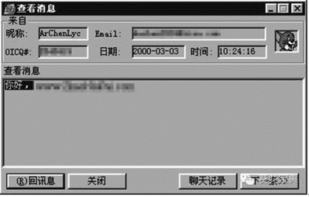
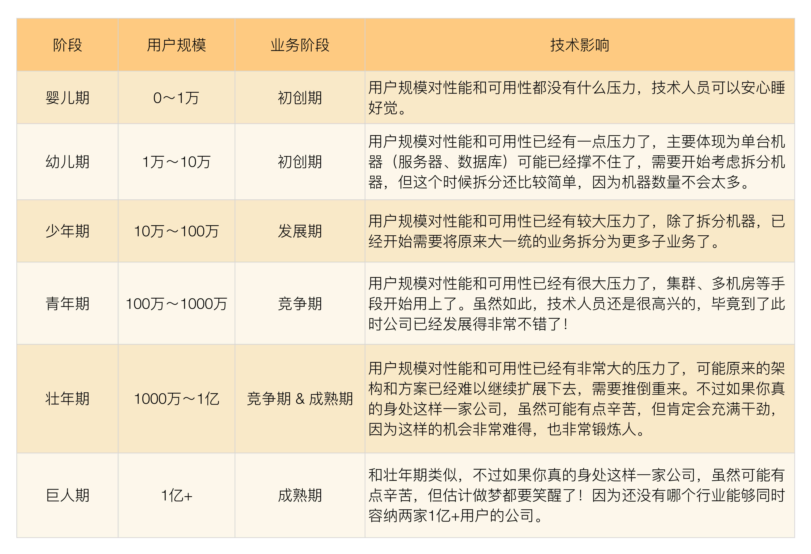

---
date: "2019-06-23"
---  
      
# 39 | 互联网技术演进的模式
由于各行业的业务发展轨迹并不完全相同，无法给出一个统一的模板让所有的架构师拿来就套用，因此我以互联网的业务发展为案例，谈谈互联网技术演进的模式，其他行业可以参考分析方法对自己的行业进行分析。

互联网业务千差万别，但由于它们具有“规模决定一切”的相同点，其发展路径也基本上是一致的。互联网业务发展一般分为几个时期：初创期、发展期、竞争期、成熟期。

不同时期的差别主要体现在两个方面：**复杂性、用户规模**。

## 业务复杂性

互联网业务发展第一个主要方向就是“业务越来越复杂”，我们来看看不同时期业务的复杂性的表现。

1.初创期

互联网业务刚开始一般都是一个创新的业务点，这个业务点的重点不在于“完善”，而在于“创新”，只有创新才能吸引用户；而且因为其“新”的特点，其实一开始是不可能很完善的。只有随着越来越多的用户的使用，通过快速迭代试错、用户的反馈等手段，不断地在实践中去完善，才能继续创新。

初创期的业务对技术就一个要求：“快”，但这个时候却又是创业团队最弱小的时期，可能就几个技术人员，所以这个时候十八般武艺都需要用上：能买就买，有开源的就用开源的。

我还以淘宝和QQ为例。

第一版的淘宝（<https://blog.csdn.net/linlin_juejue/article/details/5959171>）：  

<!-- [[[read_end]]] -->

第一版的QQ（<http://www.yixieshi.com/20770.html>）：  

可以看到最开始的淘宝和QQ与现在相比，几乎看不出是同一个业务了。

2.发展期

当业务推出后经过市场验证如果是可行的，则吸引的用户就会越来越多，此时原来不完善的业务就进入了一个快速发展的时期。业务快速发展时期的主要目的是将原来不完善的业务逐渐完善，因此会有越来越多的新功能不断地加入到系统中。对于绝大部分技术团队来说，这个阶段技术的核心工作是快速地实现各种需求，只有这样才能满足业务发展的需要。

如何做到“快”，一般会经历下面几个阶段。

* 堆功能期

业务进入快速发展期的初期，此时团队规模也不大，业务需求又很紧，最快实现业务需求的方式是继续在原有的系统里面不断地增加新的功能，重构、优化、架构等方面的工作即使想做，也会受制于人力和业务发展的压力而放在一边。

* 优化期

“堆功能”的方式在刚开始的时候好用，因为系统还比较简单，但随着功能越来越多，系统开始变得越来越复杂，后面继续堆功能会感到越来越吃力，速度越来越慢。一种典型的场景是做一个需求要改好多地方，一不小心就改出了问题。直到有一天，技术团队或者产品人员再也受不了这种慢速的方式，终于下定决定要解决这个问题了。

如何解决这个问题，一般会分为两派：一派是优化派，一派是架构派。

优化派的核心思想是将现有的系统优化。例如，采用重构、分层、优化某个MySQL查询语句，将机械硬盘换成SSD，将数据库从MySQL换成Oracle，增加Memcache缓存等。优化派的优势是对系统改动较小，优化可以比较快速地实施；缺点就是可能过不了多久，系统又撑不住了。

架构派的核心思想是调整系统架构，主要是将原来的大系统拆分为多个互相配合的小系统。例如，将购物系统拆分为登录认证子系统、订单系统、查询系统、分析系统等。架构派的优势是一次调整可以支撑比较长期的业务发展，缺点是动作较大、耗时较长，对业务的发展影响也比较大。

相信在很多公司都遇到这种情况，大部分情况下都是“优化派”会赢，主要的原因还是因为此时“优化”是最快的方式。至于说“优化派”支撑不了多久这个问题，其实也不用考虑太多，因为业务能否发展到那个阶段还是个未知数，保证当下的竞争力是最主要的问题。

* 架构期

经过优化期后，如果业务能够继续发展，慢慢就会发现优化也顶不住了，毕竟再怎么优化，系统的能力总是有极限的。Oracle再强大，也不可能一台Oracle顶住1亿的交易量；小型机再好，也不可能一台机器支持100万在线人数。此时已经没有别的选择，只能进行架构调整，在优化期被压制的架构派开始扬眉吐气了，甚至会骄傲地说“看看吧，早就说要进行架构调整，你们偏要优化，现在还是顶不住了吧，哼……”。

架构期可以用的手段很多，但归根结底可以总结为一个字“拆”，什么地方都可以拆。

拆功能：例如，将购物系统拆分为登录认证子系统、订单系统、查询系统、分析系统等。

拆数据库：MySQL一台变两台，2台变4台，增加DBProxy、分库分表等。

拆服务器：服务器一台变两台，2台变4台，增加负载均衡的系统，如Nginx、HAProxy等。

3.竞争期

当业务继续发展，已经形成一定规模后，一定会有竞争对手开始加入行业来竞争，毕竟谁都想分一块蛋糕，甚至有可能一不小心还会成为下一个BAT。当竞争对手加入后，大家互相学习和模仿，业务更加完善，也不断有新的业务创新出来，而且由于竞争的压力，对技术的要求是更上一层楼了。

新业务的创新给技术带来的典型压力就是新的系统会更多，同时，原有的系统也会拆得越来越多。两者合力的一个典型后果就是系统数量在原来的基础上又增加了很多。架构拆分后带来的美好时光又开始慢慢消逝，技术工作又开始进入了“慢”的状态，这又是怎么回事呢？

原来系统数量越来越多，到了一个临界点后就产生了质变，即系统数量的量变带来了技术工作的质变。主要体现在下面几个方面：

* 重复造轮子

系统越来越多，各系统相似的工作越来越多。例如，每个系统都有存储，都要用缓存，都要用数据库。新建一个系统，这些工作又要都做一遍，即使其他系统已经做过了一遍，这样怎么能快得起来？

* 系统交互一团乱麻

系统越来越多，各系统的交互关系变成了网状。系统间的交互数量和系统的数量成平方比的关系。例如，4个系统的交互路径是6个，10个系统的交互路径是45个。每实现一个业务需求，都需要几个甚至十几个系统一起改，然后互相调用来调用去，联调成了研发人员的灾难、联测成了测试人员的灾难、部署成了运维的灾难。

针对这个时期业务变化带来的问题，技术工作主要的解决手段有：

**平台化**

目的在于解决“重复造轮子”的问题。

存储平台化：淘宝的TFS、京东JFS。

数据库平台化：百度的DBProxy、淘宝TDDL。

缓存平台化：Twitter的Twemproxy，豆瓣的BeansDB、腾讯TTC。

**服务化**

目的在于解决“系统交互”的问题，常见的做法是通过消息队列来完成系统间的异步通知，通过服务框架来完成系统间的同步调用。

消息队列：淘宝的Notify、MetaQ，开源的Kafka、ActiveMQ等。

服务框架：Facebook的thrift、当当网的Dubbox、淘宝的HSF等。

4.成熟期

当企业熬过竞争期，成为了行业的领头羊，或者整个行业整体上已经处于比较成熟的阶段，市场地位已经比较牢固后，业务创新的机会已经不大，竞争压力也没有那么激烈，此时求快求新已经没有很大空间，业务上开始转向为“求精”：我们的响应时间是否比竞争对手快？我们的用户体验是否比竞争对手好？我们的成本是否比竞争对手低……

此时技术上其实也基本进入了成熟期，该拆的也拆了，该平台化的也平台化了，技术上能做的大动作其实也不多了，更多的是进行优化。但有时候也会为了满足某个优化，系统做很大的改变。例如，为了将用户响应时间从200ms降低到50ms，可能就需要从很多方面进行优化：CDN、数据库、网络等。这个时候的技术优化没有固定的套路，只能按照竞争的要求，找出自己的弱项，然后逐项优化。在逐项优化时，可以采取之前各个时期采用的手段。

## 用户规模

互联网业务的发展第二个主要方向就是“用户量越来越大”。互联网业务的发展会经历“初创期、发展期、竞争期、成熟期”几个阶段，不同阶段典型的差别就是用户量的差别，用户量随着业务的发展而越来越大。

用户量增大对技术的影响主要体现在两个方面：性能要求越来越高、可用性要求越来越高。

1.性能

用户量增大给技术带来的第一个挑战就是性能要求越来越高。以互联网企业最常用的MySQL为例，再简单的查询，再高的硬件配置，单台MySQL机器支撑的TPS和QPS最高也就是万级，低的可能是几千，高的也不过几万。当用户量增长后，必然要考虑使用多台MySQL，从一台MySQL到多台MySQL不是简单的数量的增加，而是本质上的改变，即原来集中式的存储变为了分布式的存储。

稍微有经验的工程师都会知道，分布式将会带来复杂度的大幅度上升。以MySQL为例，分布式MySQL要考虑分库分表、读写分离、复制、同步等很多问题。

2.可用性

用户量增大对技术带来的第二个挑战就是可用性要求越来越高。当你有1万个用户的时候，宕机1小时可能也没有很大的影响；但当你有了100万用户的时候，宕机10分钟，投诉电话估计就被打爆了，这些用户再到朋友圈抱怨一下你的系统有多烂，很可能你就不会再有机会发展下一个100万用户了。

除了口碑的影响，可用性对收入的影响也会随着用户量增大而增大。1万用户宕机1小时，你可能才损失了几千元；100万用户宕机10分钟，损失可能就是几十万元了。

## 量变到质变

通过前面的分析，我们可以看到互联网业务驱动技术发展的两大主要因素是复杂性和用户规模，而这两个因素的本质其实都是“量变带来质变”。

究竟用户规模发展到什么阶段才会由量变带来质变，虽然不同的业务有所差别，但基本上可以按照下面这个模型去衡量。

应对业务质变带来的技术压力，不同时期有不同的处理方式，但不管什么样的方式，其核心目标都是为了满足业务“快”的要求，当发现你的业务快不起来的时候，其实就是技术的水平已经跟不上业务发展的需要了，技术变革和发展的时候就到了。更好的做法是在问题还没有真正暴露出来就能够根据趋势预测下一个转折点，提前做好技术上的准备，这对技术人员的要求是非常高的。

## 小结

今天我为你讲了互联网技术演进的基本模式，希望对你有所帮助。

这就是今天的全部内容，留一道思考题给你吧，参考今天文章的方法，简单分析一下你所在行业，看看是否存在典型的技术演进模式？

欢迎你把答案写到留言区，和我一起讨论。相信经过深度思考的回答，也会让你对知识的理解更加深刻。（编辑乱入：精彩的留言有机会获得丰厚福利哦！）