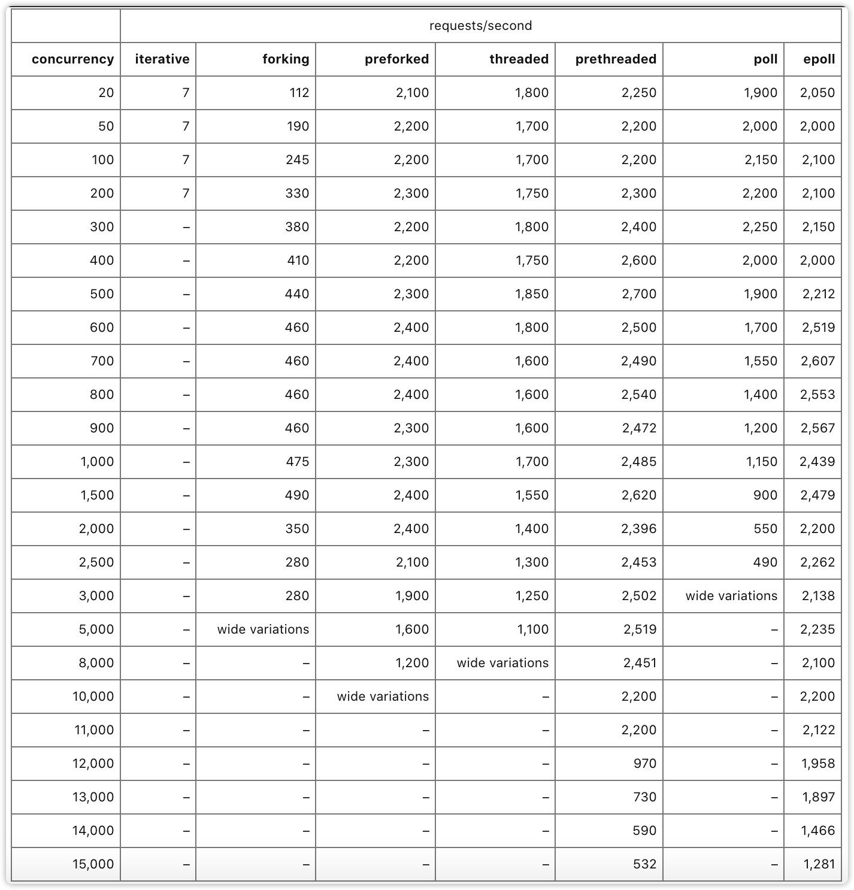
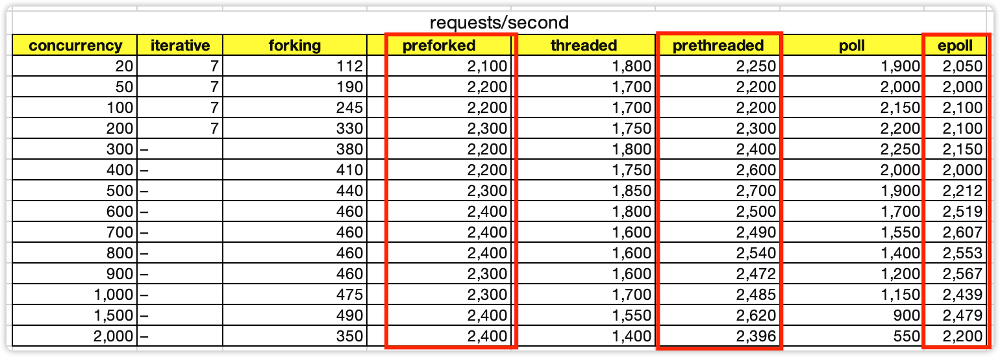
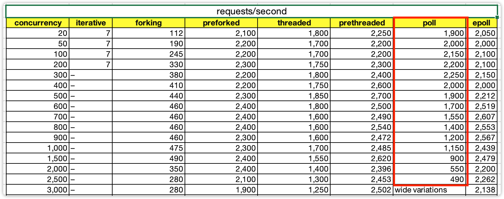
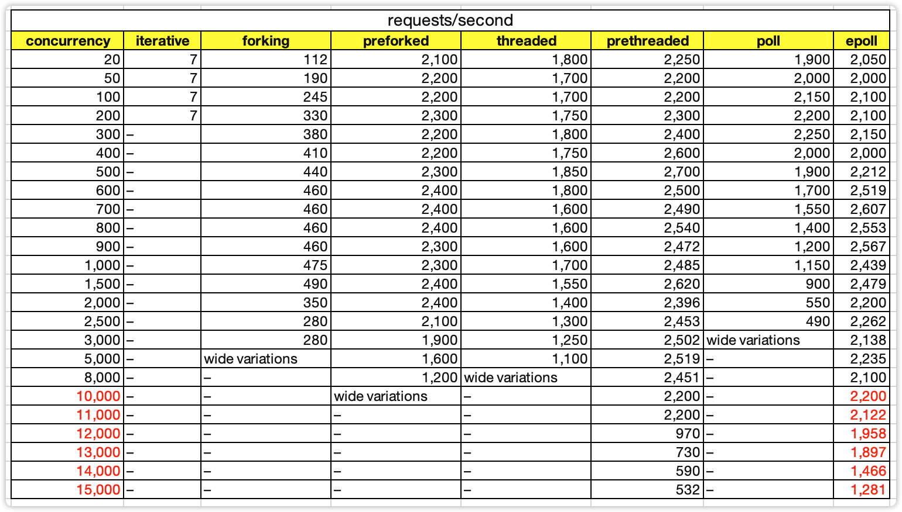

---
date: "2019-06-23"
---  
      
# 加餐｜单服务器高性能模式性能对比
你好，我是华仔。

我们架构课的[第18讲](https://time.geekbang.org/column/article/8697)和[第19讲](https://time.geekbang.org/column/article/8805)主题是单服务器高性能模式，我们讲了PPC与TPC、Reactor与Proactor，从理论上跟你详细讲述了不同模式的实现方式和优缺点，但是并没有给出详细的测试数据对比，原因在于我自己没有整套的测试环境，也不能用公司的服务器做压力测试，因此留下了一个小小的遗憾。

幸运的是，最近我在学习的时候，无意中在网络上找到一份非常详尽的关于Linux服务器网络模型的详细系列文章。作者通过连载的方式，将iterative、forking（对应专栏的PPC模式）、preforked（对应专栏的prefork模式）、threaded（对应专栏的TPC模式）、prethreaded（对应专栏的prethread模式）、poll、epoll（对应专栏的Reactor模式）共7种模式的实现原理、实现代码、性能对比都详尽地进行了阐述，完美地弥补了专栏内容没有实际数据对比的遗憾。

因此我把核心的测试数据对比摘录出来，然后基于数据来进一步阐释，也就有了这一讲的加餐。我想第一时间分享给你，相信今天的内容可以帮助我们加深对课程里讲过的理论的理解。

下面是作者对7种模式的性能测试对比结果表格，作者在文章中并没有详细地介绍测试环境，只是简单提到了测试服务器是租来的云服务器，**CPU只有1核**（没有说明具体的CPU型号），对于内存、带宽、磁盘等信息并没有介绍，我们假设这些硬件相关性能都足够。从理论上来说，网络模型的核心性能部件就是CPU，因此如下数据是具备参考意义的。

<!-- [[[read_end]]] -->

这张图的数据比较多，如何去看懂这样的性能测试数据表格呢？我来分享一个有用的技巧：**横向看对比，纵向看转折**。

### 横向看对比

比如，当并发连接数是1000的时候，可以看出preforking、prethreaded、epoll三种模式性能是相近的，也意味着epoll并不是在任何场景都具备相比其它模式的性能优势。

### 纵向看转折

比如，prethreaded模式（作者源码中设置了100个线程）在11000并发的时候性能有2200，但12000并发连接的时候，性能急剧下降到只有970，这是什么原因呢？我推测是12000并发的时候触发了C10K问题，线程上下文切换的性能消耗超越了IO处理，成为了系统的处理瓶颈。

按照上述“横向看对比，纵向看转折”的方式，我给你分享一下我的一些解读和发现。

1.  创建进程的消耗是创建线程的消耗的4倍左右。

2.  并发2000以内时，preforked、prethreaded、epoll的性能相差无几，甚至preforked和prethreaded的性能有时候还稍微高一些。

这也是内部系统、中间件等并发数并不高的系统并不一定需要epoll的原因，用preforked和prethreaded模式能够达到相同的性能，并且实现要简单。

3.  当并发数达到8000以上，只有pthreaded和epoll模式能够继续运行，但性能也有下降，epoll的下降更加平稳一些。

4.  prethreaded模式在12000并发连接的时候，性能急剧下降。

推测是触发了C10K问题，线程上下文切换的性能消耗超越了IO处理的性能消耗。

5.  poll模式随着并发数增多稳定下降，因为需要遍历的描述符越多，其性能越低。

类似的还有select模式，作者没有单独写select，因为两者原理基本类似，区别是select的最大支持连接数受限于FD\_SETSIZE这个参数。

6.  epoll在并发数超过10000的时候性能开始下降，但下降比较平稳。

这个结论看起来比较简单，但是却隐含着一个关键的设计点：**epoll不是万能的，连接数太多的时候单进程epoll也是不行的**。这也是为什么Redis可以用单进程Reactor模式，而Nginx必须用多进程Reactor模式，因为Redis的应用场景是内部访问，并发数一般不会超过10000；而Nginx是互联网访问，并发数很容易超过10000。

以上是我从性能对比数据中的一些发现，这些发现能够让我们更进一步理解专栏内容中讲到的理论知识和优缺点对比，这些数据也可以指导我们在实际的架构设计中根据应用场景来选择合适的模式。

最后，我也希望你能掌握“**横向看对比，纵向看转折**”这个分析技巧。这个技巧在查阅和审核性能测试数据以及各种对比数据的时候，能够帮助你发现很多数据背后隐含的观点和结论。

拓展阅读与学习指南：

1.  原作者的系列文章请参考：<https://unixism.net/2019/04/linux-applications-performance-introduction/>

2.  原作者的测试代码GitHub仓库地址：<https://github.com/shuveb/zerohttpd>

3.  原作者的代码实现了一个完整的基本功能的HTTP服务器，采用的是短链接的方式，还用到了Redis来保存内容，有的代码逻辑是比较复杂的，尤其是epoll的实现部分。如果你想自己简单的只是验证网络模型的性能，可以去掉其源码中HTTP的实现部分，只是简单地返回“hello world”这样的字符串即可。