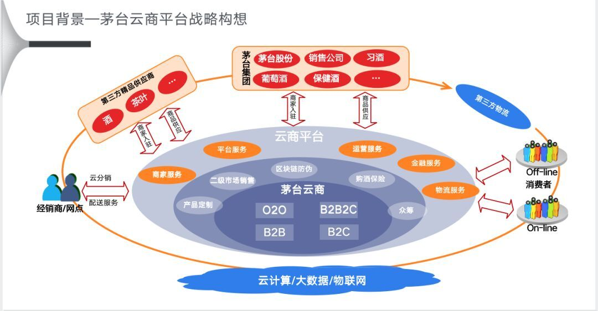
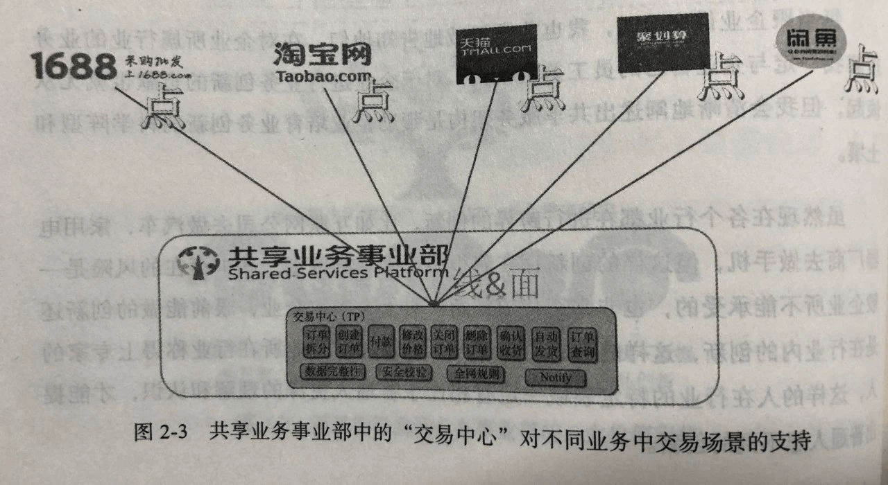

---
date: "2019-06-23"
---  
      
# 加餐｜扒一扒中台皇帝的外衣
你好，我是华仔。

今天这期加餐，我想和你聊聊中台这个话题。

自从2015阿里巴巴提出中台概念和战略，“中台”这个技术术语逐渐火热起来，尤其是从2019年开始，各类技术大会、各类公众号都在大力宣扬中台，出版社也趁着热点赶紧出版各类中台书籍，一时间中台有“旧时王谢堂前燕，飞入寻常百姓家”的感觉。如果你跟人聊技术的时候，不发表一些中台的言论，不讨论一些中台的问题，那肯定会显得你技术有点落伍了！

如果我们仔细阅读这些文章，可能会发现一个有趣的现象，绝大部分谈中台的都是做中台的，很少看到用中台的人出来评价。从人性的角度来讲，做中台的肯定不会说中台不好，毕竟还要靠这个恰饭，王婆卖瓜不自夸的话，买瓜的人自然会少。

偶尔有几篇说中台有问题的文章，例如《[中台翻车纪实：一年叫停，员工转岗被裁，资源全浪费](https://mp.weixin.qq.com/s/yfhaEkO1DG_ihJMhwtkWjA)》《[中台，我信了你的邪 | 深氪](https://mp.weixin.qq.com/s/9j3BnR3UqA-lnJDoM5Hrvg)》，也很快会有人跳出来说“你们能力不行，所以中台没做好”、“中台是一个业务、组织、技术的协同，你们肯定是组织没保证”……

总而言之，现在到处都能看到做中台的人说中台如何如何好，偶尔有几个跳出来说不好的都会被质疑能力不行！

按照我的技术理念来看，没有完美的技术，没有放之四海皆好的技术，如果你只能看到一项技术的好处，而看不到坑，那实际上很可能就会掉到坑里去。

<!-- [[[read_end]]] -->

我虽然没有真正负责做过中台，但我做过平台和中间件，更为特别的是，我参与了两个基于中台的业务项目，一个项目是将手游交易系统迁移到电商中台，另一个项目是在支付中台上从0到1搭建一个钱包。这两个项目让我亲自实践了一下在阿里和蚂蚁的中台上做项目，让我有机会近距离观察中台的运作机制，在一次次与中台的讨论、PK的过程中，对中台也有了更深的理解和认识。

从我个人的经历和理解来看，目前关于中台的很多说法是言过其实、模棱两可、甚至是错误的，接下来我将给大家谈谈实际上的中台到底是怎么运作的，会有哪些坑。由于我真正就是用的阿里电商中台和蚂蚁的支付中台，因此不用质疑中台能力不行和组织能力不行才会有我说的那些问题。

## 中台的价值到底是什么？

关于中台的价值，你看到的是这样的（来源《[一文读懂「中台」的前世今生](https://mp.weixin.qq.com/s/ZdNEgn1gxyat9PeOeycHTg)》）：

可以让各业务部门保持相对的独立和分权，保证对业务的敏感性和创新性；另一方面，用一个强大的平台来对这些部门进行总协调和支持，平衡集权与分权，并为新业务新部门提供生长的空间，从而大幅降低组织变革的成本。**中台部门提炼各业务线的共性需求，最大限度地减少“重复造轮子”。**

实际上的中台是这样的。

**1\. 业务部门并不独立。**

基于中台的业务会被分为不同优先级，大业务对于中台的影响力远远大于小业务，核心业务对中台的影响力远远大于新业务。形象点来说，中台抱大业务的大腿，小业务抱中台的大腿，因为中台也是有KPI的，中台的KPI怎么来？当然是大部分来源于支持的业务了，大业务天然会有KPI数据上的优势。

这会导致什么问题呢？大业务的创新不管是不是共性的，中台会鼎力支持，毕竟判断是不是共性需求是中台判断的，而不是每次有个新业务的时候拉上所有业务方来评估和投票；小业务就比较悲催了，中台要拒绝你，只需简单一句话“你这个业务不通用”，“你这个需求太特殊”。

如果小业务不服气能怎么办？没什么办法，不会存在仲裁委员会之类的机构，就算有，你去仲裁的时间都够你自己把业务实现5遍了！就算中台认为你的需求是共性需求，如果你是小业务，很可能也会以优先级的原因被排在很后面，这里的“很后面”可不是几天几周，很可能就是几个月半年了！而恰恰很多初创业务一开始规模肯定是比较小的，基于中台的开发模式很可能会制约创新业务的快速发展，除非这个创新业务一开始就有重量级人物挂帅，对中台能够有足够的影响力。

**2\. 中台并不总是能够提炼共性需求。**

注意这里的需求不是指电商中台里面“交易”这个粒度的需求，而是指“交易”系统里面一个个实际的功能点，你要是坚持说“交易”是共性需求，这实际上是一句正确的废话。

事实上，提炼共性需求主要是中台从0到1的建设的时候，因为这个时候已经有多个业务需求的样本存在，哪些是共性哪些是个性是比较容易分析出来的，但一旦建成后后续的业务发展和创新，中台和业务方天然存在对共性需求的不同诉求。

业务方总是期望将自己的需求划为共性需求，因为这样就能够让中台出人来实现需求；中台总是期望先不要把需求划为共性需求，而是等到多个业务都有类似需求的时候再由中台来抽象提炼，这样才能最大化复用，否则中台每个需求都认为是共性需求的话，中台会累死。

而事实上几乎不太可能出现多个业务同时提出某个需求，除了国家颁布的法律法规相关的需求外，绝大部分业务需求都是由某个业务方先提出来的，这个时候中台是无法判断是否为共性需求的，只能又回到前面说的潜规则来操作：优先满足大业务，拒绝小业务。反正大业务的需求不管是不是共性的，做了后数据肯定好看，中台KPI有保证；小业务就算以后被证明是共性的，前期做了也没多少数据，中台很可能费力不讨好。

**3\. 中台的“轮子”会不断变化。**

很多朋友看到“避免重复造轮子”就以为中台把轮子造好了，业务方只管用就可以了，而实际情况是中台确实把轮子造好了，但是它每隔一段时间就会把轮子换一遍，例如中台的数据模型、接口、架构等其实都是需要根据业务发展不断变化的。

为了达到中台“复用”的目标，通常情况下中台在推出新轮子后，就不会再长期维护老轮子，否则如果中台同时维护4\~5个相似的轮子，复用就无从谈起。这就要求基于中台的业务都必须在某个时间段内完成轮子的切换，相当于是业务方进行了一次被动架构演进。

当然，如果没有中台，业务方的架构肯定也要随着业务的发展而演进，那这和跟随中台被动演进有什么区别呢？最主要的区别是中台的架构演进频率会比独立的业务架构演进要快，道理很简单：中台融合了多个相似业务的发展！

举个简单例子：如果中台支持10个业务，其中有1个业务发展很快，中台就必须跟着演进，剩余的9个业务即使没有任何发展，也必须跟着被动演进！更何况如果这10个业务本身都在不断发展，那中台的演进会更快！那是否存在某种牛逼的技术，让中台的演进不影响业务呢？绝大部分情况下都不可能，这是由中台演进的本质决定的：中台演进的绝大部分动力来源于业务，它的演进不可能做到反过来不影响业务。这点和技术平台（存储、消息队列这类）不一样，技术平台演进的动力来源于技术更新，是可以做到不影响业务的。

**4\. 中台是某类业务的中台，不是所有业务的中台。**

中台的本质是提炼共性需求复用，如果业务差异太大的话，复用度不高，提炼和维护中台花费的代价抵不上中台复用带来的价值。所以，实际上应该叫“电商中台”、“支付中台”、“物流中台”、“出行中台”、“视频中台”、“保险中台”，而不应该是“阿里中台”、“腾讯中台”、“百度中台”、“滴滴中台”。

当然，因为现在“中台”概念火爆，出现了原来很多做中间件和技术平台的团队，纷纷将自己负责的“XX平台”改为“技术中台”，从广义的角度来说也可以，因为这确实是“各业务线共性需求”，毕竟存储、缓存、消息队列这些肯定是各业务线的共性需求，但通常情况下我们说中台时所指的“需求”，还是指“业务需求”，即客户可以使用到的功能。

所以，即使只是看到“茅台云商”这种中台项目的PPT，也能大概率地推断这个项目失败的可能性会非常高（图片来源：[中台，我信了你的邪 | 深氪](https://mp.weixin.qq.com/s/9j3BnR3UqA-lnJDoM5Hrvg)）：

## 中台的效果是怎样的？

关于中台的效果，你看到的是这样的（摘自《[中台的问题，是技术的问题，还是人的问题](https://mp.weixin.qq.com/s/rHe1nf3jrGxoyZmWt-R25g)》）：

因为阿里巴巴的生态非常复杂，很多业务方本身也很年轻，要怎么去做，下层到底能提供什么样的支撑是不清楚的。当有大中台思路之后，第一，我们这个体系里有什么样的能力，可以让各业务很清楚地知道，也可以让前台业务方更快的理解、选择和使用中台能力。第二、我们提供了基础解决方案，业务方根据需要做定制开发满足自己的业务特性，对前台的业务来说会更快。

实际的中台是这样的。

**1\. 中台的体系有什么样的功能，业务方根本不是很清楚地知道，而是很清楚地不知道。**

事实上，几乎没有人能完整地知道中台里面各个域各个子系统的能力，更加谈不上业务方更快的理解、选择和使用了。你可以随便打开一张某个技术大会上分享的中台架构，满满的一页甚至几页PPT，大框小框几十上百个，对应到具体的线上运行的系统可能几百上千个，这么复杂的一个系统，怎么可能有人知道所有的功能和细节？更何况是业务方了。

至于说中台提供完整的解决方案，业务方只要定制一下就可以快速上线，说起来容易做起来难，除非业务方是准备复制一个和已有业务基本一样的业务，否则基本上是不可能实现的。原因在于中台提供的解决方案，必然是基于已有的业务来抽象出来的“共性需求”的大集合，如果这个解决方案可定制化度很高，那么就说明可复用度比较低；如果这个解决方案的可定制化度很低，虽然可复用度高但业务可扩展度比较低。

而从中台的本质出发，中台必然会选取“可定制度低可复用度高”的方向，这就约束了只有复制一个非常类似的新业务的时候中台的解决方案才有很大价值，但是对于同一个公司来说，为何要复制两个基本一样的业务呢？如果真的有中台选择了“可定制度高”的解决方案，当新业务和已有业务有较大差异的时候，中台的解决方案并没有什么很大价值，因为大量的工作量会耗费在定制那部分。

实际上我接触的中台是这样运作的：中台会分为很多“域”，例如“交易”、“搜索”、“会员”等，然后业务方将自己的业务需求写出来，然后拉上各个域的产品接口人和技术接口人，一个域一个域的讨论。

以“会员域”为例，讨论的时候，会员域的产品接口人技术接口人肯定很熟悉会员的功能、模型和接口，业务方需要跟中台子域接口人讲解业务需求，然后中台子域接口人来评估会员当前的能力哪些是支持的，哪些是不支持的，不支持的部分是属于共性需求还是属于个性需求，如果是共性需求，需要给出中台的修改的方案，而且修改方案还要会员域的架构师进行评审，因为改中台是影响所有业务的；如果是个性需求，需要设计出中台和业务方交互的方式，例如是提供接口、配置、扩展包等。

所以如果你真正基于中台做过项目你就会发现，编码的时间确实少了，但是前期的沟通和后期的联调非常耗时间，随便做个什么项目，拉上20\~30人算一般的，稍微大点的项目拉上50\~100人也是很正常的。

以淘宝的中台为例，如下是淘宝电商中台共享事业部里面交易中心的结构（图片来源：《企业IT 架构转型之道》）：

注意：交易中心只是共享事业部的一个业务域，同级别的业务域从公开资料来看有10来个，而交易中心内部就有13个子功能了，这些子功能最后都可能对应1个或者多个实际运行的系统。

**2\. 中台的所谓的“快”，并没有严谨的衡量。**

目前各类文章都会说有了中台后业务开发快，但并没有详细的案例和分析到底有多快，仅有的几个案例看起来很夸张，但没有详细背景描述其实并没有说服力。例如说某个业务新上线很快，到底是因为第一版功能很简单，还是第一个版本投入了大量的人力来做，还是真的是因为用了中台？

事实上我经历过的两个接入中台项目并不能看出来快，从实际的开发经验来看，业务方和中台的需求讲解和讨论，业务方和中台方案的设计讨论，后期的业务系统和中台系统联调这些工作量并没有减少，反而还会有一定程度的增加，因为中台在分析需求、设计方案、联调测试的时候需要考虑对其它业务的影响。

中台能够带来的效率提升主要体现在两方面：一是编码的工作量确实会少，毕竟还是有大量的代码可以重用的；二是中台的人员都对已有的类似业务和技术很熟悉，需求的确认和方案的设计会更高效，全流程综合来看，很难判断效率到底高还是低。

事实上我之前在阿里游戏做过几个从0到1的项目，因为老板重视，都是将原来类似的系统已有的核心开发人员拉过去开发新项目，最初的代码也是从原系统拷贝过去改，开发效率一样很高，核心原因简单来说就是“熟手开发”。

以上是我从基于中台的开发项目中观察到的一些问题，归纳总结出来的一些经验。总体来看好像我在质疑中台，其实不然。关于中台的好处已经有太多的文章了，这一讲试图提供从使用者的视角来看中台所看到的一些信息和问题，目的在于帮助大家更加全面地了解中台。

咱们这门“从零开始学架构”的课程提到了架构设计的三原则，第一条就是“合适原则”，这个原则对中台也是适应的。总结来说就是：中台不是灵丹妙药，不要有问题就想着用中台解决；中台也不是放之四海而皆准，明确中台的适应场景和可能的坑，才能更好地落地中台！

其实提出中台的逍遥子已经早就谆谆告诫了（来源《[中台，我信了你的邪 | 深氪](https://mp.weixin.qq.com/s/9j3BnR3UqA-lnJDoM5Hrvg)》）：

> 中台并不适用于每家公司的每个阶段。在独立业务拓展期、突破期，“一定用独立团、独立师、独立旅建制来做”，否则就会变成瓶颈；但发展到一定阶段，出现太多山头时，就要“关停并转、要合并同类项。问管理要效率，取消重复性建设”。

好了，关于中台的分享就到这里。听了今天的内容，你对中台有更多理解了吗？欢迎留言区分享你的思考，我们一起交流。