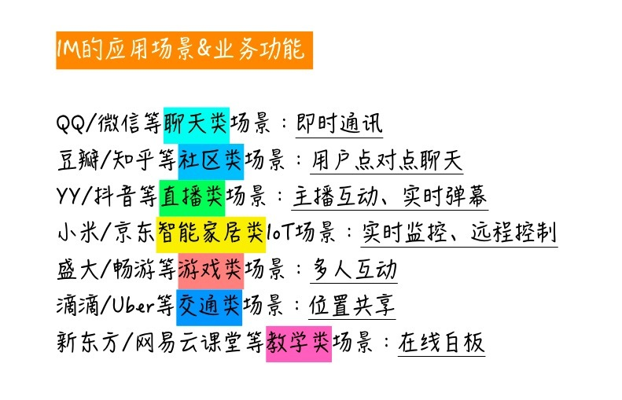
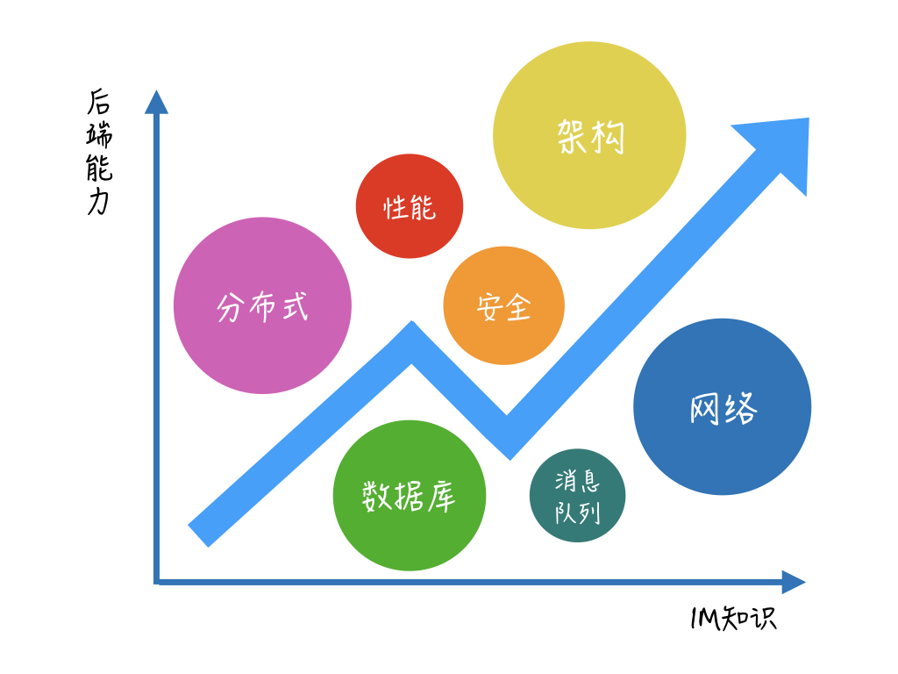

---
date: "2019-06-23"
---  
      
# 开篇词 | 搞懂“实时交互”的IM技术，将会有什么新机遇？
你好，我是袁武林。我来自新浪微博，目前在微博主要负责消息箱和直播互动相关的业务。接下来的一段时间，我会给你带来一个即时消息技术方面的专栏课程。

你可能会很好奇，为什么是来自微博的技术人来讲这个课程，微博会用到IM的技术吗？

在我回答之前，先请你思考一个问题：

> 除了QQ和微信，你知道还有什么App会用到即时（实时）消息技术吗？

其实，除了QQ和微信外，陌陌、抖音等直播业务为主的App也都深度用到了IM相关的技术。

比如在线学习软件中的“实时在线白板”，导航打车软件中的“实时位置共享”，以及和我们生活密切相关的智能家居的“远程控制”，也都会通过IM技术来提升人和人、人和物的实时互动性。

**我觉得可以这么理解：包括聊天、直播、在线客服、物联网等这些业务领域在内，所有需要“实时互动”“高实时性”的场景，都需要、也应该用到IM技术。**

微博因为其多重的业务需求，在许多业务中都应用到了IM技术，目前除了我负责的消息箱和直播互动业务外，还有其他业务也逐渐来通过我们的IM通用服务，提升各自业务的用户体验。

为什么这么多场景都用到了IM技术呢，IM的技术究竟是什么呢？

所以，在正式开始讲解技术之前，我想先从应用场景的角度，带你了解一下IM技术是什么，它为互联网带来了哪些巨大变革，以及自身蕴含着怎样的价值。

<!-- [[[read_end]]] -->

## 什么是IM系统？

我们不妨先看一段旧闻：

> 2014年Facebook以190亿美元的价格，收购了当时火爆的即时通信工具WhatsApp，而此时WhatsApp仅有50名员工。

是的，也就是说这50名员工人均创造了3.8亿美元的价值。这里，我们不去讨论当时谷歌和Facebook为争抢WhatsApp发起的价格战，从而推动这笔交易水涨船高的合理性，**从另一个侧面我们看到的是：依托于IM技术的社交软件，在完成了“连接人与人”的使命后，体现出的巨大价值。**

同样的价值体现也发生在国内。1996年，几名以色列大学生发明的即时聊天软件ICQ一时间风靡全球，3年后的深圳，它的效仿者在中国悄然出现，通过熟人关系的快速构建，在一票基于陌生人关系的网络聊天室中脱颖而出，逐渐成为国内社交网络的巨头。

那时候这个聊天工具还叫OICQ，后来更名为QQ，说到这，大家应该知道我说的是哪家公司了，没错，这家公司叫腾讯。在之后的数年里，腾讯正是通过不断优化升级IM相关的功能和架构，凭借QQ和微信这两大IM工具，牢牢控制了强关系领域的社交圈。

**由此可见，IM技术作为互联网实时互动场景的底层架构，在整个互动生态圈的价值所在。**

随着互联网的发展，人们对于实时互动的要求越来越高。于是，IM技术不止应用于QQ、微信这样的面向聊天的软件，它其实有着宽广的应用场景和足够有想象力的前景。甚至在不知不觉之间，IM系统已经根植于我们的互联网生活中，成为各大App必不可少的模块。

除了我在前面图中列出的业务之外，如果你希望在自己的App里加上实时聊天或者弹幕的功能，通过IM云服务商提供的SDK就能快速实现（当然如果需求比较简单，你也可以自己动手来实现）。

比如，在极客时间App中，我们可以加上一个支持大家点对点聊天的功能，或者增加针对某一门课程的独立聊天室。

例子太多，我就不一一列举了。其实我想说的是：**IM并不是一门仅限于聊天、社交的技术，实际上它已经广泛运用于我们身边形形色色的软件中。**

随着5G等高速移动网络技术的快速推进，网络速度和稳定性大幅提升、网络流量费用降低，势必今后还会有越来越多的软件依托即时消息的优势理念加入到IM的大家庭中来，毕竟谁不希望所有互动都能“实时触达”而且“安全可靠”呢？

## 应用场景不同，适用的解决方案也不同

另外，从技术的角度来看，IM技术在后端的实现上并不是孤立存在的，实际上，我们可以认为IM技术是众多前后端技术的一个综合体，只不过和其它业务相比，由于自身使用场景在某些技术点上有更多侧重。

在整个IM系统的实现上深度用到了**网络、数据库、缓存、加密、消息队列**等后端必备知识。架构设计中也在**大规模分布式、高并发、一致性架构设计**等方面有众多成熟的解决方案。

**所以我们可以认为，在学习和实践IM技术的过程中，也可以系统化提升你在这些方面的整体能力。**

我第一次接触IM系统并不是和“人”相关的场景，当时就职的公司做的是一个类似“物联网”的油罐车实时追踪控制系统，一是通过GPS实时跟踪油罐车的位置，判断是否按常规路线行进，一是在油罐车到达目的地之后，通过系统远程控制开锁。

所以，这里的交互实际是“车”和“系统”的互动，当然这个系统实现上并没有多大的技术挑战，除了GPS的漂移纠偏带来了一些小小的困扰，最大的挑战莫过于调试的时候需要现场跟车调试多地奔波。

再后来，由于工作的变动，我逐渐接触到IM系统中一些**高并发的业务场景**，**千万级实时在线用户，百亿级消息下推量，突发热点的直线峰值等**。一步一步地踩坑和重构，除了感受到压力之外，对IM系统也有了更深层次的理解。

记得几年前，由于消息图片服务稳定性不好，图片消息的渲染比较慢，用户体验不好。

而且，由于图片流和文本流在同一个TCP通道，TCP的阻塞有时还会影响文本消息的收发。

所以后来我们对通道进行了一次拆分，把图片、文件等二进制流拆到一个独立通道，核心通道只推缩略图流，大幅减轻了通道压力，提升了核心链路的稳定性。

同时，独立的通道也缩短了客户端到文件流的链路，这样也提升了图片的访问性能。

但后来视频功能上线后，我们发现视频的PSR1（1秒内播放成功率）比较低，原因是视频文件一般比较大，为避免通道阻塞，不会通过消息收发的核心通道来推送。

所以之前的策略是：通过消息通道只下推视频的ID，用户真正点击播放时才从服务端下载，这种模式虽然解决了通道阻塞的问题，但“播放时再下载”容易出现卡顿的情况。

因此，针对视频类消息，我们增加了一个notify-pull模式，当客户端收到一条视频类消息的通知时，会再向服务器发起一个短连接的拉取请求，缓冲前N秒的数据。

这样等用户点击播放时，基本就能秒播了，较大地提升了视频消息播放的PSR1（1秒内播放成功率）。

**因此，我们要打造一套“实时、安全、稳定”的IM系统，我们需要深入思考很多个地方，尤其是作为整个实时互动业务的基础设施，扩展性、可用性、安全性等方面都需要有较高的保障。**

比如下面几种情况。

* 某个明星忽然开直播了，在线用户数和消息数瞬间暴涨，该如何应对？
* 弱网情况下，怎么解决消息收发失败的问题，提升消息到达率？
* 如何避免敏感聊天内容由于网络劫持而泄露？

诸如此类的问题可能有很多种解决方案，但是对于不同的场景适用的方案可能也不一样。

因此在随后的内容里，我希望能够先系统化地带着你了解一下，一套基础的IM系统的整体构成，以及不同业务场景下可能存在的问题点和瓶颈点。

然后，我会从经验角度出发来和你一起深入探讨这些问题，并在这一过程中尽量遵循解决问题的3W原则（What、Why、How）。从问题现象出发，结构化分析问题的本质原因，并讨论多种解决问题的优劣和选择。

我希望能通过这样的方式，不仅让你对IM的核心组成有一个整体的认识，而且能够在各个瓶颈点的分析和后续的实践中，形成较为深刻的思考和实践能力，逐渐完善自身关于IM系统架构的知识网络。

## 课程设置

我们的课程分成三个模块，基本思路是：先从整体了解、再细化到每个垂直领域去了解它们有什么不同，进而关注到一些实现上的关键技术点、然后再回归到整体层面。

### 基础篇

本模块我们会开始学习**一个即时消息系统的基础结构，以及如何为你的App加入即时消息的模块。**并且，我们会从即时消息系统所适用的业务场景需求出发，学习IM有别于其他业务系统的特性功能，比如实时性、安全性，以及这些功能的具体实现。

### 场景篇

在场景篇里，我会挑选即时消息技术的几个具体应用场景，**这些场景相对个性化，而且在某些特性的技术实现上有一定挑战**，我会针对这些场景比较核心的重点和难点来进行拆分讲解。比如，消息的多终端漫游功能的实现重点，以及直播互动场景中峰值流量的应对等等。

### 进阶篇

进阶篇在基础篇的即时消息的基础能力之上，介绍了相对更高级一些的功能，比如和苹果的推送服务对接。另外也更多关注于即时消息场景里在**海量消息、高并发、服务高可用、服务保障**等方面的优化实践，这部分内容具备较强的通用性，适用于大部分后端服务架构，从事后端服务开发设计的同学应该都会有所收获。

我希望能通过这个专栏，把这些年积累到的一些一线的实战经验进行梳理和沉淀，让感兴趣的小伙伴从中真正了解到，在超大用户规模的场景下，我们的即时消息系统经常会碰到的一些问题和容易出现瓶颈的环节，以及最终如何通过技术的升级和架构上的优化，来一一化解。

另外我希望你在掌握即时消息技术的同时，还能从**这些实际上适用于大部分互联网后端业务的技术点和架构思想中，能体会到技术的互通性，通过思考和沉淀，形成自己的一套后端架构知识体系**，并能实际运用到自己的业务或者系统中去。

最后，给你留一个思考题吧，除了前面我提到的聊天、直播互动、物联网等这些场景，你生活中接触到的还有哪些场景，也比较适合用到即时消息技术呢？

你可以给我留言，我们一起讨论。

