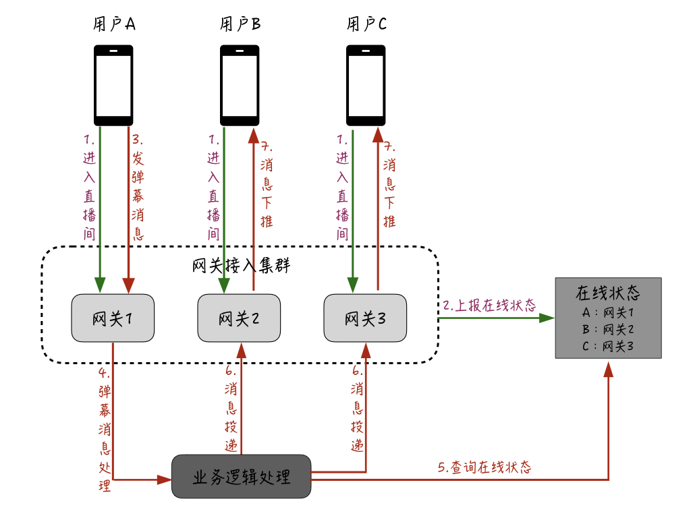
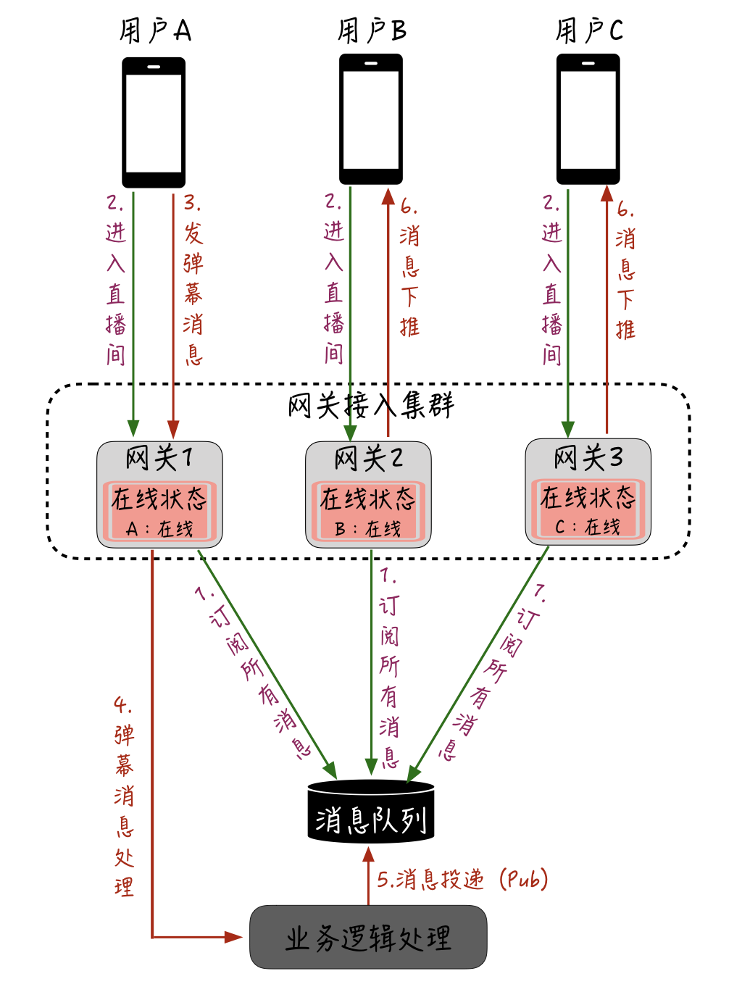
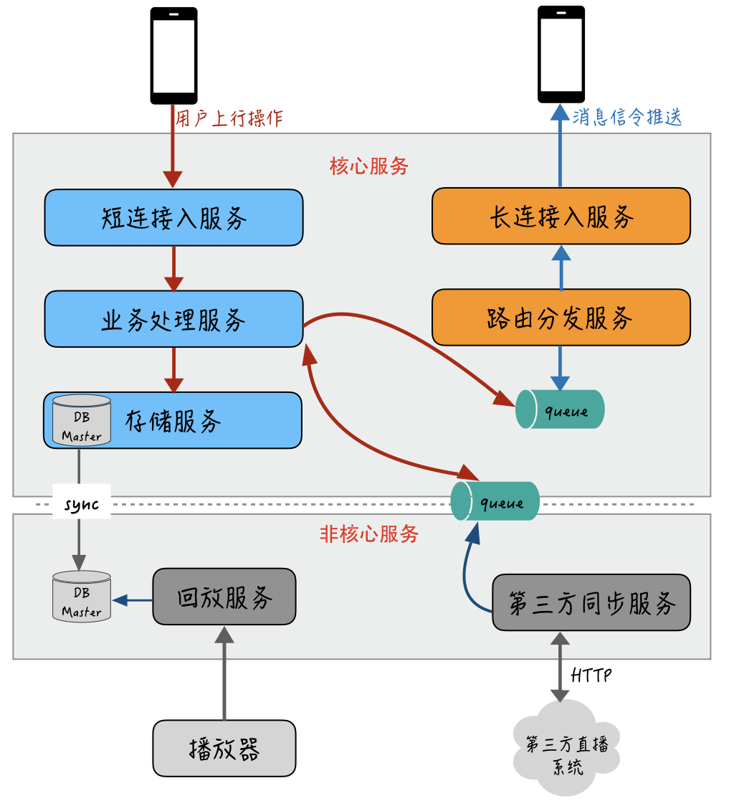
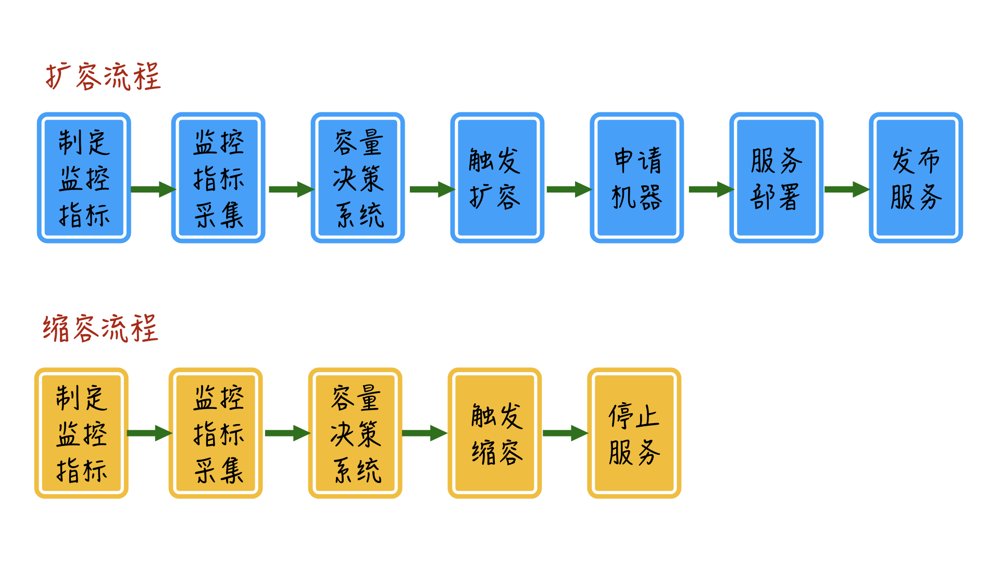

---
date: "2019-06-23"
---  
      
# 10 | 自动智能扩缩容：直播互动场景中峰值流量的应对
你好，我是袁武林。

随着近几年各种直播App和百万答题App的火爆和风靡，具有高实时性要求的直播互动场景开始纷纷借助即时消息技术，来保证直播过程中的各种互动消息和行为能够及时、可靠地投递，比如用户给主播打赏或者送礼的互动行为，不能有超过10秒的延迟，更不能丢失，否则会导致主播和房间其他用户看不到。即时消息技术凭借其在实时性和可靠性方面的优势，已经被广泛应用在互动直播场景中。

那么，和传统的消息聊天场景相比，直播互动在业务形态上究竟有哪些区别？在技术层面又有哪些高难度的挑战？

## 业务形态区别和技术挑战

首先，在业务形态上，与传统的即时消息场景不太一样，直播互动的流量峰值具有“短时间快速聚集”的突发性，流量紧随着主播的开播和结束而剧烈波动。

另外，直播互动是以房间为单位，传统的群聊业务和聊天室业务虽然也有千人群和千人聊天室，但和直播间动辄几十万、上百万人的规模相比还是小巫见大巫的。而且，直播互动由于房间有时效限制和明星效应，用户发言和互动的积极性会更高，毕竟可能“错过这村就没这店了”。

超大的房间规模及高热度的互动导致的一个问题，就是消息下推的并发峰值。这里我们可以简单用数字来直观感受一下：点对点聊天场景，如果两个人每10秒说一句话，实际上每秒的消息下推数只有0.1；群聊或者聊天室场景，假设是一个500人群，如果群里每个人也是每10秒说一句话，实际每秒的消息下推数是500 / 10 \* 500 = 25000；那么对于一个10w人在线的直播互动场景，如果直播间里每个人也每10秒说一句话，实际每秒可产生的消息下推数就是100000 / 10 \* 100000 = 10亿。

<!-- [[[read_end]]] -->

当然，这里只是用这个例子计算一下理论值，来让你了解直播互动中的并发压力与普通聊天场景的区别之大。

实际上，10万人的直播间一般不会有这么高的发言和互动热度，即使能达到，也会在服务端进行限流和选择性丢弃。一个是考虑服务端的承受能力基本不可能达到这个量级，另一方面，即使消息能全部推下去，客户端也处理不了每秒一万条消息的接收，对客户端来说，一般每秒接收几十条消息就已经是极限了。因此，由于业务形态的不同，直播互动中的高并发挑战与传统的即时消息场景相比要大得多。

## 直播互动的高并发应对

对于直播互动中高并发带来的技术挑战，我们从架构层面来看有哪些应对手段呢？下面我们先来分析一下直播互动中的一个比较大的挑战：高并发压力。

### 在线状态本地化

实际上，直播互动中的并发压力主要来自于消息下推环节中消息从一条扇出成十万条后的那部分，消息扇出前相对压力并不大。

那么，我们的优化重点主要是在扇出后的逻辑上，对于普通的消息聊天场景，扇出后的推送逻辑主要是：“查询聊天接收方在哪台接入服务器，然后把消息投递过去，最后由接入服务器通过长连接进行投递。” 如果采用这种方式来处理直播互动的消息下推，大概的流程会是下图这样的：

首先，用户通过接入网关机进入直播间；接着，网关会上报用户的在线状态；假设这时用户A发送了一条弹幕消息，这条消息会在业务逻辑处理层进行处理，并且业务逻辑处理层通过查询刚才维护的用户在线状态，会相应地查询用户A所在直播间的其他用户都在哪些网关机上，并把相应的消息投递到这些用户所在的网关服务器；最后再由网关服务器推送给用户的设备。

这里存在的一个问题是，在普通的聊天场景中，为了进行精准投递避免资源浪费，一般会维护一个中央的“在线状态”，逻辑层在确定好投递的接收人后，通过这个“在线状态”查询对应接收人所在的网关机，然后只需要把消息投递给这台网关机就可以了。

但是对于直播互动场景来说，如果采用这种模式，一个10w人的房间，每条消息需要对这个在线状态进行10w次查询，这个量级是非常大的，因此往往这个地方就会成为瓶颈。

那么针对直播互动场景，对于这个“精准投递”应该如何进行优化呢？我们一起来思考一下。

一般来说，即使是一个热度较大、在线人数几十万的直播间，房间里的用户实际上也是“无状态的”相对分散在多台网关机上。

以10w人的房间来说，假设有50台网关机，那么平均每台网关机上这个直播间的用户应该有2000人，我们完全没有必要去“精准”确认这个直播间的用户都在哪台网关机上，只需要把这个直播间的消息都全量“投递”给所有网关机即可，每台网关机也只需要在本地维护一个“某个房间的哪些用户的连接在本机”，最终由网关机把消息下推给本机上当前直播间的在线用户。优化后的直播消息下推架构大概是这样：

首先，每一台网关机在启动时会订阅一个全局的消息队列；当用户进入直播间后，会在每台网关机的本机维护一个在线状态；同样的，假设这时用户A发送了弹幕消息，这条消息会在业务逻辑处理层进行处理；紧接着再由业务处理层投递给刚才网关机订阅的全局的消息队列，这样所有网关机都能收到消息；最后，每台网关机根据本机维护的某个直播间的在线用户，再把消息下推给用户设备。

通过这个优化，相当于是把直播消息的扇出从业务逻辑处理层推迟到网关层，而且扇出后的下推不需要依赖任何外部状态服务，这样就能大幅提升直播互动消息的下推能力。

至于直播间里极少数的点对点类型的消息扇出下推（比如主播对某个用户禁言后下推给这个用户的提醒消息），可能会有一定的资源浪费，但这类消息数量相对较少，整体上看收益还是比较大的。

### 微服务拆分

对于直播互动的高并发场景来说，仅仅有架构和设计层面的优化是不够的。比如，下推消息还受制于网关机的带宽、PPS、CPU等方面的限制，会容易出现单机的瓶颈，因此当有大型直播活动时，还需对这些容易出现瓶颈的服务进行水平扩容。

此外，为了控制扩容成本，我们希望能够区分出直播互动场景里的核心服务和非核心服务，以进一步支持只针对核心服务的扩容。同时，对于核心服务，我们需要隔离出“容易出现瓶颈点的”和“基本不会有瓶颈的”业务。

基于这些考虑，就需要对直播互动的整个服务端进行“微服务拆分”改造。

首先，我来分析一下对于整个直播互动的业务来说，哪些是核心服务、哪些是非核心服务。比如：发弹幕、打赏、送礼、点赞、消息下推，这些是比较核心的；其他的如直播回放和第三方系统的同步等，这些业务在直播时我们是不希望干扰到核心的互动消息和行为的收发的。

除此之外，在核心服务里，消息的发送行为和处理一般不容易出现瓶颈，一个10w人的直播间里每秒的互动行为一般超不过1000，在这一步，我们不希望和容易出现瓶颈的消息下推业务混在一起。因此，我们可以把消息的发和收从接入层到业务处理层都进行隔离拆分。整个系统进行微服务化改造后大概就是下面这样：

核心服务通过DB从库或者消息队列的方式与非核心服务解耦依赖，避免被直接影响；容易出现瓶颈的长连接入服务独立进行部署，并且和发送消息的上行操作拆分成各自独立的通道，这样一方面能够隔离上行操作，避免被下行推送通道所影响，另一方面，轻量、独立的长连接入服务非常便于进行扩容。

### 自动扩缩容

通过微服务拆分后，你就需要考虑如何对拆分出来的服务进行扩容了，因为在平时没有高热度的直播时，考虑到成本的因素，一般不会让整个服务的集群规模太大。当有大型直播活动时，我们可以通过监控服务或者机器的一些关键指标，在热度快要到达瓶颈点时来进行扩容，整个过程实际不需要人工参与，完全可以做成自动化。

对于直播互动场景中的监控指标一般可以分为两大类：

* **业务性能指标**，比如直播间人数、发消息和信令的QPS与耗时、消息收发延迟等；
* **机器性能指标**，主要是通用化的机器性能指标，包括带宽、PPS、系统负载、IOPS等。

我们通过收集到的业务性能指标和机器性能指标，再结合模拟线上直播间数据来进行压测，找出单机、中央资源、依赖服务的瓶颈临界点，制定相应的触发自动扩缩容的指标监控阈值。

大概的自动化扩缩容的流程如下：

### 智能负载均衡

了解了自动扩缩容的整体流程，还有一个在扩容中需要你关注的问题。

对于直播互动的消息下推来说，长连接入服务维护了房间和用户的长连接，那么这里的问题在于：扩容前的机器已经存在的长连接可能已经处于高水位状态，新扩容的机器却没有承载用户连接，而对于长连接入服务前端的负载均衡层来说，大部分都采用普通的Round Robin算法来调度，并不管后端的长连接入机器是否已经承载了很多连接，这样会导致后续新的连接请求还是均匀地分配到旧机器和新机器上，导致旧机器过早达到瓶颈，而新机器没有被充分利用。

在这种情况下，即便是让负载均衡层支持自定义的复杂的均衡算法，也可能无法解决流量不平衡的问题。因为很多情况下，负载均衡层本身也是需要扩容的，自定义的均衡算法也只能在某一台负载均衡机器上生效，无法真正做到全局的调度和均衡。

一个更好的方案是接管用户连接的入口，在最外层入口来进行全局调度。

比如，在建立长连接前，客户端先通过一个入口调度服务来查询本次连接应该连接的入口IP，在这个入口调度服务里根据具体后端接入层机器的具体业务和机器的性能指标，来实时计算调度的权重。负载低的机器权重值高，会被入口调度服务作为优先接入IP下发；负载高的机器权重值低，后续新的连接接入会相对更少。

通过这种方式，我们就基本能解决旧机器和新机器对于新增流量负载不均衡的问题了。

## 小结

接下来我们简单回顾一下今天课程的内容。今天这个章节我主要从直播互动的场景出发，先带你从业务维度了解到直播互动相对普通聊天具有“突发流量”“超高下推并发”等特点。为了应对这些问题，我们可以从几个方面来进行针对性的优化。

* 首先，在线状态本地化维护，降低远程资源依赖，提升单机处理能力。
* 其次，对服务整体进行拆分，区分核心和非核心服务，隔离“容易出现瓶颈”的服务。
* 接着，通过收集业务和机器两类指标，建立容量评估模型，自动进行服务扩缩容。
* 最后，根据后端机器负载水平调度全局，接入服务入口，解决扩容后新接入流量在新扩容机器和旧机器间流量不均衡的问题。

如今，自动扩缩容作为互联网公司标配的平衡服务处理能力和资源成本的基础设施，特别是对于流量峰值波谷明显的业务，带来的收益非常明显。虽然我们今天站在直播互动的场景来展开这个话题，但这个技术其实不仅仅可以用于IM场景，也具有很强的业务普适性，希望你能从中有所收获和启发。

最后给大家留一道思考题：**通过长连接的接入网关机，缩容时与普通的Web服务机器缩容相比有什么区别？**

以上就是今天课程的内容，欢迎你给我留言，我们可以在留言区一起讨论。感谢你的收听，我们下期再见。