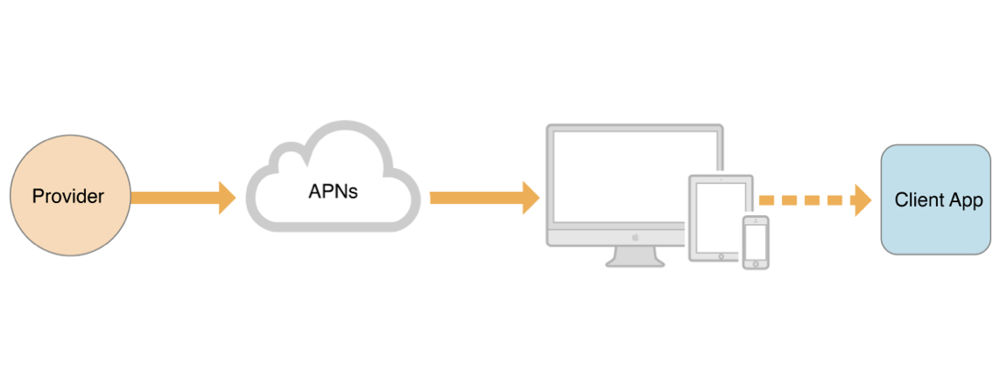
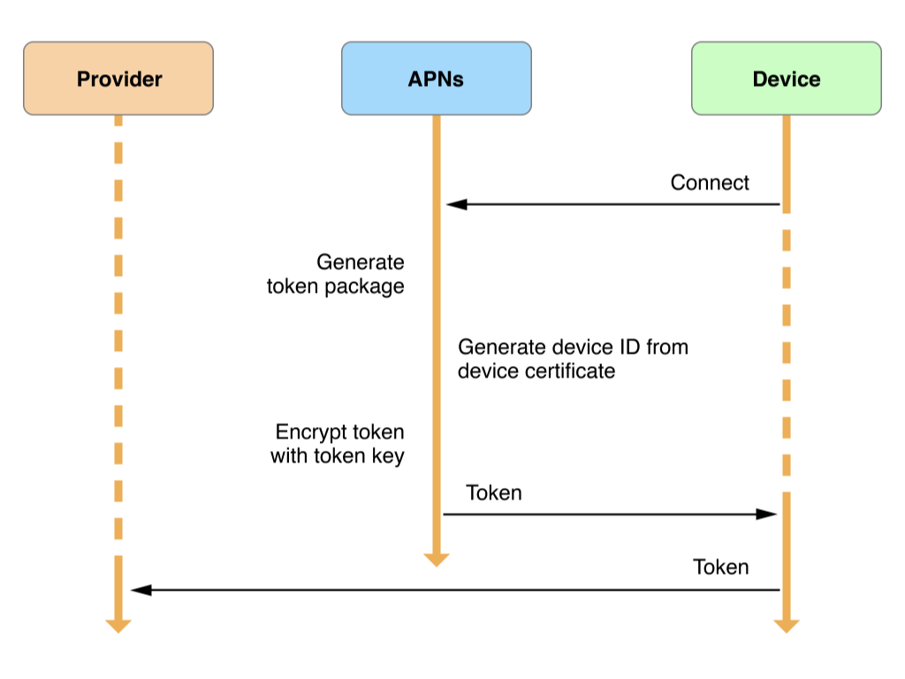
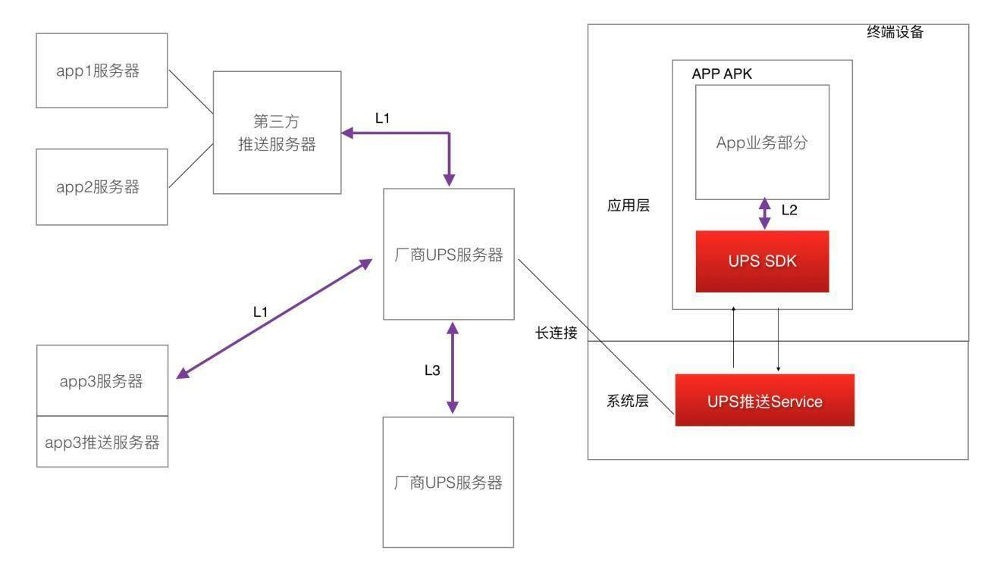

---
date: "2019-06-23"
---  
      
# 16 | APNs：聊一聊第三方系统级消息通道的事
你好，我是袁武林。

前面几节课里，我讲到在即时消息场景下，我们会依赖服务端推送技术来提升消息到达的实时性，以及通过各种手段来保证消息收发通道的可用性，从而让消息能尽量实时、稳定地给到接收人。

但在实际情况中，出于各种原因，App与服务端的长连接会经常断开。比如，用户彻底关闭了App，或者App切换到后台一段时间后，手机操作系统为了节省资源，会杀掉进程或者禁止进程的网络功能。在这些情况下，消息接收方就没有办法通过App和IM服务端的长连接来进行消息接收了。

那有没有办法，能让消息在App被关闭或者网络功能被限制的情况下，也能发送到接收人的设备呢？答案是：有。

现在手机常用的iOS和Android系统，都提供了标准的系统级下发通道，这个通道是系统提供商维护的与设备的公共长连接，可以保证在App关闭的情况下，也能通过手机的通知栏来下发消息给对应的接收人设备。而且，当用户点击这些通知时，还能重新唤醒我们的App，不仅能提升消息的到达率，还增加了用户的活跃度。

## 第三方系统下发通道

常见的第三方系统下发通道，有iOS端的APNs，以及Android端的GCM和厂商系统通道。

* iOS端的APNs（Apple Push Notification service，苹果推送通知服务），是独立于应用之外，依托系统常驻进程来维护和苹果服务器的公共长连接，负责全局的系统推送服务。
* 在Android端上，有Google的GCM（Google Cloud Message，Google云消息传递）。但GCM由于某些技术原因（如NAT超时太长、暴露的5228端口连通性差等）和某些非技术原因（需要和Google服务器建立连接），Android端的GCM在国内被大部分手机厂商定制化后直接去掉，并替换成了各自的系统通道。目前国内Android的系统级下发通道基本都是厂商通道，目前已知的有5家：小米、华为、vivo、OPPO、魅族。

<!-- [[[read_end]]] -->

### APNs

接下来我们就来了解一下iOS端的系统推送服务APNs。

下面借用苹果官网的一张图来简单说明一下，当App在没有打开的情况下，[消息通过APNs下发到设备](https://developer.apple.com/library/archive/documentation/NetworkingInternet/Conceptual/RemoteNotificationsPG/APNSOverview.html#//apple_ref/doc/uid/TP40008194-CH8-SW1)的过程：  


* 首先，Provider（也就是IM服务器）把消息通过长连接发送到APNs上；
* 紧接着，APNs把消息推送到接收方用户的iOS设备端，并在设备的通知栏进行展示；
* 最后，用户通过点击通知等操作可以唤醒App，来进行一系列的交互活动。

整个流程看起来比较简单。但仔细思考后，你可能会对其中的几个地方产生疑惑，比如，APNs是如何识别App的用户在哪台设备上？还有IM服务器是如何告知APNs，应该把消息推送给哪个设备的哪个App呢？

别着急，下面我就带你来了解一下，这两个问题在技术上是怎么解决的。

先了解一个概念吧：DeviceToken。

**什么是DeviceToken？**DeviceToken是APNs用于区分识别不同iOS设备同一个App的唯一标识，APNs的网关和设备通信时，通过系统默认自带的长连接进行连接，并通过DeviceToken作为当前连接设备的唯一标识进行系统消息的推送。

要通过APNs实现系统推送，我们的推送服务（Provider）需要先和APNs建立长连，建连时携带的证书包含“准备接收”系统消息推送的App的Bundle Identifier（Bundle Identifier是一款App的唯一标识）。

每当我们有消息需要推送时，都必须连同消息，再携带待接收系统设备的DeviceToken给到APNs。APNs通过这个DeviceToken，就能找到对应的连接设备，从而就可以把消息通过APNs和设备间的长连接，推送给这台设备上的App了。具体的流程你可以参考下面这张[官网图](https://developer.apple.com/library/archive/documentation/NetworkingInternet/Conceptual/RemoteNotificationsPG/APNSOverview.html#//apple_ref/doc/uid/TP40008194-CH8-SW1)。  


**那么，DeviceToken是固定不变的吗？**

一般来说，在同一台设备上，设备的DeviceToken是不会发生变化的，除了以下几种情况：

* iOS系统升级后；
* APNs出于安全等原因，禁用了这个DeviceToken。

因此，如果DeviceToken由于某种原因发生变化，但IM服务端并不知道，就会导致IM服务端携带失效的DeviceToken给到APNs，最终导致这次系统推送消息失败。

所以，一般情况下，我们的IM服务端可以在每次启动App时，都去请求APNs服务器进行注册，来获取DeviceToken。正常情况下，客户端每次获取到的DeviceToken都不会变，速度也比较快。客户端在首次获取到DeviceToken之后，会先缓存到本地，如果下次获取到DeviceToken后，它没有发生变化，那么就不需要我们再调用IM服务端进行更新了。这也算是个小技巧，你可以试试看。

**那么，如果App没来得及更新到IM服务端，但DeviceToken已经过期了，我们该怎么办呢？**

最新的APNs协议是基于HTTP/2实现的，针对每条消息的推送，APNs都会返回对应的状态码来明确告知IM服务端此次的消息推送成功与否。

当IM服务端把待推送的消息和DeviceToken给到APNs时，APNs会先检查这个DeviceToken是否失效，如果已经失效，那么APNs会返回一个400的HTTP状态码，根据这个状态码，IM服务端就可以对维护的这个失效DeviceToken进行更新删除。

当然，这里我有必要说一下：当我们在使用旧版的APNs协议时，可能会比较麻烦一点，因为旧版的APNs协议在判断DeviceToken失效时，会断开连接，这时就需要IM服务端再通过APNs提供的另一个Feedback接口，来定时获取这些失效的DeviceToken，然后删除掉，这样下次推送才不会再用到。

### APNs都能发啥消息？

了解了DeviceToken的作用后，我们再来看一下，通过APNs都能下发什么样类型的消息。

从IM服务端发送到APNs的每一条消息，都会有一个Payload（负载）的数据结构，这个Payload包括我们要发送的消息内容和一些推送相关的方式等数据信息，一般是一个JSON格式的字符串。

这个字符串可能会包括：接收时通知的标题、子标题、具体通知的内容，以及App的角标数是多少、接收时播放的声音，等等。同时也包括一些自定义的内容字段，比如，群消息一般还会携带群ID和具体的这条消息ID，便于用户点击唤醒App时能够跳转到相应的群聊会话。你可以参考下面这个代码设计：

```
    {
       "aps": {
           "alert : {
      	  "title": “新消息”,           //标题
              "subtitle": “来自： 张三”,   //副标题
      	  "body": “你好”              //正文内容  
           },
           "badge": 1,                   //角标数字
           "sound": "default"            //收到通知时播放的声音
        },
        "groupID": “123”,
        "mid": "1001"
    }
    

```

这里需要注意的是：Payload的大小是有限制的，iOS 8之前是256B，iOS 8之后是2KB。在iOS 10以后，推送的消息Payload大小调整为了4KB。另外，iOS 10之前只能推送文字，而在它之后可以支持主标题、副标题，还能支持附件。

### 静默推送

除了发送各自通知栏弹窗的强提醒推送外，APNs还支持“静默推送”。

“静默推送”是iOS 7之后推出的一种远程系统推送类型，它的特色就是没有文字弹窗，没有声音，也没有角标，可以在不打扰用户的情况下，悄无声息地唤醒App来进行一些更新操作。

比如，我们可以使用“静默推送”来每天定点推送消息，让某些App在后台静默地去更新订阅号的文章内容，这样用户打开App时就能直接看到，不需要再去服务端拉取或者等待服务端的离线推送了。

## APNs的缺陷

了解了APNs的实现机制和能力，你可能会比较困惑：既然APNs能够做到App打开或者关闭的情况下，通过系统通知把消息推送给用户，那好像也不需要我们再去实现自己维护一条App和IM服务器的长连接了？通过APNs的系统通知的跳转，去唤醒App后，再根据未读数从服务端拉取未读消息，好像也没问题啊？

既然如此，那么为什么大部分即时消息系统还是要自己维护一条长连通道呢？主要原因是由于APNs本身还存在一些缺陷。

### 可靠性低

APNs的第一个缺陷就是可靠性没有保障。这应该是苹果官方出于维护成本的考虑，APNs并不能保证推送消息的到达率，也不能保证消息不发生延迟。

也就是说，你要推送的消息给到了APNs，但APNs并不能保证这条消息能真正推送到用户设备上，而且也无法保障消息不发生延迟，可能你给到APNs的消息需要几分钟后用户才收到，这个现象用过iPhone的用户估计应该都碰到过。

### 离线消息的支持差

除了可能丢消息和延迟高的风险外，APNs的另一个缺陷就是无法保障离线消息的存储。当用户的设备离线或者关机时，APNs就没有办法马上把消息送达给用户，这种情况下，如果APNs需要向你这台设备发送多条推送时，就会启动它的QoS（Quality of Service，服务质量）机制，只保留给你最新的一条消息，在这种场景下，就会存在丢失离线消息的问题。

出现这种问题的主要原因应该也是出于存储成本方面的考虑，由于APNs的消息接收量整体基数太大，大量的存储和转发对服务器的资源消耗非常大，出于成本考虑，APNs就会丢掉一部分离线消息。

### 角标累加问题

除此之外，APNs还有一个小吐槽点是：对于角标的未读数，APNs不支持累计+1操作，只支持覆盖原来的角标未读数。所以在每条消息下推时，APNs还需要把这个用户的总未读消息数一起带下去，对后端未读数服务来说会增加额外的调用压力，而Android端的厂商通道就相对更友好一些，很多厂商的角标未读支持根据接收到的通知消息自动累加的特性。

## Android的厂商通道

对于Android端来说，应用的后台保活一直是提升消息在线推送到达率的重要手段，很多操作系统默认的配置是：切到后台一段时间后，会直接杀掉进程或者让进程断网。

虽然App间有互相拉起进程的取巧方式，以及系统厂商给某些超级App（比如微信）的保活白名单机制，但对于大部分App来说，还是需要在App被杀死或者被限制的情况下，通过厂商的系统通道推送消息，以此提升整体的消息到达率。

对于开头我提到的5家厂商通道的接入，它们都提供了专门的SDK（Software Development Kit，软件开发工具包），这些厂商SDK能够支持的功能，大致上和APNs比较类似，这里就不详细展开了，你可以自行了解一下。

不过值得说一下的是，由于各家SDK使用上各异，开发接入成本会相对较高，因此市面上还有很多第三方的Push服务，这些第三方的Push服务整合了多家厂商的SDK，对外提供统一的接入，降低了对接门槛，比如个推、信鸽、极光、友盟等。

## 国内统一推送联盟

由于国内各个厂商系统推送通道的差异性，造成Android端系统推送整体上的混乱和复杂性。为此在2017年，中华人民共和国工业和信息化部（简称工信部）主导成立了安卓统一推送联盟，联合各大手机厂商和运营商共同推出了“推必达”产品，对标的是苹果的APNs和Google的GCM。

根据官网的介绍，“推必达”除了通过传统的TCP长连网络来进行系统消息的下推外，还会和运营商合作，支持通过运营商的信令通道来进行消息下推。因此在没有WiFi和移动网络的场景下，我们只要有手机信号，也能接收到系统推送。

下面是[“推必达”官网提供的技术架构图](http://chinaupa.com/)。你可以看到，“推必达”提供了专门的SDK给到客户端，当各个IM服务端有消息需要通过系统推送触达用户时，会把消息直接或通过第三方推送服务交给各个厂商部署的UPS服务器，UPS服务器再通过和客户端SDK维护的长连接，把消息推送下去。



由于其支持多种消息的触达途径，“推必达”的消息到达率据官网反馈：在全国34个省市的测试，消息到达率为99.999\%。目前，国内主要的手机厂商如华为、小米、OPPO、vivo等，都已经加入到这个联盟中。另外，工信部要求到2019年12月31日，现有的各推送通道需要兼容统一推送标准。

因此，我认为对于Android端的系统推送来说，“推必达”产品如果能够成功落地，应该是未来系统推送的趋势。

## 小结

好，简单回顾一下今天课程的内容。这一讲，我主要讲到了提升消息整体到达率的利器：第三方系统推送。通过手机厂商提供的系统级长连推送服务，可以让App在没被打开或后台网络功能被系统限制的情况下，也能够通过厂商通道将消息触达到用户。

在iOS端，是由苹果提供的APNs服务来提供系统推送的能力。IM服务器把待推送的消息连同唯一标识某台设备的DeviceToken，一起给到APNs服务器，再由APNs服务器通过系统级的与任何App无关的长连接，来推送给用户设备并展示。新版本的APNs服务支持文本、音频、图片等多媒体消息的推送，以及无任何弹窗通知的静默推送。

但是APNs并不保证消息推送不发生延迟，也不保证消息能真正到达设备，对消息大小也有限制。因此，在可靠性上，APNs比App自建的长连接会差一些，所以一般也只是作为自建长连接不可用时的备选通道。

Android端下，目前国内主要是由各个手机厂商各自维护的厂商通道来提供系统推送服务。目前已知支持厂商通道的也只有5家，而且各家SDK都没有统一，所以整体上看，Android端的推送接入比较复杂和混乱。

目前工信部主导的“统一推送联盟”，它的目的就在于通过提供统一的接入方式，以此解决这种混乱状况。其推出的产品“推必达”支持在移动网络不可用的情况下，通过电信信令通道来触达用户，能进一步提升消息的到达率，是我们值得期待的解决方案。

系统推送作为一种常用的触达用户的方式，对于即时消息场景来说是提升消息到达率的一条非常重要的途径。但这些系统推送通道目前还存在可靠性低、功能不完善、生态混乱等问题，因此，对消息可靠性要求较高的场景来说，系统推送通道基本上只能作为对自建长连接推送通道的一个补充。系统推送也是一门普适性很强的技术，了解当前系统推送的业界现状和进展，对于你的前后端知识体系也是一个很好的补充和拓展。

最后给大家留一个思考题：**静默推送支持的“唤醒App在后台运行”功能，你觉得都有哪些应用场景呢？**

以上就是今天课程的内容，欢迎你给我留言，我们可以在留言区一起讨论。感谢你的收听，我们下期再见。