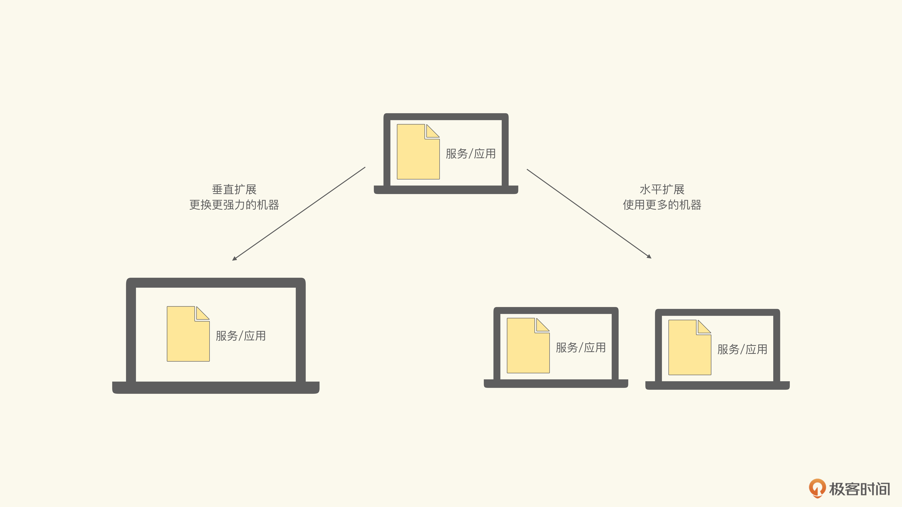
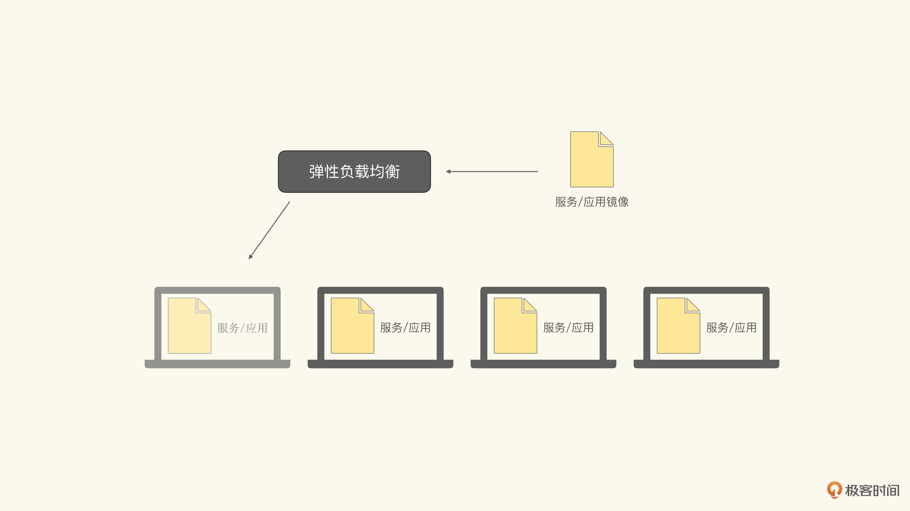
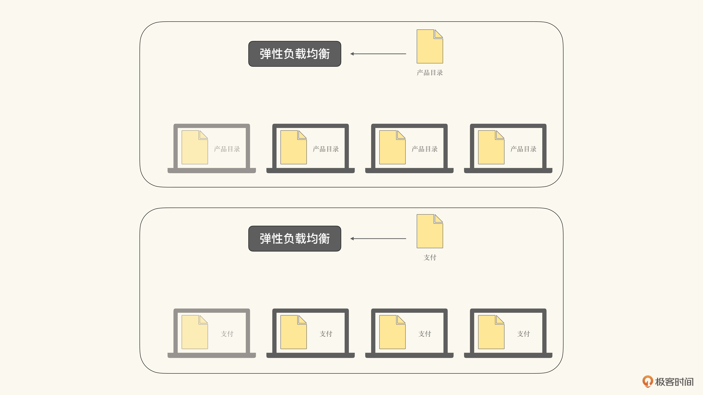
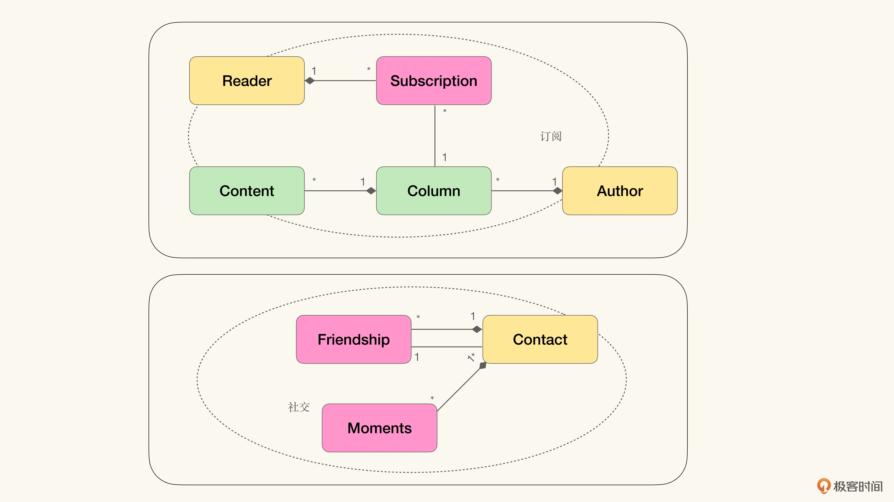
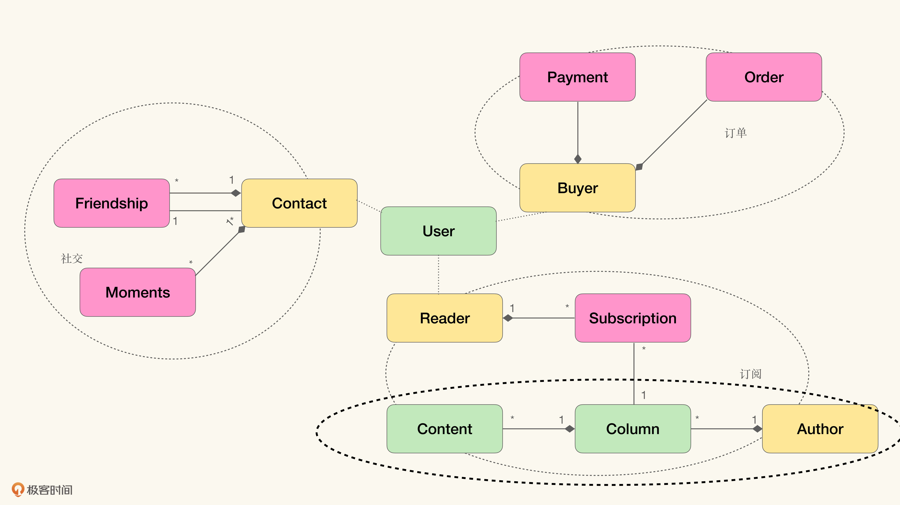
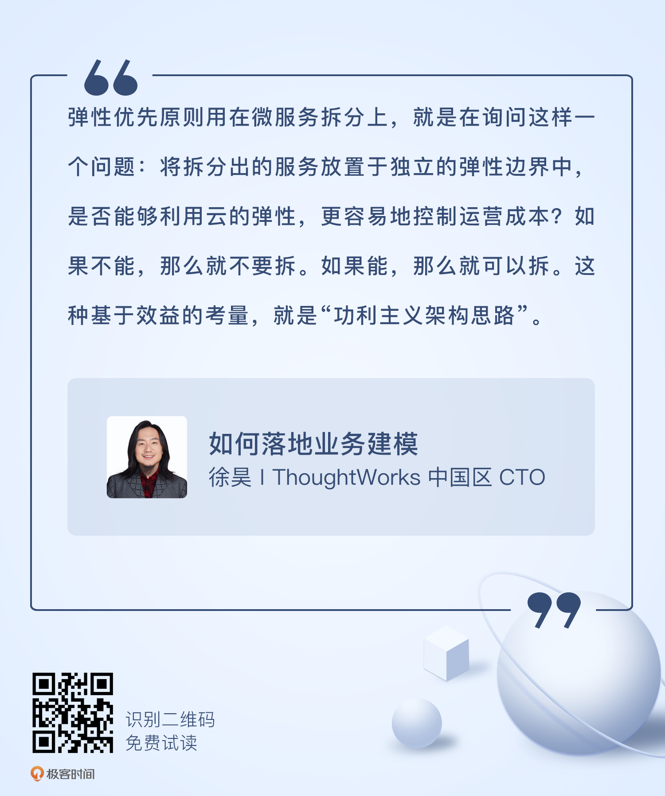

---
date: "2019-06-23"
---  
      
# 12｜云时代的挑战（上）：弹性边界还是业务边界？
你好，我是徐昊。今天我们来聊聊云原生架构中弹性边界对业务建模的影响。

通过前面旧约部分的学习，我想可能会给你留下这么一种印象，4-6节和7-9节分别给领域驱动设计打了两个大补丁：

* 通过不同的上下文对象，弥补原生对象模型从单体架构过渡到多层架构时的各种水土不服；
* 通过不同的建模方法，从业务维度展开入手，以不同的角度寻找可以被建模成对象的领域概念。

最终经由我们打过补丁的业务建模方法，就是一种**在领域驱动框架下，从业务角度出发，又兼顾了架构约束的特殊的面向对象建模法**（Object Oriented Modeling）。

如果你希望达到如下的诉求：

* 采用领域驱动设计的“两关联一循环”作为主要沟通协作的方式；
* 将模型作为统一语言，并用于提炼知识的循环；
* 在单体分层架构模式下，将模型的能力通过RESTful API暴露。

那么之前所学就基本满足你的要求了。但如果你的目标架构不仅仅是单体分层架构，而是**更云化的架构风格**，比如微服务（Microservices Architecture）等等，有了不同的关注点，那之前打的这两个补丁，就不足以支撑我们在新的架构风格下完成业务建模了。

因为更云化的架构风格有了新的关注点：弹性边界（Elasticity Boundary）。**弹性边界**是云原生（Cloud Native）架构的核心概念，**决定了我们是否能够充分发挥云平台的全部能力**。于是我们就需要新的方法来弥补原生对象模型的不足，以满足我们的需要。

<!-- [[[read_end]]] -->

## 从弹性边界理解云原生架构

为了更好地理解如何架构云原生系统，我创造了**弹性边界**这个概念。**它指把弹性作为最优先的考虑要素而划定的系统边界**。而我们通过弹性边界，就能判断某个系统是否充分利用了云平台的能力。为了帮助你理解这一点，我们需要从**什么是弹性**讲起。

在很多年前，当云计算第一次出现在我们视野中的时候，云厂商都非常热衷于讲一个关于弹性（Elasticity）的故事：我们可以根据流量的改变，动态地调整所需要的基础设施。

举个例子。作为一个电商网站，平时可能只有几千用户同时使用，只需要100台机器就足以支撑这个系统了；而双十一到来时，用户量可能会猛增几百倍，那么就需要比如说10000台去支持这个系统了。

而云平台呢，可以动态调整系统所需要的机器数量，让我们按需使用。这样我们就不需要在闲时投入过高的机器成本，也就是非双十一期间，维持10000台机器的开销。但同时也不会错过在业务高峰获取收益的机会，因为云平台会自动帮助我们从100台扩容到10000台机器。

**这种动态调节的能力被称作云的弹性**，它是云平台一切美好特质的基础。

而为了实现这种弹性，运行在云平台之上的系统，则需要满足一个条件：**这个系统可以通过水平扩展进行扩容（Scaling）**。

正如我们知道的，扩容策略（Scaling Strategy）从宏观来讲只有两种：水平扩展（Scale Out）和垂直扩展（Scale Up）。

**水平扩展**是指通过增加机器数量、构造集群的方法，来满足容量的需求。与之相对的则是**垂直扩展**（Scale Up），指当遇到扩容需求时，通过更换更强有力的机器，来获得更好的性能，或者满足容量需求。如下图所示：  
  
**为什么说水平扩展是弹性的前提呢？**事实上，我们也可以在容量到来的时候，进行垂直扩展，将云平台提供的服务器从a1.large变成a1.4xlarge（以AWS EC2 On-Demand为例）。

但这么做的问题就在于**弹性不可持续**。如果你已经使用了100台a1.4xlarge，那么你还能怎么升级呢？如果此时再来更多的用户访问，你的系统要怎么应对呢？

而使用水平扩展就不会有这样的问题，毕竟就算100台a1.4xlarge不能满足，总是可以使用200台a1.4xlarge去完成所需的弹性。因为只有水平扩展能够支持持续的弹性能力。所以我们说，水平扩展是云平台弹性的前提。云平台所声称的弹性，是建立在水平扩展的基础上的。

于是我们可以这么说：**能充分利用云平台能力的架构，就是能够充分利用水平扩展的架构**。那么接下来我们就仔细看看**云平台具体是怎么实现水平扩展的**。

我们可以回想一下**各种基础设施服务云平台**（IaaS，Infrastructure as a Service）**，它们其实只有复制和剪切两个能力**：

* 根据给定镜像（Image），产生符合镜像内容的机器的能力。也就是将镜像复制为机器的能力。
* 撤销不需要的机器，将其放回资源池的能力。也就是剪切机器的能力。

通过复制和剪切这两个能力，云平台就能对某个镜像提供水平扩展了。这种扩展方案通常被称作**弹性负载均衡**（Elastic Load Balancing）。而我们一般也会为弹性负载均衡设定一个容量阀值。

* 当流入的流量超过阀值时，弹性负载均衡会根据镜像生成新的服务器，并加入服务组网中（将镜像复制为机器的能力）。
* 如果流入的流量小于另外一个阀值，则会从服务组网中去掉已经存在的服务（剪切机器的能力）。

如下图所示，虚化的机器表示通过复制和剪切动态调配的机器：

可以看到，借由弹性负载均衡和镜像，云平台帮我们实现了对弹性的诉求。也就是能够根据流量的改变，动态地调整所需要的基础设施。

那么怎样利用弹性负载均衡提供的水平扩展，才能更有效地架构系统呢？**关键在于将弹性需要不同的组件分离。**

就以双十一为例。假设你在运营一个在线电商平台，我们可以粗略地将这个电商平台的业务分成**产品目录**和**支付**两大块。在双十一期间，肯定会遇到比平时更大的流量，因而需要更高的系统容量去支持业务。

那么问题来了，产品浏览和完成支付两个部分增加的流量是一致的吗？还是其中一个部分比另外一部分获得了更多的流量？

从我们实际参与双十一抢购的个人经验出发，就会发现，在双十一之前，用户对产品浏览对比的需求很可能比平时多；而在双十一当天呢，可能会对支付的需求更多。

那么我们就可以将支付和产品目录两块功能，分别放入不同的组网，制定不同的水平扩展策略，然后由不同弹性负载均衡控制。这样就可以有针对性地在不同阶段为两块功能提供不同的容量了。

如下图所示，产品目录和支付，被分别放入了不同的组网：

在双十一之前，当我们需要扩容产品目录时，并不需要同时扩容支付。同样的，在双十一当天，如果我们选择扩容支付，那么产品目录也不会随着扩容的变化而变化。

于是，我们通过弹性负载均衡控制了不同的组网环境，**也就控制了不同逻辑功能在弹性变化上的边界。**这就是弹性边界。**换个角度来看，我们把弹性作为主要指标，对系统进行划分，将不同弹性变化的组件放入了不同的弹性边界中。**

要知道，一旦我们通过弹性边界来划分系统，我们就能将系统划分成许多个具有一致弹性诉求的单元，然后再利用云平台的弹性调度能力，来满足不同单元的容量诉求。

**可以说，通过弹性边界，我们实际上是以更细致的粒度，控制了系统运营的成本**。这样架构系统的方式，不光可以通过云平台应对业务量峰谷的起伏，同时还获得了更准确的成本控制。

也只有这样，才能真正发挥云平台的能力。所以当我们想要利用云平台架构软件时，**寻找合理的弹性边界**便是最重要的事情。

## 拆分微服务，弹性优先还是业务优先？

当我们通过弹性边界架构系统时，很容易联想到微服务架构风格。两者都是将系统划分成更小的组件，以获得期望的架构属性。

**事实上，我们可以将微服务架构看作一种以业务上下文为弹性边界的云原生架构模式**。也就是说，微服务是云原生架构的一个子集，或者是一种特化（specilization）的形态。

如图所示，我们可以把极客时间模型中不同的上下文放入不同的弹性边界中，就能获得一个微服务架构：

这里要说明的是，虽然微服务并不一定需要以云原生架构作为基础，而且你也可以在具有固定弹性的数据中心，去部署微服务。但是实践经验告诉我们，比起将微服务部署到云平台上，在固定弹性的平台上使用微服务架构，有极高的实施成本。

具体可以参看Martin Fowler在2014年写的文章[《微服务的前置条件》](https://martinfowler.com/bliki/MicroservicePrerequisites.html)。里面很委婉地表示了，云平台实际上应该是微服务的前置条件。

如果将微服务架构风格看作一种云原生架构风格，那我们可以从弹性边界出发，重新去审视它。这样我们就能获得另外一种视角：**从云平台利用度去理解微服务架构风格，并将它与其他架构风格做出比较。**

以单体架构和微服务架构为例。单体架构中所有的业务上下文都集中在一个弹性边界内，这意味着我们无法根据实际流量，独立调整它们的容量。所以如果需要扩容，那也只能以整个应用作为单元去扩展。因而在云平台上，单体架构就是一种可行（Feasible），但成本较高的架构模式。

反观微服务架构模式，它将单体中的不同业务上下文拆分到独立的进程中，也就是赋予了它们独立的弹性边界。这时候我们扩容的选择，就变得丰富起来。我们可以根据需要，将不同的业务上下文单独扩展。

因而我们也可以这样说：比起单体架构，微服务架构更好地利用了云平台的弹性。如下图所示，表示了业务上下文在不同架构风格中的分布：

于是从弹性边界的角度出发来看待不同的架构模式，就为我们带来了另一个评价是否需要拆分微服务的思路：**是否值得将某个业务上下文放入独立的弹性边界内。**

我们都知道，将拆分的服务放入独立的弹性边界具有一定的运营成本，因而“**是否值得付出这个成本”**就成了需要讨论的问题。想想看，如果两个业务上下文，始终具有同样的弹性需求，那么，是按照业务上下文将它们拆分成两个服务呢？还是遵循弹性上下文，不去拆分呢？

我的答案是“**弹性优先”。**也就是说在云平台上，弹性永远是第一优先级。**如果两个上下文明显具有不同的弹性诉求，那就应该拆分。而如果具有一致的弹性诉求，就可以不拆**。

弹性优先原则是**一种功利主义架构思路**。这里的“功利主义”（Utilitarianism）也可以称为“效益主义”，是由英国哲学家约翰·斯图尔特·米尔（John Stuart Mill）和杰里米·边沁（Jeremy Bentham）等提倡的哲学主张。其实墨子、叶适也有类似的想法，**主张看中实际的功用和效果，不要空谈理念**。功利主义架构设计也是我近年来倡导的架构设计哲学，弹性优先原则是这一设计哲学在云平台的体现。

因为弹性优先原则用在微服务拆分上，就是在询问这样一个问题：将拆分出的服务放置于独立的弹性边界中，是否能够利用云的弹性，更容易地控制运营成本？**如果不能，那么就不要拆。如果能，那么就可以拆**。这种基于效益的考量，就是“功利主义架构思路”。

不过你可能会问，微服务的拆分可以使得每个服务独立部署啊，这也是弹性吗？是的！对于系统中软件的变更与部署，同样也可以看作弹性诉求。

那么从弹性诉求角度来看，软件的变更和部署是怎样的呢？如果有100台机器部署了1.0版本的软件，而现在我需要将它们升级到1.1版本的软件。从弹性角度来说，可以看成在一个很短的时间内，出现对于1.0版本需要的业务低谷，以及一个针对1.1版本的业务高峰。

那么弹性负载均衡会怎么处理呢？

* 出现业务低谷时，弹性负载均衡会剪切机器；
* 因为这个低谷足够低，那么最后一台都不剩了；
* 出现业务高峰时，弹性负载均衡会从镜像开始复制机器；
* 最后根据流量的需要，重新形成100台机器的体量。

因而微服务对不同变更速度的诉求，可以看作弹性诉求，通过弹性边界去控制变更的成本。那么，我们就能用弹性优先原则去分析微服务架构，以寻找服务划分的准则了。换言之，对于以云平台为部署目标的微服务系统而言，**微服务的划分要以弹性边界为主，以业务上下文为辅。**

这也帮我们回答了微服务架构的第一难题：**微服务到底要多微？**答案是，**微到能够更好地利用弹性控制成本的大小。**

最后需要说明的是，**弹性优先原则**不仅仅适用于微服务架构，而是**适用于所有云原生架构**。无论是今天的微服务，或是无服务器架构（Serverless Architecture），还是未来可能出现的宏服务（Marco Service，已经有些许苗头了）。这些都是希望通过利用弹性进而更高效地利用云平台的架构模式。因而，这些架构模式都可以通过弹性优先原则去思考和比较。

## 弹性优先对业务建模的挑战

当我们延续领域驱动设计的思路，以一种模型驱动的视角看待如何在云时代构造软件的话，就会面临两个挑战：

1.  我们的模型该如何体现弹性边界？
2.  在模型中，弹性边界与业务上下文要如何配合？

如果我们回想一下，原味面向对象建模（Vanilla Object Oriented Modeling）中的聚合（Aggregation），就会发现它是一种“一致性优先”的模型结构。所以每当我们看到聚合关系时，都可以将它读作“一致性边界”或者“事务边界”。

然而事实是，我们并没有一种类似的模型结构，可以无歧义地解读为弹性边界。

当然也正如我们前面所讲的，可以把界限上下文（Bounded Context）当作一个筐，找到了弹性边界就圈一下。如下图所示，标识了不同的弹性边界：

假设我们现在希望利用云平台重新构造极客时间的服务，那么请你思考一下：在领域模型中，我们该如何去切分弹性边界呢？

我们一个直观的感觉是，将不同的业务上下文直接当作不同的弹性边界。那就让我们仔细看一下订阅这个上下文中的内容（Content）与订阅（Subscription）的部分吧。

订阅部分处在核心的业务逻辑之上，而且随着业务的增长，同一份内容可能会有成千上万的订阅，因而对于订阅所需的容量，可能会远远大于内容所需的容量。那么我们可以说，内容和订阅这两部分处于不同的弹性边界中。因而，我们可以划分一个界限上下文表示这个弹性边界。

与此同时，我们又会面临另一个挑战：**业务上下文要和弹性上下文如何配合**？在业务上下文中，业务逻辑具有较强的一致性。而通过弹性上下文将业务上下文分割之后，这种业务逻辑的一致性又要怎么体现呢？

归根到底，在云时代进行业务建模时，我们需要确立一种模型结构以反映弹性边界。同时，在弹性边界切分业务上下文时，还需要确立另一种模型结构，去重建一致性边界。

而这些问题在原味对象建模法，以及我们之前介绍的几种建模方法中，都没有得到很好地处理。因而我创造了新的建模方法8X Flow来解决这两个问题。

不过在正式介绍8X Flow之前，我们还需要再仔细讨论一致性边界的问题，这正是下节课要讨论的内容。

## 小结

这一讲我们介绍了云平台是如何通过水平扩展为系统提供弹性的。然后，我们介绍了弹性边界这个概念，以及如何通过弹性边界去衡量软件架构是否真正利用了云平台的能力。也明确了，在云时代架构系统的首要工作就是寻找恰当的弹性边界。

并且我们以微服务为例，讲解了如何通过弹性边界以及弹性优先原则去理解它的架构属性。并给出了一个云原生视角下划分微服务的指导原则。

最后我们讲了弹性边界和弹性优先原则给业务建模带来的新挑战。下节课我们会继续细化这些挑战，以明确新的建模方法到底能为我们带来什么。

最后的最后，编辑小提示：为了方便读者间的交流学习，我们建立了微信读者群。想要加入的同学，戳此加入[“如何落地业务建模”交流群](https://jinshuju.net/f/wjtvTP)\>>>

## 思考题

就好像软件的模块之间会存在依赖关系一样，弹性边界间也会存在依赖关系。那么请思考，当弹性边界间存在依赖时，会带来哪些影响？  
  
欢迎把你的思考和想法分享在留言区，我会和你交流。我们下节课再见！