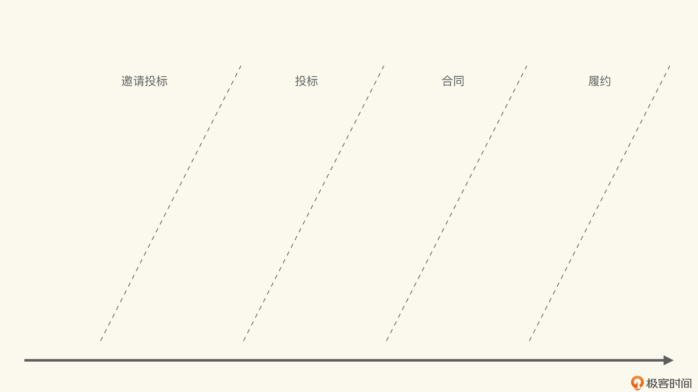
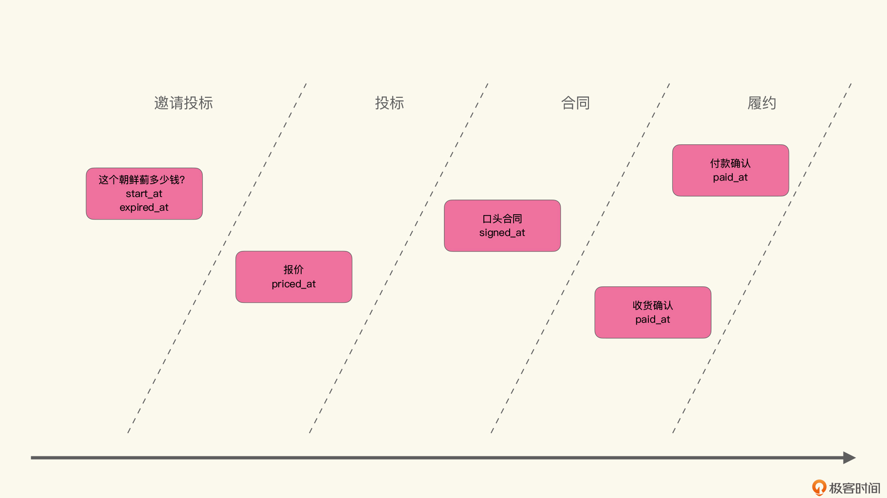
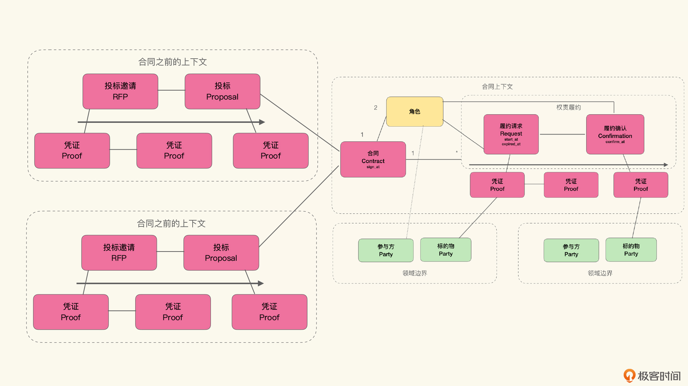
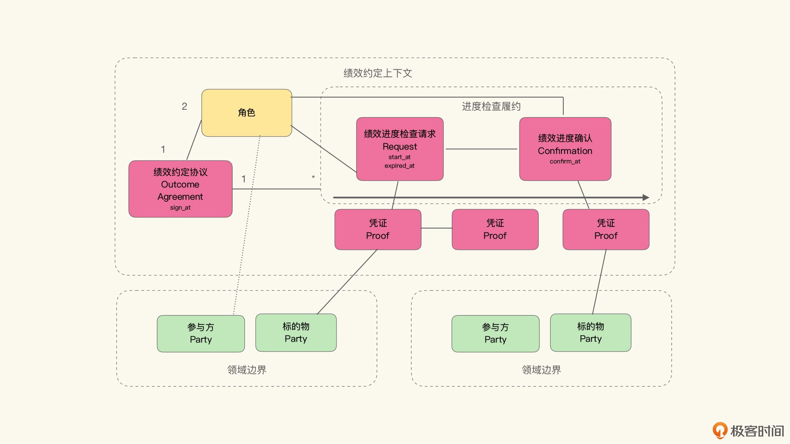
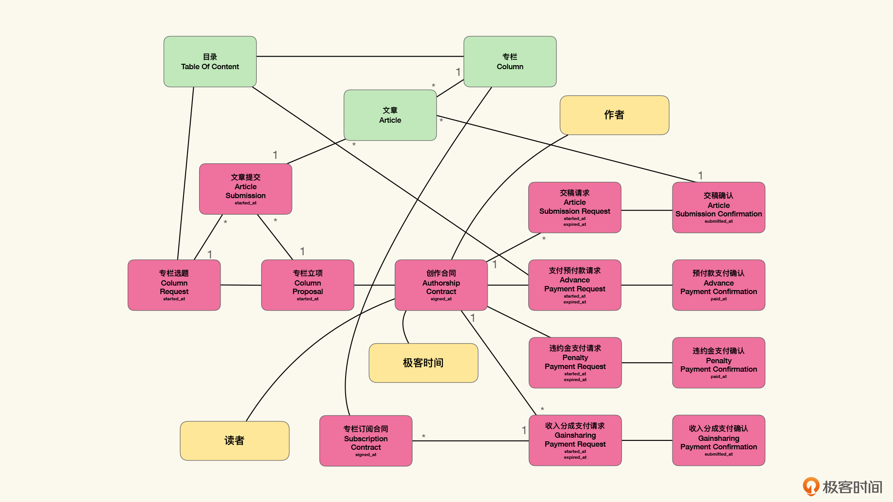
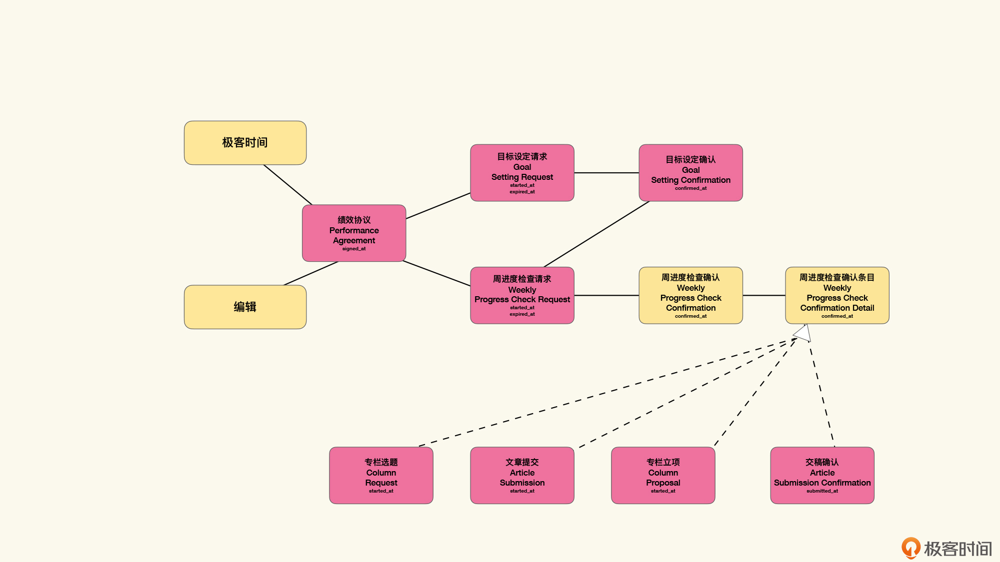
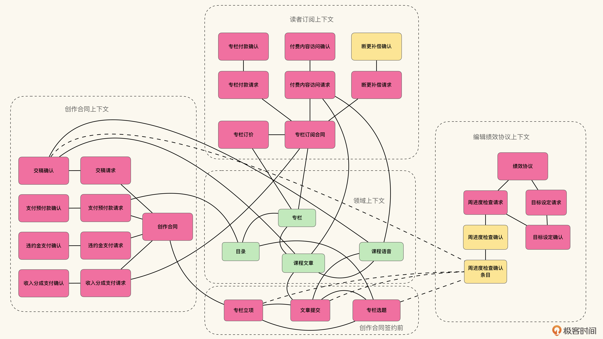
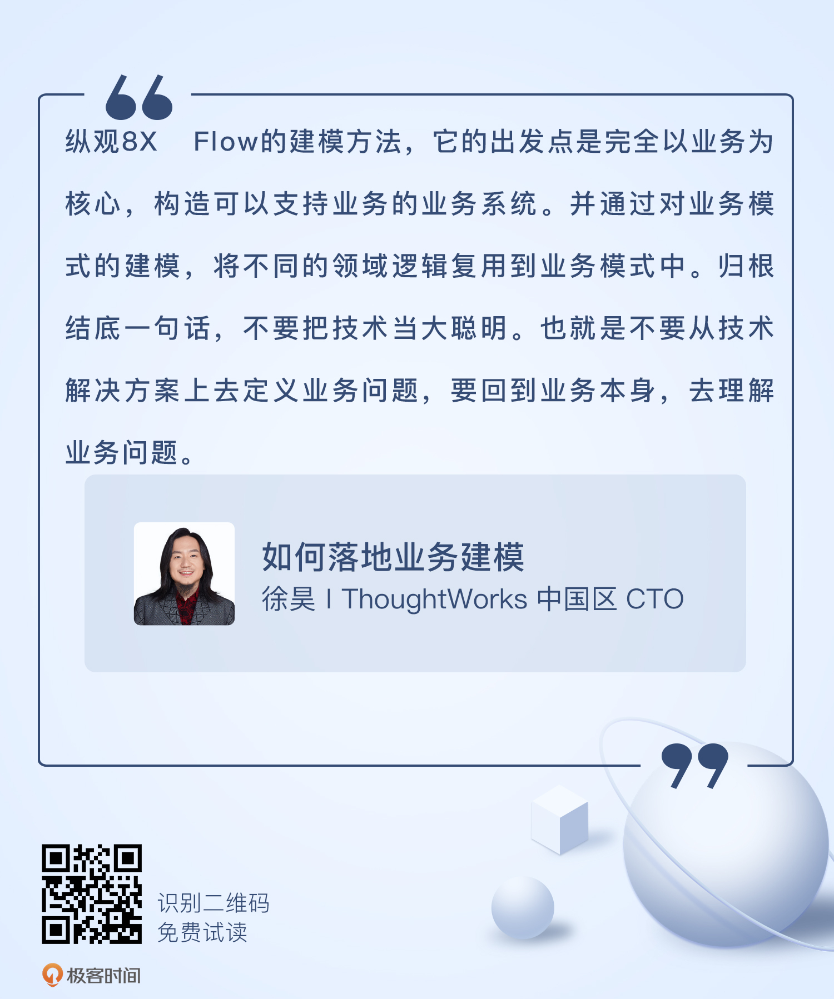

---
date: "2019-06-23"
---  
      
# 16｜8X Flow（下）：多于一个例子
你好，我是徐昊。今天我们继续8X Flow的学习。

上节课我们讲解了如何通过Request-Confirmation结构去建模履约项，并通过合同上下文聚合履约过程中产生的凭证。之后，我们又通过将履约确认泛化为角色，让凭证可以跨越不同的合同上下文完成履约。那么对于合同签订之后的业务逻辑，就都可以如此建模了。

不过到目前为止，你会发现，我们对业务逻辑的建模都是以合同签订为起点，以合同履约完成为终点。在合同上下文中聚合的业务逻辑，可以通过履约进行结构化地理解和建模。那么对于合同签订之前的业务逻辑，该怎么建模呢？

这正是我们接下来要讨论的问题。同时，这节课我们还会通过一个例子，将这三节的所学串到一起，来让你对8X Flow建模有更多的体会。

## 以事件建模法使用8X Flow

由于合同尚未签订，所以也就不存在履约项，于是我们无法通过履约关系去建模业务。这时我们要怎么办呢？**答案是：不要自己臆想，要从生活中学习。**

在现实的业务中，绝大部分的合同签订，都遵从这样一个过程：请求邀请投标（Request For Proposal）、投标（Proposal）、合同签约。

如果算上合同之后的履约，那么我们可以将整个业务划分为四个不同的阶段：邀请投标、投标、合同签约、履约。

<!-- [[[read_end]]] -->

其中合同签约是最重要的时间点，合同是最重要的业务产出。如下图所示：

让我们用一个最简单的场景理解一下业务从邀请投标到履约的全生命周期。假设你现在去菜市场买菜，看到菜摊上的朝鲜蓟（Artichoke）妖艳诡异。

* 于是就问摊主这个东西怎么卖。这就是你作为买菜的甲方，对卖菜的乙方提出的**邀请投标**。
* 摊主回答你说，一个20块，这就是**投标**。
* 如果你选择不接受这个投标，也可以**提出另一个邀请投标**，比如说，两个三十卖不卖。
* 乙方的顾问可能会说，掌柜的，瞧本，再卖就赔了。于是乙方回答你，卖不了。
* 最后你难以抵挡朝鲜蓟的诱惑，说行，20就20吧，给我拿一个。
* 于是**口头合同成立**。你掏钱付款，完成支付履约；摊主把朝鲜蓟递给你，完成交割履约。至此，业务执行完毕。

这时只要我们使用[四色建模法](https://time.geekbang.org/column/article/392869)，按照凭证的追溯，就能完成对签订合同之前的业务逻辑的建模，没什么难的。

另外，按照这个生命周期，我们可以以事件建模法使用8X Flow建模。也就是说，你可以将8X Flow的建模过程，改造为共创工作坊、引导式工作坊，或者是头脑风暴。而我们只需要按照凭证所处的阶段，将它们分别贴到对应的位置即可。

比如上面买菜的例子，我们可以通过头脑风暴得到如下的结果：

接下来，我们只需要在履约凭证中引入不同的履约请求，形成履约项。再根据凭证，寻找对应的参与方与标的物。然后再寻找违约补偿，就可以自然地进入8X Flow的建模流程了。

这也是我们讲，**事件建模法是一种元方法**。大部分建模方法都可以通过某种形式的事件建模，更多地与业务方形成交互与共创共建的氛围。如果所结合的建模法是一种强分析法的话，那么就能获得一种既有良好交互氛围，又能得到高质量模型的好方法。

回到上面这张图。如果再配合上投标邀请和投标，我们就可以在全生命周期上对8X Flow的元模型有一个更全面的视图。如下图所示，合同之前的上下文（也就是投标上下文）和合同上下文是完全分离的：

通过这个视图我们至少可以明白三点。第一，**合同之前的上下文和合同上下文应该具有不同的弹性边界**。

从业务上讲，只要不签合同（或是口头协议），那么双方就不具有任何法律约束，合同之前的上下文与合同上下文完全无关。合同之前的上下文中的关键信息，最终会汇总到合同上，一旦合同签订，那么在此之前的所有协商并不具备法律效力。因而从业务上讲，两者是完全无关的，自然可以分离。

从实际业务上讲，二者的弹性诉求通常也差距巨大。以网上购物为例，浏览啊、查找啊、比价啊、砍价啊、拼单啊、拼团啊，都是合同之前的业务。而下单之后的采购合同签订了，然后才会进入到合同履约的环节，弹性诉求自然不同。

第二，**合同前的上下文是系统另一个重要变化点**。

因为合同上下文与合同之前的上下文没有什么关系（仅仅在审计时，满足可以追溯即可），那么可以说，在合同履约中，我们并不关心合同是如何生成的。

在实际业务中，最终能够签订合同的途径有很多种，而我们不需要把它们强制归纳为一种模式。我们需要做的，是将合同之前的上下文看作渠道上下文，并承认它是系统中的变化点，这样就会从架构角度为系统带来极大的简化。这也是构造中台时，一个非常有用的技巧。接下来的第17-19讲里，我们也会讲到。

第三，虽然投标邀请和投标并不是履约项，但是它们也具有Request-Confirmation的结构，所以实际上也是异步的业务行为。这也再一次证明了我们上节课所讲的，异步在业务的交互中无处不在。

## 如果系统中不包含合同呢？

讲了这么多8X Flow的内容，我想你一定会有这么一个问题：**如果我做的系统并不包含对外的合同，那么要怎么办？**

有这几种情况。第一，**你做的系统的目标是管理内部绩效**。比如说客户关系管理系统（CRM，Customer Relationship Management），目标管理系统（Objective Management），销售管理系统（Sales Management），等等。

虽然这些系统并不牵扯对外的权责履约，但是我们仍然可以使用权责履约对这类系统进行建模。因为从业务上讲，这类系统是存在履约项的，而**履约项，其实就是干系人的工作产出、KPI、OKR**等等。

让我们以CRM电话销售为例，通常在一年或者一个季度的开始，管理者会与电话销售就绩效目标达成一致。

比如，每月需要联系客户多少次，其中有几次是电话、有几次是邮件等等。然后电话销售就需要在每次联系客户的时候，记录凭证，以便在周会或月会上汇报。

那么从合同上下文和履约的角度来看，管理者和电话销售就绩效目标达成一致，实际上是一种口头的绩效合同，或者叫绩效协议。那么周会、月会，实际上就是进度履约的检查和确认。

所以我们仍然可以用履约框架对其进行建模，而且只需要将元模型稍作修改即可：

可以看到，在这种情况下，我们仍然是以合同履约的形式来分解的业务逻辑。毕竟说到底，我们日常用人仍然在《劳动法》的框架之下。而《劳动法》规定，如果用人方要开除某个员工的话，需要通过举证来证明员工不符合用工标准，并且是持续的。因而我们把绩效约定和进度检查作为日常的管理框架，也就不足为奇了。说到底，都是攒证据，以保证管理活动不违法！

第二种情况，**你做的是领域系统，并不在合同上下文之内**。

我们仍然以上面这个CRM电话销售为例。假设你所做的是为电话销售提供客户信息（标的物），那么你做的系统就处在合同上下文之外了，当然不会具有合同上下文了。这时候你就需要**按领域系统建模**。

第三种情况，**你做的是工具**。仍然是CRM电话销售的例子。你做的系统是帮助电话销售，直接从电脑上控制座机电话拨号。同样的，**不是业务系统，不需要业务建模，可能需要领域建模，也可能不需要**（如果就是简单集成的话，就是胶水代码）。

第四种情况，以上都不是，那么最有可能是**你做的系统并没有按照合同进行分析**。其中可能含有合同，但是你没意识到。这个时候，你可以尝试对系统重新进行建模，没准儿就会发现你的合同上下文放在什么地方了。

或者，**最可悲的，你做的系统完全不重要**，跟业务没有任何关系。比如在任何的内外合同/协议上下文中，都不留下任何痕迹，也不会被人当作工具使用。这个时候，你需要反思的不仅仅是这个系统了，可能还有你的职业生涯。

关于8X Flow方法的内容就这么多，接下来让我们看个例子（里面包含很多个合同，所以可以看成是多于一个例子，是为点题），从而让你有更多的体会。

## 以合同和履约建模极客时间专栏

在我们《如何落地业务建模》这门课中，贯穿始终的一直都是极客时间专栏这个例子。那么自然，我们还是要用8X Flow来彻底地分析一下它。

之所以把极客时间专栏作为例子，一方面是因为我们都在使用极客时间学习，对它的功能比较了解，我也就不需要写很多废话来介绍它的上下文了。另一方面则是因为，在极客时间专栏的背后，还有与作者的分成，以及编辑团队与作者催稿等不为人知的内情。

所以哪怕极客时间专栏看起来是一个付费的内容管理系统（Content Management System，CMS），但它背后还是有足够多的业务逻辑值得我们深究。那么今天我们就继续以它为例，分析一下背后的业务逻辑。

我先简要概述一下专栏是如何与作者签约的，以及专栏是如何上线的。大致流程如下：

1.  确定选题：首先是编辑与专栏作者沟通，就课程涉及的内容达成意向。
2.  安排试写：编辑会要求作者去试写一下课程中的内容，对语言风格和写作习惯进行打磨。
3.  打磨大纲：在编辑认可作者写作能力之后，需要作者确认目录以及课程中文章数目。
4.  打磨样稿、选题评审：作者会开始试写前面部分的文章，当文章累计到达一定数量之后，编辑会进行立项讨论，也就是是否可以开课。
5.  如果确认可以开课，那么就要签署作者协议了。  
    （1）支付协议内容中涉及的预付款，也就是按照课程中文章数量，提前预付一定金额的稿费。  
    （2） 约定的课程价格，以及作者分成比例。  
    （3）约定作者收款周期，以及收款方式。  
    （4）极客时间会提前扣除预付的稿费金额，直到有所盈余，然后再继续转给作者。  
    （5）作者在课程进行中应保持持续交稿，不能断更。  
    （6）如果出现断更的情况，作者需要赔付违约金若干。
6.  编辑在收到足够数量的存稿之后，就可以准备课程上线。
7.  在课程上线之后，编辑仍然需要按照约定好的节奏，督促作者写稿并按时完稿。
8.  每个编辑可能要督促多名作者，主编会按照每名编辑的工作，安排必要的检查与核对。

通过对上述业务逻辑的描述，我们发现，其中至少存在两个合同上下文：极客时间和作者之间的创作协议；极客时间和编辑之间的绩效约定。

那么让我们分别来看一下这两个合同的履约项，首先是极客时间和作者之间的创作协议：

* 支付预付款，权利方是作者，义务方是极客时间。
* 收入分成，权利方是作者，义务方是极客时间。
* 交稿，权利方是极客时间，义务方是作者。
* 违约金赔付，权利方是极客时间，义务方是作者。

这时我们需要询问，如果极客时间没有按期支付预付款、没有按期支付收入分成、违约金迟迟不肯赔付，以及如果作者不能交稿等等。我们会发现，违约金赔付其实已经是交稿的违约履约项了，而预付款和收入分成并没有对应的违约履约。如果是在现实中，我们就需要去和业务方确认是不是如此的情况。

在这里的例子中，我们可以假设，如果出现这样的情况，就直接打官司。那么我们可以对这个合同上下文进行建模：

看完了极客时间和作者之间的协议，然后我们再来看极客时间和编辑之间的绩效约定。

事实上，我们并不知道极客时间内部究竟是如何组织编辑们的工作的，但是我们可以根据业务的常识进行判断。通常在不考虑违约的情况下，**内部绩效约定只有两个主要权责履约项**：**目标设定和进度检查**。

如果管理流程对于目标的确定性要求较高，那么目标设定可以看做邀请投标-投标，也就是绩效协议确立前的讨价还价。比如以年度为单位进行目标设定，通常会留有一个季度的时间，作为目标计划与磋商的阶段。

而如果是更为灵活的工作内容和产出，则可以将目标设定看做正常的权责履约项。这时可以将目标设定看做合同变更条款，也就是在合同执行过程中，若要修改合同内容，会进行怎么样的操作。

按照这个思路，我们可以列出极客时间和编辑之间绩效协议的主要履约项：

* 目标设定，权利方未知，义务方未知；
* 进度检查（周度），权利方是极客时间，义务方是编辑。

可以看到，对于目标设定，我们没有指定权利方和义务方。这主要是因为**在不同的目标设定方法下，权利方和义务方是不同的**。

* 比如在一个强管控的运营模式下，一般是主编会为编辑设定任务，然后编辑同意。这时候，权利方是极客时间，义务方是编辑。
* 而如果在一个强调主动性的运营模式下，编辑会为自己设定目标，然后由主编判断目标是否合理。那么这时候，权利方是编辑，义务方是极客时间。

我们自然觉得主动性的运营模式更好、更人性化，但是也要清楚，业务建模所依据的并不是方案的好坏，而是业务的真相。所以这时，我们需要做的事情就是跟业务方确认现实是何种情况，并通过模型忠实地反应出来。这就够了。

再说一句题外话。在这个例子里，当编辑和极客时间分别处在义务方时，他们各自采取的行动是不同的。编辑通常只有同意权，而极客时间不仅有同意权，还有不同意的权利。也就是说，在强管控的情况下，主编给编辑指派了任务，编辑是不能说“我不同意”的。

但是反过来，当编辑为自我设定目标时，主编是能说“这不够好”。所以同意权和不同意权是两个权利（世界上有一个人只有同意权，那就是英女王，也就是什么都只能同意，而且还不能辞职！所以，别看你大多数时间只有同意权，但是你可以辞职啊）。

言归正传，经过我侧面调查，极客时间还是很鼓励自主性的，因而目标设定的权利方是编辑，义务方是极客时间。那么我们可以对这个合同上下文建模：

在上节课里，我们大致描述了读者部分的内容，因为这部分功能你也比较熟悉了，我就不再做介绍了。

那么如果我们将这三个合同上下文放在一起，就可以看到凭证是如何在不同的合同上下文间，完成了业务的串联与整合。如下图所示：

在这个全视图中，我们可以看到：

* 编辑是如何帮助作者从选题、打磨内容，到签订合同，最后再到催稿上线的；
* 读者是如何通过订阅专栏，为作者带来分成的；
* 创作合同是如何保证作者一定会按时更新文章，以保证读者能阅读到课程内容的；
* 以及三方是如何围绕领域系统CMS（也就是由专栏、文章组成的领域上下文）展开协同的。

至此，我们完成了极客时间专栏这个例子的终极形态，一套相对完整的业务模型。它为我们展示了，极客时间是通过哪些运营活动将一个CMS转化为可盈利的产品的（恭喜极客时间最近一轮融资）。这是我们如果只关注领域逻辑的话，永远也看不到的内容。

## 小结

通过这三节课，我们完整学习了8X Flow建模法。我们首先区分了什么是业务逻辑，什么是领域逻辑。从宏观上将两者分离，以保证业务系统与领域系统具有不同的知识边界和弹性边界。

然后，我们从合同履约入手，通过履约项和合同上下文建立业务模型。

今天，我们又介绍了合同之前的上下文，也就是渠道上下文。并解释了为何公司内的绩效管理也可以通过协议与履约的方式进行建模。

纵观8X Flow的建模方法，它的出发点是完全以业务为核心，构造可以支持业务的业务系统。并通过对业务模式的建模，将不同的领域逻辑复用到业务模式中。

**归根结底一句话，不要把技术当大聪明。也就是不要从技术解决方案上去定义业务问题，要回到业务本身，去理解业务问题。**

所以，架构也要以应对业务的变化点为根本出发点，将合同上下文、履约上下文和领域上下文作为系统天然的边界。从业务上下文中寻找变化点（角色化的履约确认、不同的渠道上下文等），并通过软件架构降低支持这些变化的成本。

总之，我们不要老是抱怨业务逻辑不易理解、变来变去的。事实上，业务逻辑是最简单，也是最理性的逻辑：多赚钱少花钱，规避法律风险，提供合规审计。要知道这套逻辑，业务方不光要跟你讲，也会跟投资人、股东讲，还会跟审计、法务讲，所以绝对是经过了千锤百炼，可以放心使用。

## 思考题

我们讲了系统中的变化点，那么通过这些变化点，我们可以怎样来建模中台系统？

很期待你能把自己对这节课的总结，对思考题的想法，或者任何疑问，分享在留言区，我在这里等你。我们下节课再见！