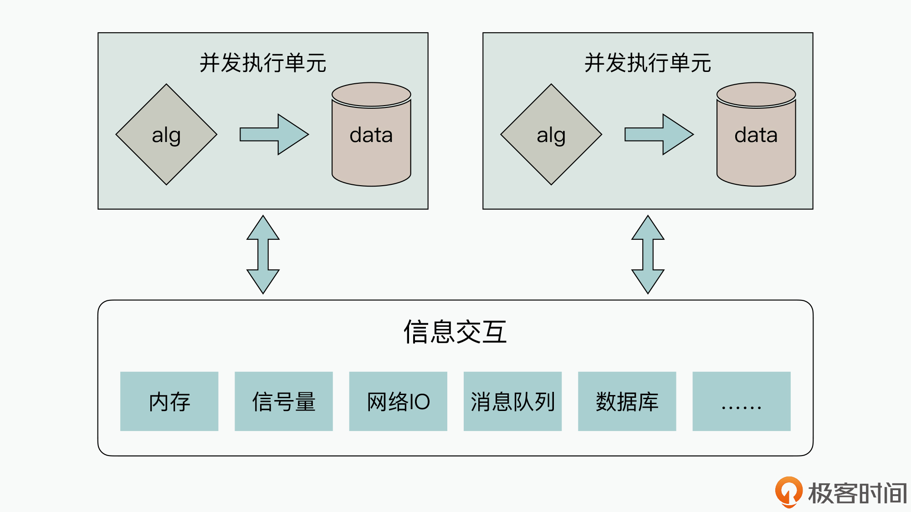
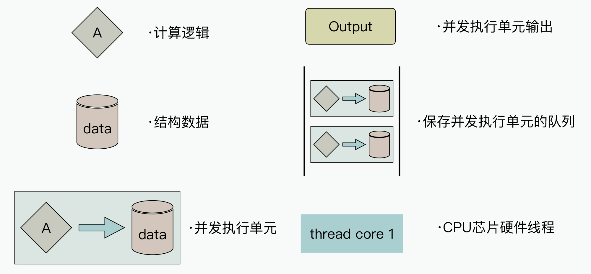
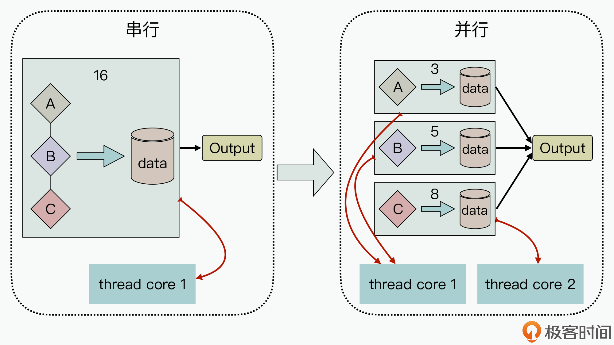
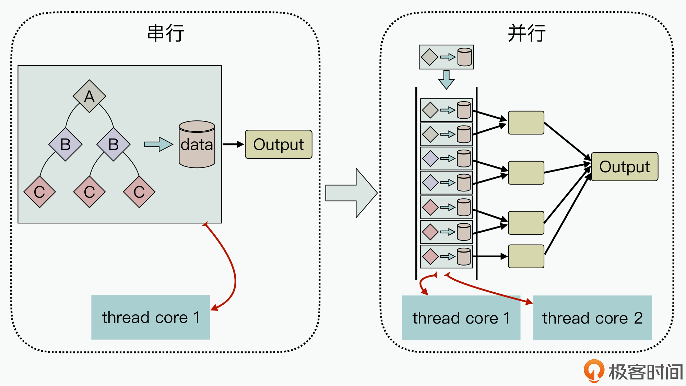
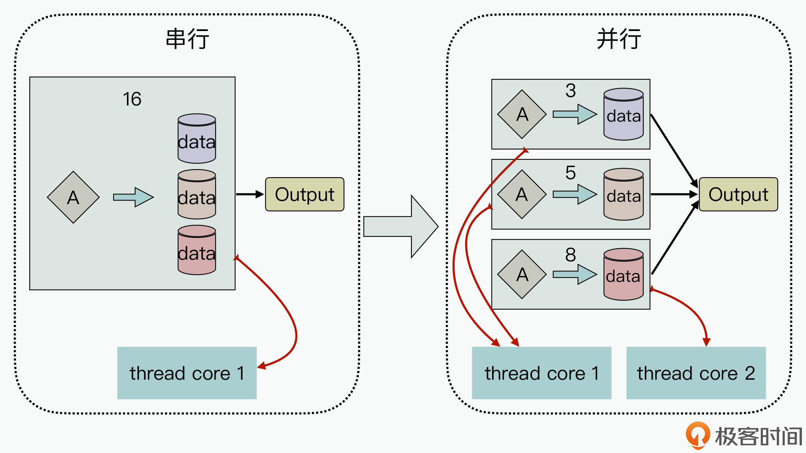
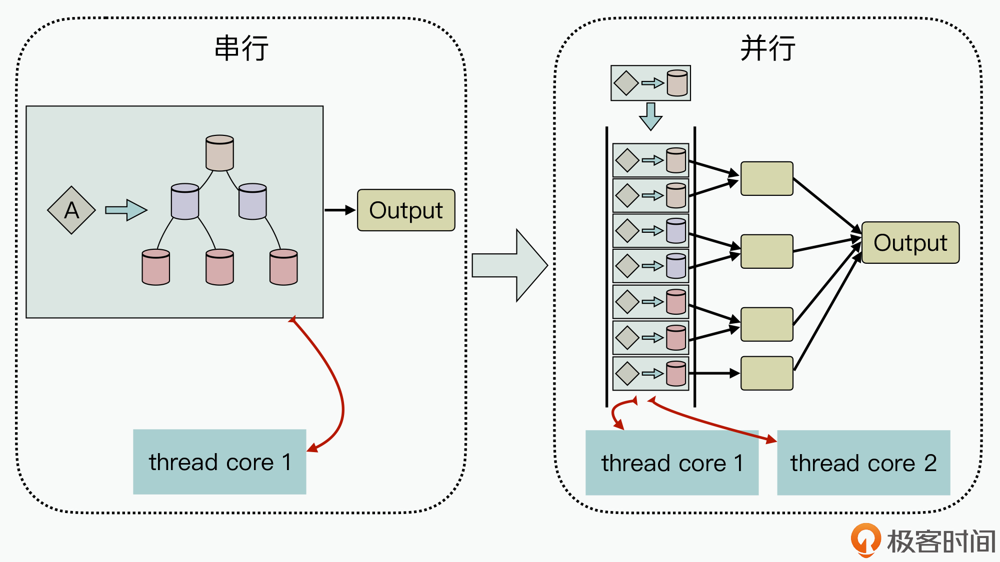
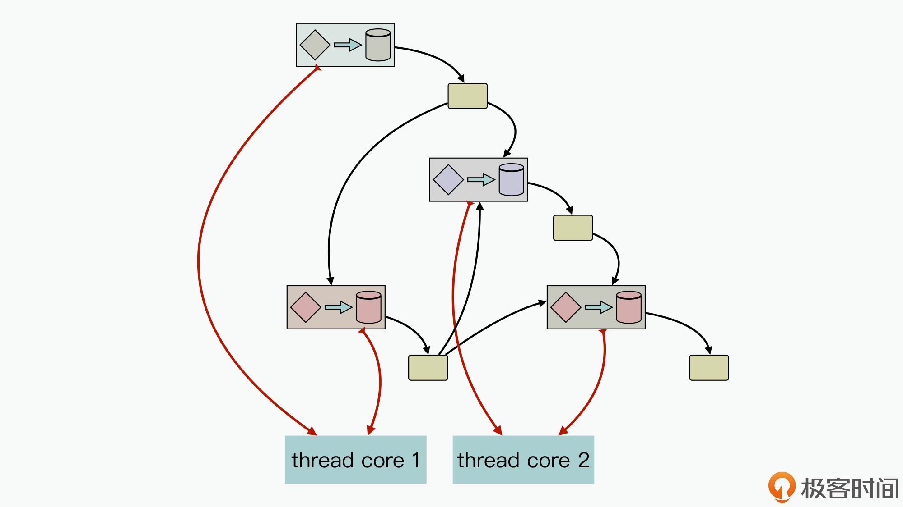

---
date: "2019-06-23"
---  
      
# 02 | 并行设计（上）：如何利用并行设计挖掘性能极限？
你好，我是尉刚强。

在计算机领域，由于CPU单核性能的增⻓逐渐停滞，而我们面临的业务问题复杂度却在不断地上升，为了更好地解决这个冲突，在CPU中增加核数就成为了一种默认的应对方案。而通常来说，我们会借助并行设计来充分发挥硬件多核上的运行性能。

不过，在CPU多核的场景下，要想通过并行设计将计算负载均衡到每个CPU核上，以此减少业务处理的时延，将软件性能提升至最大化，**依然存在着很大的挑战**。

为什么这么说呢？不知道你在实际的业务场景中有没有发现，由于并行拆分不合理，而导致产品性能不可控，甚至是恶化的现象非常普遍。另外，由于程序员普遍会存在串行编程的惯性思维，在并发同步互斥实现中引入的故障难以定位，也很容易导致产品在较长时间里处于不可用状态。而这些问题，都会对我们的软件性能产生直接影响。

所以这节课，我就来给你介绍6种针对不同业务问题的典型并行设计架构模式，以此让你在面对实际的业务问题时，能快速准确地挖掘业务中的并发性，找到适合产品的并行设计架构。而同步互斥作为并行设计中的一个难点，如果你希望能高效解决，需要对其有很深入的理解认识，我将在下一节课单独介绍。

## 并行计算模型

在开始讲解具体的并行设计架构模式之前，我想先带你了解一下并行计算模型。

<!-- [[[read_end]]] -->

因为当面对具体的业务问题时，如何将复杂的领域问题拆分成可并行的逻辑单元，并实现同步交互，是并行架构设计的关键。而并行计算模型，可以帮助我们建立起对并发系统抽象模型，以及各种基本概念的认识，从而更容易去理解后续的并行设计架构模式。

我们知道，在CPU多核运行的场景下，不同的并行计算单元如果共享相同的内存地址单元，就可能会导致各种同步互斥的问题，比如脏数据、死锁等。所以，在并行计算模型中，我们就需要隔离不同并发计算单元的内存数据，以尽量减少引入同步互斥的问题。

那么具体要怎么做呢？我们可以把并行计算模型抽象为两个层次：

1.  由结构数据和相应的计算逻辑组成并发执⾏单元，这样可以通过组合实现更复杂的业务；
2.  基于各种手段（如内存、互斥量、消息队列、数据库等），对并发执⾏单元计算的结果进行交互同步，保证业务计算结果的确定性。

你可以参考一下这个模型的抽象视图：

这里你要注意的是，图中的两个并行执行单元代表了抽象的逻辑单元，并不是特指线程。并行执行单元的粒度可大可小，像函数、routine（协程）、actor、线程、进程、作业等，都可以作为并行执行单元。

那么现在，我们来思考一个问题：在调用软件并发调度框架，如java.util.concurrent.Executors的submit接口时，提交的Thread是一个真正创建的线程吗？

首先我们要知道，这个Thread是一个抽象的并行执行单元，实际上并不是真正的线程。而java.util.concurrent.Executors是Java语言基于线程封装的调度框架底座，它支持将Callable和Runner接口实现并映射到具体的线程运行单元上。所以说，**在设计并发架构时，我们不应该将并行执行单元片面地理解为线程。**

不过在Java语言中，也不是只能使用这种抽象粒度的并行执行单元来实现并行设计。Java中还有诸如Akka、Reactor等并发调度框架底座，来支撑更加轻量级的并行执行单元。比如，你可以使用Akka中的Actor进行并行系统设计，也可以基于Reactor库设计和实现并发程序，你甚至可以为特定应用场景专门定制并发调度底座。

也就是说，**在并行设计的过程中，我们不应该将并行执行单元限定在线程粒度上，而是应该根据处理的特定领域问题，选择合适的并行执行单元粒度，并选择或定制实现相应的并发调度框架。**

> 另外，在使用Java设计实现并发程序的过程中，我们可以使用Java语言内置的并发库，如各种锁、并发集合等来实现同步与信息交互。但在多机分布式系统中，还需要依赖数据库、消息队列、网络传输等技术来实现信息交互。

所以，接下来我介绍的6种并行设计架构模式，就是基于上述的并行计算模型来描述的。

## 并行设计架构模式

这里我想先说明一点，在软件领域中，我们⾯对的业务场景一定是纷繁多样的，只花一节课的时间我们不可能面面俱到、了解所有的业务场景。所以今天，我只想带你重点思考一个问题：如何根据业务场景进⾏并行设计，从⽽在最⼤程度上发挥硬件并⾏的能⼒。下面我介绍的6种并行设计架构模式，也都是基于这个问题而展开的。

那么，我是如何划分这6种并行架构⽅案的呢？答案是根据计算逻辑、结构数据、信息交互这三个维度的不同的规则性，拆分后得出的。要知道，这些架构之间并不是孤⽴的。对于特定领域的业务场景来说，很多时候需要组合⼏种架构模式来实现业务逻辑。

所以，你在学习这6种并⾏架构模式时，就需要了解这种架构的核⼼关注点是什么，以及它重点解决了什么问题。为了便于你理解后面会用到的几种并行架构设计的图例，这里我先说明一下图中各种元素的含义：

* **计算逻辑：**业务中的计算逻辑，可以在CPU上执行的代码段。
* **结构数据：**拆分到并行执行单元中的独立数据，可以记录在内存中，也可以在数据库中。
* **并行执行单元：**抽象并行执行实体，使用软件并发调度框架映射到底层CPU硬件线程上；并行计算单元中的数字，表示计算单元的工作量。
* **并行执行单元输出：**并行执行单元的执行结果，需要使用同步与互斥手段实现并行执行单元的业务功能组合。
* **保存并行执行单元队列：**不少软件并发调度框架，如java.util.concurrent.Executors内部已提供了待调度并行执行单元队列，但也有不少场景需要自己设计维护并行执行单元队列。
* **CPU芯片硬件线程：** CPU多核场景下，支撑并行执行的CPU硬件线程。软件并行执行单元最终会映射到不同CPU硬件线程上才能实现真正并行。

除此之外，在介绍6种并行设计架构模式的过程中，我还会给你重点强调下该架构模式中的隐式约束条件。只有充分理解了这些约束条件，你才能在并行设计的过程中，避免引入一些故障，也能够降低代码开发的实现复杂度，并最大化地挖掘这种并行设计架构模式的性能。

好了，下面我们就开始吧。

### 1\. 任务线性分解架构

第一种架构模式是任务线性分解架构，它是一种按照计算逻辑维度进行确定性拆分的并行架构设计模式。其大致的实现过程是这样的：

首先可以看到，在图中的左侧，三个计算逻辑A、B、C是在相同的⼀个数据块上进行操作的。通过依赖分析，我们会发现A、B、C三个计算逻辑相对独⽴。因此，当单核处理性能存在瓶颈时，按照计算逻辑维度进⾏并⾏拆分，就能够进⼀步提升性能。

所以上图的右侧，就是按照计算逻辑拆分成的三个独⽴的并⾏执⾏单元，这样就可以映射到两个硬件线程较少的处理时延上。

> 补充：作为一名Java工程师，需要你显式地映射绑定到硬件线程的场景可能比较少；但对于嵌入式工程师而言，映射绑定也是并行设计中非常关键的一个环节。

实际上在很多的业务领域中，都存在需要根据同一个事件或数据，并行触发很多任务的场景。比如在电商购物场景下，当发生了一笔交易且交易成功后，就会同时触发填充邮件内容并通知责任人、按照多种维度统计数据及更新等多项任务。

通常，当这些触发的业务计算逻辑之间相互独立时，我们就可以通过创建多个并行执行单元，分别处理拆分后的不同子问题，并根据不同单元业务工作量的大小，建立与具体硬件线程的映射绑定关系。

这种并行设计架构模式相对比较简单，潜在的业务场景也比较多。比如，在Observer模式中处理的类似问题、在消息队列中一对多通信解决的业务问题等，通常都隐含着任务线性并发的可能性。

总而言之，任务线性分解架构比较适用于业务逻辑确定性的场景，你在实际应用时要注意以下几点：

* 在并⾏执⾏单元间，数据依赖可以通过⼀些⼿段进行消除或隔离，比如利用Thread Local变量，通过数据冗余来消除依赖；
* 执⾏单元的⼯作量⽐较确定，容易与硬件线程建⽴绑定和映射关系；
* 一般来说，做并⾏拆分我们需要先了解全局的业务功能，同时任务线性拆分的扩展性会差⼀些。

### 2\. 任务分治架构

第二种架构模式是任务分治架构，它是一种按照计算逻辑进行动态拆分的并行架构设计模式。我们来看下它的设计特点：

通过图中的左侧，我们能够发现，在很多的业务场景下，计算逻辑并不是全局确定的。有些业务在计算过程中，还需要根据场景来判断是否拆分成更⼩的⼦问题进⾏求解。比如说，A计算过程中，会拆分出2个B⼦问题，⽽在这2个⼦问题的计算过程中，需要进⼀步拆分为3个C⼦问题来求解。

那么，针对这种场景进⾏并行设计时，就不能在系统运⾏前完成任务的拆分，而是需要动态创建任务，并借助任务队列来管理执⾏任务。这里的执⾏线程可以从队列中拉取任务，映射到硬件线程上执⾏。

这种并行设计架构模式的使用场景相对少一些。

我之前曾基于Akka框架，设计开发了一款智能对话引擎。在这个对话引擎系统中，用户对话的所有语义信息是有限的，当收到某个用户对话数据时，在特定上下文中，可能语义是全局语义中一个较小的子集。所以我需要在这个子集内选择语义匹配率最高的一个，然后进行回复。

另外，每个语义计算匹配率的计算逻辑与对话数据是独立的，所以为了实现用户对话消息的急速回复，我需要在该上下文下，动态创建出多个并行执行单元，分别计算语义匹配度，再汇总选择出匹配率最高的一个。而这个实现框架，就是基于任务分治架构进行设计的。

事实上，在Java的java.util.concurrent.Executors以及Akka等框架中，已经内置实现了并发任务队列，并支持与CPU等硬件线程映射，从而满足了大部分场景下的业务需求。但在一些实时性要求比较高、性能要求非常苛刻的场景下，比如股票交易等，任务队列以及硬件资源绑定关系，通常是需要单独设计实现的。

同样，这里我们也来了解下这种架构模式的隐式约束条件：

* 通常动态拆分的并⾏任务间，通信开销会比较⼤，你需要额外分析通信对性能的影响；
* 动态拆分的并⾏任务间通常存在控制依赖，需要利用Fork-Join机制协调任务间同步；
* 受制于计算路径跨度对并发性能的影响，最⼤化发挥并⾏性能⽐较困难。

### 3\. 数据⼏何分解架构

第三种架构模式是数据几何分解架构，它是一种根据待处理的业务数据进行线性拆分的并行架构设计模式。同样，我们先来看下它的设计特点：

数据⼏何分解与任务线性分解架构的⻛格⽐较接近，但⼏何分解架构的主要特点是**相同计算逻辑需要在不同的数据上进⾏运算**。如图中右侧所示，拆分成不同的并⾏计算单元后，计算逻辑是相同的（颜⾊相同），但是数据是不同的（颜⾊不同）。

在互联网微服务场景中，业务关键数据会记录到数据库表中。当数据规模比较大，需要对数据库表使用分表策略保存，这就是一种典型数据几何分解方式。针对这种场景，当接收到业务数据库表查询分析请求，需要基于同一个计算逻辑与不同数据库分表组合，创建出多个执行单元并行计算提升性能。

通常在业务发展中，待处理数据规模增加是一个非常重要的变化方向，通过弹性计算资源提升业务处理能力是核心关注点之一。而数据几何分解架构是解决这类问题的一种典型方法，有很多优点，应用非常广泛。

好，最后我们来看看数据几何分解架构的隐式约束条件：

* 一般来说，采⽤数据⼏何分解架构，其可⽀持的扩展性会⽐较强；
* 这种性能架构模式⽐较适合于SPMD（Single Program Multi Data）架构，SPMD架构会使用一套相同的代码实体并行运行在多个硬件线程上，这样用户只需要管理一套代码实体即可，成本比较低。
* 数据几何分解架构中，不同并⾏计算单元的更新数据间是独⽴的。

### 4\. 递归数据架构

第四种架构模式是递归数据架构，它是一种在处理过程中对业务数据进行动态拆分的并行架构设计模式，其架构设计特点如下：

从图中我们可以看到，业务处理的数据是树状或者图状组织的，而这就表明了线性⼏何拆分数据会比较困难。

因此，我们在实际应用时，就需要在遍历的过程中动态创建任务，然后对每个中间计算单元的运算结果逐步合并，计算得到最终的结果，如图中右侧所示。

MongoDB是目前应用非常广泛的开源文档性数据库，它支持将灵活的JSON格式业务数据保存到数据库中。在对业务记录JSON格式内的多个字段进行数据分析时，代码需要递归遍历JSON中所有嵌套字段并进行分析计算。为了最大化并发执行，减少处理时延，可以采用递归数据架构模式，在递归遍历字段过程中动态创建对应字段分析的并行执行单元。

这种架构应用场景也相对较少，主要针对非规则结构数据进行计算分析时使用，比如树状、有向图等数据结构。

同样，最后我们来看看这种架构的隐式约束条件：

* 这种架构模式下，计算任务单元需要动态创建，⽽且⼯作量不确定；
* 一般来说，递归数据架构对应的算法是递归算法。

### 5\. 数据流交互架构

第五种架构模式是数据流交互架构，它是从信息交互的维度出发，是一种在并行执行单元间单向交互的并行架构设计模式。我们来看下它的设计特点：

从上图中我们可以发现，这种业务场景的典型特⾊是：

1.  ⼀个计算单元的输出刚好是另外⼀个计算单元的输⼊，并且消息交互是单向确定性的；
2.  业务场景中还会源源不断接收到新的输⼊，需要使⽤相似的计算策略进行处理。

也就是说，针对这种场景，计算单元的确定性会⽐较强，我们可以静态规划与硬件线程的映射关系，⽽**设计的核⼼就是如何⾼效实现并发计算单元间的信息交互。**

具体怎么做呢？我给你举个例子。

在大数据领域中，ETL（Extract-Transform-Load）是一个非常典型的场景，它是用来描述将数据从来源端经过抽取（extract）、转换（transform）、加载（load）至目的端的过程。但业务数据处理需求通常是由多个ETL阶段组合完成的，因此针对这类场景，使用数据流交互架构会比较适合。

此外，在嵌入式领域，⽹络协议栈的报⽂处理、不同协议栈解析特定头部字节、完成业务处理后透传给下⼀层，也是使用数据流交互架构的一类典型场景。

这里你要知道，在数据流交互架构中，不同并行执行单元的处理消息速率通常是不一致的，你需要借助消息队列缓存来协调。而在Java中，并发的各种BlockingQueue就是前面这个问题中，消息队列的一种实现方式，也就是典型的生产者消费者模型处理的问题。

好，现在我们来看下这种架构的隐式约束条件：

* 通常，数据流交互架构中的计算业务是线性可拆分的，数据在时间线上是均匀、批量地向前推进且相互独⽴；
* 在该架构下，计算任务的⼯作量确定性比较强，⽐较适合静态规划；
* 当消息通信满⾜单向⽣产者消费者模式时，数据流交互架构可以避免使⽤互斥锁，达到消息的⾼效率交互。

### 6\. 异步交互架构

最后一种架构模式是异步交互架构，它是一种并行执行单元间，交互关系比较复杂的并行架构设计模式，其设计特点如下图所示：

从图上我们可以发现，该业务场景的典型特⾊是这样的：

1.  同⼀个任务需要与多个任务进⾏消息交互；
2.  同⼀个消息需要多个任务进⾏处理。

这种系统的计算逻辑可能需要进行全局拆分，也可能不能拆分，我们要根据实际情况进⾏处理。

我给你举个例子。在微服务架构中，微服务在完成一个REST请求业务功能的过程中，可能需要进行多次数据库操作，还可能需要多次调用其他微服务提供的REST接口。为了充分发挥性能，我们在将业务逻辑拆分为多个并行执行单元后，并行执行单元间的运行开销差异较大，就可以使用异步交互来实现业务功能。

这里请注意，要想最大化地发挥这种架构的性能，还需要实现一点：并行执行单元能够动态灵活地映射到特定的硬件CPU核上。比如说，Node.js后端业务async和Java语言中的Future并发机制，都是比较好的支撑异步交互架构的语言机制。

最后我们来看下它的隐式约束条件：

* 计算任务的⼯作量不确定性强，任务通常需要动态调整映射到对应硬件线程；
* 消息交互需要使⽤异步机制提升性能；

## 小结

并⾏设计解决的是将复杂业务领域的问题拆分为多个相对较⼩的串⾏⼦问题，每个串行子问题对应一个并行执行单元，并通过⾼效解决⼦问题间的信息交互与同步，从而减少业务整体处理时延，最终满足业务的性能需求。

今天我以最大化地挖掘并行性能为出发点，给你介绍了6种⽐较典型的并行架构解决思路。不过在实际的业务场景中，当性能并不是系统关键因素时，如果你使用串行化代码实现就已经满足了性能要求，而且开发成本更低，那么这时你就需要权衡一下，是否还需要进行并行设计。

## 思考题

我们知道，对Java而言，有java.util.concurrent.Executors、Akka、Reactor等并发调度框架底座，那么这些框架之间有什么差异呢？在开发一个核心业务只有对数据库增删查改的微服务时，你会如何选择呢？

欢迎在留言区分享你的答案和思考。如果觉得有收获，也欢迎你把今天的内容分享给更多的朋友。