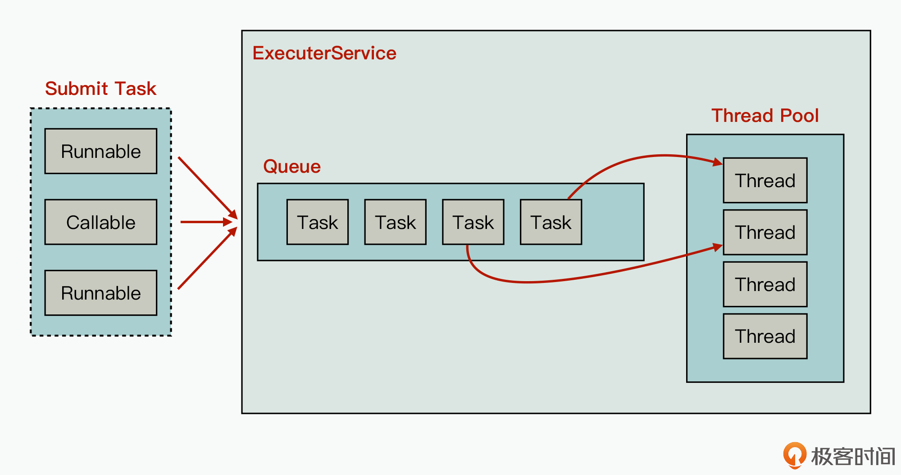
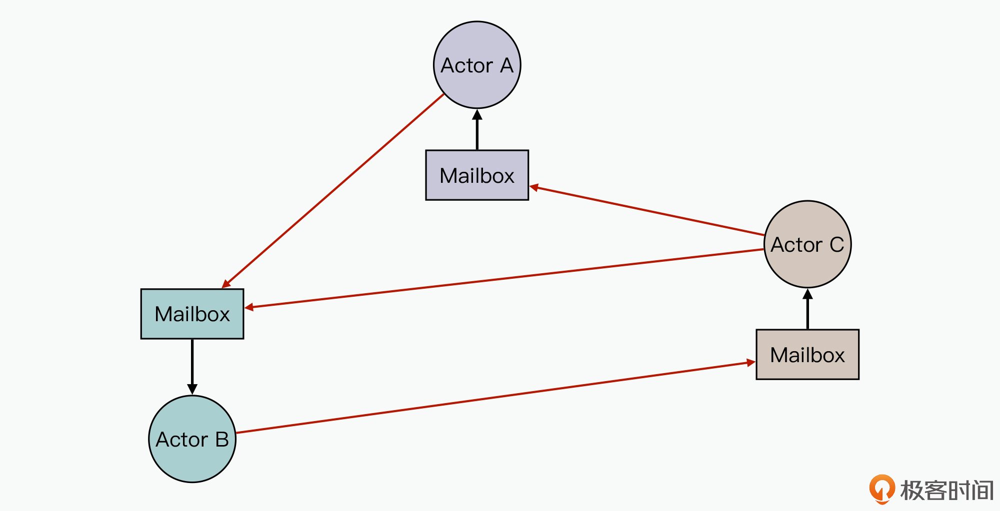
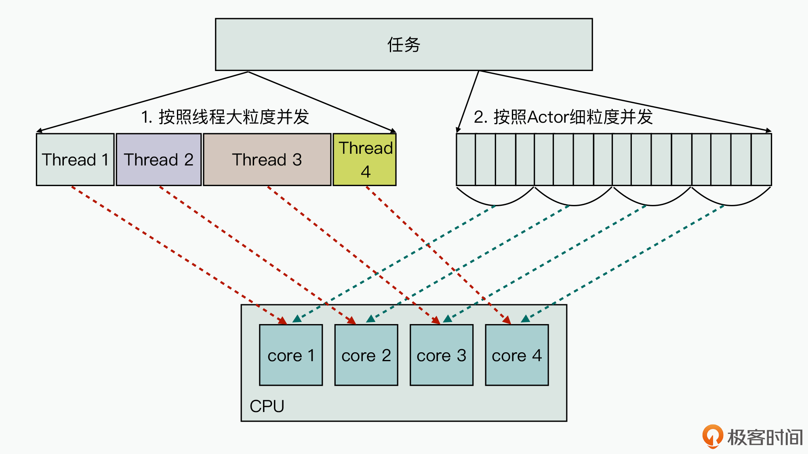
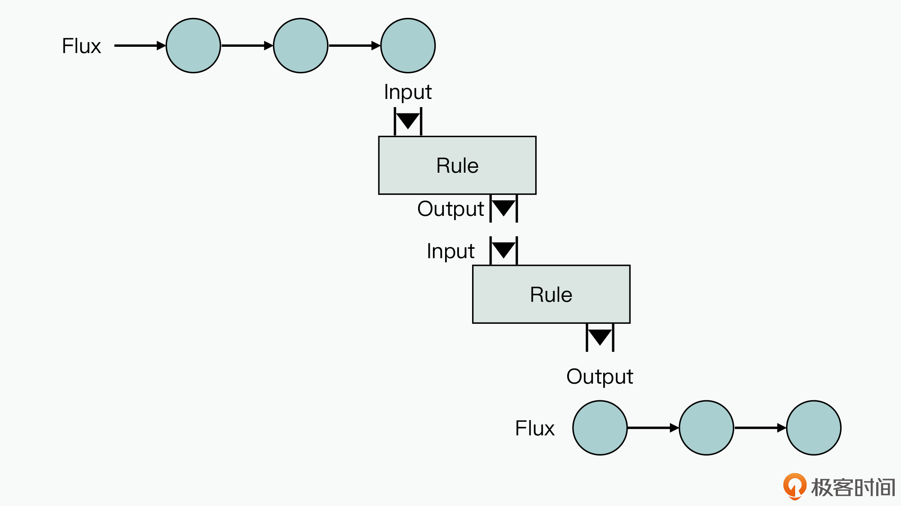

---
date: "2019-06-23"
---  
      
# 15 | 并发实现：掌握不同并发框架的选择和使用秘诀
你好，我是尉刚强。

在学完了第[2](https://time.geekbang.org/column/article/375102)、[3](https://time.geekbang.org/column/article/376555)节课之后，我们已经清楚了并行设计的重要性，也掌握了几类典型的并行设计架构模式，但是在编码实现的过程中，这些并行设计架构模式还需要依赖底层的并发框架才能完成。所以今天这节课，我就和你聊一聊并发框架的选择和使用秘诀。

其实不同的编程语言中，可用的并发框架种类非常多，比如Java语言有Thread Pool框架、 Akka框架、Reactor响应式框架等；C加加语言有CAF框架、Theron框架等；Go语言有goroutine等。

这些并发框架之间的差异很大，如果选择或使用不当，会很容易导致开发出来的软件性能比较差。而且，现在也依旧有不少的程序员，对这些并发框架并没有比较系统的认识，在选择和使用并发框架时，经常是比较随意的。

所以在今天的课程中，我就来告诉你当碰到具体的业务问题时，你应该如何选择更合适的并发框架，以及在使用中要遵循什么样的方法，才能发挥出并发框架的最佳性能。另外，在课程中我主要是以Java语言为例，来重点给你讲解Thread Pool框架、Akka并发框架、Reactor响应式框架的基本原理与特点，以及它们在使用过程中的一些注意事项，让你能最大化地发挥并发框架的性能优势。

<!-- [[[read_end]]] -->

而如果你是从事其他编程语言的开发工作，当然也可以参考这节课的内容，因为接下来我要介绍的Java并发框架，它们也代表了如今在并发系统设计中比较主流的三种框架（线程池、Actor模型、响应式架构）。

那接下来，就从我们最熟悉的Thread Pool框架开始学习吧。

## Java Thread Pool框架

Java的Thread Pool框架是目前最流行的一个并发框架，因为它使用起来比较方便，适用的场景也非常多。同时，它也是其他并发框架（如Akka）内部实现所依赖的技术，所以理解和学习这个框架是很重要的。

那么，为了更好地理解Java Thread Pool框架，我们先来看下它的框架模型图：

从图的左边开始看，继承接口Runnable、Callable的具体实现任务，在调用ExecutorService.submit接口时，会提交任务到ExecutorService内部的一个任务队列中。同时，在ExecutorService内部还存在一个预先申请的线程池（Thread Pool），线程池中的线程会从任务队列中领取一个任务来执行。

那么由此我们也能发现，在Java语言中，与直接在代码中创建线程相比，**采用Thread Pool这种机制有很多好处**：第一个好处，就是在Thread Pool中，你可以重复利用已创建的线程资源，从而减少线程创建和销毁造成的额外开销；第二个好处是，当有新业务请求到达时，你可以直接使用已创建的线程来处理业务，所以还可以最大化地减少处理时延。

其实，**对于一个软件系统而言，线程是非常重要的稀缺资源，而线程池技术也是有效管理线程资源、最大化提升软件性能的关键手段之一。**

但是，我见过不少的软件系统，在使用线程池时根本没有章法，每个开发人员在自己的业务模块中随意创建线程池，而对于整个软件系统来说，业务代码中一共创建了多少个线程池、每个线程池的资源规模配置如何，都是很含糊的，从而就导致开发出的软件性能总是处于不可控的状态。

所以通常来说，在使用线程池设计实现并发系统的时候，你需要针对线程池的创建与配置进行全局设计。那么这里的问题就是，**你应该依据什么样的规则来划分线程池组？以及如何去配置线程池使用的资源呢？**

实际上，就我的实践经验来看，我认为应该根据以下两个维度来划分线程池组：

* 首先，你应该根据**不同的业务逻辑特点**来划分线程组，比如说，可以将以CPU计算为主和以IO处理为主的业务逻辑，划分到不同的线程池组中；
* 其次，你还可以根据**不同的业务功能的优先级**，划分出不同的线程池组。

这样，当线程池组的划分确定之后，接下来，你就可以**根据JVM中可用的CPU核资源数目**（你可以使用Runtime.getRuntime\(\).availableProcessors\(\)获取JVM可用的CPU核数），**给不同的线程池组分配合理的线程资源额度**。

然后，在对线程池组配置可用的线程资源时，你还需要针对不同线程池上的业务特点，选择不一样的线程资源配置策略。比如说，针对CPU计算密集型业务，只需保持线程池配置可用的线程数，与可以分配的CPU核数相等即可；而针对IO密集型业务，由于业务中的阻塞请求比较多，所以可以将配置的线程数提高到可用CPU核数的两倍以上。

当然，我这里只是介绍了大体的配置思路，当你在为线程池组配置可用的线程时，最好是基于真实的业务运行特性分析，并从全局统筹分配之后，再为每个线程池配置合适的线程资源。

OK，现在我们再回头看一下前面那个线程池框架模型图，不知你发现没有，这个框架模型中并没有考虑线程之间的通信机制要怎么实现。那么你可能就会想：**当业务中的线程之间存在信息交互时，应该怎么办呢？**

这个时候，你肯定会想到，可以基于Java并发消息队列来进行通信，还可以使用各种同步互斥锁呀。

的确，在Java语言中，内置的并发消息队列与互斥锁等机制，几乎可以满足线程间的各种同步交互需求，如果合理设计并使用，也可以很好地发挥出软件性能。

不过，在真实的业务开发过程中，并发消息队列和锁机制如果使用不当，不仅容易导致软件出现很严重的故障，而且也容易引起系统中的某些线程长时间阻塞，从而不能很好地满足业务的性能需求。另外，并发消息队列和锁在解决同步互斥和数据一致性的问题时，带来的内部开销也会在一定程度上消耗软件的性能。

那么，有没有不需要基于直接使用并发消息队列和锁，来设计和实现高并发系统的框架呢？

答案当然是有的，我接下来要给你介绍的Akka并发框架，就是为了解决这个问题。

## Akka并发框架

首先我们知道，Akka是基于Actor模型实现的一套并发框架。所以这里，我们同样是先通过一个Actor核心模型图，来了解下Akka并发框架的特点：

在这个模型图中，每个Actor代表的是可以被调度执行的轻量单元。如图中所示，Actor A和Actor C在向Actor B发送消息时，所有消息会被底层框架发送到Actor B的Mailbox中，然后底层的Akka框架调度代码会触发Actor B，来接收并执行消息的后续处理。这样，基于Actor模型的这套并发框架，首先就保证了消息可以被安全地在各个Actor之间传递，同时也保证了每个Actor实例可以串行处理接收到的所有消息。

因此，**采用基于Actor模型的Akka框架，在开发实现软件时，你就不需要关注底层的并发交互同步了**，只需要聚焦到业务中设计每个Actor实现的业务逻辑，它需要接收什么消息，又需要向谁发送什么消息。

另外，由于Actor模型中的消息机制，实现了消息在Actor之间传递时会被串行处理，所以就**天然避免了在消息交互中需要解决的数据一致性的问题**。也就是说，针对系统中并发单元间存在大量信息交互的场景，选用Akka并发框架在性能上会存在一定的优势。

其实，**Actor模型还有一个更大的优势**，就是Actor是非常轻量的，它可以支持很大规模的并发，并负载均衡到各个CPU核上，从而可以充分发挥硬件资源，进一步提升软件的运行性能。

那么接下来，为了更好地理解这个原理，我们来看一个任务拆分示意图，它描述了两种不同的任务拆分方式，以及将拆分的子任务映射到CPU具体核上的执行过程。

在图中，左侧的方法1，代表的是传统基于线程的粒度并发拆分，你能够发现，这里想要拆分成大小均匀的并发子任务，其实是很有挑战的。而当拆分出的子任务大小规模差别比较大时，然后当它们被映射到底层CPU中的核上执行时，就会造成CPU核上的负载不均衡的情况。

这也就是说，传统的任务拆分方式会出现某些核处于空闲状态，而另外的核上还有线程在执行的场景，所以在这种场景下，CPU多核的性能空间就无法发挥到极致。

而图中右侧的方法2，代表的是Actor的细粒度任务拆分，它可以把业务功能拆分成大量的轻量级的Actor子任务。而由于每个Actor都非常轻量，Akka的底层调度框架就可以将这些Actor子任务均匀地分布到多个CPU硬件核上，从而可以最大化地发挥CPU的性能。

所以，你在实际的业务开发中要注意，如果在使用Actor时，没有利用好Actor轻量级的特性，开发出来的Actor承载的业务逻辑太多，导致Actor的任务粒度过大，那么就很难发挥出Actor的最佳性能表现。

OK，在理解了这种并发框架的使用优势之后，你可能仍然存在一个问题，就是**究竟什么样的业务系统会存在大量的并发信息交互，比较适合采用Akka并发框架呢？**

按照我的实践经验，一般来说，**CPU计算密集型**的软件系统会比较适合采用Akka并发框架。如果你发现业务系统中，存在大量基于并发消息队列的通信，且核心业务都是围绕着CPU计算逻辑，而IO请求并不是核心的业务逻辑，那么你的系统就很可能比较适用Akka并发框架。

实际上，很多种计算执行引擎就是比较典型的代表。比如，我之前开发的智能对话引擎，需要将多个计算模型的计算结果放在一起进行比较分析，那它就非常适合采用Akka并发Actor框架模型。

不过，对于一些典型的互联网微服务来说，当它们收到REST请求后，实现的核心业务逻辑主要是针对数据库CRUD，或是针对其他服务的REST接口调用，同时，这些不同的REST请求业务还是相对独立的。那么，这类系统就应该属于IO密集型业务，所以选择采用Akka并发框架，往往优势就不是很大。

那么，针对IO密集型业务，是不是选用线程池并发框架就是性能最佳的方案呢？

其实也不一定，下面我们就一起看下Reactor并发框架的实现特点，并了解下它在解决IO密集型业务时存在的优势吧。

## Reactor响应式框架

Reactor架构是一种基于数据流的响应式架构模式，严格来说它可能不算是完整的并发框架，但是却内置了灵活调整并发的机制和能力。

对于不太熟悉函数式编程范式的程序员来说，可能理解与使用Reactor架构会有些挑战。不过没有关系，在今天的课程中，我会帮你搞清楚Reactor架构模型的基本原理和优势是什么，你并不需要囿于细节。而当你在实际的业务中，需要决策是否使用这款并发框架时，再选择深入学习具体的用法也不迟。

好，首先，我们还是来看看Reactor框架的工作原理图：

如上图所示，输入流Flux就是Reactor中典型的异步消息流，它代表了一个包含0个到N个的消息序列。另外，图中的Rule代表的是一个基于消息的处理逻辑或规则，输入流中的消息可以被中间多个处理逻辑组合连续加工之后，再生成一个包含0个到N个的输出消息流Flux。

那么在看完原理图之后，我们需要思考一个问题：Reactor为什么要采用这样的计算模型呢，它又可以给软件的性能带来什么样的优势呢？

其实，这里主要会带来两个比较明显的优势，接下来我就给你重点介绍下。

**第一个比较大的性能优势，就是它提供了背压机制。**如果通俗点讲，那就是图中的中间处理规则（Rule），在接收处理消息时采用的是Pull模式，所以不存在数据消息积压的情况。而对于传统的分布式并发系统而言，内部消息堆积是一个很普遍的影响性能的因素，所以使用Reactor框架，就可以避免这种情况发生。

**第二个比较大的性能优势，就是在中间的消息处理规则实现中，针对IO的交互操作可以采用非阻塞的异步交互。**而原来传统的基于线程与IO交互的实现过程中，不管是使用直接的IO请求，或者基于Future的get机制，都不可避免地会发生当前线程被阻塞的情况。所以基于Reactor的异步响应式交互模式，在处理多IO请求时性能会更出色。

另外，在Spring Boot 2.0版本之后，也提供了对Reactor的全面支持，可以支持你去实现事件驱动模型的后端开发，从而更好地发挥软件的性能优势。

## 小结

在今天的课程中，我主要讲解了Thread Pool并发框架、Akka的Actor并发模型和Reactor的响应式架构的核心原理与性能特点。其中，Thread Pool是使用最普遍，也是其他并发框架的底座；而基于Actor模型的Akka，更适合对计算密集型且交互比较多的并发场景；而基于Reactor响应式架构，在针对消息流处理的、基于IO密集型的异步交互场景来说，有比较大的性能优势。

那么，在学习完今天的课程后，当你碰到特定的应用场景时，就可以基于这些并发架构的原理与特点，来选择适合产品的并发架构。但是要注意，选择并发框架只是在一定程度上，减少了开发高性能软件的复杂度，而最终开发出的软件的性能，还取决于你是否找到了更适合业务特性的高性能实现方案。

所以，你还需要继续深入理解业务逻辑，寻找到特定并发框架下，让软件性能更佳的设计与实现方法。

## 思考题

针对IO密集型软件系统，采用Thread Pool框架开发软件性能，是不是一定比采用Akka的并发框架的性能差呢？