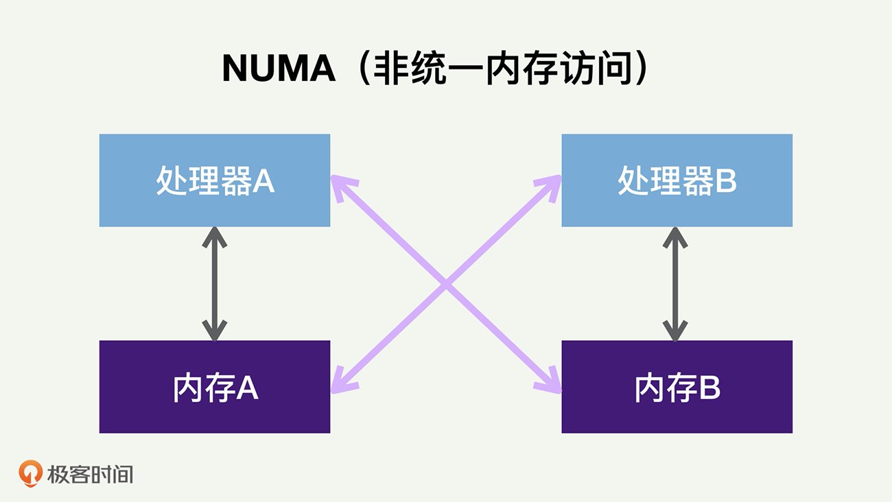
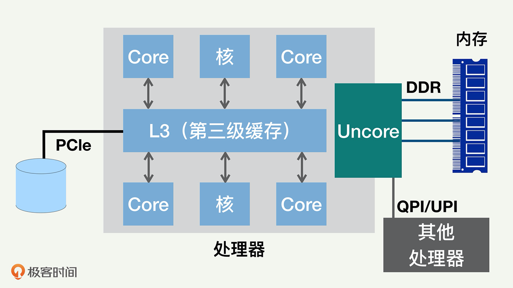
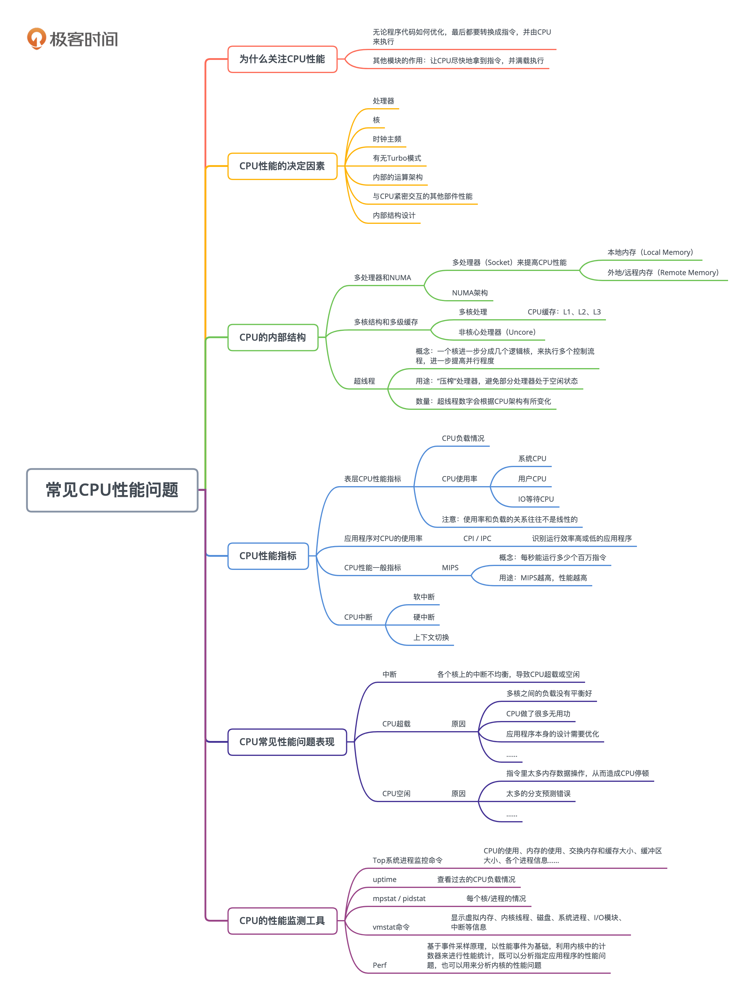

---
date: "2019-06-23"
---  
      
# 15 | CPU篇：如何让CPU的运行不受阻碍？
你好，我是庄振运。

从这一讲开始，我们探讨分析几个最容易发生性能问题的领域：CPU、内存、存储和网络。

这一讲先来讨论关于CPU的常见性能问题。首先我们从硬件的角度，来看看CPU的性能取决于哪些因素，然后分析一下CPU的内部结构。接着我们探讨和CPU性能相关的软件系统，看看CPU运行时侯的调度和切换。

## CPU的性能决定因素

宏观来讲，一台服务器里面的CPU性能取决于好几个因素，包括有多少处理器、多少个核、时钟主频是多少、有没有Turbo模式、处理器内部的运算架构以及和CPU紧密交互的其他部件的性能。

CPU的更新换代很频繁，基本上每两年就会更新一代。比如Intel的CPU，最近10年已经经历了5代左右。每一代都有主频的变化，而且有好几个变种。

下面的表格描述了从十年前（也就是2009年）的SandyBridge，到后来的IvyBridge、Haswell、Broadwell，直到Skylake。注意，对后面的三代，我分别列出了其中的两种变化——单处理器（1P）和双处理器（2P）。

大体上我们可以看出，虽然CPU更新换代，但是处理器的时钟主频基本不再提高，甚至变得更低了。这样的目的是降低CPU的功耗。比如SandyBridge的时钟频率是2.6GHz，但是到了Skylake，反而降低到了2GHz。

<!-- [[[read_end]]] -->

为了提升单个处理器的性能，每个处理器里面的核数却越来越多，这样就可以尽量的提升并行处理能力。比如SandyBridge的每个处理器只有8个核，而Skylake则多达20个核。

而且我们也看到，每一代CPU都允许Turbo模式，就是让CPU的主频提高。目的是可以让处理器在特殊情况下，用提高功耗的代价来增加主频，从而获得更高性能。

## CPU的内部结构

CPU的性能也取决于它的内部结构设计。很多程序员对CPU的内部机构不是完全清楚，尤其是对相关的术语之间的区别和联系一知半解，比如多处理器和多核、逻辑CPU和硬件线程、超线程，以及L1/L2/L3三级缓存等。

之所以对这些结构不甚了解，主要原因是现代处理器变得复杂，普遍采用多处理器，多核以及内部的各种优化处理来提高CPU性能。我们今天就从外到内，从宏观到微观地介绍一下。

我注意到，这方面的很多中文术语，大家有时候用法不一致，所以很容易混淆。为了清楚描述，你尤其要注意一下我用的术语（包括英文）。

### 多处理器和NUMA

现在的CPU普遍采用多处理器（Socket）来提高CPU性能，每个处理器都有自己可以直接访问的本地内存（Local Memory）。一般来讲，这里面每个处理器的性能和内存大小都是一样的。每个处理器也都可以访问其他处理器的内存，这些内存就相当于是外地/远程内存（Remote Memory）。

当CPU处理器访问本地内存时，会有较短的响应时间（称为本地访问Local Access）。而如果需要访问外地/远程内存时候，就需要通过互联通道访问，响应时间就相比本地内存变慢了（称为远端访问Remote Access）。所以NUMA（Non-Uniform Memory Access）就此得名。

下图展示了两个处理器的NUMA架构。

如果处理器A访问内存A，就是本地访问。如果它访问内存B，就是远端访问，内存的访问延迟大大增加。

采用多处理器和NUMA架构的主要原因，是提高整个CPU的并行处理性能。每一台服务器可以同时运行很多程序和进程。对每一个进程和线程而言，当它运行在某一个处理器上时，它所对应的内存使用默认的分配方案是——优先尝试在请求线程当前所处的处理器的本地内存上分配。如果本地内存不足，才会分配到外地/远程内存上去。

### 多核结构和多级缓存

我们再看看每个处理器内部的结构。我们刚刚讲到的处理器，内部一般都是多核（Core）架构。随着多核处理器的发展，CPU的缓存通常分成了三个级别：L1、L2和L3。

级别越小就越接近CPU，速度更快，同时容量也越小。L1和L2一般在核的内部，我们下一讲还会详细讲。L3缓存是三级缓存中最大的一级，同时也是最慢的一级；在同一个处理器内部的核会共享同一个 L3 缓存。

除了多个核以及L3缓存外，处理器上一般还有非核心处理器（Uncore），里面含有和指令运行不直接相关的组件，包括QPI控制器和存储器一致性监测组件，如下图所示。

### 超线程（Hyperthreading，HT）

一个核还可以进一步分成几个逻辑核，来执行多个控制流程，这样可以进一步提高并行程度，这一技术就叫超线程，有时叫做 simultaneous multi-threading（SMT）。

超线程技术主要的出发点是，当处理器在运行一个线程，执行指令代码时，很多时候处理器并不会使用到全部的计算能力，部分计算能力就会处于空闲状态。而超线程技术就是通过多线程来进一步“压榨”处理器。

举个例子，如果一个线程运行过程中，必须要等到一些数据加载到缓存中以后才能继续执行，此时CPU就可以切换到另一个线程，去执行其他指令，而不用去处于空闲状态，等待当前线程的数据加载完毕。

通常，一个传统的处理器在线程之间切换，可能需要几万个时钟周期。而一个具有HT超线程技术的处理器只需要1个时钟周期。因此就大大减小了线程之间切换的成本，从而最大限度地让处理器满负荷运转。

一个核分成几个超线程呢？

这个数字会根据CPU架构有所变化；Intel一般是把一个核分成2个。

“这台计算机有多少CPU？”

我们经常会问这个问题，结合我们刚刚讲的知识，就很容易回答了。

比如，如果一台计算机有两个处理器，每个处理器有12个核，而且采用了HT超线程，那么总的CPU数目就是48，就是2×12×2。这个数字48，就是我们平时用监控软件和命令看到的CPU的数量。比如，Linux的top或者vmstat命令，显示的CPU个数就是这样算出来的。

## CPU性能指标和常见性能问题

我们继续探讨CPU的性能指标和常见性能问题，这方面很多资料都有涉及，我们提纲挈领地总结一下。

最表层的CPU性能指标，就是CPU的负载情况和使用率。CPU使用率又进一步分成系统CPU、用户CPU、IO等待CPU等几个指标。你执行一下top命令就会看到。

需要注意的是，因为CPU架构的复杂性，以及和其他部件的交互，CPU的使用率和负载的关系往往不是线性的。

也就是说，如果10\%的CPU使用率可以每秒处理1千个请求，那么80\%的CPU使用率能够处理多少请求呢？不太可能处理每秒8千个请求，往往会远远小于这个数字。

衡量一个应用程序对CPU使用效率时，往往会考察CPI（Cycles Per Instruction，每指令的周期数）和 IPC（Instructions Per Cycle，每周期的指令数）。这两个指标有助于识别运行效率高或低的应用程序。而一台计算机的CPU性能一般用MIPS（Millions of Instructions Per Second）来衡量，表示每秒能运行多少个百万指令，MIPS越高，性能越高。MIPS的计算很简单，就是时钟频率×IPC。

继续往深处分析，CPU常见的各种中断包括软中断和硬中断。除此之外，还有一种特殊的中断：上下文切换。这些指标需要和每个核挂钩，理想情况下是各个核上的中断能够均衡。如果数量不均衡，往往会造成严重的性能问题——有的核会超载而导致系统响应缓慢，但是其他的核反而空闲。

和CPU相关的性能问题，基本上就是表现为CPU超载或者空闲。

如果是CPU超载，那么就要分析为什么超载。多数情况下都不一定是合理的超载，比如说多核之间的负载没有平衡好，或者CPU干了很多没用的活，或者应用程序本身的设计需要优化等等。反之，如果是CPU空闲，那就需要了解为什么空闲，或许是指令里面太多内存数据操作，从而造成CPU停顿，也或许是太多的分支预测错误等，这就需要具体分析和对症下药的优化。

CPU对多线程的执行顺序是谁定的呢？

是由内核的进程调度来决定的。内核进程调度负责管理和分配CPU资源，合理决定哪个进程该使用 CPU，哪个进程该等待。进程调度给不同的线程和任务分配了不同的优先级，优先级最高的是硬件中断，其次是内核（系统）进程，最后是用户进程。每个逻辑CPU都维护着一个可运行队列，用来存放可运行的线程来调度。

## CPU的性能监测工具

我们最后讲一下CPU性能监测方面的工具。和CPU监测相关的工具挺多的，而且往往每个工具都包含很多不同的有用的信息。

比如在Linux上，最常用的Top系统进程监控命令。Top是一个万金油的工具，可以显示出CPU的使用、内存的使用、交换内存和缓存大小、缓冲区大小、各个进程信息等。

如果想要查看过去的CPU负载情况，可以用uptime。也可以用mpstat和pidstat，来分别查看每个核还有每个进程的情况。另一个常用的vmstat命令可以用于显示虚拟内存、内核线程、磁盘、系统进程、I/O模块、中断等信息。

对有经验的性能工程师来讲，有一个类似于“瑞士军刀”一样的好工具：Perf。

Perf是Linux上的性能剖析（profiling）工具，极为有用。它是基于事件采样原理，以性能事件为基础，利用内核中的计数器来进行性能统计。它不但可以分析指定应用程序的性能问题，也可以用来分析内核的性能问题。

## 总结

这一讲我们讨论了计算机的运算核心，CPU的结构，尤其是它内部的和性能相关的部件，并澄清了一些术语。

CPU是服务器性能的最重要的部分；因为不管程序代码如何优化，最后都要转换成指令，让CPU来执行。不管其他部件如何和CPU交互，最终目的是让CPU尽快地拿到指令，并满载执行。

唐代有个诗人叫李贺，他曾经形容跨马奔驰的愿景：

“大漠沙如雪，燕山月似钩。  
何当金络脑，快走踏清秋。”

我们常把CPU类比大脑，CPU性能优化的目标，就是让它的运行不受阻碍，如千里马一样任意驰骋。

现代CPU提升性能的主要途径是并行化，这方面的策略包括：多处理器、多核、超线程，另外还有流水线架构和超标量等等，都是为了提高并行处理能力。

## 思考题

你工作中一定碰到过CPU方面的性能问题吧？总结一下，有几种表现形式？

> 比如是总体CPU使用量太高，还是计算机的几个核负载不均衡？负载不均衡是什么原因导致的呢？是线程数不够，还是系统调度的问题？

欢迎你在留言区分享自己的思考，与我和其他同学一起讨论，也欢迎你把文章分享给自己的朋友。