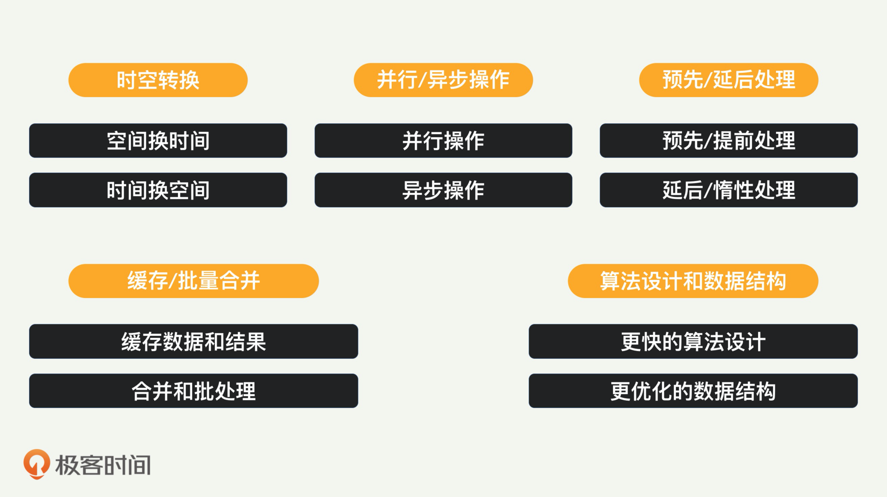

---
date: "2019-06-23"
---  
      
# 20 | 性能优化十大策略：如何系统地有层次地优化性能问题？
你好，我是庄振运。

上一讲中，我们聊了性能优化的六大原则。原则有了，但是在针对实际的性能问题的时候，用什么样的解决方案才可以提升性能呢？这就需要你了解**具体的优化策略**了。

现实中的性能问题和具体领域千差万别，我也不可能面面俱到。但是为了帮助你理解，我总结了十大常用的优化策略。

我将这十大策略分成五个类别，每个类别对应两个相关策略，帮助你掌握。这五个类别是：时空相互转换、并行/异步操作、预先/延后处理、缓存/批量合并、算法设计和数据结构。我们现在一个个来讲。

## 时空转换

第一个策略类别是“时空转换”。我们看科幻电影和小说的时候，经常会看到时空转换这个题材。性能优化里面有两个策略恰好组成了这个类别，包括“用时间换空间”和“用空间换时间”这两个看似互相对立的策略。

### 1.用时间换空间

用时间换空间的策略，出发点是内存和存储这样的“空间”资源，有时会成为最稀缺的资源，所以需要尽量减少占用的空间。比如，一个系统的最大性能瓶颈如果是内存使用量，那么减少内存的使用就是最重要的性能优化。

这个策略具体的操作方法有几种：

* 改变应用程序本身的数据结构或者数据格式，减少需要存储的数据的大小；
* 想方设法压缩存在内存中的数据，比如采用某种压缩算法，真正使用时再解压缩；
* 把一些内存数据，存放到外部的、更加便宜的存储系统里面，到需要时再取回来。

<!-- [[[read_end]]] -->

这些节省内存空间的方法，一般都需要付出时间的代价。

除了内存，还有一种常见的场景是，降低数据的大小来方便网络传输和外部存储。压缩的方法和算法有很多种， 比如现在比较流行的ZStandard（ZSTD）和LZ4。这些算法之间有空间和时间的取舍。

衡量任何压缩算法，基本上看三个指标：**压缩比例**、**压缩速度**以及**使用内存**。

如果系统的瓶颈在网络传输速度或者存储空间大小上，那就尽量采取高压缩比的算法，这样用时间来换空间，就能够节省时间或者其他方面的成本。

### 2.用空间换时间

“用空间换时间”就是对“用时间换空间”策略反其道而行之。有些场景下，时间和速度更加重要，但是空间尚有富余，这时我们就可以考虑用空间来换时间。

这里要注意的一点是，我们后面还会讲一条关于使用缓存的策略。虽然缓存的策略理论上也是一种“空间换时间”的方式，但我们在这里把它分开来讲，这是因为缓存策略的“空间”定义与一般的“空间换时间”不同。一般来讲，“缓存”使用的空间，和原来的空间不在同一个层次上，添加的缓存往往比原来的空间高出一个档次。而我们这里“空间换时间”的策略，里面的“空间”是和原来的空间相似的空间。

互联网的服务往往规模很大，比如全国的服务甚至是全球的服务。用户分布在各地，它们对访问时间的要求很高，这就要求被访问的数据和服务，要尽量放在离他们很近的地方。“空间换时间”就是对数据和服务进行多份拷贝，尽可能地完美覆盖大多数的用户。我们前面讲过的CDN内容分发网络技术就可以归类于此。

其实我们部署的任何大规模系统，都或多或少地采用了用空间换时间的策略，比如在集群和服务器间进行负载均衡，就是同时用很多个服务器（空间）来换取延迟的减少（时间）。

## 预先和延后处理

优化策略的第二大类是“预先和延后处理”，这一类别也有两个互相对立的策略。一个是预先或者提前处理，另外一个是延后或者惰性处理。

### 3.预先/提前处理

预先/提前处理策略同样也表现在很多领域，比如网站页面资源的提前加载。Web标准规定了至少两种提前加载的方式：preload和prefetch，分别用不同的优先级来加载资源，可以显著地提升页面下载性能。

很多文件系统有预读的功能，就是提前从磁盘读取额外的数据，为下次上层应用程序读数据做准备。这个功能对顺序读取非常有效，可以明显地减少磁盘请求的数量，从而提升读数据的性能。

CPU和内存也有相应的预取操作，就是将内存中的指令和数据，提前存放到缓存中，从而加快处理器执行速度。缓存预取可以通过硬件或者软件实现，也就是分为**硬件预取**和**软件预取**两类。

硬件预取是通过处理器中的硬件来实现的。该硬件会一直监控正在执行程序中请求的指令或数据，并且根据既定规则，识别下一个程序需要的数据或指令并预取。

软件预取是在程序编译的过程中，主动插入预取指令（prefetech），这个预取指令可以是编译器自己加的，也可以是我们加的代码。这样在执行过程中，在指定位置就会进行预取的操作。

### 4.延后/惰性处理

延后/惰性处理策略和前面说的预先/提前处理正好相反。就是尽量将操作（比如计算），推迟到必需执行的时刻，这样很可能避免多余的操作，甚至根本不用操作。

运用这一策略最有名的例子，就是COW（Copy On Write，写时复制）。假设多个线程都想操作一份数据，一般情况下，每个线程可以自己拷贝一份，放到自己的空间里面。但是拷贝的操作很费时间。系统如果采用惰性处理，就会将拷贝的操作推迟。如果多个线程对这份数据只有读的请求，那么同一个数据资源是可以共享的，因为“读”的操作不会改变这份数据。当某个线程需要修改这一数据时（写操作），系统就将资源拷贝一份给该线程使用，允许改写，这样就不会影响别的线程。

COW最广为人知的应用场景有两个。一个是Unix系统fork调用产生的子进程共享父进程的地址空间，只有到某个子进程需要进行写操作才会拷贝一份。另一个是高级语言的类和容器，比如Java中的CopyOnWrite容器，用于多线程并发情况下的高效访问。

## 并行/异步操作

优化策略的第三大类是“并行/异步操作”。并行和异步两种操作虽然看起来很不一样，其实有异曲同工之妙，就是都把一条流水线和处理过程分成了几条，不管是物理上分还是逻辑上分。

### 5.并行操作

并行操作是一种**物理上**把一条流水线分成好几条的策略。直观上说，一个人干不完的活，那就多找几个人来干。并行操作既增加了系统的吞吐量，又减少了用户的平均等待时间。比如现代的CPU都有很多核，每个核上都可以独立地运行线程，这就是并行操作。

并行操作需要我们的程序有扩展性，不能扩展的程序，就无法进行并行处理。这里的并行概念有不同的粒度，比如是在服务器的粒度（所谓的横向扩展），还是在多线程的粒度，甚至是在指令级别的粒度。

绝大多数互联网服务器，要么使用多进程，要么使用多线程来处理用户的请求，以充分利用多核CPU。另外一种情况就是在有IO阻塞的地方，也是非常适合使用多线程并行操作的，因为这种情况CPU基本上是空闲状态，多线程可以让CPU多干点活。

### 6.异步操作

异步操作这一策略和并行操作不同，这是一种**逻辑上**把一条流水线分成几条的策略。

我们首先在编程的领域澄清一下概念：同步和异步。同步和异步的区别在于一个函数调用之后，是否直接返回结果。如果函数挂起，直到获得结果才返回，这是同步；如果函数马上返回，等数据到达再通知函数，那么这就是异步。

我们知道Unix下的文件操作，是有block和non-block的方式的，有些系统调用也是block式的，如：Socket下的select等。如果我们的程序一直是同步操作，那么就会非常影响性能。采用异步操作的话，虽然稍微增加一点程序的复杂度，但会让性能的吞吐率有很大提升。

现代的语言往往对异步操作有比较好的支持，使得异步编程变得更加简单，可读性也更好。

## 缓存/批量合并

“缓存/批量合并”是优化策略中的第四大类。缓存和批量合并这两个策略，有些场景下会同时起作用，所以我把它们放在一起。

### 7.缓存数据

缓存的本质是加速访问。这是一个用得非常普遍的策略，几乎体现在计算机系统里面每一个模块和领域，CPU、内存、文件系统、存储系统、内容分布、数据库等等，都会遵循这样的策略。

我们最熟悉的应该就是CPU的各级缓存了。在文件系统、存储系统和数据库系统里面，也有快速缓存来存储经常访问的数据，目的是尽量提高缓存命中率，从而避免访问比较慢的存储介质。

对于一个基于Web的应用服务，前端会有浏览器缓存，有CDN存放在边缘服务器上，有反向代理提供的静态内容缓存；后端则还会有服务器本地缓存。

程序设计中，对于可能重复创建和销毁，且创建销毁代价很大的对象（比如套接字和线程），也可以缓存，对应的缓存形式，就是连接池和线程池等。

对于消耗较大的计算，也可以将计算结果缓存起来，下次可以直接读取结果。比如对递归代码的一个有效优化手段，就是缓存中间结果。

### 8.批量合并处理

在有IO（比如网络IO和磁盘IO）的时候，合并操作和批量操作往往能提升吞吐量，提高性能。

我们最常见的是批量IO读写。就是在有多次IO的时候，可以把它们合并成一次读写数据。这样可以减少读写时间和协议负担。比如，GFS写文件的时候，尽量批量写，以减少IO开销。

对数据库的读写操作，也可以尽量合并。比如，对键值数据库的查询，最好一次查询多个键，而不要分成多次。

涉及到网络请求的时候，网络传输的时间可能远大于请求的处理时间，因此合并网络请求也很有必要。上层协议呢，端到端对话次数尽量不要太频繁（Chatty），否则的话，总的应用层吞吐量不会很高。

## 更先进算法和数据结构

优化策略中的最后一个大类就是“更先进算法和数据结构”。这两个策略是紧密配合的，比如先进的算法有时候会需要先进的数据结构；而且它们往往和程序的设计代码直接相关，所以放在一起。

### 9.先进的算法

同一个问题，肯定会有不同的算法实现，进而就会有不同的性能。比如各种排序算法，就是各有千秋。有的实现可能是时间换空间，有的实现可能是空间换时间，那么就需要根据你自己的实际情况做权衡。

对每一种具体的场景（包括输入集合大小、时间空间的要求、数据的大小分布等），总会有一种算法是最适合的。我们需要考虑实际情况，来选择这一最优的算法。

### 10.高效的数据结构

和算法的情况类似，不同的数据结构的特性，也是千差万别。

没有一个数据结构是在所有情况下都是最好的，比如你可能经常用到的Java里面列表的各种实现，包括各种口味的List、Vector、LinkedList，它们孰优孰劣，取决于很多个指标：添加元素、删除元素、查询元素、遍历耗时等等。我们同样要权衡取舍，找出实际场合下最适合的高效的数据结构。

## 总结

各种性能问题的解决，需要采用一些策略；而且不同的人和不同的场景中，会采用有时相同有时迥异的策略，恰如韩愈所说的“草树知春不久归，百般红紫斗芳菲”。但花草树木争奇斗艳，说到底是因为“知春不久归”。

同样的道理，这些性能优化策略，有时候很容易想到，有时候并不是那么直观。所以，我们需要系统地有层次地思考，而这一讲就是帮助你建立这样的思路。

通过总结十大策略，希望你可以多从不同角度，思考同一个问题；有时候一个问题看似无解，但多方位思考，可能会突然发现非常好的解决方案。

陆游曾经说：“山重水复疑无路，柳暗花明又一村”。我们做性能优化的时候，也会经常有这样的感觉的。

## 思考题

这十大策略也许你已经在工作中使用过，你曾经用过哪些呢？你自己归纳过它们吗？

你现在正在使用的编程语言，有没有对一种数据结构（比如列表，集合）提供了很多种不同的实现方法，它们之间在不同场景下的性能对比如何？

欢迎你在留言区分享自己的思考，与我和其他同学一起讨论，也欢迎你把文章分享给自己的朋友。