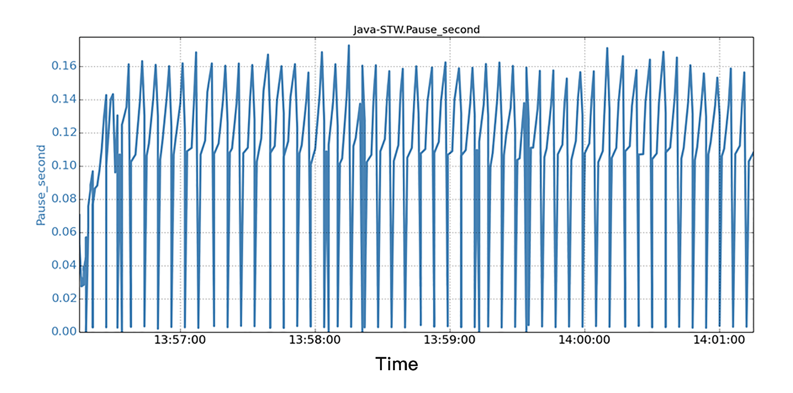
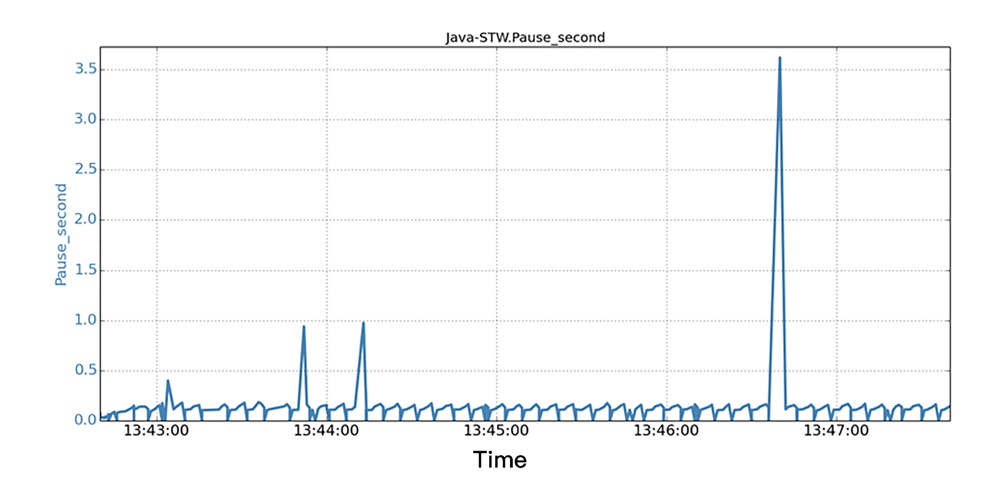
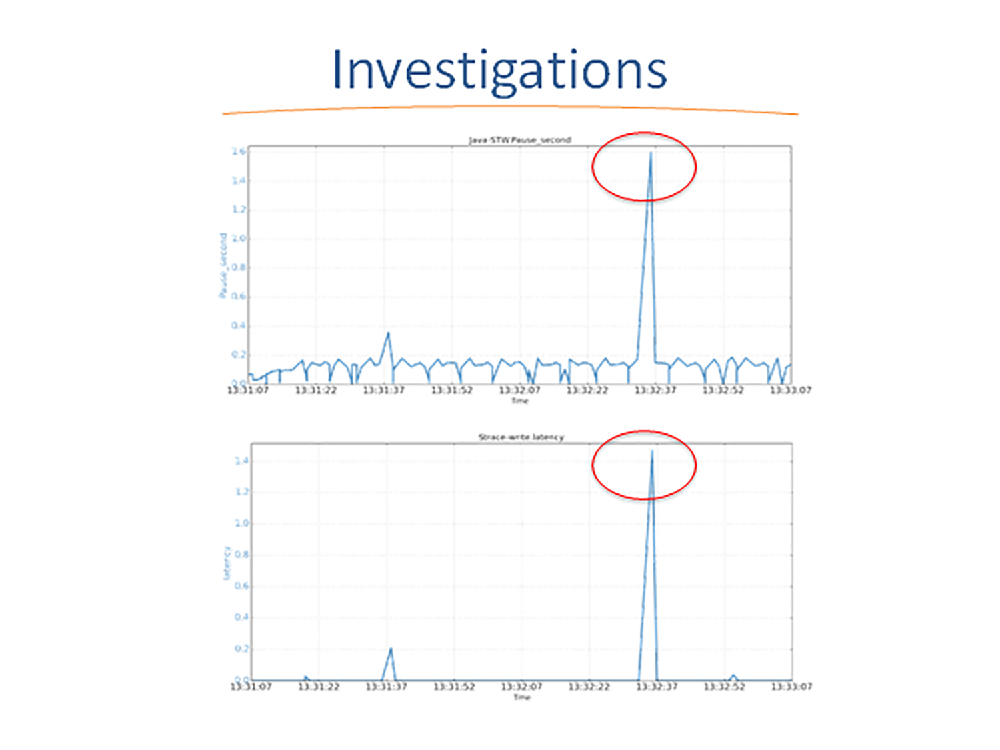
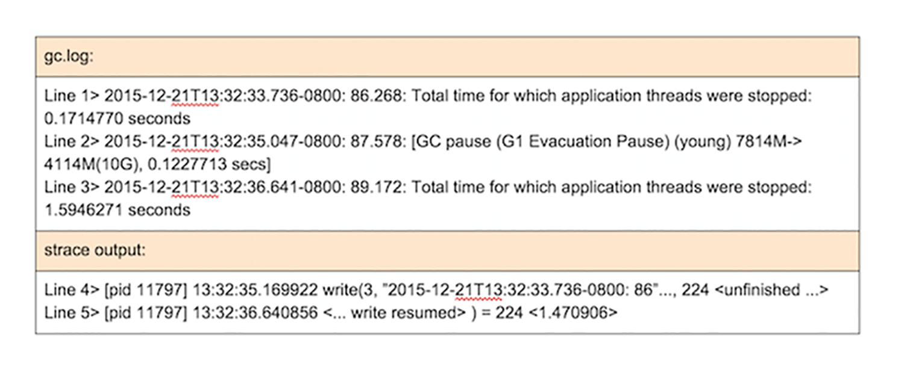
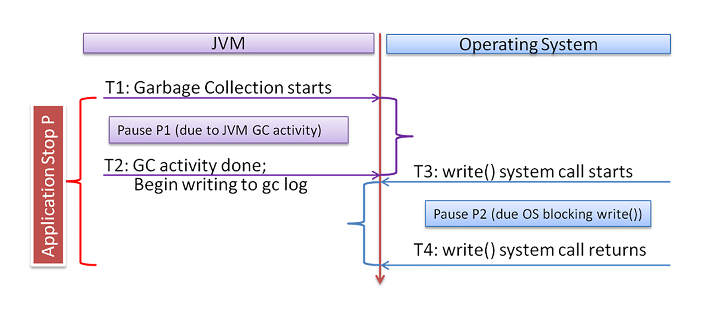
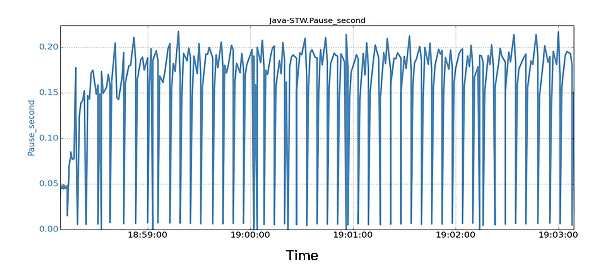
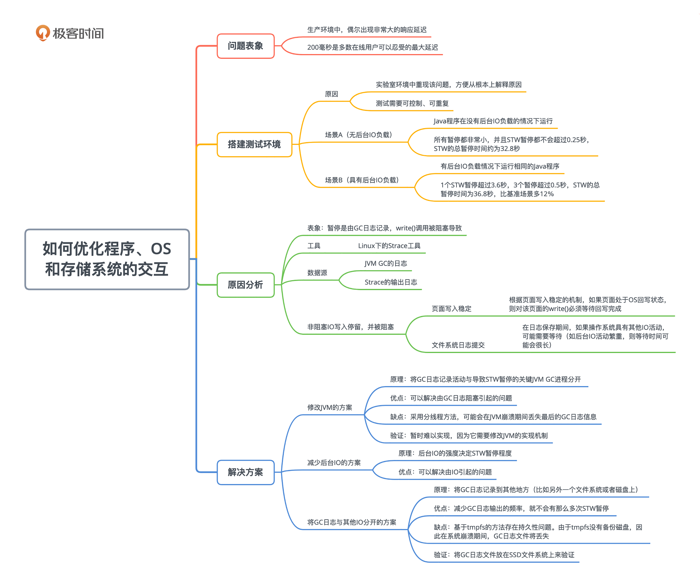

---
date: "2019-06-23"
---  
      
# 24 | 跨层案例：如何优化程序、OS和存储系统的交互？
你好，我是庄振运。

我们前面几讲介绍了性能优化的原则和策略，并且集中探讨了CPU、内存和存储三个最关键的领域。

今天我们来讲一个**比较复杂的JVM场景和超大延迟的性能问题**；这是本模块，也就是性能优化模块的最后一讲。

我们会一步步地探讨这个性能问题的表象、问题的重现、性能分析的过程和解决方案。这个性能问题的复杂性，表现在它牵扯了计算机技术的很多层次——从最上层的应用程序，到中间层JVM的机制，再到操作系统和文件系统的特性，最后还涉及到硬件存储的特点。

更重要的是，这几个层次互相影响，最后导致了平时我们不容易看到的严重性能问题——非常大的JVM卡顿。

今天我会把问题的核心和分析过程阐述清楚，而对于其他的一些背景和更多的性能数据，你可以参考我发表在[IEEE Cloud](https://ieeexplore.ieee.org/document/7820334)上的论文。

## 生产环境下偶尔很大的响应延迟是怎么回事？

我们先来看看这个性能问题的表象：就是在生产环境中，偶尔会出现非常大的响应延迟。

由于大多数互联网业务都是面向在线客户的（例如在线游戏和在线聊天），所以，确保客户相应的低延迟非常重要。各种研究也都表明，200毫秒延迟，是多数在线用户可以忍受的最大延迟。因此，确保低于200毫秒（甚至更短）的延迟，已经成为定义的SLA（服务水平协议）的一部分。

<!-- [[[read_end]]] -->

鉴于Java的普及和强大功能，当今的互联网服务中有很大一部分都在运行Java。Java程序的一个问题是JVM卡顿，也就是大家常说的STW（Stop The World）、JVM（Java虚拟机）暂停。根据我的经验，尽管我们或许已经仔细考虑了很多方面来优化，但Java应用程序有时仍会遇到很大的响应延迟。

这个STW的产生和JVM的运行机制是直接相关的。

Java应用程序在JVM中运行，使用的内存空间叫**堆**。JVM负责管理应用程序在内存里面的对象。堆空间经常被GC回收（垃圾收集），这个过程是JVM操作的。Java应用程序可能在GC和JVM活动期间停止，这就会给应用程序带来STW暂停。

这些GC和JVM活动信息很重要，根据启动JVM时提供的JVM选项，各种类型的相关信息，都将记录到GC的日志文件中。

尽管某些GC引起的STW暂停众所周知（比如JVM导致的Full GC），但是我们在生产中发现，其他因素，比如**操作系统本身，也会导致一些相当大的STW暂停**。

比如我举个例子。文中的图片就显示了一个STW暂停和GC日志，这个暂停时间超过了11秒；我就经常在生产环境中看到这样的STW暂停。

你注意一下图片中有较大的字体的那行，里面显示了User、Sys和Real的计时，分别对应着用户、系统和实际的计时。比如“Real=11.45”就表示实际的STW暂停是11.45秒钟。

在这个GC日志中，这种暂停11秒钟的STW非常讨厌，因为这样大的暂停是不能容忍的。而且这个问题很难理解，完全不能用GC期间的应用程序活动和垃圾回收活动来解释。

从日志中我们也看到，这个JVM的堆并不大，只有4GB，垃圾收集基本不会超过1秒钟。正如图中显示的那样，用户和系统时间都可以忽略不计，User和Sys的暂停时间分别是0.18秒钟和0.01秒钟，但是实际上JVM暂停了11.45秒钟！

因此，GC所做的工作量，根本无法解释如此之大的暂停值。

## 搭建测试环境重现问题

为了搞清这个问题，我们做了彻底的性能分析和各种测试。为了去掉很多其他的干扰因素，以便方便根因分析，我们首先希望**实验室环境中重现该问题**，这样就比较方便从根本上解释原因。

出于**可控制性**和**可重复性**的考虑，我们使用了自己设计的一个简单Java程序。为了方便对比，我们根据**有没有后台背景IO活动**，而测试了两种场景（这里的后台背景IO就是各种磁盘IO）。不存在后台IO的场景是基准场景，而引入后台IO的另一场景，将重现我们观测到的性能问题。

我们使用的Java程序的逻辑也很简单直白，就是不断地分配和删除特定大小的对象。程序一直在不断分配对象，当对象数目达到某阈值时，就会删除堆中的对象。堆的大小约为1GB。每次运行固定时间，是5分钟。

为了真实地模拟生产环境，我们在第二种场景中注入后台IO。 这些IO由bash脚本生成，该脚本就是不断复制很大的文件。在我们的实验室环境中，后台工作模块能够产生每秒150MB的磁盘写入负载，差不多可以使服务器配备的镜像硬盘驱动器饱和。这个应用程序和后台IO脚本的源代码在[GitHub](https://github.com/zhenyun/JavaGCworkload)上开源。

我们考虑的主要性能指标，是关于应用程序的STW暂停，具体考虑了两个指标：

1.  总暂停时间，即所有STW暂停的总暂停时间；
2.  较大的STW暂停计数和。

下面让我们一起来看看结果。

场景A是基准场景，Java程序在没有后台IO负载的情况下运行。我们在实验室环境中执行了许多次运行，得到的结果基本是一致的。

图片中显示的是一个持续5分钟的运行，就是沿着5分钟的时间线，显示了所有JVM STW暂停的时间序列数据。我们观察到，所有暂停都非常小，并且STW暂停都不会超过0.25秒。 STW的总暂停时间约为32.8秒。

场景B是有后台IO负载情况下运行相同的Java程序。在实际的生产过程中，IO负载可能来自很多地方，比如操作系统、同一机器上的其他应用程序，或者来自同一Java应用程序的各种IO活动。

在图片中，我们同样沿着5分钟的时间线，显示了所有JVM STW暂停的时间序列数据。我们发现，当后台IO运行时，相同的Java程序，在短短5分钟的运行中，看到1个STW暂停超过3.6秒，3个暂停超过0.5秒！结果是，STW的总暂停时间为36.8秒，比基准场景多了12％。

而STW总暂停时间多，也就意味着应用程序的实际工作吞吐量比较低，因为JVM多花了时间在STW暂停上面。

## 响应延迟的根本原因在哪里？

为了弄清楚STW暂停的原因，我们接着进行了深入的分析。

我们发现STW大的暂停是由GC日志记录，write\(\)调用被阻塞导致的。这些write\(\)调用，虽然以缓冲写入模式（即非阻塞IO）发出，但由于操作系统有“回写”IO的机制，所以仍然可能被操作系统的“回写”IO阻塞。

操作系统的“回写”机制是什么呢？就是文件系统定期地把一些被改变了的磁盘文件，从内存页面写回存储系统。

具体来说，当缓冲的write\(\)需要写入文件时，它首先需要写入OS缓存中的内存页面。这些内存页是有可能被“回写”的OS缓存机制锁定的；而且当后台IO流量很重时，该机制可能导致这些内存页面被锁定相当长的时间。

为了彻底查清原因，我们使用Linux下的Strace工具，来剖析函数调用和STW暂停的时间相关性。

这个图表示的是**JVM STW暂停**，和strace工具报告的**JVM进行write\(\)系统调用的延迟**。图片集中显示了一个1.59秒的JVM STW暂停的快照。

我们仔细检查了两个时间序列数据，发现尽管JVM的GC日志记录使用缓冲写入，但是GC暂停和write\(\)延迟之间有极大的相关性。

这些时间序列的相关性表明，由于某些原因，GC日志记录的缓冲写入仍然被阻塞了。

那这个原因是什么呢？我们就要通过仔细阅读分析JVM GC的日志和Strace的输出日志（如下图所示）来寻找。

让我沿着时间轴线来具体解释一下图片中的数据。

在时间35.04秒时，也就是第 2 行日志，一个新的JVM新生代GC启动，并用了0.12秒才完成。新生代GC在35.17秒时结束，并且JVM尝试发出write\(\)系统调用（第4行），将新生代GC统计的信息输出到GC日志文件。write\(\)调用被阻塞1.47秒，所以最后在时间36.64（第5行）结束，总共耗时1.47秒。当write\(\)调用在36.64返回给JVM时，JVM记录此STW暂停为1.59秒（即0.12 + 1.47）（第3行）。

这些数据表明，GC日志记录过程，恰好位于JVM的STW暂停路径上，而日志记录所花费的时间也是STW暂停的一部分。如果日志记录，也就是write\(\)调用被阻塞，那么就会导致STW暂停。换句话说，实际的STW暂停时间由两部分组成：

1.  实际的GC时间，例如，新生代GC时间。
2.  GC日志记录时间，例如，write\(\)执行时被OS阻塞的时间。

我用下图来清楚地表示它们之间的关系。

左边是JVM的活动，右边是操作系统的活动。时间T1时垃圾回收开始，T2时GC结束，并开始调用write\(\)写日志。这之间的延迟，就是GC的延迟。T3时write\(\)调用开始，T4时write\(\)调用返回。这之间的延迟，就是OS导致的阻塞延迟。所以，总的STW暂停就是这两部分延迟的和，也就是T4-T1。

那么接下来的一个很难理解的问题是：为什么非阻塞IO，还会被阻塞？！

在深入研究各种资源（包括操作系统内核源代码）后，我们意识到，非阻塞IO写入还是可能会停留，并被阻塞在内核代码执行过程中。具体原因有好几个，其中包括：**页面写入稳定**（Stable Page Writing）和**文件系统日志提交**（Journal Logging）。下面分别说明。

JVM写入GC日志文件时，首先会改变（也就是“弄脏”）相应的文件缓存页面。即使以后通过操作系统的写回机制，将缓存页面写到磁盘文件中，被改变内存中的缓存页面，仍然会由于稳定的页面写入而导致**页面竞争**。

根据页面写入稳定的机制，如果页面处于OS回写状态，则对该页面的write\(\)必须等待回写完成。这是为了避免将部分全新的页面保留到磁盘（会导致数据不一致），来确保磁盘数据的一致性。

对于日志文件系统，在文件写入过程中会生成适当的日志。当附加到GC日志文件，而需要分配新的文件块时，文件系统需要首先将日志数据保存到磁盘。在日志保存期间，如果操作系统具有其他IO活动，则可能需要等待。如果后台IO活动繁重，则等待时间可能会很长。

## 解决方案如何落地？

我们已经看到，由于操作系统的各种机制的原因，包括页面缓存写回、日志文件系统等，JVM可能在GC日志期间，被长时间阻塞。

那么怎么解决这个问题呢？

我们思考了三种方案可以缓解这个问题，分别是：

1.  修改JVM；
2.  减少后台IO；
3.  将GC日志记录与其他IO分开。

修改JVM是将GC日志记录活动，与导致STW暂停的关键JVM GC进程分开。这样一来由GC日志阻塞引起的问题就将消失。

比如JVM可以将GC日志放到另一个线程中，该线程可以独立处理日志文件的写入，也就不会造成另外一个应用程序线程的STW暂停。这个方案的缺点是，采用分线程方法，可能会在JVM崩溃期间丢失最后的GC日志信息。

第二种方案是减少后台IO。

后台IO引起的STW暂停的程度，取决于后台IO的强度。因此，可以采用各种方法来降低这些IO的强度。比如在JVM应用程序运行的服务器上，不要再部署其他IO密集型应用程序。

第三种方案是将GC日志与其他IO分开。

对延迟敏感的应用程序，例如为交互式用户提供服务的在线应用程序，通常无法忍受较大的STW暂停。这时可以考虑将GC日志记录到其他地方，比如另外一个文件系统或者磁盘上。

比如这个文件系统可以是临时文件系统（tmpfs，一种基于内存的文件系统）。它具有非常低的写入延迟的优势，因为它不会引起实际的磁盘写入。但是，基于tmpfs的方法存在持久性问题。由于tmpfs没有备份磁盘，因此在系统崩溃期间，GC日志文件将丢失。

而另一种方法是将GC日志文件放在更快的磁盘上，例如SSD。我们知道，就写入延迟和IOPS而言，SSD具有更好的IO性能。

## 如何证明解决方案是否有效？

得出方案后，我们就需要对它们进行验证了。

在我们提出的三种方案中，第一种方案，也就是改进JVM，是暂时难以实现的，因为它需要修改JVM的实现机制。第二种方案呢，是不言自明。如果没有背景IO或者有较少背景IO，那么自然背景IO的影响就变小了；或者减少GC日志输出的频率，就不会有那么多次STW暂停了。

因此，我们这里直接来验证第三种方案：将GC日志记录与其他IO分开。

我们的方法，是将GC日志文件放在SSD文件系统上来验证这种方案。我们运行与前面实验场景中相同的Java应用程序和后台IO负载。下图中显示了一个5分钟运行时段的所有STW暂停和相应的时间戳。

对于STW暂停的信息，我们注意到所有的JVM的暂停都非常小，所有暂停都在0.25秒以下。可以说，延迟暂停方面的性能，得到了很大的提高，这表明，如果这样分开GC日志文件，即使有很大的后台IO负载，也不会导致JVM程序发生较大的STW暂停；这样的结果也就验证了这一方案的有效性。

## 总结

今天我们探讨了一个跨层的性能分析和优化案例。由于计算机几个层面的技术互相影响，实际生产环境中，会出现非常大的响应时间延时，严重影响公司业务。这些层面包括应用程序、JVM机制、操作系统和存储系统。

我们通过合理的性能测试和性能分析，包括搭建合适的测试环境进行问题重现、详细的根因分析，最终提出了几种解决方案。简单来说，就是JVM在GC时会输出日志文件，写入磁盘时会因为背景IO而被阻塞。把日志文件和背景IO分开放在不同磁盘，从而让它们互相不影响的话，就能大幅度降低STW延迟。

从这个案例我们也可以再次了解，从事性能优化工作需要通晓几乎所有层面的知识。而且不光要知识面广，还要能深入下去，才能进行彻底的根因分析。

唐代诗人刘禹锡有一首诗说：“莫道谗言如浪深，莫言迁客似沙沉。千淘万漉虽辛苦，吹尽狂沙始到金。”对待这样复杂的性能问题，我们也需要不怕困难，不惧浪深沙沉。因为只有经过千淘万漉的辛苦，才能淘到真金，发现问题的本质并彻底解决它。

## 思考题

既然这个问题是Java应用程序偶尔发生大延迟，原因是JVM垃圾回收GC的Log日志，写到硬盘的文件系统引起的，我们如何可以让JVM把GC日志写到内存去吗？

> Tips：考虑一下JVM参数。

欢迎你在留言区分享自己的思考，与我和其他同学一起讨论，也欢迎你把文章分享给自己的朋友。