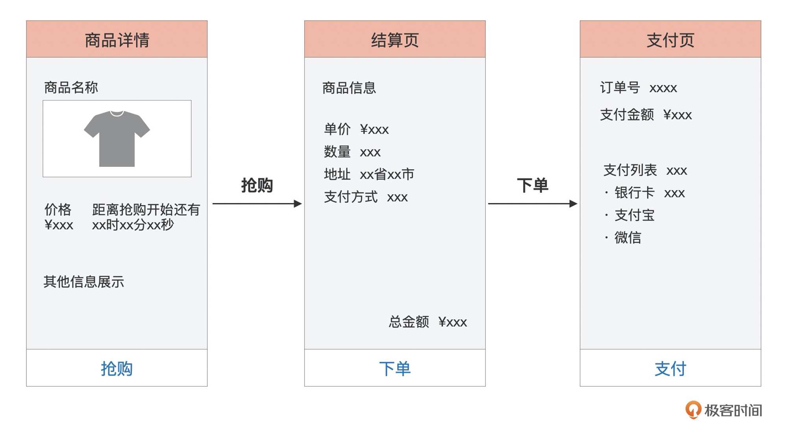
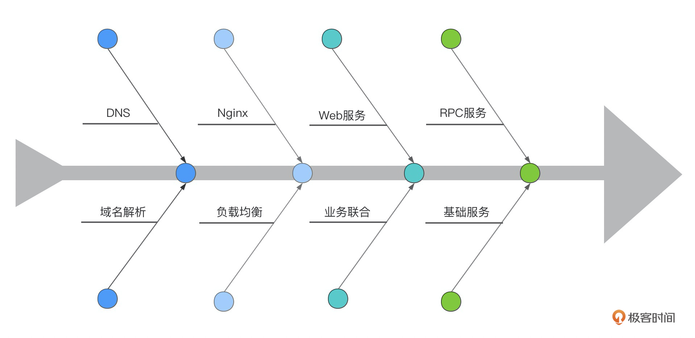
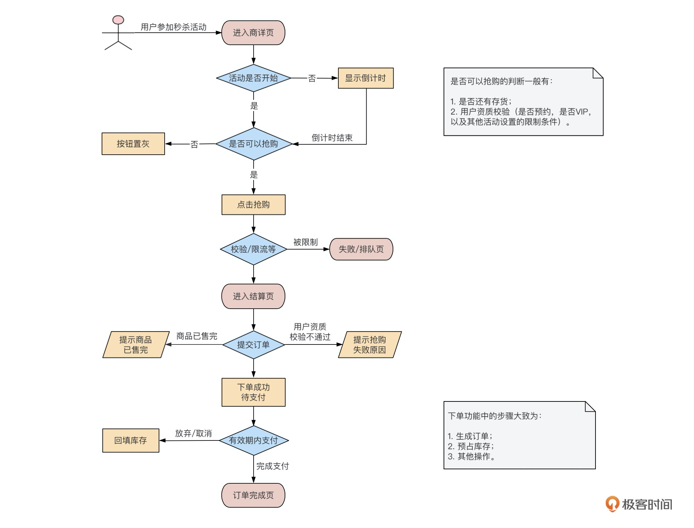
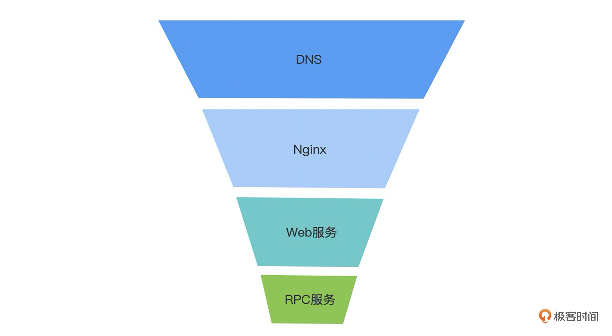

---
date: "2019-06-23"
---  
      
# 01｜直面痛点：秒杀系统的挑战和设计原则
你好，我是志东，欢迎和我一起从零打造秒杀系统。

每年的618、双11都是电商平台的狂欢日，各种营销活动、营销方式层出不穷，而秒杀就是其中最重要的手段之一。飞天茅台、华为手机、高端显卡等热门商品的抢购活动，即使你没有抢过，也或许听过，这就是秒杀带来的影响力。用具有价格优势的稀缺商品，来增加电商平台的关注度，带来空前的流量，进而可以为平台的拉新带来新助力，如果再辅以其他营销手段，比如抢购资格限制VIP等，那么这又是一笔可观的创收。

所以在当下这个流量为王的网络时代，能够提供秒杀的营销手段，就显得异常重要，这也是我们为什么需要做秒杀系统。

当然，实现一个秒杀系统也并不是那么容易的事，要考虑的点有很多。比如，我们首先要知道秒杀活动的业务特点，其次是要清楚秒杀系统的请求链路，这样才能根据其特点，针对请求链路中可能存在的瓶颈点做优化与设计。除此之外还有很多其他问题，我会在之后的课程中一一详解。

那么作为专栏的第一课，为了让你对秒杀系统有一个整体的认知，接下来我们就综合看一下当下秒杀系统都存在哪些挑战，以及所要遵循的设计原则，这些可以为我们后面的实战打下一个很好的基础。

## 秒杀怎么玩

我先简单介绍下秒杀业务具体是怎么玩的。

<!-- [[[read_end]]] -->

通常情况下，平台商家会拿出稀缺商品，事先在秒杀的运营系统中设置好活动的开始、结束时间，以及投入的库存（简单的玩法，只要这几个主要元素即可）。在活动开始之后，用户可以通过活动抢购入口（一个商品详情页，或是一个广告链接），进入到活动的结算页，然后点击下单，完成商品的抢购操作，整个过程如下：

这种方式通用性很强，可以适配大部分的平台。当然如果想对流量有个预期上限，方便做备战工作，那么你可以加上预约功能，即在活动开始前，先开放一段时间的预约，让用户先去进行预约，然后才能获得参加抢购活动的资格。

如果面对的业务场景复杂些，你还可以联合风控，在参加活动时校验用户资质，踢掉黄牛以及有过不良行为的人，尽量将资源给到优质用户。

那么如果业务再复杂些呢？可以搭配限购开展活动，控制个人维度下一段时间内的购买数，让抢购成功的快乐触达更多的人。

以上列举的各种组合使用场景，你都可以根据自己的实际情况灵活变通，或者开拓思维创造属于自己独特的秒杀玩法。其实在电商大行其道的今天，大部分玩法已经比较通用了，相信这些方式你也都参与过。

秒杀系统还是很美好的，可怎么样才能实现它呢？

## 秒杀系统的挑战

首先，我们得直面以下的这些挑战。

### 巨大的瞬时流量

秒杀活动的特点，就是将用户全部集中到同一个时刻，然后一起开抢某个热门商品，而热门商品的库存往往又非常少，所以持续的时间也比较短，快的话可能一两秒内就结束了。

这种场景下，高并发产生的巨大瞬时流量，首先会击垮你服务的“大门”，当“大门”被击垮后，外面的进不来，里面的出不去，进而造成了整个服务的瘫痪；退一步说，即便你保住了大门，进来的流量如果不加以管控，任凭其横冲直撞，也会对依赖的基础设施服务造成毁灭性打击；再退一步说，即使我们的系统没有被摧毁，在机器资源的高负载下，整个请求链路的响应时间也会跟着拉长，这样就会大大降低用户的抢购体验，紧接着就会是蜂拥而来的客诉。本想通过秒杀活动带来正面影响，但结果可能恰恰相反。

我记得京东最开始用秒杀系统售卖口罩时，就出现过类似的问题。技术团队内部事前没有沟通充分，导致准备不足，大家谁也没有预料到活动商品会成为爆品，以致最终的用户抢购体验很差。当然了这也不限于京东，相信每逢大促把瞬时流量测试列为重中之重的平台还是非常多的。

### 热点数据问题

高并发下一个无法避开的问题，就是热点数据问题。

特别是对于秒杀活动，大家抢购的都是同一个商品，所以这个商品直接就被推到了热点的位置，不管你是用的数据库，还是分布式缓存，都无法支持几十万、上百万对同一个key的读写，以Redis的写为例，最高仅可支持几万的TPS。像商品库存的控制，就会有这个问题。

### 刷子流量

当你的系统被刷子盯上，那说明你的秒杀系统已经有了很大的影响力了。一般我们提供的秒杀对外服务，都是HTTP的服务。不管你是用H5实现的页面，还是通过安卓或是iOS实现的原生页面，特别是H5，都可以直接通过浏览器或是抓包工具拿到请求数据，这样刷子便可以自己通过程序实现接口的直接调用，并可以设置请求的频率。

这样高频次的请求，会挤占正常用户的抢购通道，同时，刷子也获得了更高的秒杀成功率。这不仅破坏了公平的抢购环境，也给系统服务带来了巨大的额外负担。

其实总结来说，瞬时的大流量就是最大的挑战，当业务系统流量成几何增长时，有些业务接口加机器便可以支持。但考虑到成本与收益，在有限的资源下，如何通过合理的系统设计来达到预期的业务目标，就显得格外重要了。

## 秒杀系统如何设计

清楚了秒杀系统所面临的挑战，接下来我们就可以考虑如何应对了。所谓知己知彼，百战不殆。在设计系统之前，我们不妨先来看下，一次HTTP请求所经过的链路路径：

这是一个比较宏观的图谱，如果我们提供的是一个HTTP服务，那么每个客户端请求进来都要经过这些链路，而每个链路节点的作用又是什么呢？我们逐一看下。

**DNS**：负责域名解析，会将你的域名请求指定一个实际的IP来处理（事先配置好处理请求的IP，DNS按顺序指定），并且一般客户端浏览器会缓存这个IP一段时间，当下次再请求时就直接用这个IP来建立连接，当然如果指定的IP挂了，DNS并不会自动剔除，下次依然会使用它。

**Nginx**：也就是上面的被DNS指定来处理请求的IP，一般都会被用来当做反向代理和负载均衡器使用，因为它具有良好的吞吐性能，所以一般也可以用来做静态资源服务器。当Nginx接收到客户端请求后，根据负载均衡算法（默认是轮询）将请求分发给下游的Web服务。

**Web服务**：这个就是我们都比较熟知的领域了，一般我们写业务接口的地方就是这了，还有我们的H5页面，也都可以放到这里，这里是我们做业务聚合的地方，提供页面需要的数据以及元素。

**RPC服务**：一般提供支撑业务的基础服务，服务功能相对单一，可灵活、快速部署，复用性高。RPC服务一般都是公司内部服务，仅供内部服务间调用，不对外开放，安全性高。

在了解了一次请求所经过的链路节点后，接下来我们再看下，在用户的一次抢购过程中，每次和系统的交互都要做什么事情。

结合上图来看，商详页部分和支付页部分，对于一般平台来说，都是通用板块，而从“点击抢购”开始到“下单成功待支付”，这一段是属于秒杀系统的业务范畴，在这里我们梳理下，有哪几件事情是需要秒杀系统来做的。

**1.提供活动数据**：提供参加秒杀活动的商品信息，主要用于商详页判断活动的倒计时、开始、结束等页面展示和抢购入口校验。

**2.提供结算页**：如果把秒杀做成一个单独业务模块，可跨平台（安卓、PC、iOS）嵌入，那么就需要提供一整套服务，包括H5页面，主要用于展示商品的抢购信息，包括商品名称、价格、抢购数量、地址、支付方式、虚拟资产等等。

**3.提供结算页页面渲染所需数据**：包括用户维度的地址、虚拟资产等数据，活动维度的名称、价格等数据。

**4.提供下单**：用户结算页下单，提供订单生成或是将下单数据透传给下游（如果平台有通用的订单接入接口）。

当然在这中间，还有个隐形的，但却是非常重要的核心能力，那就是做**流量的精细化筛选**，尽量确保传给下游接口的流量，都是优质请求。

以上，我们了解了HTTP请求所经过的链路，也总结了秒杀系统所需要提供的能力，那么接下来，我们就可以着手做秒杀系统的设计了。

对于系统的设计，有一些基本的原则，比如校验前置、分层过滤，再结合我们上面的链路路径图，效果如下所示：

一般我们会在**DNS层**做一些和网络相关的防攻击措施，公司的网络安全部门有统一的一些配置措施，这层我们无法写业务，但是可以拦截一些攻击请求。

接下来到**Nginx层。**Nginx不仅可以作为反向代理和负载均衡器，也可以做大流量的Web服务器，同时也是一款非常优秀的静态资源服务器。如果把业务校验也放到这里来，就可以实现校验前置的原则了吗？

Nginx+Lua说，没问题。这时候可能你会有顾虑，Nginx担负了那么多任务，会被拖垮吗？不会，因为Nginx很强大，能力越大，责任越大。那么Nginx为什么比Apache服务更强大呢？第1课我们留个悬念，后面会讲。

接下来就到了**Web服务**了。我们在这里做业务的聚合，提供结算页页面渲染所需要的数据以及下单数据透传，同时也负责流量的筛选与控制，保证下游系统的安全。

最后就是**RPC服务。**它提供基础服务，一般经过上面3层的严格把关，到这里的请求，量已经小很多了，我们写业务逻辑，在技术上也有更多的发挥空间。

## 小结

想要设计秒杀系统，首先得了解秒杀，包括业务和技术层面。从业务上来说，我们了解到秒杀一般适用于稀缺商品的售卖，能够聚集人气，可以给平台带来关注度和流量。同时配合秒杀的营销手段也有很多种，可以结合预约、限购、风控等功能模块开展活动，以应对不同的业务场景。此外，我们也归纳了秒杀需要提供的能力，即活动数据、活动结算页、活动提单等能力。

从技术层面上来说，我们需要了解HTTP服务的请求链路路径，即请求从DNS到Nginx，Nginx处理后分发给Web服务，Web服务再聚合调用下游的RPC服务。每个链路节点都有它擅长做的事情。只有清楚了这些，我们才能够将秒杀系统提供的业务功能，按不同阶段、不同响应，合理地拆分到不同的链路层级来实现，以符合我们校验前置、分层过滤、缩短链路的设计原则，并能够从容应对秒杀系统所面临的瞬时大流量、热点数据、黄牛刷子等各种挑战。

当然，这只是第一步，在接下来课程中，我们将实际开发一个秒杀系统，并将我以往在实际生产中遇到的问题以及积累的各环节优化技术，一一分享。

## 思考题

这节课我们介绍了秒杀系统面临的挑战，除了重点介绍的瞬时流量以外，你觉得对秒杀系统而言，还有哪些方面也是比较重要的呢？我们又该通过怎样的设计来解决呢？

以上就是这节课的全部内容，欢迎你在评论区和我讨论问题，交流经验！