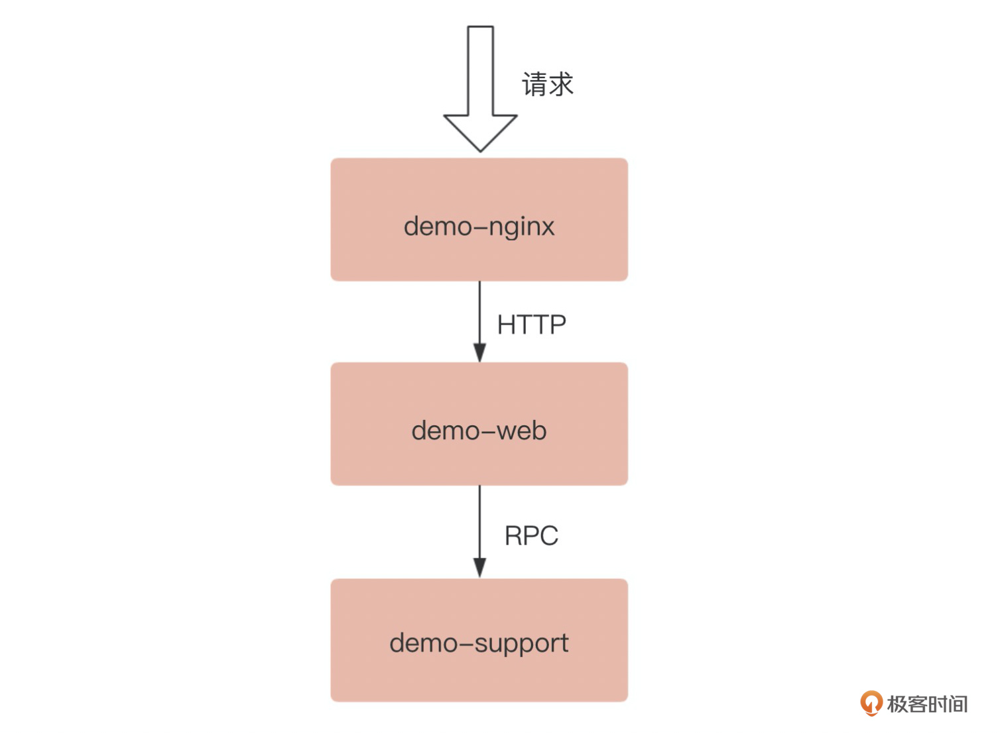
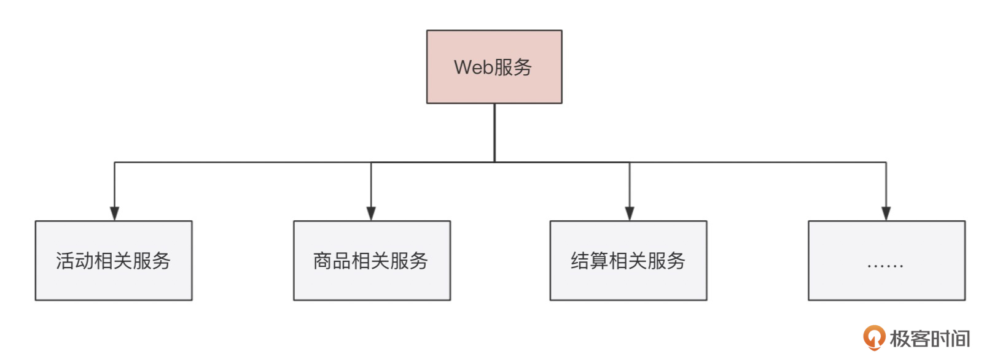
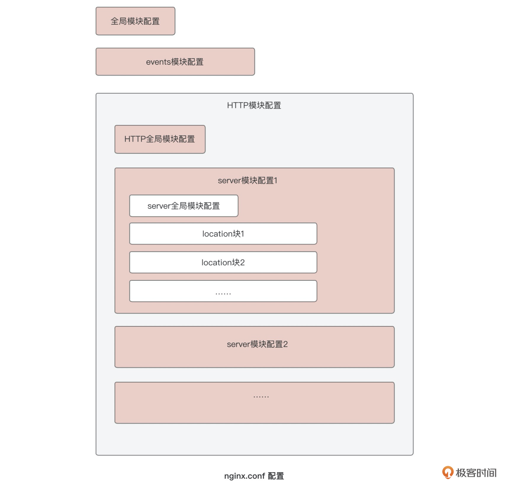
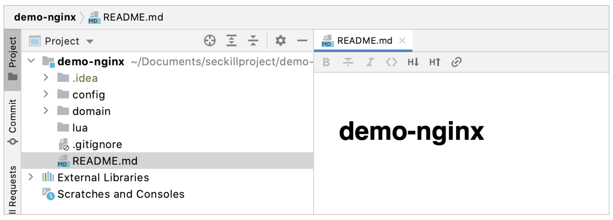
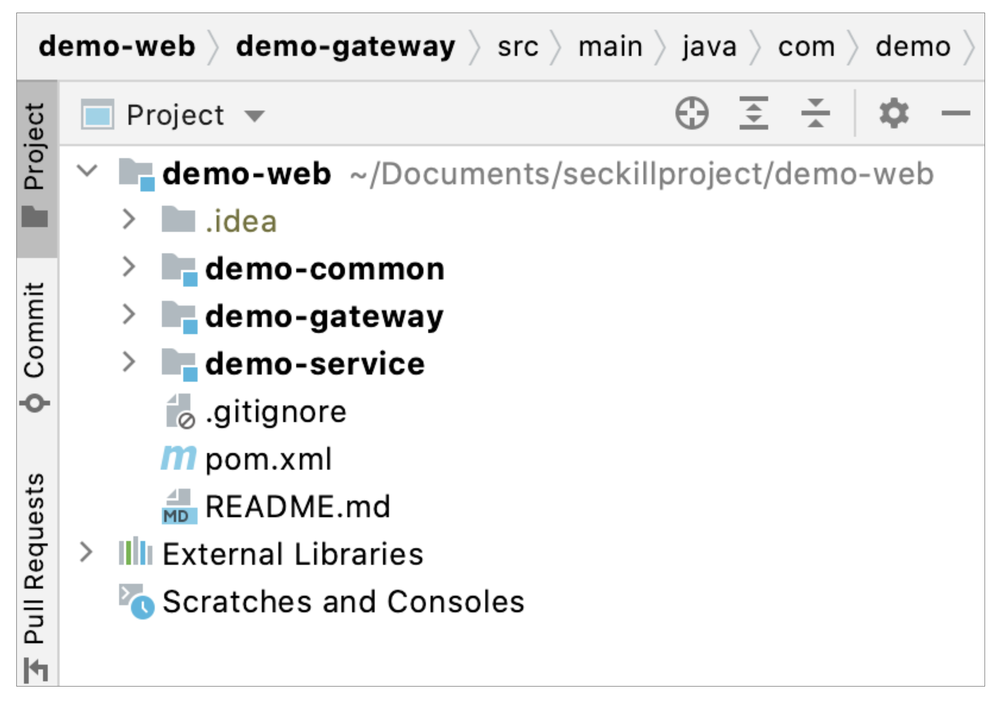
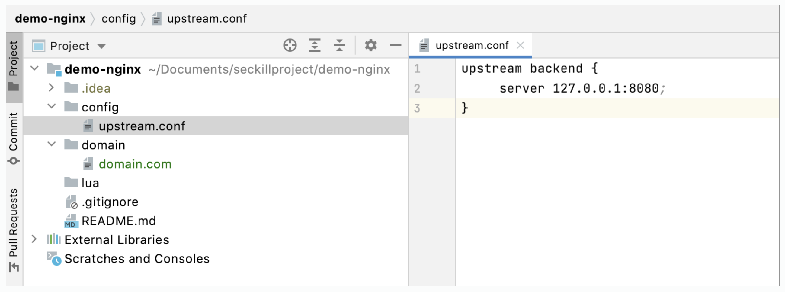
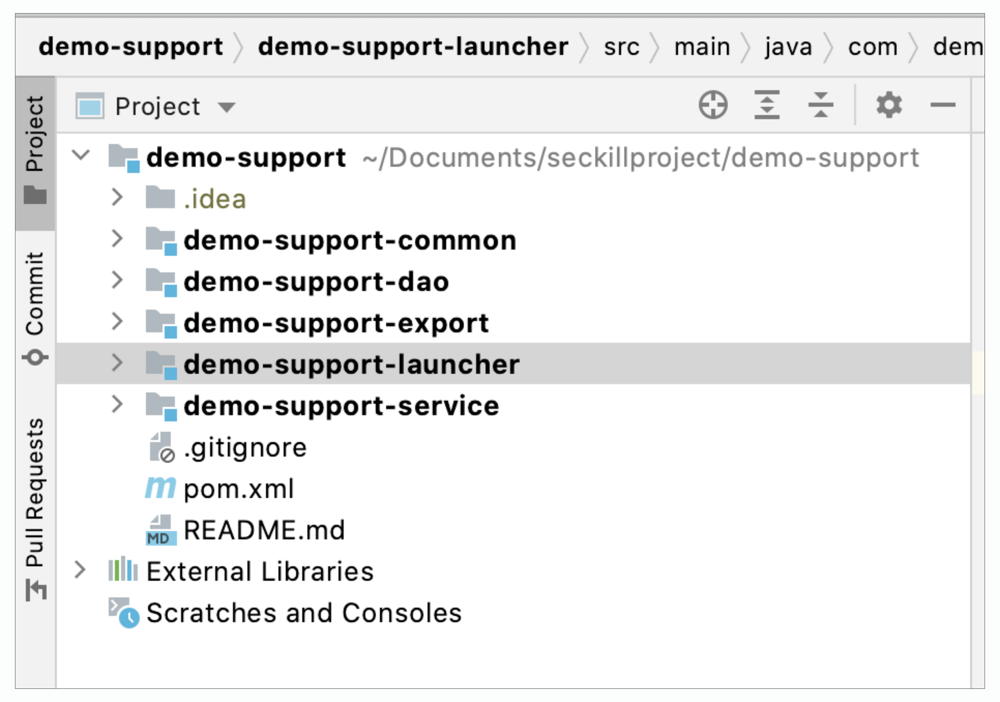
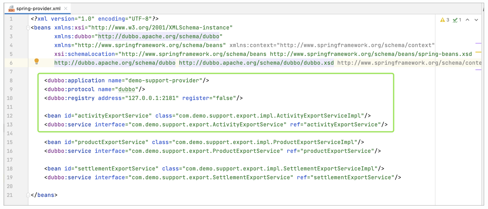
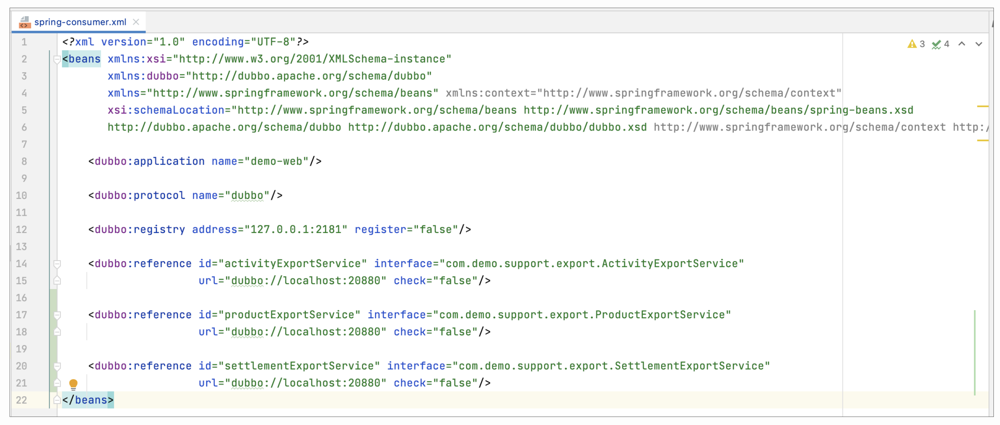
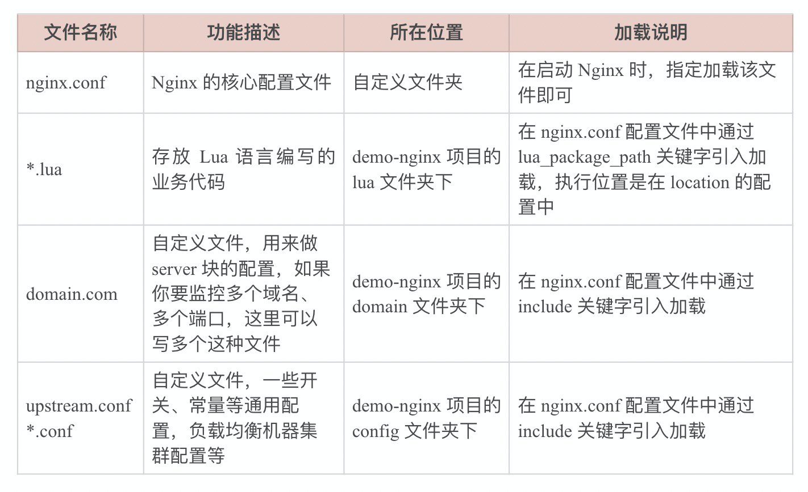

---
date: "2019-06-23"
---  
      
# 03 | 指日可待：一步一步搭建秒杀系统（上）
你好，我是志东，欢迎和我一起从零打造秒杀系统。

在上一节课中我们搭建了本地的依赖环境，这节课我们将依据前篇中做的技术选型，继续搭建我们的开发项目，并在我们搭建好的项目上，**开发一个最简的秒杀系统**。

这个系统模拟通过商详页，进入到结算页，可以展示商品图片、名称、价格等；其次支持输入地址、选择支付方式、修改购买数量等操作行为；然后提交订单；最后在下单成功后模拟跳转到支付页。

麻雀虽小，五脏俱全，这些基本上涵盖了秒杀的整个流程，只不过大平台的结算元素更丰富，也有更多的分支操作，但这些都可以在我们的基础上，按照专栏中介绍的一些原则，进行增减。

整个项目的搭建和秒杀业务系统的具体实现还是比较复杂的，所以我们将分成两节课来完成。这节课我们主要是搭建项目，那么话不多说，我们直接开始吧。

## 职能划分

根据前面我们对秒杀业务做的分析可知，要实现秒杀业务，我们最少需要3个系统服务：

* 一个是Nginx服务，我们命名为demo-nginx；
* 再一个是Web服务，我们称其为demo-web；
* 最后一个是RPC服务，我们就叫它demo-support。

3个项目的关系如下图所示：



3个项目的目标职能划分这里我也详细介绍一下。

**首先是demo-nginx，主要负责：**

<!-- [[[read_end]]] -->

* 流量筛选：根据黑白名单、登录态和参数有效性等来筛选流量。
* 流量分发：通过设置的负载均衡算法进行流量分发，也可以自定义算法，比如根据IP做hash，或者根据用户ID做hash等。
* 简单业务以及校验：提供活动数据、活动有效性校验、库存数量校验和其他业务相关的简单校验等。
* 限流：根据IP或者自定义关键入参做限流。
* 异常提示页面：主要是进结算页失败的提示页，可能是被限流，被业务校验拦截或者是后端服务异常等。

**其次是demo-web，主要负责：**

* 提供结算页H5。

提供结算页的HTML，或者是重定向到CDN上的结算页H5地址。这里你肯定要问，为什么不把这个功能前置到Nginx服务，那样不是可以更快地返回吗？

这里主要考虑到一个上线灰度发布的问题。你有没有想过，如果秒杀上线后，在后续的需求版本迭代中，我们页面新增了一个功能，该功能需要调用一个新的接口，我们该如何制定发布计划，来确保上线的安全以及不影响线上用户的使用体验呢？

我们可以选择全量上线，但这么做的后果就是一旦出现我们测试未覆盖到的业务场景而引发了线上事故，那么就会影响到全部的用户，这对我们来说是不可接受的，所以上线还得采取灰度发布的方式。

**那什么是灰度发布呢？**

大多数同学应该有所了解，这里我只简单讲一下灰度发布的做法与目的。一般我们新功能上线，都不是一下子全量上线，而是有计划地逐步灰度上线，即先上1台或几台服务线上观察，如果有问题，马上回滚。这样做的好处是，如果真的出现问题，那么受影响的流量也只有灰度的那些机器。也就是说，如果你线上有1000台服务，你上一台灰度，那么受影响的流量也只有千分之一。这个做法最大限度地降低了事故的影响面。

但采用灰度发布的方式又会带来新的问题，即用户点击抢购进入到了新页面，新页面调用新接口，但如果这个请求打到了旧的服务器上，没有新的接口，那岂不是就报错了？

这里你不妨主动思考下：怎么确保灰度上线情况下，使同一个用户进入到新页面所发出的请求也能够打到新的接口服务上。


* 业务聚合接口：提供结算页H5渲染页面所需数据，以及提供用户行为操作所需接口，比如下单等。
* 其他功能：部分关键接口的限流，以保证下游接口的安全。

**最后是demo-support，主要负责：**

提供基础服务、数据的支持，包括活动数据、商品数据、用户维度数据、提单等，主要模拟基础服务，正常情况下，应该是按业务模块做细致划分的，如下图所示：



这里我们为了开发方便，就全部集成到一个demo-support服务里了。

## 项目搭建

现在，我们确定了项目服务职能范围，也做了相关的命名，下面就可以做项目的搭建了。

但在开始之前我要简单说明下：在后面的项目搭建以及后续的开发中，对涉及到demo-nginx项目的配置或Lua语法等我会多讲一些，这部分可能大家都比较陌生，而对于demo-web、demo-support项目的一些常用配置，则会稍加精简，因为大家会比较熟悉，特别的地方会再重点说明。

以下除了demo-nginx项目外，你在搭建项目时都可以通过自己熟悉的技术栈来实现，只需要让目标系统达到我们所希望它具备的能力即可，技术不限。

### **demo-nginx项目搭建**

这个项目主要是用Lua语言开发，在上节课中我们安装了OpenResty，本地创建的nginx.conf文件的路径在 \~/Documents/seckillproject/nginx/conf/nginx.conf，这个是Nginx服务配置的核心文件，Nginx启动就是根据这个配置来做一些初始化工作的。

一个nginx.conf文件的正常配置结构如下图所示：



这里的“全局模块配置”“events模块配置”，以及HTTP模块配置中的“HTTP全局模块配置”，都是直接配置在nginx.conf中，属于核心配置。而“server模块配置”以及下面的“location块”配置都是我们写业务逻辑的地方，比较灵活，所以写到我们的demo-nginx项目中，并通过Nginx的include关键字将对应的路径在nginx.conf中的“HTTP模块配置”里引用进来。

这里先粗略地介绍一下各个模块的作用：

* **全局模块配置**：这里一般配置Nginx的进程数、日志目录与级别、CPU绑核等。
* **events模块配置**：主要配置Nginx使用的工作模型，进程连接数限制等；
* **HTTP模块配置**：这里就是处理HTTP请求的相关配置，包括监控的域名、端口、URL以及业务代码的配置引用等。

那么在了解了项目的基本结构之后，我们就开始动手搭建吧。

**第一步：**我们先在本地创建一个demo-nginx项目，这里我用的开发工具是IDEA，如下图所示：



这里我创建了三个文件夹，依次是config、domain、lua。其中，config文件夹是用来存放一些常用配置的，像一些常量配置和负载均衡配置等；domain文件夹主要是用来存放“HTTP配置”中的server模块配置文件；lua文件夹则主要用来存放用Lua语言编写的业务逻辑代码文件。

**第二步：**在domain文件下，新增domain.com文件，用来配置server和location。

**第三步：**修改我们的nginx.conf文件，引入刚刚新建的domain.com文件以及lua文件夹下即将要写的.lua文件。nginx.conf内容修改如下：

```
    worker_processes 1; #工作进程数
    error_log logs/error.log error;#日志路径  日志级别
    events {
    	worker_connections 256;#单进程最大连接数
    }
    http {
    	lua_package_path "~/Documents/seckillproject/demo-nginx/lua/?.lua;;";
    	include ~/Documents/seckillproject/demo-nginx/domain/domain.com;
    }
    

```

这里lua\_package\_path 的功能是导入项目中的 .lua文件。Include 是导入一些server模块配置文件，就像在HTML里引用JavaScript一样。

**第四步：**配置server和location，这里先只简单配置一个监控端口，以及一个请求的匹配URL，简单输出“hello world”，配置内容如下：

```
    server {
        listen 7081;
        location /sayhello {
            default_type text/plain;
            content_by_lua_block {
                ngx.say("hello world!!!")
            }
        }
    }
    

```

**第五步：**启动Nginx。还记得Nginx的命令吗？不记得可以回头看看我们之前搭建OpenResty时教的。启动Nginx之后，在终端或者浏览器输入请求地址，就可以看到输出结果了，如下图所示：


这样我们的demo-nginx项目就搭建完成了，剩下的就是填充配置与业务逻辑的开发了。

现在让我们马不停蹄，继续下一个项目的搭建。

### **demo-web项目搭建**

因为demo-web项目提供的是HTTP接口，所以我们的基础框架使用的是SpringMVC，新建了一个maven项目，命名为demo-web，并且新建了3个子module，分别是demo-gateway，demo-common，demo-service。

其中demo-gateway主要负责对外HTTP接口定义，以及SpringMVC相关文件配置，并且也是要打包部署的module；demo-service主要用来做业务逻辑处理；demo-common用来放一些公用方法或者工具类等。

整体项目结构如下图所示：



之后进行SpringMVC相关配置，配置完成后，可以自己写个controller，测试一下是否搭建成功，这里因为都是大家比较熟悉的领域，所以就不做过多赘述了。

当demo-web项目搭建完成后，就可以和我们之前搭建的demo-nginx项目联动一下了，即请求先到Nginx，被其配置的location拦截，经过处理后将其分发给demo-web。所以接下来我们需要对demo-nginx做一些修改。

**第一步：**在config文件夹，新建upstream.conf的配置文件，用来配置打到后端Web服务器的IP和端口号。如果是线上，这里可以配置服务器集群，内容如下：

```
    upstream backend {
    	 server 127.0.0.1:8080;
    }
    

```

其中upstream是Nginx关键字，backend是自定义名称。我们了解的Nginx的负载均衡功能，就是在这里配置的。修改后的项目结构如下图所示：



**第二步：**修改domain.com的server配置文件，新增proxy\_pass配置项。意在将请求分发给后端服务器，其中backend就是我们在第一步中自定义的名字，如代码第5行所标：

```
    server {
    	listen 7081;
    	location /sayhello{
    	    default_type text/plain;
            proxy_pass http://backend;
    	}
    }
    

```

**第三步：**在nginx.conf中，将upstream.conf文件加载进去。

```
    	worker_processes 1;
    	error_log logs/error.log error;
    	events {
    	    worker_connections 256;
    	}
    	http {
    	    lua_package_path "~/Documents/seckillproject/demo-nginx/lua/?.lua;;";
    	    include ~/Documents/seckillproject/demo-nginx/domain/domain.com;
    	    include ~/Documents/seckillproject/demo-nginx/config/upstream.conf;
        }
    

```

**第四步：**demo-nginx修改完成后，我们在demo-web新建一个controller，并启动。这里就要重点说明一下了，Nginx配置的location URL需要和demo-web中定义的controller下对应的方法mapping保持一致，不然两者是串不起来的。

准备完成后，我们来启动一下Nginx，在浏览器输入请求URL：<http://localhost:7081/sayhello>，你就会看到预期结果，这里就不展示截图了。

到这里，我们的demo-nginx与demo-web两个项目就可以串联起来工作了。现在就只剩下一个demo-support项目了，我们马上着手搭建它。

### **demo-support搭建**

可以参考刚刚的步骤与配置。首先新建demo-support项目，然后新建5个子module，如下图所示：



* demo-support-common：存放一些基本的工具方法或者常量等。
* demo-support-dao：持久层，主要存放数据库相关的SQL文件、实体、操作方法。
* demo-support-export：对外接口定义层，主要定义提供的RPC接口方法以及实体等。
* demo-support-service：业务逻辑层。
* demo-support-launcher：项目文件配置、监控、拦截器等，同时也是打包部署module。

这里也同样不做过多的讲解，你最终搭建起来项目，使其能够操作数据库，并能够提供RPC服务即可。这里特别说明一下，就是在集成RPC框架Dubbo时，因为是本地服务间调用，所以不需要注册中心，像下面这样配置即可，线上再正常配置。

  


## 小结

在这节课中我们为了开发一个最简的秒杀系统，设计了3个系统项目：一个是demo-nginx，用来做真正的网关入口；另一个是demo-web，用来做业务的聚合；最后一个是web-support，用来做基础数据和服务的支撑。

同时我们给每个项目做了比较明确的职能划分，然后按照顺序依次搭建起了3个项目。

在这3个项目中，我们着重介绍了demo-nginx项目的搭建，其他两个因为是大家比较熟悉的内容，所以就没有做太多着墨。

由于在上节课的OpenResty搭建和这节课的demo-nginx搭建教学里，一共出现了好几个和Nginx相关的文件，在这里我们做个归纳总结，以防你混淆。



通过表格，我们可以更清楚明了地看到这些文件的作用。同时到这里，我们的所有依赖环境和项目都已经准备就绪了，那么下节课我们将正式开始秒杀业务代码的编写，来实现我们课程开头设定的小目标。

## **思考题**

课程中布置过的一道思考题：H5在做灰度上线时，如何让新版本的页面请求始终打到新的灰度机器，而老页面的请求始终打到旧版本的服务上，两者不出现交叉呢？


以上就是这节课的全部内容，欢迎你在评论区和我讨论问题，交流经验！