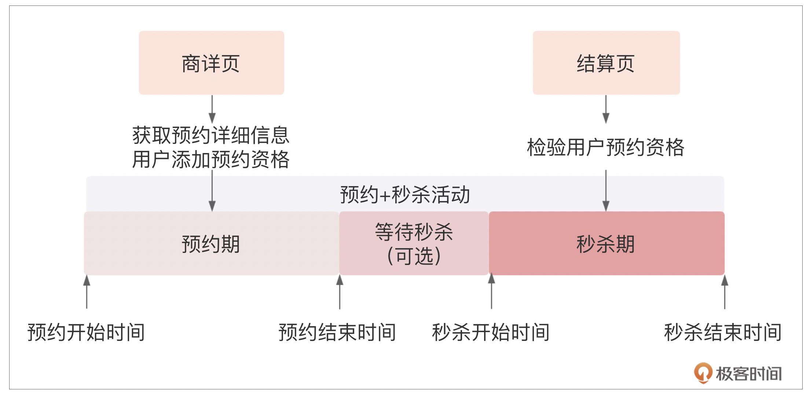
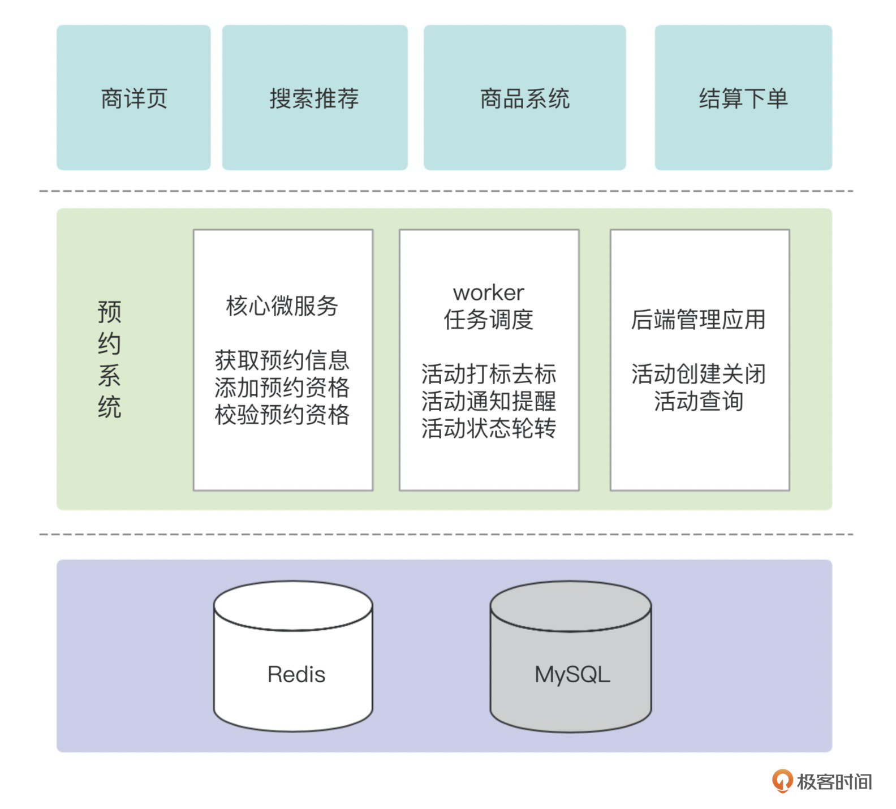
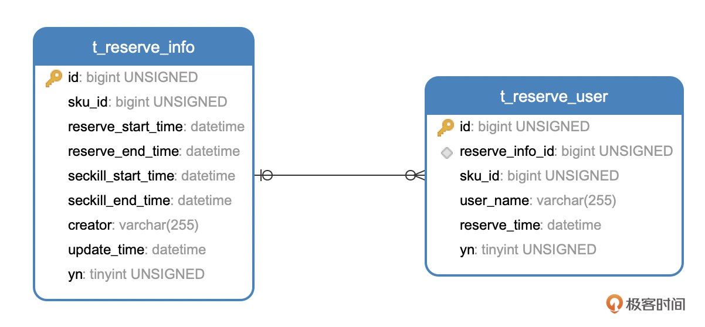
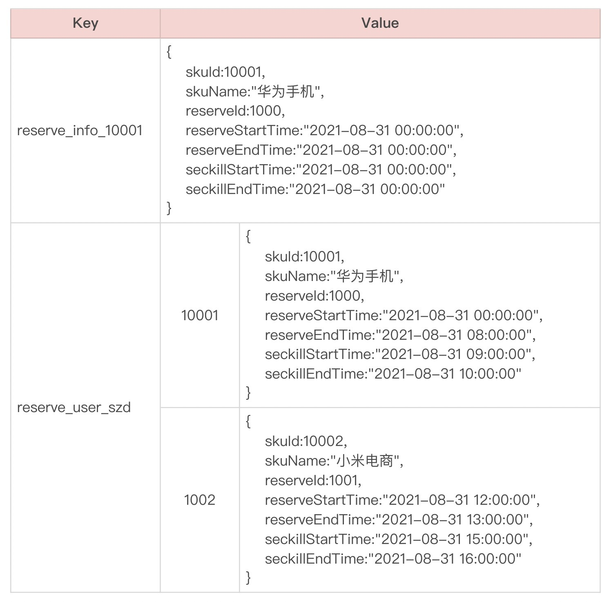
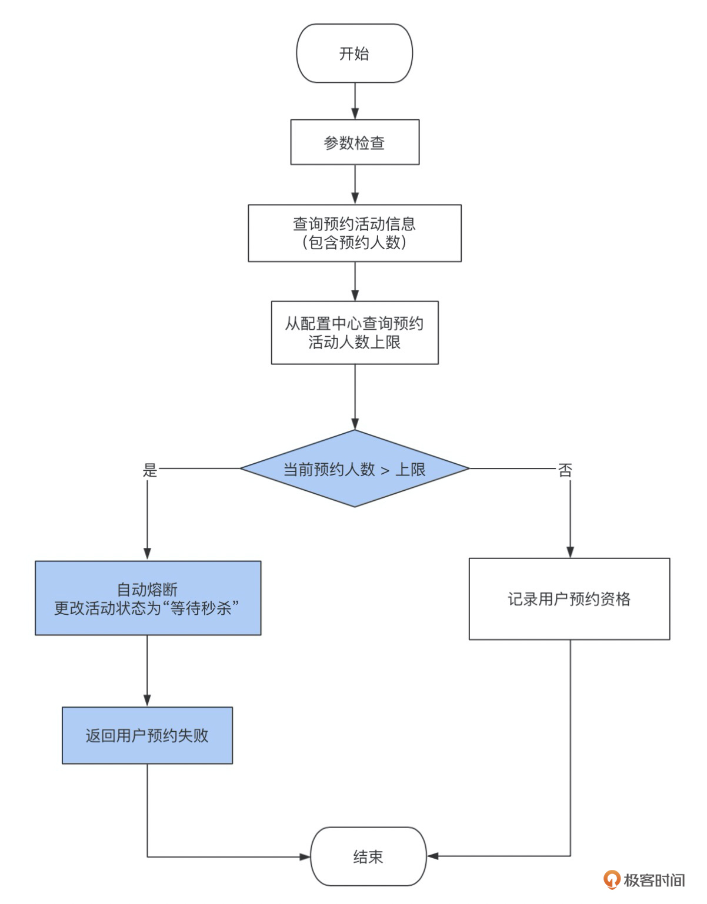

---
date: "2019-06-23"
---  
      
# 06｜谋定后动：秒杀的流量管控
你好，我是志东，欢迎和我一起从零打造秒杀系统。

上节课我们详细探讨了秒杀的隔离策略，简单回顾一下，为了让秒杀商品不影响其他商品的正常销售，我们从多个角度详细介绍了隔离，特别是系统隔离层面，我们从流量的起始链路入手，介绍了各个链路不同的隔离方法。从这节课开始，我们将重点介绍流量的管控。

## 如何有效地管控流量？

通过对秒杀流量的隔离，我们已经能够把巨大瞬时流量的影响范围控制在隔离的秒杀环境里了。接下来，我们开始考虑隔离环境的高可用问题，通俗点说，普通商品交易流程保住了，现在就要看怎么把秒杀系统搞稳定，来应对流量冲击，让秒杀系统也不出问题。方法很多，有**流量控制、削峰、限流、缓存热点处理、扩容、熔断**等一系列措施。

这些措施都是我们在第二模块要重点讲解的技术手段，内容比较多，而且会有一些交叉，我会用三节课来分享。

这节课我们先来看流量控制。在库存有限的情况下，过多的用户参与实际上对电商平台的价值是边际递减的。举个例子，1万的茅台库存，100万用户进来秒杀和1000万用户进来秒杀，对电商平台而言，所带来的经济效益、社会影响不会有10倍的差距。相反，用户越多，一方面消耗机器资源越多；另一方面，越多的人抢不到商品，平台的客诉和舆情压力也就越大。当然如果为了满足用户，让所有用户都能参与，秒杀系统也可以通过堆机器扩容来实现，但是成本太高，ROI不划算，所以我们需要提前对流量进行管控。

<!-- [[[read_end]]] -->



如果你关注过电商平台的双11或618大促，你肯定能感受到“预约+秒杀”在大促时的主流营销玩法。上图是预约+秒杀营销模式的示意图，主要分为预约期和秒杀期。

预约期内，开放用户预约，获取秒杀抢购资格；秒杀期内，具备抢购资格的用户真正开始秒杀。在预约期内，关键是**锁定用户**，这也是我们能够用来做流量管控的核心。在展开通过预约进行流量管控的细节之前，我们先看下如何来设计一个简单的预约系统。

## 预约系统设计

在进行系统设计之前，我们先分析预约的业务情况。

先从角色看，参与的有运营方，提供商品，进行预约活动的计划安排；C端用户，进行预约和秒杀行为；以及支撑预约活动的交易链路系统。

因此我们需要一个**预约管理后台**，进行活动的设置和关闭；需要一个**预约worker系统**，根据时间调用商品系统进行预约打标和去标，向预约过的用户发短信或消息提醒；还需要一个面向C端的**预约核心微服务**，提供给用户预约和取消预约能力，商详在展示时获取预约信息的能力，秒杀下单时检查预约资格的能力，以及获取用户的预约列表能力。

这样预约的架构就出来了，如下图所示：



预约管理后台和预约worker的功能比较简单，这里就不展开介绍了。我们重点看下预约核心微服务系统的设计，包括接口、数据库和缓存。

以下是核心微服务需要提供的**Dubbo接口**：

```
    package com.ecommerce.reservation.service;
    
    public interface IReservationService { 
        //添加预约资格接口 
        public Boolean addReservation(String skuId, String userName); 
        //取消预约资格接口
        public Boolean cancelReservation(String skuId, String userName);  
        //获取预约信息接口
        public List<ReservationInfo> getReservationInfoList(List<String> skuIds);
        //校验预约资格接口
        public Boolean validateReservation(String skuId, String userName);
        //获取用户预约列表接口
        public List<MyReservation> getMyReservationList(String userName);
    }
    

```

接口的具体实现这里就不展开了，代码逻辑还是比较简单的。拿添加预约资格接口来说，这个接口的实现就是先做一些参数校验，接着把预约关系写入数据库，再写入Redis缓存，最后更新商品的总预约人数。当然，这里面数据库和缓存的一致性问题是需要仔细考虑的。

再看下**数据库层**的设计，对预约来讲，核心就是两个维度：预约活动和用户预约关系。因此实际上数据库层面只需要两张表就够了，一张是预约活动信息表，另一张是用户预约关系表。

```
    CREATE TABLE `t_reserve_info` (
      `id` bigint(20) unsigned NOT NULL AUTO_INCREMENT COMMENT '预约活动id',
      `sku_id` bigint(20) unsigned DEFAULT NULL COMMENT '商品编号',
      `reserve_start_time` datetime DEFAULT NULL COMMENT '预约开始时间',
      `reserve_end_time` datetime DEFAULT NULL COMMENT '预约结束时间',
      `seckill_start_time` datetime DEFAULT NULL COMMENT '秒杀开始时间',
      `seckill_end_time` datetime DEFAULT NULL COMMENT '秒杀结束时间',
      `creator` varchar(255) DEFAULT NULL COMMENT '活动创建人',
      `update_time` datetime DEFAULT NULL COMMENT '更新时间',
      `yn` tinyint(255) unsigned DEFAULT NULL COMMENT '是否删除',
      PRIMARY KEY (`id`)
    ) ENGINE=InnoDB DEFAULT CHARSET=utf8;
    
    CREATE TABLE `t_reserve_user` (
      `id` bigint(20) unsigned NOT NULL AUTO_INCREMENT COMMENT '关系id',
      `reserve_info_id` bigint(20) unsigned DEFAULT NULL COMMENT '预约活动id',
      `sku_id` bigint(20) unsigned DEFAULT NULL COMMENT '商品编号',
      `user_name` varchar(255) DEFAULT NULL COMMENT '用户名称',
      `reserve_time` datetime DEFAULT NULL COMMENT '预约时间',
      `yn` tinyint(255) unsigned DEFAULT NULL COMMENT '是否删除',
      PRIMARY KEY (`id`),
      KEY `reserve_id_ref` (`reserve_info_id`),
      CONSTRAINT `reserve_id_ref` FOREIGN KEY (`reserve_info_id`) REFERENCES `t_reserve_info` (`id`)
    ) ENGINE=InnoDB DEFAULT CHARSET=utf8;
    

```

以下是这两张核心数据库表的ER图：



当数据量小的时候，我们用以上这两张表就能满足业务需求。但是在头部电商平台，每次大促时预约人数都是几千万量级的，因此为了更好的性能，我们需要对数据库分库分表。对t\_reserve\_user这个用户预约关系表来说，就需要按照user\_name的哈希值进行分库和分表。另外，对于历史数据，也需要有个定时任务进行结转归档，以减轻数据库的压力。

接下来我们再看下**缓存设计**。对高并发系统来说，要扛住大流量，我们知道肯定不能让流量击穿到数据库，所以需要设计缓存来抵挡。

先看t\_reserve\_info这个对象，首先我们需要在Redis缓存里存储它，那么Redis key可以这样设计：reserve\_info\_\{skuid\}，value可以用JSON string存储，当然也可以采用其他序列化方式，取决于你自己。

因为这个对象是sku维度的，在爆品的场景下，可能会有热点问题，针对热点问题的解决方案，可以设计Redis分片的一主多从来扛流量，也可以通过微服务层的本地缓存来解决。具体细节这里先留个悬念，我们在后面的热点缓存板块再来深入讨论。

另外，用户和商品的预约关系，可以存储成Redis的hash表，key为reserve\_user\_\{userName\}，value就是用户的预约sku列表，field为skuid。用户的预约关系和预约信息表不同，它是用户维度的，不会存在热点问题，所以我们可以不用考虑本地缓存。

假设skuid=10001的商品正常进行预约，用户szd预约了该商品，那么缓存内容大致如下：



## 预约系统优化

现在我们已经把预约系统设计出来了，接下来要做的就是优化它。

传统的预约模式，预约期是固定的时间段，用户在这个阶段内都可以预约；但在秒杀场景下，为了能够准确把控流量，控制预约人数上限，我们需要拓展预约期的定义，除了时间维度外，还要加入预约人数上限的维度，一旦达到上限，预约期就即时结束。

这实际上是给预约活动添加了一个自动熔断的功能，一旦活动太火爆，到达上限后系统自动关闭预约入口，提前进入等待秒杀状态。这样就可以准确把控人数，从而为秒杀期护航。



以上是预约熔断的流程图，白色部分流程是原有的用户预约过程，蓝色部分是添加了熔断机制的流程。技术方案还是比较简单的，这里更多的是给你思路上的启发，这也是我多次踩坑之后的经验总结。

这里，你可以拓展想一想，我们现在已经能够通过预约熔断来把控秒杀资格的上限，那么随着用户对流程的熟悉，**预约系统会怎么演变呢？**

是的，你没有猜错，当用户都知道必须预约才能在秒杀阶段有参与资格时，用户就会在预约期疯狂地挤进来，那么此时的预约系统也具备秒杀系统的特点了。好在预约人数的把控不需要那么精确，我们只需要即时熔断就达到目的了。

当然了，不是所有的爆品都有这样的号召力，我刚说的属于特殊情况。要知道即使是飞天茅台，都不会触发预约熔断。而2020年2月初口罩紧缺的时候，线下都是居委会分配票证购买（我印象中听父母提起他们那一辈计划经济时代才需要粮票肉票），线上一开放预约，一分钟就预约了几百万用户触发熔断了。这应该是互联网历史上流量最大的秒杀活动了吧。

另外，一般预约系统在业务设计上，需要在商详页展示当前预约人数给用户看，以营造商品火爆的气氛。我们自然就想到了可以在Redis里记录一个预约人数的key，比如reserve\_amount\_\{skuid\}，value就是预约人数。商详页展示氛围的时候，会从Redis里获取到这个value进行提示，而用户点击“立即预约”按钮进行预约时，会往这个key进行++操作。这个设计在预约流量没那么聚集时没什么问题，因为一般Redis单片也能扛个七八万的OPS。而当预约期一分钟内几百万人都来预约时，显然这个Redis key就是典型的热key问题了。这个热key问题的解决我们会在热点处理章节重点介绍。

## 小结

上一节课我们介绍了秒杀的隔离，我们需要进一步思考的就是控制流量。通常的做法是事前引入预约环节，进行秒杀参与人数的把控，“预约+秒杀”是主流电商平台通用的营销方式。

这个方案有两点好处，人气不足时，可以通过预约聚集人气，在同一时间点放闸开始秒杀，起到烘托大促气氛的作用；而人气过于旺盛时，则可以通过预约控制参与人数上限，只有预约过的会员才有秒杀资格，就可以防止过多人数对秒杀抢购造成冲击。

为了准确地控制能够参与秒杀的用户量级，预约系统需要增加基于用户数量级设定的自动熔断的功能。有了预约自动熔断，我们就可以结合秒杀商品的库存，业务计划引流的PV多少，提前规划好预约阶段开放的抢购资格数量，进行流量规划，准确管控秒杀期的流量。

除此之外，这节课我们还重点学习了预约系统的设计思路，根据这个思路，你可以很快速地搭建出一个比较简单的预约系统。

通过预约来控制流量属于事前管控，其实在事中，还有很多的手段来管控流量。比如通过答题或验证码，让流量平缓；通过排队机制，让流量有序地进入秒杀系统；抑或通过限流，对流量进行过滤。这些流量管控的具体措施我将在下一讲为你一一道来。

## 思考题

预约业务还有一个功能，就是给预约过的用户发消息提醒，引导用户进行秒杀。一般的做法是根据skuid从t\_reserve\_user表取出预约过的用户，然后进行push推送。

```
    select user_name from t_reserve_user where sku_id=#{skuId} limit #{page.beginIndex},#{page.step}
    

```

那么，当一个sku预约了几百万用户之后，这个查询会遇到深度分页的问题，越到后面查询越慢。现在请你想一下，有没有其他替代方案可以解决深度分页难题？

以上就是这节课的全部内容，欢迎你在评论区和我讨论问题，交流经验！