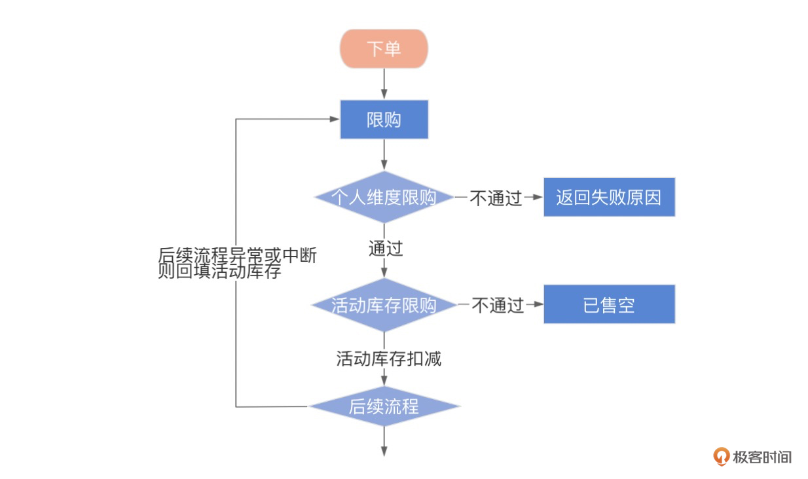
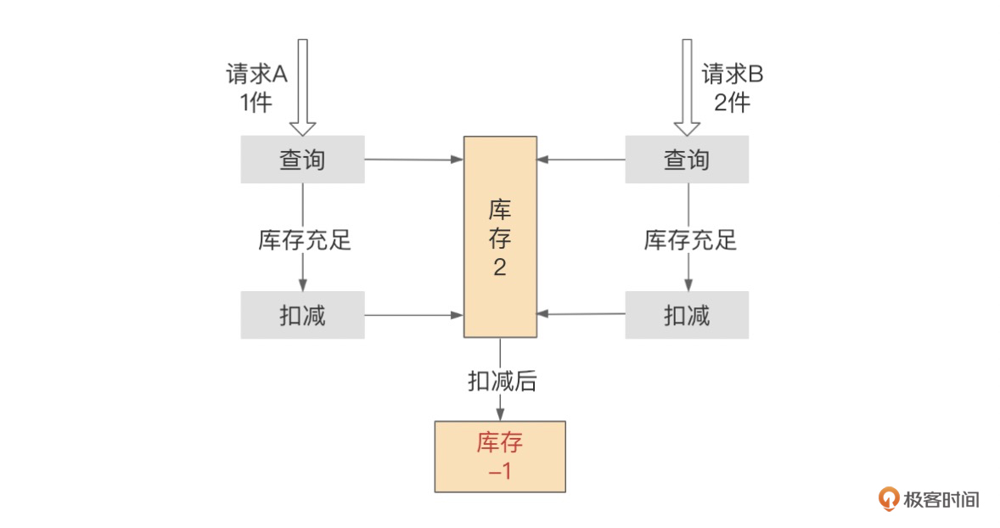
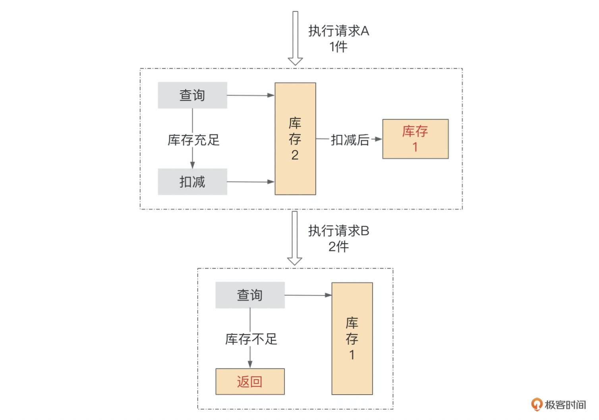
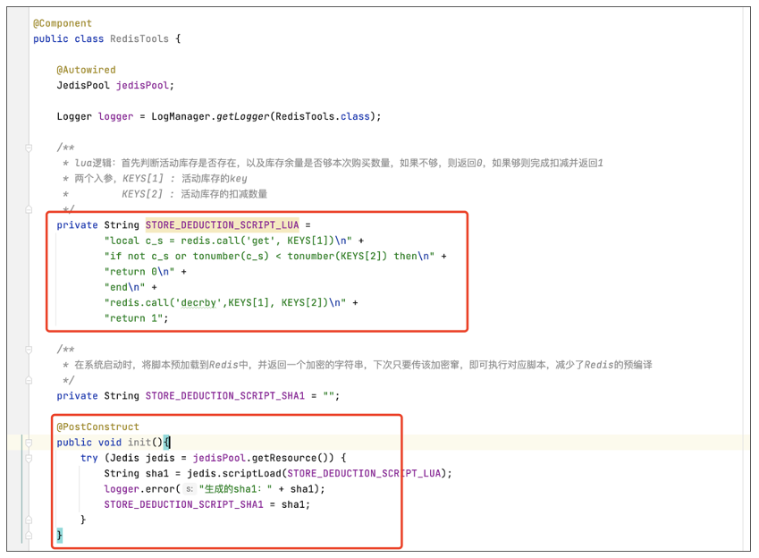
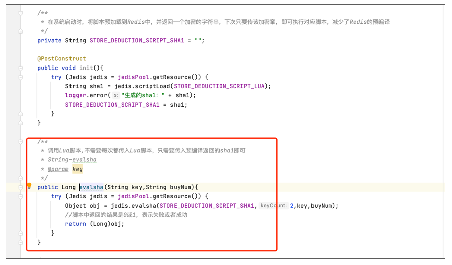
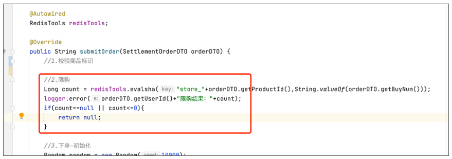
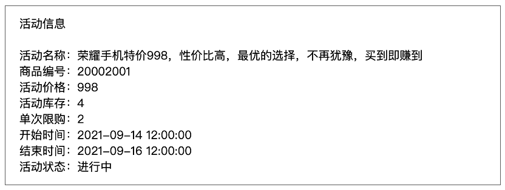
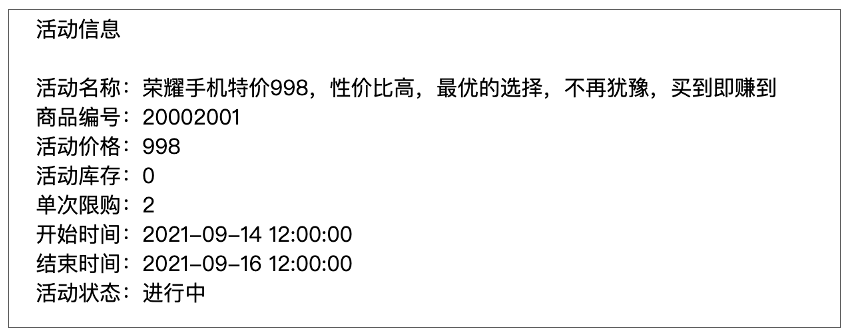
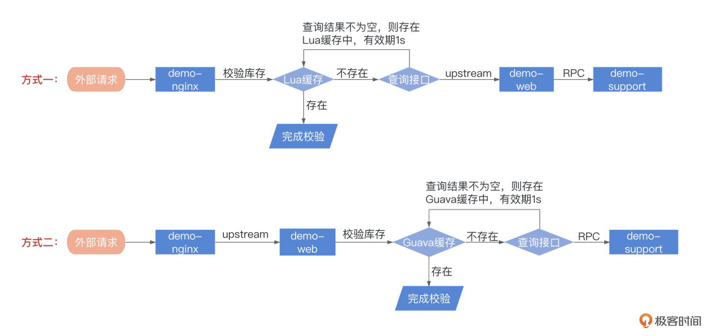

---
date: "2019-06-23"
---  
      
# 10｜不差毫厘：秒杀的库存与限购
你好，我是志东，欢迎和我一起从零打造秒杀系统。

你应该还记得，在介绍秒杀系统所面临的挑战时，我们就有提到库存超卖的问题，它是秒杀系统面临的几大挑战之一。而库存系统一般是商城平台的公共基础模块，负责所有商品可售卖数量的管理，对于库存系统来说，如果我只卖100件商品，那理想状态下，我希望外部系统就放过来100个下单请求就好了（以每单购买1件来说），因为再多的请求过来，库存不足，也会返回失败。

并且对于像秒杀这种大流量、高并发的业务场景，更不适合直接将全部流量打到库存系统，所以这个时候就需要有个系统能够承接大流量，并且只放和商品库存相匹配的请求量到库存系统，而限购就承担这样的角色。**限购之于库存，就像秒杀之于下单，前者都是后者的过滤网和保护伞。**

所以在有了限购系统之后，库存扣减的难题其实就转移到限购了。当然从纯技术的角度来说，不管是哪个系统来做库存的限制，高并发下库存扣减都是绕不开的难题。所以在今天这节课里，首先我们会了解限购的能力，然后会详细地讲解如何从技术角度解决库存超卖的问题。这样只要你学会了这类问题的解决方案和思路，不管是否做活动库存与真实库存的区分，都能从容应对。

## **限购**

顾名思义，限购的主要功能就是做商品的限制性购买。因为参加秒杀活动的商品都是爆品、稀缺品，所以为了让更多的用户参与进来，并让有限的投放量惠及到更多的人，所以往往会对商品的售卖做限制，一般限制的维度主要包括两方面。

<!-- [[[read_end]]] -->

**商品维度限制：**最基本的限制就是商品活动库存的限制，即每次参加秒杀活动的商品投放量。如果再细分，还可以支持针对不同地区做投放的场景，比如我只想在北京、上海、广州、深圳这些一线城市投放，那么就只有收货地址是这些城市的用户才能参与抢购，而且各地区库存量是隔离的，互不影响。

**个人维度限制：**就是以个人维度来做限制，这里不单单指同一用户ID，还会从同一手机号、同一收货地址、同一设备IP等维度来做限制。比如限制同一手机号每天只能下1单，每单只能购买1件，并且一个月内只能购买2件等。个人维度的限购，体现了秒杀的公平性。

有了这些功能支持之后，再做一个热门秒杀活动时，首先会在限购系统中配置活动库存以及各种个人维度的限购策略；然后在用户提单时，走下限购系统，通过限购的请求，再去做真实库存的扣减，这个时候到库存系统的量已经是非常小了。

该限购流程如下图所示：



那么在介绍完限购之后，下面我再来详细说一下上图中活动库存扣减的实现方案。

## **活动库存扣减方案**

我们都知道，用户成功购买一个商品，对应的库存就要完成相应的扣减。而库存的扣减主要涉及到两个核心操作，一个是查询商品库存，另一个是在活动库存充足的情况下，做对应数量的扣减。两个操作拆分开来，都是非常简单的操作，但是在高并发场景下，不好的事情就发生了。

举个简单的例子，比如现在活动商品有2件库存，此时有两个并发请求过来，其中请求A要抢购1件，请求B要抢购2件，然后大家都去调用活动查询接口，发现库存都够，紧接着就都去调用对应的库存扣减接口，这个时候，两个都会扣减成功，但库存却变成了-1，也就是超卖了。

整个过程如下图所示：



从图中我们可以看到，库存超卖的问题主要是由两个原因引起的，一个是查询和扣减不是原子操作，另一个是并发引起的请求无序。

所以要解决这个问题，我们就得**做到库存扣减的原子性和有序性**。理想过程应该如下图所示：



当然理想很美好，那我们该怎么去实现它呢？

你首先可能会想到利用数据库的行锁机制。这种方式的优点是简单安全，但是其性能比较差，无法适用于我们秒杀业务场景，在请求量比较小的业务场景下，是可以考虑的。

既然数据库不行，那能使用分布式锁吗？即通过Redis或者ZooKeeper来实现一个分布式锁，以商品维度来加锁，在获取到锁的线程中，按顺序去执行商品库存的查询和扣减，这样就同时实现了顺序性和原子性。

其实这个思路是可以的，只是不管通过哪种方式实现的分布式锁，都是有弊端的。以Redis的实现来说，仅仅在设置锁的有效期问题上，就让人头大。如果时间太短，那么业务程序还没有执行完，锁就自动释放了，这就失去了锁的作用；而如果时间偏长，一旦在释放锁的过程中出现异常，没能及时地释放，那么所有的业务线程都得阻塞等待直到锁自动失效，这与我们要实现高性能的秒杀系统是相悖的。所以**通过分布式锁的方式可以实现，但不建议使用。**

那还有其他方式吗？有！我们都知道Redis本身就是单线程的，天生就可以支持操作的顺序性，如果我们能在一次Redis的执行中，同时包含查询和扣减两个命令不就好了吗？庆幸的是，Redis确实能够支持。

Redis有个功能，是可以执行Lua脚本的（我们Nginx服务也有用到Lua语言，看来Lua语言的适用场景还真不少），并且可以保证脚本中的所有逻辑会在一次执行中按顺序完成。而在Lua脚本中，又可以调用Redis的原生API，这样就能同时满足顺序性和原子性的要求了。

当然这里的原子性说法可能不是很准确，因为Lua脚本并不会自动帮你完成回滚操作，所以如果你的脚本逻辑中包含两步写操作，需要自己去做回滚。好在我们库存扣减的逻辑针对Redis的命令就两种，一个读一个写，并且写命令在最后，这样就不存在需要回滚的问题了。

这里能帮我们实现Redis执行Lua脚本的命令有两个，一个是EVAL，另一个是EVALSHA。

原生EVAL方法的使用语法如下：

```
    EVAL script numkeys key [key ...] arg [arg ...]
    

```

其中EVAL是命令，script是我们Lua脚本的字符串形式，numkeys是我们要传入的参数数量，key 是我们的入参，可以传入多个，arg 是额外的入参。

但这种方式需要每次都传入Lua脚本字符串，不仅浪费网络开销，同时Redis需要每次重新编译Lua脚本，对于我们追求性能极限的系统来说，不是很完美。

所以这里就要说到另一个命令EVALSHA了，原生语法如下：

```
    EVALSHA sha1 numkeys key [key ...] arg [arg ...]
    

```

可以看到其语法与EVAL类似，不同的是这里传入的不是脚本字符串，而是一个加密串sha1。这个sha1是从哪来的呢？它是通过另一个命令SCRIPT LOAD 返回的，该命令是预加载脚本用的，语法为：

```
    SCRIPT LOAD script
    

```

这样的话，我们通过预加载命令，将Lua脚本先存储在Redis中，并返回一个sha1，下次要执行对应脚本时，只需要传入sha1即可执行对应的脚本。这完美地解决了EVAL命令存在的弊端，所以我们这里也是基于EVALSHA方式来实现的。

既然有了思路，也有了方案，那我们开始用代码实现它吧。

首先我们根据以上介绍的库存扣减核心操作，完成核心Lua脚本的编写。其主要实现的功能就是查询库存并判断库存是否充足，如果充足，则做相应的扣减操作，脚本内容如下：

```
    -- 调用Redis的get指令，查询活动库存，其中KEYS[1]为传入的参数1，即库存key
    local c_s = redis.call('get', KEYS[1])
    -- 判断活动库存是否充足，其中KEYS[2]为传入的参数2，即当前抢购数量
    if not c_s or tonumber(c_s) < tonumber(KEYS[2]) then
       return 0
    end
    -- 如果活动库存充足，则进行扣减操作。其中KEYS[2]为传入的参数2，即当前抢购数量
    redis.call('decrby',KEYS[1], KEYS[2])
    

```

然后我们将Lua脚本转成字符串，并添加脚本预加载机制。

预加载可以有多种实现方式，一个是外部预加载好，生成了sha1然后配置到配置中心，这样Java代码从配置中心拉取最新sha1即可。另一种方式是在服务启动时，来完成脚本的预加载，并生成单机全局变量sha1。我们这里先采取第二种方式，代码结构如下图所示：



以上是将Lua脚本转成字符串形式，并通过\@PostConstruct完成脚本的预加载。然后新增EVALSHA方法，如下图所示：



方法入参为活动商品库存key以及单次抢购数量，并在内部调用Lua脚本执行库存扣减操作。看起来是不是很简单？在写完底层核心方法之后，我们只需要在下单之前，调用该方法即可，具体如下图所示：



一切完成后，接下来就让我们来验证一下，是否会出现超卖的情况吧。

## 模拟场景

我们模拟的场景是这样的：

* 首先，通过前文中提到的活动创建接口，完成活动的创建；
* 然后，调用活动开始接口，并将商品活动信息同步到Redis里，包括商品活动库存；
* 接着，我们通过并发测试工具，直接模拟请求下单操作；
* 最后，请求在经过限购（代码中直接调用EVALSHA核心方法模拟）时，判断是否通过，如果通过就继续下单，并完成数据库中库存的扣减，如果售空，则返回失败。

我们按照模拟思路，先创建一个活动，数据库库存为4，然后调用活动开始接口，活动信息如下图所示：



再查看一下该活动对应的Redis活动库存，也是4件，如下图所示：


然后我们开始模拟1秒内发出多个并发请求，每个请求抢购2件商品。我这里使用的是wrk工具做的测试，测试命令如下：

```
    wrk -t3 -c3 -d1s http://localhost:8080//settlement/submitData?productId=20002001
    

```

以上命令的大概意思是使用3个线程来做压测，持续时间1秒。执行后的测试结果如下：


从上图可以看到，在1秒内发出了15个请求。现在我们看下限购的结果，1代表通过，0代表不通过，具体如下图所示：


确实只有2个请求通过限购，其他的全部被拦截了。这个时候，我们再分别查看下Redis活动库存和数据库库存，如下图所示：



库存数量都变成了0，没有出现超卖的情况！一切都完美符合我们的预期。

## **总结**

这节课我们分析了库存系统的业务边界，由于是电商平台的基础系统，并且基于秒杀业务隔离的原则，使得库存系统不太适合直接承接秒杀的高并发流量，需要有个过滤层。而限购系统刚好可以胜任这样的角色，限购可以从商品和个人的维度来做商品的限制性购买，从而可以帮库存系统抵挡住无效的流量，只放过和商品库存相匹配的请求数量。

当然不管是哪个系统来做库存的控制，都要面临的问题就是库存的精确控制，所以我们从纯技术的角度分析了库存超卖发生的两个原因。一个是库存扣减涉及到的两个核心操作，查询和扣减不是原子操作；另一个是高并发引起的请求无序。

所以我们的应对方案是利用Redis的单线程原理，以及提供的原生EVALSHA和SCRIPT LOAD 命令来实现库存扣减的原子性和顺序性，并且经过实测也确实能达到我们的预期，且性能良好，从而有效地解决了秒杀系统所面临的库存超卖挑战。以后再遇到类似的问题，你也可以用同样的解决思路来应对。

## 思考题

请你思考一下，根据我们校验前置的原则，是否可以仅仅将库存的校验前置到demo-nginx或demo-web中，像下图所示：



如果可以，该如何具体实现它？

期待你的思考和方案，也欢迎你在留言区中与我交流，我们下节课再见！