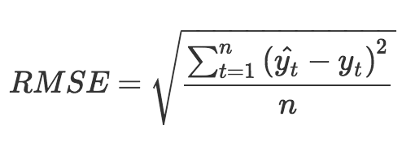

---
date: "2019-06-23"
---  
      
# 02 | 个性化推荐系统有哪些绕不开的经典问题？
推荐系统发展到了今天，已经出现了一些常见的问题，一部分已经有很好的解决方案，另外一部分却还没有通用解决方案，需要根据实际情况做一下具体的分析。

今天我来和你聊一聊这些问题。我会首先讲讲一些推荐系统中的问题模式，然后再专门说一些需要面对的具体问题。

## 推荐系统的问题模式

我们知道，推荐系统的使命是为用户和物品建立连接，建立的方式是提前找出那些隐藏的连接呈现给用户，这是一个预测问题；所以推荐系统的预测问题模式，从达成的连接目标角度区分，有两大类：

1.  评分预测；
2.  行为预测。

因为评分和行为是用户对推荐结果的两类反馈，我们给他们推荐了一个或多个物品，目的是希望他们“消费”，这种消费反应在用户行为上，比如“点击查看”，信息咨询类的还有“阅读完成”，视频音乐类的有“播放完成”，电商类的“加入购物车”等。

整个行为呈现一个漏斗形状，从曝光到最终消费完成。最后在用户完成消费后，产品方一般还希望他们告诉自己消费的体验，这时候就有评分了；所以不同推荐系统的任务也不同，有的直接去预测用户如果消费完之后会给多少评分，更多的推荐系统则会分层，致力于预测用户的行为。下面我分别详细说一下这两类问题。

## 评分预测

评分预测相关算法模型研究的兴盛，最大的助攻是 Netflix 举办的推荐算法大赛。

评分预测要干的事情是这样的：假如用户消费完一个物品之后会给出一个打分，比如通常是1\~5分，或者有的网站用星星的颗数表示，也是一样。

我们就想能不能提前预测一个用户对每一个物品会打多少分，找出那些他可能会打高分，但是还没消费的物品，然后装作若无其事地呈现在他面前，惊不惊喜，意不意外\?

说干就干，怎么干呢？正如王小波给李银河写的信那样：不能胡干。一个朴素的思想是：建立一个模型，这个模型会给用户历史上打过分的物品去预测分数。

预测分数和实际分数之间会有误差，我们根据这个误差去调整模型参数，让这个误差越来越小，最后得到的这个模型理论上就可以为我们干活了。事实上，这其实就是个机器学习里面的回归问题。

Netflix比赛的评判标准就是 RMSE ，即均方根误差，怎么算的呢？

这个公式中的t表示每一个样本，n 表示总共的样本数，有帽子的 yt 就是模型预测出的分数，是我们交的作业，秃顶的 yt 就是用户自己打的分数，是标准答案，然后一个样本一个样本地对答案，模型预测分数和用户自己打分相减，这就是我们预测的误差。

由于误差有正数也有负数，而我们只关心绝对值大小，所以再给误差求平方，这就是名字中的“方”的来源，再对所有样本的误差平方求平均值，这就是名字中“均”的来源，因为我们对误差都平方了，所以最后再对均值开方根，这就是名字中的“根”的来源。这个过程就是求均方根误差。

评分预测问题常见于各种点评类产品（如：书影音的点评），但评分类推荐存在以下问题：

1.  数据不易收集，我刚才说过，用户给出评分意味着他已经完成了前面所有的漏斗环节；
2.  数据质量不能保证，伪造评分数据门槛低，同时真实的评分数据又处在转化漏斗最后一环，门槛高；
3.  评分的分布不稳定，整体评分在不同时期会差别很大，个人评分在不同时期标准不同，人和人之间的标准差别很大。

用户爸爸们给产品施舍的评分数据，我们又叫做显式反馈，意思是他们非常清晰明白地告诉了我们，他们对这个物品的态度；与之相对的还有隐式反馈，通常就是各类用户行为，也就是另一类推荐系统问题：行为预测。

## 行为预测

实际上，用户爸爸们每天要在不同的 App 或者网站之间不停批阅奏章，日理万机，非常忙，所以能够提交的像评分这种显式反馈数据很少。

但是没关系，只要用户来了，就会有各种行为数据产生，从登录刷新，到购买收藏，都是用户行为，这类数据是用户们在自觉自愿的情况下产生的，数据量比显式反馈多很多。

用户的行为通常呈现漏斗关系，我希望用户最终达成的行为可能不是那么容易得到的，比如购买，比如建立一个社交关系，比如完整消费一个长内容，通常是从登录刷新开始，逐层经历漏斗流失。

而推荐系统肩负的使命自然是达成用户行为，也就是连接越多越好。这也是这一类推荐系统问题的关注点。

推荐系统预测行为方式有很多，常见的有两种：直接预测行为本身发生的概率，和预测物品的相对排序。直接预测用户行为这一类技术，有一个更烂大街的名字，叫做CTR预估。这里的C原本是点击行为Click，但这个解决问题的模式可以引申到任何其他用户行为，如收藏、购买。

CTR意思就是 Click Through Rate，即“点击率”。把每一个推荐给用户的物品按照“会否点击”二分类，构建分类模型，预估其中一种分类的概率，就是CTR预估。

行为预测说白了，就是利用隐式反馈数据预测隐式反馈的发生概率；也因此，各家互联网产品要高度重视隐式反馈，归纳起来有以下几点原因。

1.  数据比显式反馈更加稠密。诚然，评分数据总体来说是很稀疏的，之前Netflix的百万美元挑战赛给出的数据稀疏度大概是1.2\%，毕竟评分数据是要消耗更多注意力的数据。

2.  隐式反馈更代表用户的真实想法，比如你不是很赞成川普的观点，但还是想经常看到他的内容（以便吐槽他），这是显式反馈无法捕捉的。而人们在Quora上投出一些赞成票也许只是为了鼓励一下作者，或者表达一些作者的同情，甚至只是因为政治正确而投，实际上对内容很难说真正感兴趣。

3.  隐式反馈常常和模型的目标函数关联更密切，也因此通常更容易在AB测试中和测试指标挂钩。这个好理解，比如CTR预估当然关注的是点击这个隐式反馈。

用户给出较高评分的先决条件是用户要有“评分”的行为，所以行为预测解决的是推荐系统的80\%问题，评分预测解决的是最后那20\%的问题，行为预测就像是我们剁手买买买后，可爱的商品要先乘坐飞机，飞跃千山万水到所在区域来，而评分预测则是快递员最终将东西递交到你手上这个过程。

## 几个常见顽疾

讨论了两大类推荐系统的问题后，我们再来看几个推荐系统的隐藏顽疾。之所以说这些是隐藏顽疾，是因为它们还没有很好的通用解决方案，并且不容易被重视，这几个顽疾分别是：

1.  冷启动问题；
2.  探索与利用问题；
3.  安全问题。

### 1 冷启动问题

推荐系统是数据贪婪型应用，所谓数据贪婪型应用，就是对数据的需求绝无足够的那一天。冷启动问题广泛存在于互联网产品中，但我们这里仅仅限于推荐系统的冷启动。

新用户或者不活跃用户，以及新物品或展示次数较少的物品，这些用户和物品，由于缺乏相关数据，很是空虚寂寞冷，因此就是冷启动问题的关注对象。

关于“如何解决冷启动”本身，有伪命题的嫌疑，因为通常的解决方式就是给它加热：想办法引入数据，想办法从已有数据中主动学习（一种半监督学习）。我们会在后面的文章中详细讨论冷启动的问题。

### 2 探索与利用问题

探索与利用，行话又叫做EE问题。假如我们已经知道了用户的喜好，一般有三种对待方式：

1.  全部给他推荐他目前肯定感兴趣的物品；
2.  无视他的兴趣，按照其他逻辑给他推荐，如编辑推荐、随机推荐、按时间先后推荐等等；
3.  大部分给他推荐感兴趣的，小部分去试探新的兴趣，如同一边收割长好的韭菜，一边播种新的韭菜。

哪一种更科学和持久呢？显然是第三种，那么如何平衡这里的“大部分”和“小部分”呢？

这就是 Exploit 和 Explore 问题的核心了。Exploit意为“开采”，对用户身上已经探明的兴趣加以利用，Explore 意为“探索”，探明用户身上还不知道的兴趣。

我们会在后面的文章中详细讨论EE问题。

### 3 安全问题

凡是系统就有漏洞，凡是漏洞有利可图，就一定有人去图，推荐系统也不例外。如果你正在一款流量非常大的产品上构建推荐系统，那么一定要考虑推荐系统攻击问题。推荐系统被攻击的影响大致有以下几个：

1.  给出不靠谱的推荐结果，影响用户体验并最终影响品牌形象；
2.  收集了不靠谱的脏数据，这个影响会一直持续留存在产品中，很难完全消除；
3.  损失了产品的商业利益，这个是直接的经济损失。

所以推荐系统的安全问题：有哪些攻击手段，以及对应的防御办法，这些我们也会在后面的文章中予以讨论。

## 总结

今天，我从两个角度总结了推荐系统中的常见问题。

第一个角度是模型的角度，将推荐系统的模型分成了预测评分和预测行为，这样一来，自己有什么数据就选择什么样的模型。另一个角度是看看推荐系统中一些永恒存在但是潜在的问题，包括冷启动、EE问题、安全问题。

好了，说到这里，你可以去观察一下你用过的推荐系统，看看它们的模型是预测评分还是预测行为，你可以在下面留言，我们一起讨论。感谢你的收听，我们下次再见。

想迅速了解并掌握推荐系统的同学，可以购买《推荐系统三十六式》专栏，作者在推荐系统方面有8年的经验，为推荐系统学习者架构起整体的知识脉络，并在此基础上补充实践案例与经验，力图解决系统起步阶段 80\% 的问题。

<!-- [[[read_end]]] -->