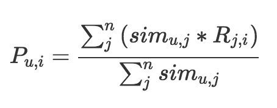

---
date: "2019-06-23"
---  
      
# 07 | 人以群分，你是什么人就看到什么世界
要说提到推荐系统中，什么算法最名满天下，我想一定是协同过滤。在很多场合，甚至有人把协同过滤和推荐系统划等号，可见二者的关系多么紧密。

协同过滤的重点在于“协同”，所谓协同，也就是群体互帮互助，互相支持是集体智慧的体现，协同过滤也是这般简单直接，历久弥新。

# 协同过滤

当你的推荐系统度过了只能使用基于内容的推荐阶段后，就有了可观的用户行为了。这时候的用户行为通常是正向的，也就是用户或明或暗地表达着喜欢的行为。这些行为可以表达成一个用户和物品的关系矩阵，或者说网络、或者说是图，都是一个东西。

这个用户物品的关系矩阵中填充的就是用户对物品的态度，但并不是每个位置都有，需要的就是把那些还没有的地方填起来。这个关系矩阵是协同过滤的命根子，一切都围绕它来进行。

协同过滤是一个比较大的算法范畴。通常划分为两类：

1.  基于记忆的协同过滤（Memory-Based）；
2.  基于模型的协同过滤（Model-Based）。

基于记忆的协同过滤，现在看上去极其简单，就是记住每个人消费过什么东西，然后给他推荐相似的东西，或者推荐相似的人消费的东西。基于模型的协同过滤则是从用户物品关系矩阵中去学习一个模型，从而把那些矩阵空白处填满。

接下来一段时间，我们就围绕这两个类别的协同过滤与你好好聊聊。今天我先来说的是基于记忆的协同过滤的一种——基于用户，或者叫做User-Based， User to User。

# 基于用户的协同过滤

## 背后的思想

你有没有过这种感觉，你遇到一个人，你发现他喜欢的书、喜欢的电影也基本上都是你喜欢的，从此以后，你就想老是想问他：还有什么好推荐的，最近又看了什么书，最近又看了什么电影？甚至不惜和他撞衫，和他穿一个风格的衣服。

对喽，这个感觉非常地自然直接，它就是基于用户的协同过滤背后思想。详细来说就是：先根据历史消费行为帮你找到一群和你口味很相似的用户；然后根据这些和你很相似的用户再消费了什么新的、你没有见过的物品，都可以推荐给你。

这就是我们常说的人以群分，你是什么人，你就会遇到什么人，所以说，要谨慎交友啊。

这其实也是一个给用户聚类的过程，把用户按照兴趣口味聚类成不同的群体，给用户产生的推荐就来自这个群体的平均值；所以要做好这个推荐，关键是如何量化“口味相似”这个看起来很直接简单的事情。这关系到一个用户会跟哪些人在同一个房间内，万一进错了房间，影响就会不好。

<!-- [[[read_end]]] -->

## 原理

书归正传，我们来说一说基于用户的协同过滤具体是怎么做的。前面说过，核心是那个用户物品的关系矩阵，这个矩阵是最原始的材料。

**第一步，准备用户向量，从这个矩阵中，理论上可以给每一个用户得到一个向量。**

为什么要说是“理论上”呢？因为得到向量的前提是：用户爸爸需要在我们的产品里有行为数据啊，否则就得不到这个向量。

这个向量有这么三个特点：

1.  向量的维度就是物品的个数；
2.  向量是稀疏的，也就是说并不是每个维度上都有数值，原因当然很简单，这个用户并不是消费过所有物品，废话嘛，连我们压箱底的都给用户推荐了，那当然不用再推荐什么了；
3.  向量维度上的取值可以是简单的0或者1，也就是布尔值，1表示喜欢过，0表示没有，当然因为是稀疏向量，所以取值为0的就忽略了。

**第二步，用每一个用户的向量，两两计算用户之间的相似度，设定一个相似度阈值或者设定一个最大数量，为每个用户保留与其最相似的用户。**

这里两两计算相似度如何计算，市面上有很多相似度计算方法，你也可以自己设计，我们在后面的文章里会逐一介绍，这里先略过不提。

**第三步，为每一个用户产生推荐结果。**

把和他“臭味相投”的用户们喜欢过的物品汇总起来，去掉用户自己已经消费过的物品，剩下的排序输出就是推荐结果，是不是很简单。具体的汇总方式我们用一个公式来表示。

这个公式也是很简单的。等号左边就是计算一个物品i和一个用户u的匹配分数，等号右边是这个分数的计算过程，分母是把和用户u相似的n个用户的相似度加起来，分子是把这n个用户各自对物品i的态度，按照相似度加权求和。

这里的态度最简单就是0或者1，1表示喜欢过，0表示没有，如果是评分，则可以是0到5的取值。整个公式就是相似用户们的态度加权平均值。

## 实践

看上去简单得不值一提，但是在实现上却有一些坑，需要小心小心再小心。你想过以下这几个问题吗？

1.  只有原始用户行为日志，需要从中构造出矩阵，怎么做？
2.  如果用户的向量很长，计算一个相似度则耗时很久，怎么办？
3.  如果用户量很大，而且通常如此，两两计算用户相似度也是一个大坑，怎么办？
4.  在计算推荐时，看上去要为每一个用户计算他和每一个物品的分数，又是一个大坑，怎么办？

嗯……不要气馁，下面我会逐一说下如何化解这些问题。

**1 构造矩阵**

我们在做协同过滤计算时，所用的矩阵是稀疏的，说人话就是：很多矩阵元素不用存，因为是0。这里介绍典型的稀疏矩阵存储格式。

1.  CSR：这个存储稍微复杂点，是一个整体编码方式。它有三个组成：数值、列号和行偏移共同编码。
2.  COO：这个存储方式很简单，每个元素用一个三元组表示（行号，列号，数值），只存储有值的元素，缺失值不存储。

这些存储格式，在常见的计算框架里面都是标准的，如 Spark 中，Python 的 NumPy 包中。一些著名的算法比赛也通常都是以这种格式提供数据。这里不再赘述了。

把你的原始行为日志转换成上面的格式，就可以使用常用计算框架的标准输入了。

**2 相似度计算**

相似度计算是个问题。

首先是单个相似度计算问题，如果碰上向量很长，无论什么相似度计算方法，都要遍历向量，如果用循环实现就更可观了，所以通常降低相似度计算复杂度的办法有两种。

1.  对向量采样计算。道理很简单，两个一百维的向量计算出的相似度是0.7，我现在忍受一些精度的损失，不用100维计算，随机从中取出10维计算，得到相似度是0.72，显然用100维计算出的0.7更可信一些，但是在计算复杂度降低十倍的情形下，0.72和它误差也不大，后者更经济。这个算法由Twitter提出，叫做 DIMSUM 算法，已经在Spark中实现了。

2.  向量化计算。与其说这是一个小技巧，不如说这是一种思维方式。在机器学习领域，向量之间的计算是家常便饭，难道向量计算都要用循环实现吗？并不是，现代的线性代数库都支持直接的向量运算，比循环快很多。也就是我们在任何地方，都要想办法把循环转换成向量来直接计算，一般像常用的向量库都天然支持的，比如 Python 的 NumPy 。

其次的问题就是，如果用户量很大，两两之间计算代价就很大。

有两个办法来缓解这个问题：

第一个办法是：将相似度计算拆成 Map Reduce 任务，将原始矩阵Map成键为用户对，值为两个用户对同一个物品的评分之积，Reduce 阶段对这些乘积再求和，Map Reduce任务结束后再对这些值归一化；

第二个办法是：不用基于用户的协同过滤。

另外，这种计算对象两两之间的相似度的任务，如果数据量不大，一般来说不超过百万个，然后矩阵又是稀疏的，那么有很多单机版本的工具其实更快，比如 KGraph、 GraphCHI 等。

**3 推荐计算**

得到了用户之间的相似度之后。接下来还有一个硬骨头，计算推荐分数。显然，为每一个用户计算每一个物品的推荐分数，计算次数是矩阵的所有元素个数，这个代价，你当然不能接受啊。这时候，你注意回想一下前面那个汇总公式，有这么几个特点我们可以来利用一下：

1.  只有相似用户喜欢过的物品需要计算，这个大大的赞，这个数量相比全部物品少了很多；
2.  把计算过程拆成Map Reduce任务。

拆Map Reduce任务的做法是：

1.  遍历每个用户喜欢的物品列表；
2.  获取该用户的相似用户列表；
3.  把每一个喜欢的物品Map成两个记录发射出去，一个是键为\<相似用户ID，物品ID，1>三元组，可以拼成一个字符串，值为\<相似度>，另一个是键为\<相似用户ID，物品ID，0>三元组，值为\<喜欢程度\*相似度>，其中的1和0为了区分两者，在最后一步中会用到；
4.  Reduce阶段，求和后输出；
5.  \<相似用户ID，物品ID, 0>的值除以\<相似用户ID，物品ID, 1>的值

一般来说，中小型公司如果没有特别必要的话，不要用分布式计算，看上去高大上、和大数据沾上边了，实际上得不偿失。

拆分Map Reduce任务也不一定非要用 Hadoop 或者Spark实现。也可以用单机实现这个过程。

因为一个Map过程，其实就是将原来耦合的计算过程解耦合了、拍扁了，这样的话我们可以利用多线程技术实现Map效果。例如C加加里面 OpenMP 库可以让我们无痛使用多线程，充分剥削计算机所有的核。

**4 一些改进**

对于基于用户的协同过滤有一些常见的改进办法，改进主要集中在用户对物品的喜欢程度上：

1.  惩罚对热门物品的喜欢程度，这是因为，热门的东西很难反应出用户的真实兴趣，更可能是被煽动，或者无聊随便点击的情形，这是群体行为常见特点；
2.  增加喜欢程度的时间衰减，一般使用一个指数函数，指数就是一个负数，值和喜欢行为发生时间间隔正相关即可，这很好理解，小时候喜欢的东西不代表我现在的口味，人都是会变的，这是人性。

## 应用场景

最后，说一说基于用户的协同过滤有哪些应用场景。基于用户的协同过滤有两个产出：

1.  相似用户列表；
2.  基于用户的推荐结果。

所以我们不但可以推荐物品，还可以推荐用户！比如我们在一些社交平台上看到：“相似粉丝”“和你口味类似的人”等等都可以这样计算。

对于这个方法计算出来的推荐结果本身，由于是基于口味计算得出，所以在更强调个人隐私场景中应用更佳，在这样的场景下，不受大V影响，更能反应真实的兴趣群体，而非被煽动的乌合之众。

# 总结

今天，我与你聊了基于用户的协同过滤方法，也顺带普及了一下协同过滤这个大框架的思想。基于用户的协同过滤算法简单直接，但是非常有效。只是，在实现这个方法时，有很多需要注意的地方，比如：

1.  相似度计算本身如果遇到超大维度向量怎么办；
2.  两两计算用户相似度遇到用户量很大怎么办？

同时，我也聊到了如何改进这个推荐算法，希望能够帮到你，针对你自己的产品，你可以再多想几种改进办法吗？欢迎留言一起讨论。感谢你的收听，我们下次再见。

