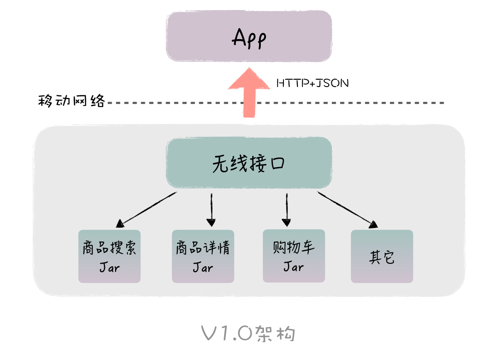
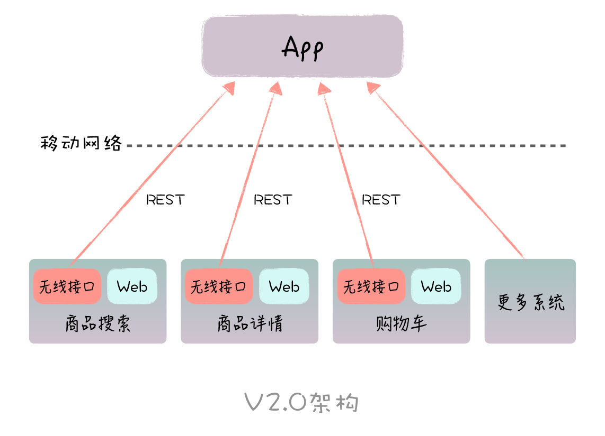
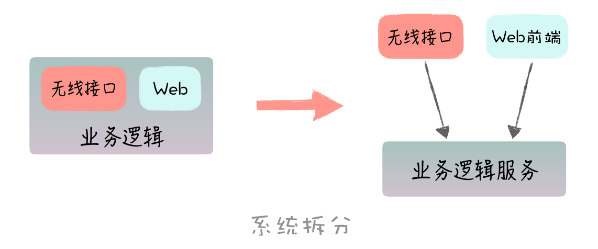
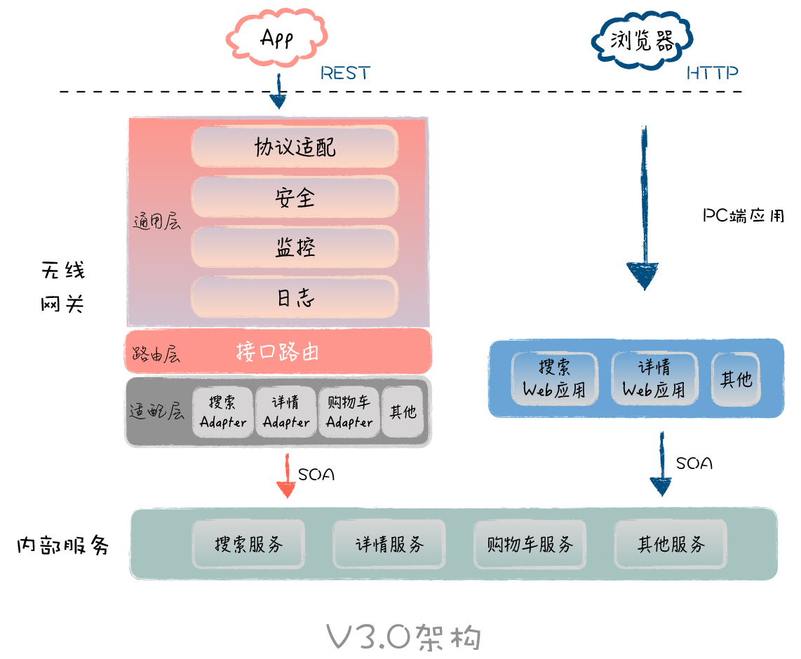

---
date: "2019-06-23"
---  
      
# 05 | 可扩展架构案例（二）：App服务端架构是如何升级的？
你好，我是王庆友。

上一讲，我与你介绍了电商平台从单体架构到微服务架构的演变过程。那么今天，我会通过一个**1号店App服务端架构改造**的例子，来具体说明架构的演变过程，让你能更深入地理解架构演变背后的原因。

好，先让时间拨回到2012年，当时随着智能设备的普及和移动互联网的发展，移动端逐渐成为用户的新入口，各个电商平台都开始聚焦移动端App。这个时候，1号店也开始试水移动端购物，从那时起，1号店App的服务端架构一共经历了三个版本的变化。

接下来，我就为你具体介绍App服务端架构变化的过程以及原因。

## V1.0架构

我先说说最开始的1.0版本。当时的情况是，App前端的iOS和Android开发团队是外包出去的，而App的服务端是由1号店内部一个小型的移动团队负责的，这个团队主要负责提供App前端需要的各个接口，接口使用的通信协议是HTTP+JSON。

具体的架构如下图所示：



这个架构比较简单，App的服务端整体上就一个应用，由移动团队来维护所有对外接口，服务端内部有很多Jar包，比如商品搜索、商品详情、购物车等等，这些Jar包包含了各个业务线的业务逻辑及数据库访问，它们由各个业务线的开发者负责提供。

你可以看到，这个1.0版本的服务端，实际上就是一个单体应用，只是对外的接口和内部Jar包分别由不同的团队来提供，这个架构的优点和缺点同样都非常明显。

<!-- [[[read_end]]] -->

**它的优点是简单方便**。App前端的外包团队只需要对接后端的一个移动团队就可以了，然后移动团队通过现成的Jar包，封装各个业务线的功能。至于这些Jar包，业务线团队也无需额外去开发。

为什么呢？我们知道，早期的电商平台都是先有PC端应用，再推App，App最开始的功能，大多是从已有的PC端平移过来的。因此，这些Jar包直接从PC端应用里拿过来就可以了，如果Jar包版本有更新，由业务线团队直接同步给移动团队即可。

那这个架构设计是不是很完美啊？当然不是，不知道你发现了没有，其实这里也存在了很多问题。

### 第一个问题：移动服务端对Jar包的紧密依赖

移动团队负责对外接口，但他们非常依赖业务团队提供的Jar包来实现业务逻辑，这是一种物理上的紧耦合依赖关系。

如果业务团队根据PC端的需求，修改了应用代码后，Jar包也会随之修改。那么在实践中，经常会出现这样的情况：业务团队很多时候，要么忘了同步新的Jar包给移动团队，要么是新的Jar包调整了类的接口，导致了App服务端的功能有问题，或者直接不可用。

### 第二个问题：移动团队的职责过分复杂

服务端为App提供的是粗粒度接口，而业务团队的Jar包提供的是细粒度的接口。

因此，移动团队在Jar包的基础上，还需要做很多的业务逻辑聚合，很多时候，这些逻辑还跨多个业务线，导致移动团队对所有业务逻辑都要深入了解。相信你也知道，这是很难做到的。

### 第三个问题：团队并行开发困难

由于移动团队和业务团队是通过物理Jar包进行集成的，移动团队直接受业务团队的代码影响，就导致了团队之间并行开发困难，一次大的App升级经常需要2\~3个月的时间。

而当时的1号店，需要能尽快地推出App端，我们所有的做法都是围绕这个目的来的，包括把前端团队外包出去，后端采用单体架构，移动端功能从PC端直接移植过来。所以，从当时的情况来说，这种简单的服务端架构和团队合作模式是非常合适的。

而过了一段时间，当移动端的功能已经初步具备，我们就需要针对移动自身的特点去组织功能，并能够快速上线这些新功能。那么，这种单体架构加物理Jar包耦合的方式，就成为App进一步发展的瓶颈。

接下来，我们就看下系统是如何通过架构升级，来解决这个问题的。

## V2.0架构

到了2013年，1号店App服务端架构升级到了V2.0。在这个时候，1号店自己接手了App前端的开发工作，同时，服务端接口也由各个业务线团队直接负责，这样，App前端直接对接多个后端应用提供的HTTP接口。

整体架构如下图所示：



对于各个业务团队来说，他们现在走向了前台，每个团队负责各个业务线的App接口。他们一般采取这样的做法，一方面，他们以Web应用的方式，为PC端浏览器提供访问；另一方面，针对移动端的访问需求，他们在Web应用里面，增加了一些REST接口，直接供App访问。在这里，移动接口和Web应用在同一个工程里开发，作为同一个应用进行部署和运行。

这里你可以看到，这实际上就是一种**分布式的系统架构**，每块业务由不同的团队负责，可以很好地支持团队之间的并行开发；同时，移动接口和PC端共享底层业务逻辑，有助于快速把PC端的功能完整地复制到App端。

这样，**通过V2.0架构的升级，业务线团队的生产力就被完全释放了，App的功能也就快速丰富起来了。**

但这种方式也带来了一系列的问题，我们具体说下。

**首先是移动端和PC端互相干扰的问题。**

你可以看到，在同一个业务线内部，移动接口和Web应用，物理上是绑定在一起的。很多时候，PC端的代码修改会影响到移动接口，而Web应用的发布，也会导致移动接口被动地被发布，如果PC端出现功能问题，也会影响到移动接口的可用性。反过来也是一样的，移动接口的需求变化，会影响到PC端的功能。

我们知道，当移动端发展到了一定程度，它需要和PC端有不同的功能和用户体验，但这种紧耦合的方式，导致了相互之间产生很多不必要的干扰，对系统的功能和稳定性都带来了负面影响。

**其次是重复开发的问题。**

移动接口除了要给App端提供业务数据，还需要考虑一系列系统级的功能，比如说，安全验证、日志记录、性能监控等等，每个移动接口都需要这些通用功能。

那现在，由于App前端是和后端直连的，这就意味着，每个后端系统都需要独自去支持这些系统级的功能，导致了各个后端系统重复开发。一旦这些通用需求发生了变化，比如说，我们要对传输数据进行压缩，那么，所有的后端系统都需要同步调整，这样不但工作量很大，而且也给项目管理也带来了很大的挑战。

**最后是稳定性的问题。**

在这里，基于这种直连方式，只要一个后端系统出问题，就会直接影响到App的可用性，使得App整体上非常的脆弱。

之所以会出现以上这些问题，它的根本原因在于，我们在App端，直接照搬了PC端的做法，没有针对移动端自身的特点，去做架构设计。

我们知道，当App发展到一个成熟阶段时，无论是业务功能，还是非业务性功能，和PC端都是不同的。所以，在架构设计上，我们必须能够支持它们各自不同的特点，根据这个思路，我们的App服务端架构也演变到了V3.0版本。

## V3.0架构

在V3.0版本中，服务端架构包含了两个大的升级。

**首先，我们对每个业务线的服务端进行拆分，让App接口和PC端接口各自在物理上独立，但它们共享核心的业务逻辑。**

拆分后的架构如下图所示：



这样拆分的结果是，原来大的服务端变成了3个应用，包括一个App端接口应用，一个PC端Web应用，还有一个核心业务逻辑服务，3个部分都是独立维护和部署的。

**除此之外，架构改造还考虑了移动端自身的特点。**

一方面，每个移动端接口需要调用对应的后台服务，进行业务逻辑处理，这个是个性化的，每个接口的处理逻辑都不一样；另一方面，每个移动端接口都需要进行系统级的功能处理，比如前面所说的安全验证、接口监控等，这个是共性的，每个接口的处理方式都是一样的。

那么，在架构上，我们就需要把共性的系统级功能进行集中处理，把个性化的业务功能进行分散处理。

**最后，我们结合服务端的应用拆分，以及对移动接口本身的改造，落地了服务端V3.0架构。**

如下图所示：



在这里，App前端会通过**移动网关**来访问服务端接口。这里的网关主要就是负责处理通用的系统级功能，包括通信协议适配、安全、监控、日志等等；网关处理完之后，会通过接口路由模块，转发请求到内部的各个业务服务，比如搜索服务、详情页服务、购物车服务等等。

对于PC端浏览器来说，它直接访问对应的Web应用，如搜索应用、详情页应用等，然后这些应用也是访问同样的内部服务。

> 这里说明下，当时还没有流行前后端分离，所以PC端有对应的Web应用，同时负责业务逻辑和UI展现。

现在，你已经了解了V3.0版本的整体架构设计，接下来，我们就深入移动网关，去具体了解下它的内部实现机制。

### 移动网关的内部实现

在图中，你可以看到，整个移动网关分为三层，自上而下分别是通用层、接口路由层、适配层，接下来我们逐一分析。

**通用层**

首先是通用层，它负责所有系统级功能的处理，比如通讯协议适配、安全、监控、日志等等，这些功能统一由网关的通用层进行预处理，避免了各个业务线的重复开发。

在具体实现时，每个通用功能的处理逻辑都会封装成一个拦截器，这些拦截器遵循统一的接口定义，并且拦截器都是可配置的。当有外部请求过来，网关会依次调用这些拦截器，完成各个系统级功能的处理。

这个拦截器接口的定义如下：

```
    Object filter(Object input)throws Exception
    

```

**接口路由层**

接下来是接口路由层。移动端请求经过通用层的预处理之后，将会进一步分发给后端的业务适配器进行处理。

我们在配置文件里，对接口请求的URL和业务适配器进行映射，接口路由层的分发逻辑就是根据请求中的URL，在配置文件里找到对应的适配器，然后把请求交给适配器进行后续的处理。

配置文件的具体内容如下所示：

```
    www.website.com/search    SearchAdapter
    www.website.com/detail    DetailAdapter
    

```

**服务适配层**

最后是服务适配层。我们知道，外部接口的请求格式，往往和内部服务接口的格式是不一样的。具体到1号店当时的情况，外部接口是HTTP+JSON格式，内部服务是Hessian+二进制格式。

适配器首先用来解决内外部接口的适配，除此之外，适配器还可以根据需要，对多个内部服务做业务聚合，这样可以对App前端提供粗粒度的接口服务，减少远程网络的调用次数。

这些适配器遵循统一的接口定义：

```
    Object adapter(Object input)throws Exception
    

```

这些适配器物理上是Jar包的形式，由各个业务线研发团队提供，所有的适配器会集中部署在网关，而网关本身可以支持多实例的部署，通过水平扩展的方式提升服务端的处理能力。

现在，你已经很清楚了V3.0架构的实现细节，接下来，我们就深入看下，这次架构升级达到了什么样的实际效果。

### 架构的实际效果

**首先，App端和PC端彻底独立了**。在上面的图中，我们可以看到，App前端和PC端浏览器是完全对等的，PC端浏览器有自己的服务端，App前端也有自己的服务端，在这里，移动网关就充当App服务端的角色。

在这个架构下，两个服务端都可以针对自身的特点，独立开发，独立部署，无论在逻辑层面还是物理层面都实现了彻底解耦。我们知道，一开始，App是依附于PC端，而现在，它终于可以独立地发展了。

**其次，通过架构改造，实现了核心业务的复用**。这里，我们把核心的业务逻辑从Web应用中剥离出来，变成了共享的服务。在服务设计时，我们不再区分PC端还是移动端，而是从业务本身出发，提供一套通用的接口，同时供PC端和移动端调用，从而实现了底层业务逻辑的复用。

**还有，这个架构强化了系统级功能**。原来通用的系统级功能，由各个团队各自去提供，很多团队要么不提供，要么实现的方式不一样；现在的系统级功能，是由集中式的移动网关统一来提供，我们就可以很方便地强化这些系统级功能。

举个例子，我们可以把通信协议由HTTP升级为更安全的HTTPS，当后端服务有问题时，也可以通过网关进行事先的数据缓存，直接返回给App前端。比如说商品的详情数据，就很适合这样的处理。

所以，有了移动网关，整个App的可用性、稳定性和安全性都得到了大幅度的提升。

**最后，团队分工也更明确了**。在这里，移动团队主要负责移动网关，包括网关本身和各种过滤器的维护，他们可以针对移动端的特点，做各种系统级功能的优化；而业务团队，主要负责各自的业务逻辑，包括适配器和底层服务。移动团队和业务团队通过明确的适配接口进行协作，相互不影响。

我们可以看到，V3.0在V2.0分布式架构的基础上，通过服务化改造，实现了基础业务的复用；同时，通过移动网关落地系统级功能，实现了系统的平台化改造。

**总的改造结果就是，解放了业务线，提升了系统的稳定性，使得移动端可以做大做强。**

## 总结

今天，我与你分享了1号店App服务端架构改造的实际例子。在这个例子中，架构经历了单体架构到分布式架构，再到SOA架构的变化过程，并且通过移动网关的方式，一定程度上实现了平台化。

在这里，你可以清晰地看到，公司每个阶段的业务，都有它不同的特点，我们选择的架构必须能够适配它，**过度设计和设计不足，同样都是有害的。**

通过今天的分享，相信你对各种架构的优缺点，以及业务上的适用性有了更进一步的了解。他山之石，可以攻玉。架构的策略和原则是通用的，希望你能够通过实战不断去领会和运用。

**最后，给你留一道思考题**：你都做过哪些系统改造，改造前是什么架构，改造后又是什么架构，过程中有哪些挑战呢？

欢迎在留言区和我互动，我会第一时间给你反馈。如果觉得有收获，也欢迎你把这篇文章分享给你的朋友。感谢阅读，我们下期再见。