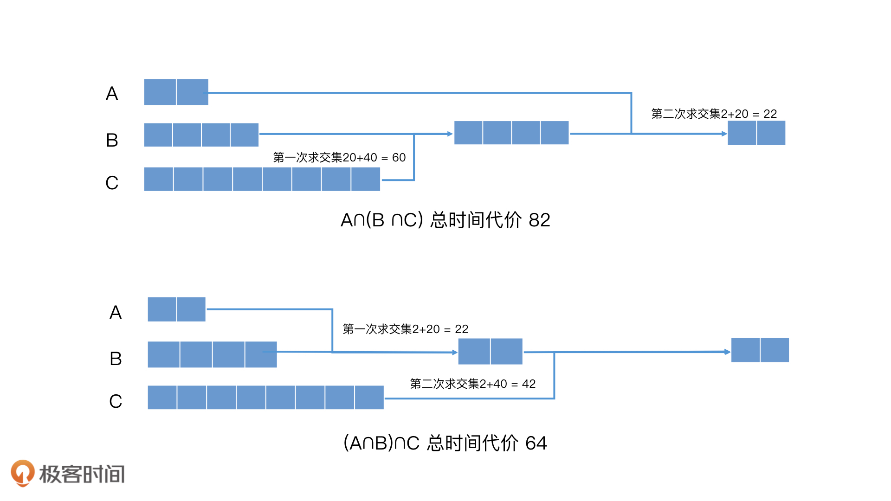
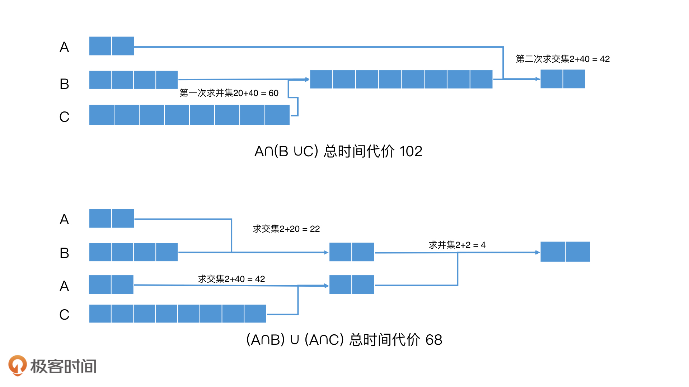
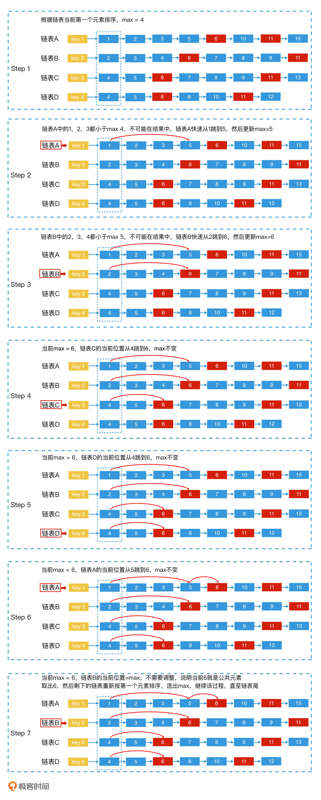
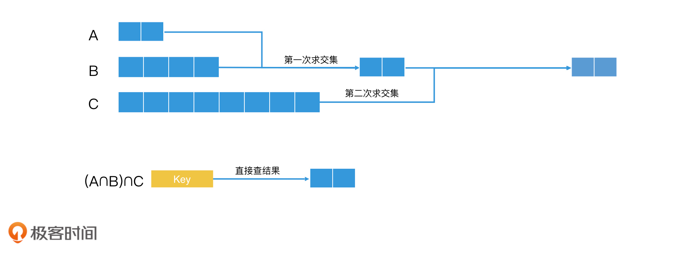
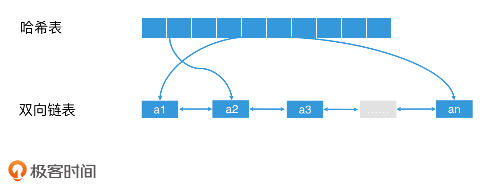

---
date: "2019-06-23"
---  
      
# 特别加餐 | 倒排检索加速（二）：如何对联合查询进行加速？
你好，我是陈东。欢迎来到检索专栏的第二次加餐时间。

在上一篇加餐中，我们讲了工业界中，倒排索引是怎么利用基础的数据结构来加速“求交集”过程的。现在，相信你已经对跳表、哈希表和位图的实际使用，有了更深刻的理解和认识了。然而，在日常的检索中，我们往往会面临更复杂的联合查询需求。这个时候，又该如何加速呢？

我们先来看一个例子：在一个系统的倒排索引中，有4个不同的key，分别记录着“北京”“上海”“安卓”“学生”，这些标签分别对应着4种人群列表。如果想分析用户的特点，我们需要根据不同的标签来选择不同的人群。这个时候，我们可能会有以下的联合查询方式：

1.  在“北京”或在“上海”，并且使用“安卓”的用户集合。抽象成联合查询表达式就是，（“北京”∪“上海”）∩“安卓”；
2.  在“北京”使用“安卓”，并且是“学生”的用户集合。抽象成联合查询表达式就是，“北京”∩“安卓”∩“学生”。

这只是2个比较有代表性的联合查询方式，实际上，联合查询的组合表达可以更长、更复杂。对于联合查询，在工业界中有许多加速检索的研究和方法，比如，调整次序法、快速多路归并法、预先组合法和缓存法。今天，我们就来聊一聊这四种加速方法。

## 方法一：调整次序法

<!-- [[[read_end]]] -->

首先，我们来看调整次序法。那什么是调整次序法呢？接下来，我们就以三个集合的联合查询为例，来一起分析一下。这里我再多说一句，虽然这次讲的是三个集合，但是对于多个集合，我们也是采用同样的处理方法。

假设，这里有A、B、C三个集合，集合中的元素个数分别为2、20、40，而且A包含在B内，B包含在C内。这里我先补充一点，如果两个集合分别有m个元素和n个元素，那使用普通的遍历归并合并它们的时间代价为O\(m+n\)。接着，如果我们要对A、B、C求交集，这个时候，会有几种不同的求交集次序，比如，A∩（B∩C）、（A∩B）∩C等。那我们该如何选择求交集的次序呢？下面，我们就以这两种求交集次序为例来分析一下，不同的求交集次序对检索效率的影响。

当求交集次序是A∩（B∩C）时，我们要先对B和C求交集，时间代价就是20+40 = 60，得到的结果集是B，然后B再和A求交集，时间代价是2 + 20 = 22。因此，最终一共的时间代价就是60 + 22 = 82。

那当求交集次序是（A∩B）∩C时，我们要先对A和B求交集，时间代价是2 + 20 = 22，得到的结果集是A，然后A再和C求交集，时间代价是2 + 40 = 42。因此，最终的时间代价就是22 + 42 = 64。这比之前的代价要小得多。

求A∩（B∩C）和（A∩B）∩C的过程

除了对A、B、C这三个集合同时取交集以外，还有一种常见的联合查询方式，就是对其中两个集合取并集之后，再和第三个集合取交集，比如A ∩（B∪C），你可以看我开头举的第一个例子。在这种情况下，如果我们不做任何优化，查询代价是怎么样的呢？让我们一起来看一下。

首先是执行B∪C的操作，时间代价是20 + 40 = 60，结果是C。然后再和A求交集，时间代价是2+40 = 42。一共是102。

这样的时间代价非常大，那针对这个查询过程我们还可以怎么优化呢？这种情况下，我们可以尝试使用数学公式，对先求并集再求交集的次序进行改造，我们先来复习一个集合分配律公式：

A∩（B∪C）=（A∩B）∪（A∩C）

然后，我们就可以把先求并集再求交集的操作，转为先求交集再求并集的操作了。那这个时候，查询的时间代价是多少呢？我们一起来看一下。

首先，我们要执行A∩B操作，时间代价是2+20 = 22，结果是A。然后，我们执行A∩C操作，时间代价是2+40=42，结果也是A。最后，我们对两个A求并集，时间代价是2+2=4。因此，最终总的时间代价是22 + 42 + 4 = 68。这比没有优化前的102要低得多。  

求A∩（B∪C）和（A∩B）∪（A∩C）的过程

这里有一点需要特别注意，如果求并集的元素很多，比如说（B∪C∪D∪E∪F），那我们用分配律改写的时候，A就需要分别和B到F求5次交集，再将5个结果求并集。这样一来，操作的次数会多很多，性能就有可能下降。因此，我们需要先检查B到F每个集合的大小，比如说，如果集合中元素个数都明显大于A，我们预测它们分别和A求交集能有提速的效果，那我们就可以使用集合分配律公式来加速检索。

不知道你有没有注意到，在一开始讲这两个例子的时候，我们假设了A、Ｂ、Ｃ有相互包含的关系，这是为了方便你更好地理解调整操作次序带来的效率差异。那在真实情况中，集合中的关系不会这么理想，但是我们分析得到的结论，依然是有效的。

## 方法二：快速多路归并法

**但是，**调整次序法有一个前提，就是集合的大小要有一定的差异，这样的调整效果才会更明显。那如果我们要对多个posting list求交集，但是它们的长度差异并不大，这又该如何优化呢？这个时候，我们可以使用跳表法来优化。

在对多个posting list求交集的过程中，我们可以**利用跳表的性质，快速跳过多个元素，加快多路归并的效率。**这种方法，我叫它"**快速多路归并法**"。在一些搜索引擎和广告引擎中，包括在Elastic Search这类框架里，就都使用了这样的技术。那具体是怎么做的呢？我们一起来看一下。

其实，快速多路归并法的思路和实现都非常简单，就是将n个链表的当前元素看作一个**有序循环数组**list\[n\]。并且，对有序循环数组从小到大依次处理，当有序循环数组中的最小值等于最大值，也就是所有元素都相等时，就说明我们找到了公共元素。

这么说可能比较抽象，下面，我们就以4个链表A、B、C、D求交集为例，来讲一讲具体的实现步骤。

第1步，将4个链表的当前第一个元素取出，让它们按照由小到大的顺序进行排序。然后，将链表也按照由小到大有序排列；

第2步，用一个变量max记录当前4个链表头中最大的一个元素的值；

第3步，从第一个链表开始，判断当前位置的值是否和max相等。如果等于max，则说明此时所有链表的当前元素都相等，该元素为公共元素，那我们就将该元素取出，然后回到第一步；如果当前位置的值小于max，则用**跳表法**快速调整到该链表中**第一个大于等于max的元素位置**；如果新位置元素的值大于max，则更新max的值。

第4步，对下一个链表重复第3步，就这样依次处理每个链表（处理完第四个链表后循环回到第一个链表，用循环数组实现），直到链表全部遍历完。

为了帮助你加深理解，我在下面的过程图中加了一个具体的例子，你可以对照前面的文字描述一起消化吸收。  
  
上图的例子中，我们通过以上4个步骤，找到了公共元素6。接下来，你可以试着继续用这个方法，去找下一个公共元素11。这里，我就不再继续举例了。

## 方法三：预先组合法

接下来，我们来说一说第三种方法，预先组合法。其实预先组合法的核心原理，和我们熟悉的一个系统实现理念一样，就是能提前计算好的，就不要临时计算。换一句话说，对于常见的联合查询，我们可以提前将结果算好，并将该联合查询定义一个key。那具体该怎么操作呢？

假设，key1、key2和key3分别的查询结果是A、B、C三个集合。如果我们经常会计算A∩B∩C，那我们就可以将key1+key2+key3这个查询定义为一个新的组合key，然后对应的posting list就是提前计算好的结果。之后，当我们要计算A∩B∩C时，直接去查询这个组合key，取出对应的posting list就可以了。  

直接提前组合计算

## 方法四：缓存法加速联合查询

预先组合的方法非常实用，但是在搜索引擎以及一些具有热搜功能的平台中，经常会出现一些最新的查询组合。这些查询组合请求量也很大，但是由于之前没有出现过，因此我们无法使用预先组合的方案来优化。这个时候，我们会使用**缓存技术**来优化。

那什么是缓存技术呢？缓存技术就是指将之前的联合查询结果保存下来。这样再出现同样的查询时，我们就不需要重复计算了，而是直接取出之前缓存的结果即可。这里，我们可以借助预先组合法的优化思路，为每一个联合查询定义一个新的key，将结果作为这个key的posting list保存下来。

但是，我们还要考虑一个问题：内存空间是有限的，不可能无限缓存所有出现过的查询组合。因此，对于缓存，我们需要进行内容替换管理。一种常用的缓存管理技术是**LRU**（Least Recently Used），也叫作**最近最少使用替换机制**。所谓最近最少使用替换机制，就是如果一个对象长期未被访问，那当缓存满时，它将会被替换。

对于最近最少使用替换机制，一个合适的实现方案是使用双向链表：当一个元素被访问时，将它提到链表头。这个简单的机制能起到的效果是：如果一个元素经常被访问，它就会经常被往前提；如果一个元素长时间未被访问，它渐渐就会被排到链表尾。这样一来，当缓存满时，我们直接删除链表尾的元素即可。

不过，我们希望能快速查询缓存，那链表的访问速度就不满足我们的需求了。因此，我们可以使用O\(1\)查询代价的哈希表来优化。我们向链表中插入元素时，同时向哈希表中插入该元素的key，然后这个key对应的value则是链表中这个节点的地址。这样，我们在查询这个key的时候，就可以通过查询哈希表，快速找到链表中的对应节点了。因此，使用“**双向链表+哈希表**”是一种常见的实现LRU机制的方案。  

使用双向链表+哈希表实现LRU机制

通过使用LRU缓存机制，我们就可以将临时的查询组合缓存起来，快速查询出结果，而不需要重复计算了。一旦这个查询组合不是热点了，那它就会被LRU机制替换出缓存区，让位给新的热点查询组合。

缓存法在许多高并发的查询场景中，会起到相当大的作用。比如说在搜索引擎中，对于一些特定时段的热门查询，缓存命中率能达到60\%以上甚至更高，会大大加速系统的检索效率。

## 重点回顾

好了，今天的内容就讲到这里。今天我们学习了联合查询的4种优化方法，我们一起来回顾一下。

第1种方法是调整次序法，它是通过从小到大求交集，以及使用集合分配律改写查询，使得检索效率得到提升。

第2种方法是快速多路归并法，它是利用跳表快速跳过多个元素的能力，结合优化的多路归并方案，提升多个posting list归并性能的。

第3种方法是预先组合法，也就是将热门的查询组合提前处理好，作为一个单独的key，保存提前计算好的posting list。

第4种则是使用缓存法，将临时的热点查询组合进行结果缓存处理，避免重复查询每次都要重复计算。

你会看到，这4种方法分别从数学、算法、线下工程和线上工程，这四种不同的方向对联合查询进行了优化。同时使用它们，能让我们从多个维度对联合查询进行加速。

通过上一篇加餐，我相信你也体会到了，如果我们能合理组合和灵活应用简单的数据结构和算法，就能构建出复杂的架构，让它们在工业界的大规模系统中发挥重要的作用。那通过这一篇加餐，你还可以体会到，基础知识的全面性能帮助你从不同的维度去思考，教你用更多的手段去优化系统。

因此，在学习的金字塔中，扎实和稳健的基础知识永远是最重要。多花点时间，打好基础，我相信你一定会有巨大的收获！

## 课堂讨论

最后，我们还是来看一道讨论题。

对于今天介绍的四种方案，你觉得哪一种给你的印象最深刻？你会尝试在怎么样的场景中使用它？为什么？

欢迎在留言区畅所欲言，说出你的思考过程和答案。如果有收获，也欢迎把这篇文章分享给你的朋友。