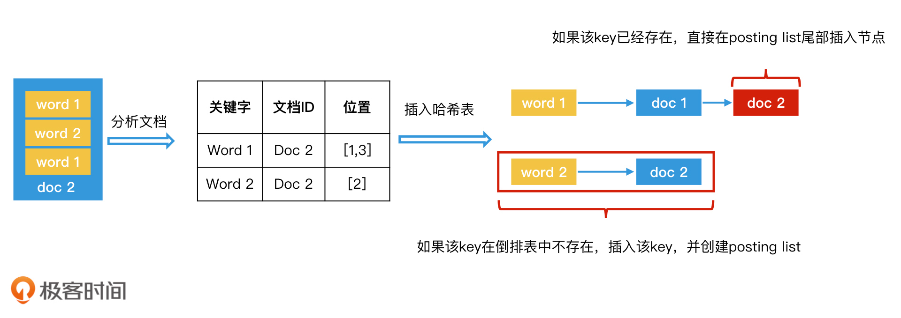
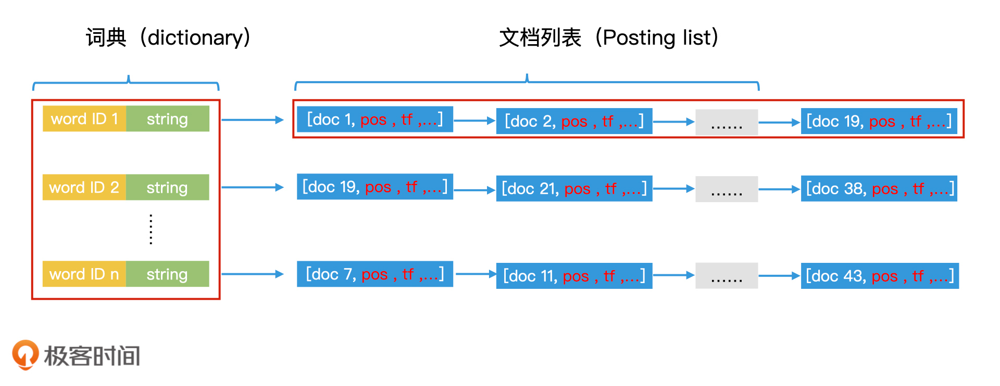
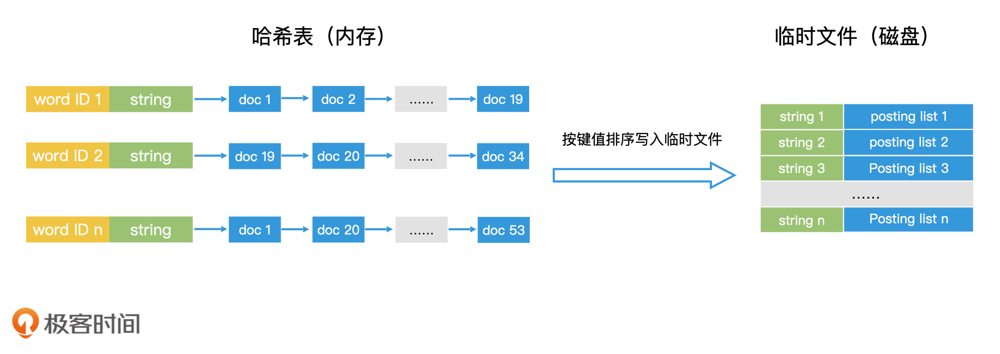
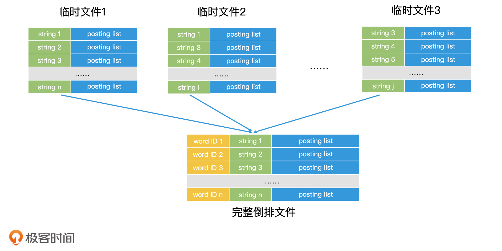
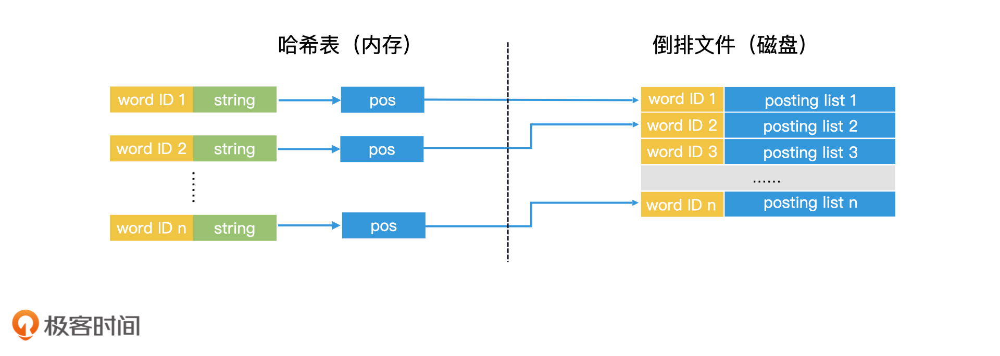
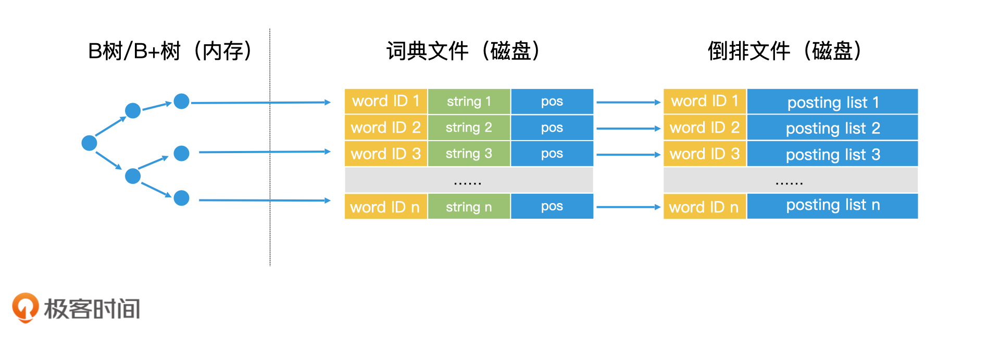

---
date: "2019-06-23"
---  
      
# 08 | 索引构建：搜索引擎如何为万亿级别网站生成索引？
你好，我是陈东。

对基于内容或者属性的检索场景，我们可以使用倒排索引完成高效的检索。但是，在一些超大规模的数据应用场景中，比如搜索引擎，它会对万亿级别的网站进行索引，生成的倒排索引会非常庞大，根本无法存储在内存中。这种情况下，我们能否像B+树或者LSM树那样，将数据存入磁盘呢？今天，我们就来聊一聊这个问题。

## 如何生成大于内存容量的倒排索引？

我们先来回顾一下，对于能够在内存中处理的小规模的文档集合，我们是如何生成基于哈希表的倒排索引的。步骤如下：

1.  给每个文档编号，作为它们的唯一标识，并且排好序；
2.  顺序扫描每一个文档，将当前扫描的文档中的所有内容生成\<关键字，文档ID，关键字位置>数据对，并将所有的\<关键字，文档ID，关键字位置>这样的数据对，都以关键字为key存入倒排表（位置信息如果不需要可以省略）；
3.  重复第2步，直到处理完所有文档。这样就生成一个基于内存的倒排索引。  
    

内存中生成倒排索引

对于大规模的文档集合，如果我们能将它分割成多个小规模文档集合，是不是就可以在内存中建立倒排索引了呢？这些存储在内存中的小规模文档的倒排索引，最终又是怎样变成一个完整的大规模的倒排索引存储在磁盘中的呢？这两个问题，你可以先思考一下，然后我们一起来看工业界是怎么做的。

<!-- [[[read_end]]] -->

首先，搜索引擎这种工业级的倒排索引表的实现，会比我们之前学习过的更复杂一些。比如说，如果文档中出现了“极客时间”四个字，那除了这四个字本身可能被作为关键词加入词典以外，“极客”和“时间”还有“极客时间”这三个词也可能会被加入词典。因此，完整的词典中词的数量会非常大，可能会达到几百万甚至是几千万的级别。并且，每个词因为长度不一样，所占据的存储空间也会不同。

所以，为了方便后续的处理，我们不仅会为词典中的每个词编号，还会把每个词对应的字符串存储在词典中。此外，在posting list中，除了记录文档ID，我们还会记录该词在该文档中出现的每个位置、出现次数等信息。因此，posting list中的每一个节点都是一个复杂的结构体，每个结构体以文档ID为唯一标识。完整的倒排索引表结构如下图所示：  

倒排索引（哈希表实现）

那么，我们怎样才能生成这样一个工业级的倒排索引呢？

首先，我们可以将大规模文档均匀划分为多个小的文档集合，并按照之前的方法，为每个小的文档集合在内存中生成倒排索引。

接下来，我们需要将内存中的倒排索引存入磁盘，生成一个临时倒排文件。我们先将内存中的文档列表按照关键词的字符串大小进行排序，然后从小到大，将关键词以及对应的文档列表作为一条记录写入临时倒排文件。这样一来，临时文件中的每条记录就都是有序的了。

而且，在临时文件中，我们并不需要存储关键词的编号。原因在于每个临时文件的编号都是局部的，并不是全局唯一的，不能作为最终的唯一编号，所以无需保存。  

生成磁盘中的临时文件

我们依次处理每一批小规模的文档集合，为每一批小规模文档集合生成一份对应的临时文件。等文档全部处理完以后，我们就得到了磁盘上的多个临时文件。

那磁盘上的多个临时文件该如何合并呢？这又要用到我们熟悉的多路归并技术了。每个临时文件里的每一条记录都是根据关键词有序排列的，因此我们在做多路归并的时候，需要先将所有临时文件当前记录的关键词取出。如果关键词相同的，我们就可以将对应的posting list读出，并且合并了。

如果posting list可以完全读入内存，那我们就可以直接在内存中完成合并，然后把合并结果作为一条完整的记录写入最终的倒排文件中；如果posting list过大无法装入内存，但posting list里面的元素本身又是有序的，我们也可以将posting list从前往后分段读入内存进行处理，直到处理完所有分段。这样我们就完成了一条完整记录的归并。

每完成一条完整记录的归并，我们就可以为这一条记录的关键词赋上一个编号，这样每个关键词就有了全局唯一的编号。重复这个过程，直到多个临时文件归并结束，这样我们就可以得到最终完整的倒排文件。  

多个临时文件归并生成完整的倒排文件

这种将大任务分解为多个小任务，最终根据key来归并的思路，其实和分布式计算Map Reduce的思路是十分相似的。因此，这种将大规模文档拆分成多个小规模文档集合，再生成倒排文件的方案，可以非常方便地迁移到Map Reduce的框架上，在多台机器上同时运行，大幅度提升倒排文件的生成效率。那如果你想了解更多的内容，你可以看看Google在2004年发表的经典的map reduce论文，论文里面就说了使用map reduce来构建倒排索引是当时最成功的一个应用。

## 如何使用磁盘上的倒排文件进行检索？

那对于这样一个大规模的倒排文件，我们在检索的时候是怎么使用的呢？其实，使用的时候有一条核心原则，那就是**内存的检索效率比磁盘高许多，因此，能加载到内存中的数据，我们要尽可能加载到内存中**。

我们知道，一个倒排索引由两部分构成，一部分是key集合的词典，另一部分是key对应的文档列表。在许多应用中，词典这一部分数据量不会很大，可以在内存中加载。因此，我们完全可以将倒排文件中的所有key读出，在内存中使用哈希表建立词典。  

词典加载在内存中，文档列表存在磁盘

那么，当有查询发生时，通过检索内存中的哈希表，我们就能找到对应的key，然后将磁盘中key对应的postling list读到内存中进行处理了。

说到这里，你可能会有疑问，如果词典本身也很大，只能存储在磁盘，无法加载到内存中该怎么办呢？其实，你可以试着将词典看作一个有序的key的序列，那这个场景是不是就变得很熟悉了？是的，我们完全可以用B+树来完成词典的检索。

这样一来，我们就可以把检索过程总结成两个步骤。第一步，我们使用B+树或类似的技术，查询到对应的词典中的关键字。第二步，我们将这个关键字对应的posting list读出，在内存中进行处理。  

词典文件+倒排文件

到这里，检索过程我们就说完了。不过，还有一种情况你需要考虑，那就是如果posting list非常长，它是很有可能无法加载到内存中进行处理的。比如说，在搜索引擎中，一些热门的关键词可能会出现在上亿个页面中，这些热门关键词对应的posting list就会非常大。那这样的情况下，我们该怎么办呢？

其实，这个问题在本质上和词典无法加载到内存中是一样的。而且，posting list中的数据也是有序的。因此，我们完全可以对长度过大的posting list也进行类似B+树的索引，只读取有用的数据块到内存中，从而降低磁盘访问次数。包括在Lucene中，也是使用类似的思想，用分层跳表来实现posting list，从而能将posting list分层加载到内存中。而对于长度不大的posting list，我们仍然可以直接加载到内存中。

此外，如果内存空间足够大，我们还能使用缓存技术，比如LRU缓存，它会将频繁使用的posting list长期保存在内存中。这样一来，当需要频繁使用该posting list的时候，我们可以直接从内存中获取，而不需要重复读取磁盘，也就减少了磁盘IO，从而提升了系统的检索效率。

总之，对于大规模倒排索引文件的使用，本质上还是我们之前学过的检索技术之间的组合应用。因为倒排文件分为词典和文档列表两部分，所以，检索过程其实就是分别对词典和文档列表的访问过程。因此，只要你知道如何对磁盘上的词典和文档列表进行索引和检索，你就能很好地掌握大规模倒排文件的检索过程。

## 重点回顾

今天，我们学习了使用多文件归并的方式对万亿级别的网页生成倒排索引，还学习了针对这样大规模倒排索引文件的检索，可以通过查询词典和查询文档列表这两个阶段来实现。

除此之外，我们接触了两个很基础但也很重要的设计思想。

一个是尽可能地将数据加载到内存中，因为内存的检索效率大大高于磁盘。那为了将数据更多地加载到内存中，索引压缩是一个重要的研究方向，目前有很多成熟的技术可以实现对词典和对文档列表的压缩。比如说在Lucene中，就使用了类似于前缀树的技术FST，来对词典进行前后缀的压缩，使得词典可以加载到内存中。

另一个是将大数据集合拆成多个小数据集合来处理。这其实就是分布式系统的核心思想。在大规模系统中，使用分布式技术进行加速是很重要的一个方向。不过，今天我们只是学习了利用分布式的思想来构建索引，在后面的课程中，我们还会进一步地学习，如何利用分布式技术优化检索效率。

## 课堂讨论

词典如果能加载在内存中，就会大幅提升检索效率。在哈希表过大无法存入内存的情况下，我们是否还有可能使用其他占用内存空间更小的数据结构，来将词典完全加载在内存中？有序数组和二叉树是否可行？为什么？

欢迎在留言区畅所欲言，说出你的思考过程和最终答案。如果有收获，也欢迎把这篇文章分享给你的朋友。