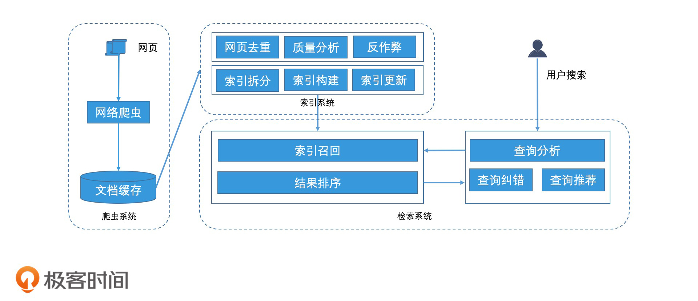
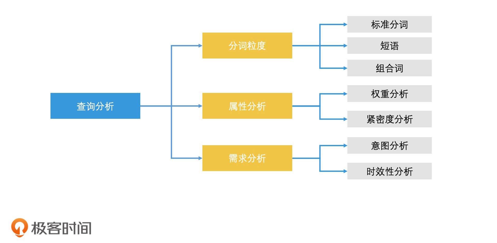
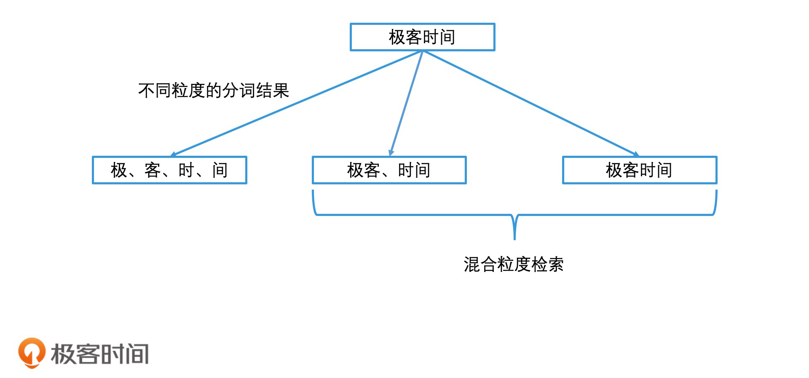
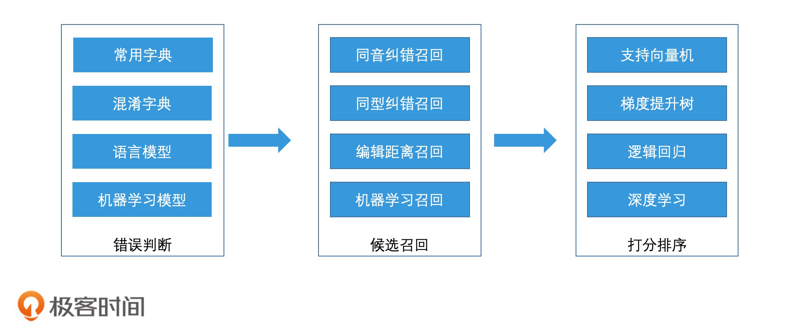

---
date: "2019-06-23"
---  
      
# 18 | 搜索引擎：输入搜索词以后，搜索引擎是怎么工作的？
你好，我是陈东。今天我来讲讲搜索引擎的核心架构。

搜索引擎你应该非常熟悉，它是我们学习和工作中非常重要的一个工具。它的特点是能在万亿级别的网页中，快速寻找出我们需要的信息。可以说，以搜索引擎为代表的检索技术，是所有基于文本和关键词的检索系统都可以学习和参考的。

那今天，我们就一起来聊一聊，在输入搜索词以后，搜索引擎是怎么工作的。

首先，我们一起来了解一下搜索引擎的核心架构和工作过程。然后再重点分析其中的检索系统。

## 搜索引擎的整体架构和工作过程

搜索引擎会涉及非常多技术领域。其中，比较重要的有网页抓取、文本分析、检索模型、索引技术、链接分析、反作弊、云存储和云计算。正是因为涉及的领域非常多，所以搜索引擎完整的系统架构也非常复杂，会由许多子系统组成。

不过，我们可以从功能结构上，把搜索引擎的核心系统分为三部分，分别是爬虫系统、索引系统和检索系统。  

接下来，我们就分别说说，这三部分子系统具体的作用和工作过程。

**首先是爬虫系统。**

一个好的搜索引擎，必须要能采集足够多的网页。因此，我们需要通过高性能的爬虫系统来完成持续的网页抓取，并且将抓取到的网页存入存储平台中。一般来说，我们可以将抓取到的网页存放在基于LSM树的HBase中，以便支持数据的高效读写。

<!-- [[[read_end]]] -->

**其次是索引系统。**

在爬虫系统抓取到网页之后，我们需要对这些网页进行一系列的处理，它们才可以变成可用的索引。处理可以分为两个阶段，首先是对网页进行预处理，主要的手段包括相似网页去重、网页质量分析、分词处理等工作，然后是对网页进行反作弊的分析工作，来避免一些作弊网页干扰搜索结果。

处理好网页之后，我们就要为搜索引擎生成索引，索引的生成过程主要可以分为三步。

**第一步，索引拆分**。由于抓取到的网页量级非常大，把它们全部都生成索引不太现实，因此我们会在离线阶段，根据之前的网页预处理结果，进行计算和筛选，分别分离出高质量和普通质量的网页集合。这样，我们就能进行分层索引了（[第12讲](https://time.geekbang.org/column/article/227161)）。当然，无论是高质量的网页集合还是普通质量的网页集合，数据量都不小。因此，我们还需要进行基于文档的拆分（[第10讲](https://time.geekbang.org/column/article/225869)），以便生成索引。

**第二步，索引构建**。在确认了索引的分片机制以后，我们可以使用Map Reduce服务，来为每个索引分片生成对应的任务，然后生成相应的倒排索引文件（[第8讲](https://time.geekbang.org/column/article/222810)）。每个倒排索引文件代表一个索引分片，它们都可以加载到线上的服务器中，来提供检索服务。

**第三步，索引更新**。为了保证能实时更新数据，搜索引擎会使用全量索引结合增量索引的机制来完成索引更新。并且由于搜索引擎的全量索引数据量巨大，因此，我们一般使用滚动合并法来完成索引更新（[第9讲](https://time.geekbang.org/column/article/222807)）。

有了这样创建出来的索引之后，搜索引擎就可以为万亿级别的网页提供高效的检索服务了。

**最后是检索系统。**

在检索阶段，如果用户搜索了一个关键词，那么搜索引擎首先需要做查询分析，也就是通过分析查询词本身以及用户行为特征，找出用户的真实查询意图。如果发现查询词有误或者结果很少，搜索引擎还会进行拼写纠正或相关查询推荐，然后再以改写后的查询词去检索服务中查询结果。

在检索服务中，搜索引擎会将查询词发送给相应的索引分片，索引分片通过倒排索引的检索机制，将自己所负责的分片结果返回。对于返回的结果，搜索引擎再根据相关性分析和质量分析，使用机器学习进行打分，选出Top K个结果（[第11讲](https://time.geekbang.org/column/article/226100)）来完成检索。

以上就是一个搜索引擎的完整的工作机制了。那与广告引擎和推荐引擎相比，**搜索引擎最大的特点，就是它有一个很强的检索约束条件，那就是用户输入的查询词。可以说，查询词是搜索引擎进行检索的最核心的信息。**但是很多时候，用户输入的查询词是含糊的、不精准的，甚至是带有错误的。还有一种可能是，用户输入的查询词不在倒排索引中。

这些问题也都是搜索引擎要解决的核心问题。因此，接下来，我们就以搜索“极客时间”为例，来讲讲搜索引擎的解决方案。

## 搜索引擎是如何进行查询分析的？

一般来说，用户在搜索的时候，搜索词往往会非常简短，很难完全体现用户的实际意图。而如果我们无法准确地理解用户的真实意图，那搜索结果的准确性就无从谈起了。因此，搜索引擎中检索系统的第一步，一定是进行查询分析。具体来说，就是理解用户输入的搜索词，并且对输错的查询词进行查询纠正，以及对意图不明的查询词进行查询推荐。那查询分析具体该怎么做呢？

在查询分析的过程中，我们主要会对搜索词进行分词粒度分析、词的属性分析、用户需求分析等工作。其中，分词粒度分析直接关系到我们以什么key去倒排索引中检索，而属性分析和需求分析则可以帮助我们在打分排序时，有更多的因子可以考虑。因此，**分词粒度分析是查询分析的基础**。那什么是分词粒度分析呢？  

分词粒度分析是中文搜索中特有的一个环节。因为中文词和英文词相比，最大的区别是词与词之间没有明确的分隔标志（空格）。因此，对于中文的搜索输入，我们要做的第一件事情，是使用分词工具进行合理的分词。但分词，就会带来一个分词粒度的问题。

比如说，当用户输入“极客时间”时：如果我们按单字来切分，这个搜索词就会变成“极/客/时/间”这四个检索词；如果是按“极客/时间”来切分，就会变成两个检索词的组合；如果是不做任何分词，将“极客时间”当成一个整体，那就是一个搜索短语。切分的方式这么多，到底我们该怎么选择呢？

一般来说，我们会使用默认的标准分词粒度再结合整个短语，作为我们的检索关键词去倒排索引中检索，这就叫作混合粒度的分词方式。那“极客时间”就会被分为【极客、时间、极客时间】这样的检索词组合。如果检索后返回的结果数量不足，那我们还会去查询【极、客、时、间】这样的更细粒度的单字组合。  

## 搜索引擎是如何进行查询纠错的？

以上，都是在用户输入正确搜索词时的查询分析。那如果用户的输入有误，比如说，将“极客时间”输成了“即可时间”，或者是“级可时间”，搜索引擎又会怎么办呢？这个时候，我们就需要用到查询纠错功能和查询推荐功能了。

我们先来说一说查询纠错功能是如何使用的。查询纠错的过程一般会分为三个步骤，分别是错误判断、候选召回和打分排序。  

一般来说，在错误判断阶段，我们会根据人工编辑以及对搜索日志进行数据挖掘，得到常见字典和混淆字典。然后，我们使用哈希表或者字典树等结构来对字典进行索引，使得这两个字典具有高效的检索能力。如果某个分词后的检索词，我们无法在常用字典中查询到，或者它出现在了混淆字典中，那就说明这个词很可能是错误的。因此，我们还需要启动后续的候选召回和打分排序步骤。

不过，近年来，基于语言模型和机器学习的错误判断方式被广泛地使用。这种判断方式具体来说就是，我们会在用户输入检索词后，先对其进行置信度判断，如果得分过低，再进入后续的纠错过程。这能帮助我们更好地进行纠错。为什么这么说呢？我们来看一个例子，如果我们将“极客”错误地输入成了“级可”，通过检索常用字典和混淆字典，我们是有可能发现这个错误的。但如果我们错输成“即可”，由于“即可”本身也是一个合理的词，因此我们就需要使用基于语言模型和机器学习的方法，计算“即可”这个词出现在这个上下文中的置信度，才能发现有错。

在错误判断完成之后，就进入候选召回阶段了。在候选召回中，我们会预估查询词出错的每种可能性，提前准备好可能的正确结果。一般情况下，中文输入有2种常见的出错情况。

第1种，拼音相同但是字不同。这时，我们就要将相同拼音的词作为候选集，以拼音为Key进行检索。第2种是字形相似，那我们就生成一个相似字型的词典，通过该词典召回候选集。此外，还有根据编辑距离进行相似召回，根据机器学习得到候选集进行召回等。通过这些不同的纠错方式，我们就能得到可能的纠错结果集合了。

最后，我们要对众多的纠错结果进行打分排序。在这个过程中，我们可以使用各种常见的机器学习和深度学习算法进行打分判断（你可以回忆一下11讲，我们讲过的那些方法），将得分最高的纠错结果返回。这样就完成了整个查询纠错过程。

好了，到这里，我们就把查询纠错的过程说完了。至于查询推荐，则更多的是分析搜索日志的结果，用“查询会话”“点击图”等技术，来分析哪些检索词之间有相关性。比如说，如果检索“极客时间”和检索“极客邦”的用户都会浏览相同的网页，那么“极客邦”就很有可能出现在“极客时间”的相关推荐中。

因此，查询推荐可以提供出更多的关键词，帮助搜索引擎召回更多的结果。它一般会在关键词不足的场景下被启用，或是作为补充提示出现。所以，关于查询推荐我就不再多说了，你只要记住查询推荐的原理就可以了。

总的来说，通过查询分析、查询纠错、查询推荐的过程，搜索引擎就能对用户的意图有一个更深入的理解。那接下来，我们就通过得到的一系列关键词，也就是【极客、时间、极客时间】，去查询倒排索引了。

## 搜索引擎是如何完成短语检索的？

首先，我们可以使用“极客时间”作为一个完整的关键词去倒排索引中查找。如果倒排索引中能查询到这个关键词，并且返回的结果集足够，那这样的检索结果是非常精准的。但是，这依赖于我们在构建索引的时候，必须将“极客时间”作为一个关键词进行处理。

可是在构建倒排索引的时候，我们一般是通过分析搜索日志，将一些常见的热门短语作为关键词加入倒排索引中。由于能被直接作为关键词的短语数量不会太多，因此，如果“极客时间”没有被识别为热门短语进行单独处理的话，那我们拿着“极客时间”这个短语作为关键词，直接查询的结果就是空的。

在这种情况下，我们就会使用更细粒度的分词结果，也就是使用“极客”和“时间”这两个关键词，去做两次检索，然后将得到的结果求交集合并。不过，这样做就会有一个问题：如果只是简单地将这两个关键词检索出来的文档列表求交集合并，那我们最终得到的结果并不一定会包含带有“极客时间”的文档。这又是为什么呢？

你可以考虑一下这种情况：如果有一个网页中有一句话是“一个极客往往没有时间打游戏”。那我们搜索“极客”“时间”这两个关键词的时候，这个网页就会被检索出来。但这是我们期望的检索结果吗？并不是。因为“极客”和“时间”的位置离得太远了。

那如果我们能记录下关键词出现在文档中的位置，并且在合并文档列表的时候，判断两个关键词是否接近，不就可以解决这个问题？没错，这种方法就叫作**位置信息索引法**。我们会通过两个关键词的位置关系来判断该文档和检索词的相关性。位置越远，相关性就越小，如果位置直接邻接在一起，相关性就最高。

如果是两个以上的关键词联合查询，那我们会将同时包含所有关键词的最小片段称为最小窗口，然后通过衡量查询结果中最小窗口的长度，来判断多个关键词是否接近。这么说比较抽象，我们来举个例子。当我们分别以“极”“客”“时”“间”这四个字作为关键词查询时，如果一个文档中有这么一句话“**极**多**客**人，一**时**之**间**”，那字符“极”到字符“间”之间就是9个字符。也就是说，在这句话中覆盖“极”“客”“时”“间”这四个关键词的最小窗口长度就是9。

有了这个方法，我们就可以将搜索结果按照最小窗口长度排序，然后留下相关性最高的一批结果了。这样，我们就完成“极客时间”的短语检索了。

## 重点回顾

今天，我们主要讲了搜索引擎的整体架构和工作原理。并且，由于搜索引擎的业务特点会非常依赖用户输入的查询词，因此，我们还重点讨论了搜索引擎对查询词进行的一系列特殊处理技术。

通常的流程是，先对查询词进行查询分析，搜索引擎通过对查询词进行不同粒度的分词，得到多个检索词。在这个过程中，搜索引擎还会通过查询纠错和相似推荐，拓展出更多的检索词候选。

然后，搜索引擎会利用得到的检索词在倒排索引中进行短语检索。这个时候，搜索引擎会通过位置信息索引法，来判断检索结果和检索词的相关性。最后，搜索引擎会通过对搜索结果中最小窗口的长度排序，留下相关性最高的结果。

除此之外，你还会看到很有意思的一点：查询纠错中也存在候选召回和打分排序这两个环节。实际上，许多业务的核心检索过程，都可以抽象为候选召回和打分排序这两个阶段，包括我们后面会讲到的广告系统和推荐系统也是一样。因此，如何将一个业务根据自身的特点，抽象成合适的检索过程，是 一个很重要的设计能力。那这部分内容我希望你能多看几遍，来加深理解，后面的课程中，我们也会继续学习相关的内容。

## 课堂讨论

1.  在使用位置信息索引法中，我们在计算最小窗口的时候需要保证关键词是有序的。如果这个时候有两个关键词的话，我们可以先固定第一个关键词，然后只找它和第二个关键词的距离就可以了。那如果有3个关键词，我们又该如何保证次序呢？
2.  对于搜索引擎的检索技术，你还有什么想要了解和讨论的？

欢迎在留言区畅所欲言，说出你的思考过程和最终答案。如果有收获，也欢迎把这一讲分享给你的朋友。