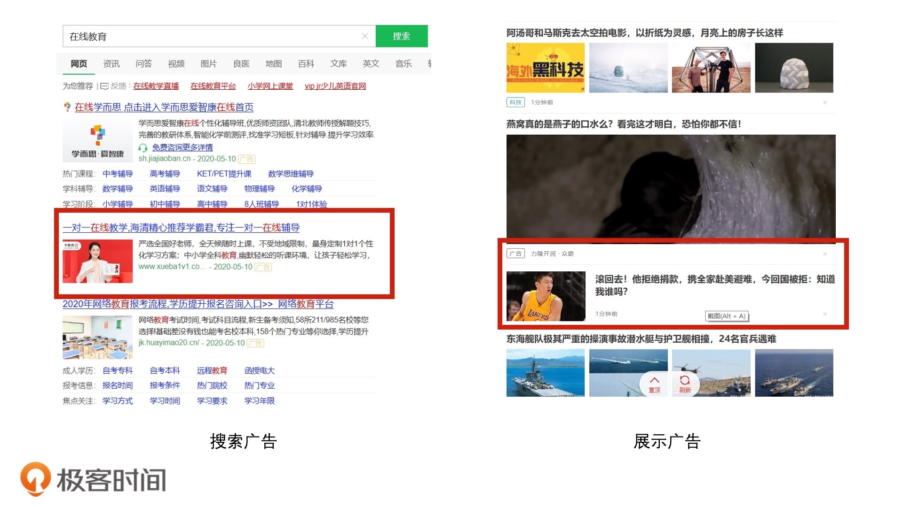
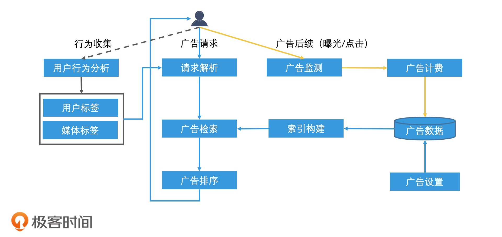
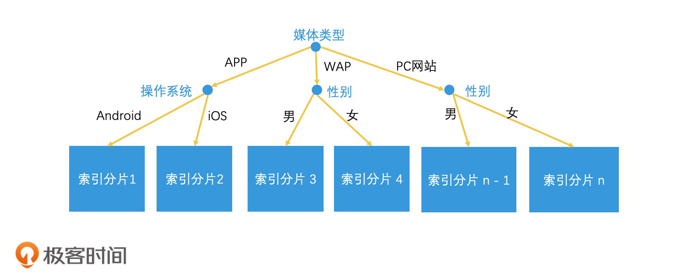
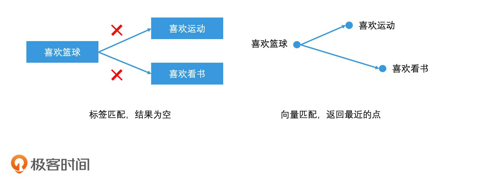
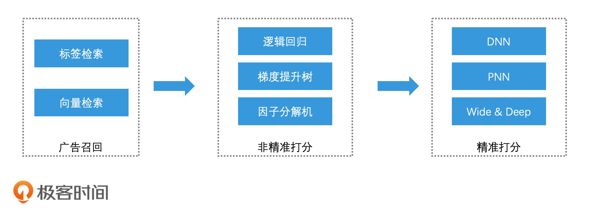
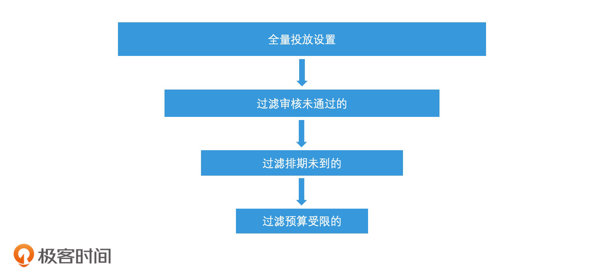
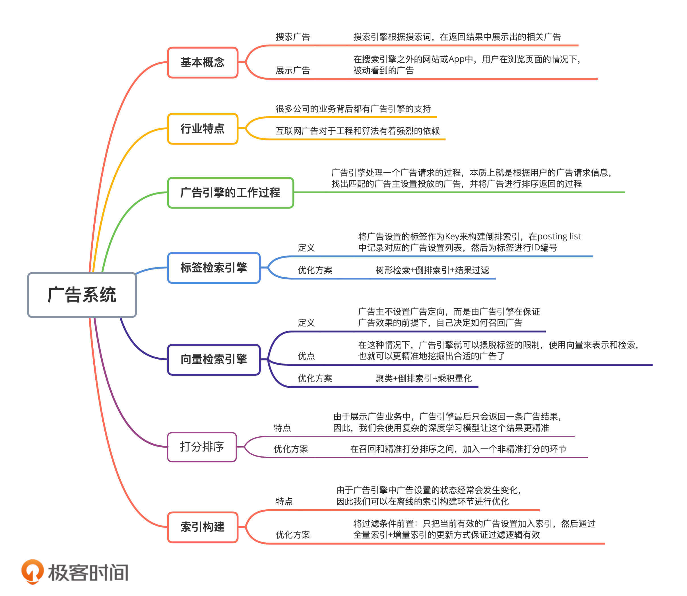

---
date: "2019-06-23"
---  
      
# 19 | 广告系统：广告引擎如何做到在0.1s内返回广告信息？
你好，我是陈东。今天我们来讲广告系统。

说到广告系统，很多人可能没有那么熟悉。但是在互联网行业中，广告系统其实是非常重要，并且非常有代表性的一种系统。

一方面是因为，广告是许多互联网公司的重要营收来源。比如，我们熟悉的Google和Facebook，它们的广告收入就占公司总收入的80\%以上。因此，尽管许多互联网公司的主营业务并不一样，有的是搜索引擎，有的是电商平台，有的是视频平台等等。但是，它们背后都有着相似的广告业务线。

另一方面，互联网广告对于工程和算法有着强烈的依赖。强大的工程和算法让现在的互联网广告能做到千人千面。最常见的，我们在打开网站的一瞬间，广告系统就会通过实时的分析计算，从百万甚至千万的广告候选集中，为我们这一次的广告请求选出专属的广告。而且，整个响应广告请求的处理过程，只需要0.1秒就能完成。

那在大型广告系统中，广告的请求量其实非常大，每秒钟可能有几十万甚至上百万次。因此，广告系统是一个典型的高并发低延迟系统。事实上，这背后离不开一个高性能的广告检索引擎的支持。那今天，我们就来聊一聊，广告系统中负责检索功能的广告引擎架构。

## 广告引擎的整体架构和工作过程

首先，我们来了解两个基本概念。

<!-- [[[read_end]]] -->

互联网广告分为搜索广告和展示广告两大类。简单来说，搜索广告就是用户主动输入关键词以后，搜索引擎在返回结果中展示出的相关广告。而展示广告，则是在搜索引擎之外的网站或App中，用户在浏览页面的情况下，被动看到的广告。比如说，在打开一些App时出现的开屏广告，以及朋友圈中的广告等等。  

尽管这两种广告的业务形态不太一样，但是它们后台的广告引擎本质上都是相似的，主要的区别是约束条件上的不同。

在搜索广告中，因为它和搜索词有很强的相关性，所以，我们需要针对搜索词进行一系列的分析，这和我们上一讲说过的查询分析过程类似，这里我就不多讲了。而展示广告没有搜索词的约束条件，展示能力也就更灵活。因此，今天我们主要以展示广告为例，来说一说从用户打开网站到看到广告，广告系统是如何工作的。

为了方便你理解，我梳理了一张广告引擎的核心功能架构图。接下来，我就依据这个架构图，从**用户浏览**和**广告主投放广告**这两个方面，来为你详讲解一下广告引擎的工作过程。  

一方面，当用户浏览网页时，网页会向服务端发起一个广告请求。服务端接到广告请求后，会先进行请求解析，也就是通过用户在系统中的唯一ID、网站地址以及广告位ID，去后台查询相关的广告请求的扩展信息。

那怎么查询呢？一般来说，通过系统之前对用户的长期行为收集和分析，我们就能知道该用户的喜好，比如喜欢看篮球、喜欢购物等。根据得到的结果，我们会为用户打上相应的标签。同理，对于各种网页和广告位，我们也会分析好网页分类等信息。然后，我们会提前将这些分析好的结果保存在Key-value数据库中，以支持快速查询。这样一来，广告请求解析就可以通过查询Key-value数据库，得到相关信息了。

另一方面，广告主在投放广告时，为了保证广告的后续效果，往往会进行广告设置，也就是给广告投放加上一些定向投放的条件。比如说，只投放给北京的用户，年龄段在20岁以上，对篮球感兴趣，使用某一型号的手机等。这些限制条件，我们都可以用标签的形式来表示。因此，一个广告设置，抽象出来就是一系列标签的组合。

所以我们说，**广告引擎处理一个广告请求的过程，本质上就是根据用户的广告请求信息，找出标签匹配的广告设置，并将广告进行排序返回的过程**。这一点非常重要，我们后面讲的内容都是围绕它来展开的，我希望你能记住它。

返回广告以后，我们还需要收集广告的后续监测数据，比如说是否展现给了用户，以及是否被用户点击等后续行为。那有些后续行为还涉及广告计费，比如，如果广告是按点击付费的话，那么只要有用户点击了广告，就会产生对应的费用。这时广告系统不仅需要进行相应的计费，还需要快速修改系统中的广告数据，使得系统能在广告主的预算花完之后就立即停止投放。

好了，以上就是广告引擎的工作过程。你会发现，尽管广告引擎在业务形态和流程上都有自己的特点，但是，它的核心检索流程和搜索引擎是类似的，也分为了索引构建、检索召回候选集和排序返回这三个部分。不过，和搜索引擎相比，由于广告引擎没有明确的关键词限制，因此在如何构造倒排索引上，广告引擎会有更大的灵活度。

接下来，我们就一起来看看，广告引擎是怎么结合自己的业务特点，来进行高性能的检索设计，从而能在0.1秒内返回合适的广告。

## 标签检索：合理使用标签过滤和划分索引空间

广告引擎的索引设计思路，是将广告设置的标签作为Key来构建倒排索引，在posting list中记录对应的广告设置列表，然后为标签进行ID编号，让系统处理标签的过程能更高效。这么说比较抽象，我来举个例子。

如果广告设置的标签是“地域：北京”“兴趣：篮球”“媒体：体育网站”，那我们可以使用一个32位的整数为每个标签进行编号。具体来说就是将32位的整数分为两部分，高位用来表示定向类型，低位用来表示这个定向类型下具体的标签。

比如说，我们采用高8位作为定向类型的编码，用来表示地域定向、兴趣定向和媒体定向等。用低24位，则作为这个定向类型下面的具体内容。那在地域定向里，低24位就是每个地区或者城市自己的编码。这样，我们就可以将广告设置的标签都转为一个编号了（高、低位的分配是可以根据实际需求灵活调整的）。  

### 1\. 将标签加入过滤列表

那是不是所有的标签都可以作为倒排索引的Key呢？你可以先自己想一想，我们先来看一个例子。

如果所有的广告投放设置都选择投放在App上，那么“媒体类型：App”这个标签后面的posting list就保存了所有的广告设置。但是，这样的标签并不能将广告设置区分开。为了解决这个问题，我们可以使用类似TF-IDF算法中计算IDF的方式，找出区分度低的标签，不将它们加入倒排索引。

那我们什么时候使用这些标签呢？我们可以将这些标签加入“过滤列表”中，然后在倒排索引中检索出结果以后，加上一个过滤环节，也就是对检索结果进行遍历，在遍历过程中使用“过滤列表”中的标签进行检查，这样就完成了标签是否匹配的判断。

### 2\. 用标签进行索引分片

其实，对于标签的匹配使用，我们还有其他的方案。我们再来看一个例子，假设平台中有一半的广告投放设置希望投放在移动App上，另一半希望投放在PC网站上，那如果我们以“媒体类型：App”和“媒体类型：PC网站”作为标签来建立倒排索引的话，这样的标签是有区分度的。但是由于这两个标签后面的posting list都会非常长，各自都保存着一半的广告设置。因此在进行posting list归并的时候，实际上就等于要遍历一半的广告设置。这反而会降低检索效率。

因此，对于“媒体类型”这类（以及“性别”、“操作系统”等）具有少量的标签值，但是每个标签值都有大规模区分度的设置维度来说，我们可以不把它们加入到倒排索引中，而是根据标签来将广告设置进行**分片**。也就是把投放PC网站的广告设置作为一组，投放App的广告设置作为另外一组，分别建立倒排索引。

如果这样的有区分度的设置维度不止一个，那我们就使用树形结构进行划分，将最有区分度的设置维度（如“媒体类型”）作为根节点，不同的设置值作为分叉（如PC网站和App就是“媒体类型”维度下的两个分叉）。在这个节点下，如果有其他的设置也具有足够的区分度，那也可以作为子节点继续划分。然后对于被划分到同一个叶子节点下的一组，我们再利用标签建立倒排索引。  

通过这样的树形结构，我们根据广告请求上的标签，就能快速定位到要找的索引分片，之后，再查找分片中的倒排索引就可以了。

总结来说，广告设置对广告引擎来说，就像搜索词对搜索引擎一样重要。但是对于广告设置，我们不会像关键词一样，全部加入倒排索引中，而是会分别加入到三个环节中：第一个环节，作为树形结构的节点分叉进行分流；第二个环节，作为倒排索引的Key；第三个环节，在遍历候选结果时作为过滤条件。通过这样的设计，广告引擎中的检索空间就能被快速降低，从而提升检索效率，快速返回候选结果了。

## 向量检索：提供智能匹配能力

随着广告业务的演化，目前很多平台提供了一种新的广告投放模式：不是由广告主设置广告定向，而是由广告引擎在保证广告效果的前提下，自己决定如何召回广告。在这种情况下，广告引擎就可以摆脱标签的限制，使用向量来表示和检索，也就可以更精准地挖掘出合适的广告了。为什么要摆脱标签的限制呢？

我们来看个例子，在之前的标签系统中，当广告主想将广告投放给“喜欢篮球的人”时，如果一个用户身上的标签只有“喜欢运动”，那这个广告是不会投放给这个用户的。但如果广告主不进行广告定向限定，而是由广告引擎来决定如何召回广告，那广告引擎是可以针对“喜欢运动”的人投放这条广告的。

具体是怎么做的呢？我们可以将广告设置和用户兴趣都表示为高维空间的向量，这样，原来的每个标签就都是向量的一个维度了。然后我们使用最近邻检索技术，找到最近的点就可以返回结果了。这样的设计，本质上是使用机器的智能定向设置，代替了广告主手动的定向设置，从而大幅提升了广告设置的效率和效果。  

不过，在我们使用向量检索来代替标签检索之后，系统的性能压力也会更大，因此，为了保证广告引擎能在0.1秒内返回广告检索结果，我们需要对向量检索进行加速操作。这时，我们可以使用第16讲中“聚类+倒排索引+乘积量化”的实现方案，来搭建广告引擎的向量检索系统，从而提高向量检索的检索效率。

## 打分排序：用非精准打分结合深度学习模型的精准打分

广告引擎除了在召回环节和搜索引擎不一样之外，在打分排序环节也有自己的特点。这主要是因为它们需要返回的结果数量不同。具体来说就是，在搜索引擎中，我们要返回Top K个结果，但是在展示广告业务中，广告引擎往往最后只会返回一条广告结果！因此，对于最后选出来的这一条广告，我们希望它和用户的匹配越精准越好。所以，在广告引擎中，我们会使用复杂的深度学习模型来打分排序。

但如果在召回阶段选出的候选广告数量很多，那全部使用开销很大的深度学习模型来进行打分的话，我们是很难将单次检索结果控制在0.1秒之内的。而且，如果召回的候选广告数量有几千条，广告引擎最终又只能选出一条，那这几千条的候选广告都使用深度学习模型进行计算，会造成大量的资源浪费。

为了解决这个问题，我们可以在召回和精准打分排序之间，加入一个非精准打分的环节，来更合理地使用资源。具体来说就是，我们可以基于简单的机器学习模型（如逻辑回归模型（LR）、梯度提升决策树（GBDT）、因子分解机（FM）等）配合少量的特征，来完成这个非精准打分环节，将候选广告的数量限制在几十个的量级。然后，我们再使用深度学习模型来进行精准打分，最后选出分数最高的一个广告进行投放。这样，我们就能大幅节省计算资源，提升检索效率了。  

## 索引精简：在索引构建环节缩小检索空间

除了优化在线的召回和打分环节的检索效率之外，广告业务的特点，使得我们还可以在离线的索引构建环节，通过缩小检索空间来优化。这是因为，广告引擎和搜索引擎中检索对象的生命周期有着很大的不同。一般来说，一个网页只要上线就会存在很久，但是一个广告设置的状态却经常变化。这怎么理解呢？

比如说，当广告设置限定了投放的时间段时，那这个广告可能上午是有效的，下午就处于停投状态了。再比如说，如果广告预算花完了，那广告也会变为停投状态，但是充值后又会恢复成有效状态。举了这么多例子，我其实就是想告诉你，广告设置的生命周期变化非常快。

因此，如果我们不考虑这些情况，直接将所有的广告设置都加载到系统中进行索引和检索，然后在遍历过滤的环节，再来检查这些状态进行判断的话，就会带来大量的判断开销。

这种情况下，我们该怎么办呢？我们可以将过滤条件提前到离线的索引构建的环节。这是因为，这些过滤条件和定向设置没有关系，所以我们完全可以在索引构建的时候，就将这些广告设置过滤掉，仅为当前有效的广告设置进行索引，这样检索空间也就得到了大幅压缩。  

当然，这种提前过滤有一个前提条件，那就是广告引擎需要提供实时高效的索引更新能力。好在，广告投放设置的体量一般不会像网页数那么庞大，一般都可以全部加载到内存中，因此，我们使用全量索引结合增量索引的更新机制，就可以对线上的索引进行实时更新了。

## 重点回顾

今天，我们以展示广告为例，学习了广告引擎的工作原理。并且，重点学习了，针对展示广告的特点，在不同的环节进行灵活的设计，来实现高性能的广告引擎。这些优化设计，我们可以概括为以下4点。

1.  在标签检索引擎中，我们通过合理地将标签使用在树形检索+倒排索引+结果过滤这三个环节，来提高检索效率。

2.  在向量检索引擎中，我们可以使用聚类+倒排索引+乘积量化的技术来加速检索。

3.  在打分排序环节，增加一个非精准打分环节，这样我们就可以大幅降低使用深度学习模型带来的开销。

4.  在索引构建环节，我们还可以将一些过滤条件前置，仅将当前有效的广告设置加入索引，然后通过全量索引+增量索引的更新方式，来保证过滤逻辑的有效。  
    

## 课堂讨论

假设我们使用“媒体类型”作为树形检索的节点，“PC网站”和“APP”作为两个分叉，并且允许广告主选择“既在PC网站投放，又在APP上投放”。如果有少量的广告主使用了这种投放，我们的索引分片应该怎么调整？针对这道题中的索引分片，我们必须加载到不同服务器上才能发挥效果，还是即使在单台服务器也能发挥效果？为什么？

欢迎在留言区畅所欲言，说出你的思考过程和最终答案。如果有收获，也欢迎把这一讲分享给你的朋友。