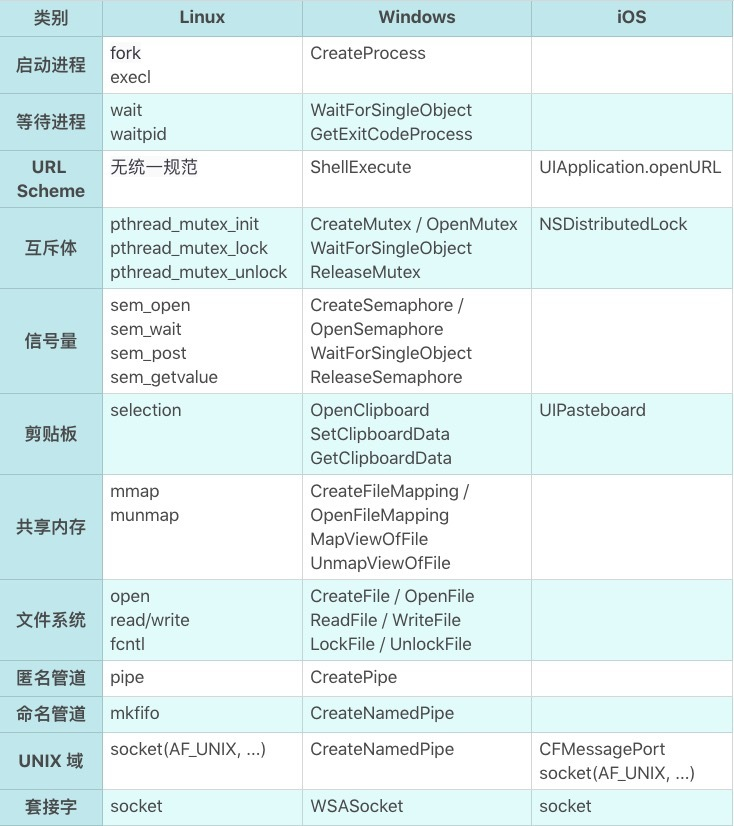

---
date: "2019-06-23"
---  
      
# 13 | 进程间的同步互斥、资源共享与通讯
你好，我是七牛云许式伟。

在上一讲，我们介绍了进程内执行体之间的协同机制。今天我们接着聊进程与进程之间的协同。

这些协同机制大体可分为：互斥、同步、资源共享以及通讯等原语。对于这些协同机制，我们对比了 Linux、Windows、iOS 这三大操作系统的支持情况，整理内容如下：



在逐一详细分析它们之前，我们先讨论一个问题：从需求角度来讲，进程内协同与进程间协同有何不同？

在早期，操作系统还只有进程这个唯一的执行体。而今天，进程内的执行体（线程与协程）被发明出来并蓬勃发展，事情发生了怎样的变化？

请先思考一下这个问题。我们在这一讲最后总结的时候一起聊聊。

## 启动进程

在讨论进程间的协同前，我们先看下怎么在一个进程中启动另一个进程。这通常有两种方法：

* 创建子进程；
* 让Shell配合执行某个动作。

前面在 “[11 | 多任务：进程、线程与协程](https://time.geekbang.org/column/article/96324)” 一讲中我们已经提到过，创建子进程 UNIX 系的操作系统都用了 fork API，它使用上很简洁，但是从架构角度来说是一个糟糕的设计。Windows 中我们用 CreateProcess，这个函数有很多的参数。

iOS 很有意思，它并不支持创建子进程。在进程启动这件事情上，它做了两个很重要的变化：

* 软件不再创建多个进程实例，永远是单例的；
* 一个进程要调用另一个进程的能力，不是去创建它，而是基于 URL Scheme 去打开它。

<!-- [[[read_end]]] -->

什么是 URL Scheme ？我们平常看到一个 URL 地址。比如：

* <https://www.qiniu.com/>
* <ftp://example.com/hello.doc>

这里面的 https 和 ftp 就是 URL Scheme，它代表了某种协议规范。在 iOS 下，一个软件可以声明自己实现了某种 URL Scheme，比如微信可能注册了“weixin”这个 URL Scheme，那么调用

```
     UIApplication.openURL("weixin://...") 
    

```

都会跳转到微信。通过这个机制，我们实现了支付宝和微信支付能力的对接。

URL Scheme 机制并不是 iOS 的发明，它应该是浏览器出现后形成的一种扩展机制。Windows 和 Linux 的桌面也支持类似的能力，在 Windows 下调用的是 ShellExecute 函数。

## 同步与互斥

聊完进程的启动，我们正式开始谈进程间的协同。

首先我们来看一下同步和互斥体。从上一讲 “[12 | 进程内协同：同步、互斥与通讯](https://time.geekbang.org/column/article/96994)”看，同步互斥相关的内容有：

* 锁（Mutex）；
* 读写锁（RWMutex）；
* 信号量（Semaphore）；
* 等待组（WaitGroup）；
* 条件变量（Cond）。

进程间协同来说，主流操作系统支持了锁（Mutex）和信号量（Semaphore）。Windows 还额外支持了事件（Event）同步原语，这里我们略过不提。

进程间的锁（Mutex），语义上和进程内没有什么区别，只不过标识互斥资源的方法不同。Windows 最简单，用名称（Name）标识资源，iOS 用路径（Path），Linux 则用共享内存。

从使用接口看，Windows 和 iOS 更为合理，虽然大家背后实现上可能都是基于共享内存（对用户进程来说，操作系统内核对象都是共享的），但是没必要把实现机理暴露给用户。

我们再看信号量。

信号量（Semaphore）概念是 Dijkstra（学过数据结构可能会立刻回忆起图的最短路径算法，对的，就是他发明的）提出来的。信号量本身是一个整型数值，代表着某种共享资源的数量（简记为 S）。信号量的操作界面为 PV 操作。

P 操作意味着请求或等待资源。执行 P 操作 P\(S\) 时，S 的值减 1，如果 S \< 0，说明没有资源可用，等待其他执行体释放资源。

V 操作意味着释放资源并唤醒执行体。执行 V 操作 V\(S\) 时，S 的值加 1，如果 S \<= 0，则意味着有其他执行体在等待中，唤醒其中的一个。

看到这里，你可能敏锐地意识到，条件变量的设计灵感实际上是从信号量的 PV 操作进一步抽象而来，只不过信号量中的变量是确定的，条件也是确定的。

进程间的同步与互斥原语并没有进程内那么丰富（比如没有 WaitGroup，也没有 Cond），甚至没那么牢靠。

为什么？因为进程可能会异常挂掉，这会导致同步和互斥的状态发生异常。比如，进程获得了锁，但是在做任务的时候异常挂掉，这会导致锁没有得到正常的释放，那么另一个等待该锁的进程可能就会永远饥饿。

信号量同样有类似的问题，甚至更麻烦。对锁来说，进程挂掉还可能可以把释放锁的责任交给操作系统内核。但是信号量做不到这一点，操作系统并不清楚信号量的值（S）应该是多少才是合理的。

## 资源共享

两个进程再怎么被隔离，只要有共同的中间人，就可以相互对话（通讯）。中间人可以是谁？共享资源。进程之间都有哪些共享的存储型资源？比较典型的是：

* 文件系统；
* 剪贴板。

文件系统本身是因存储设备的管理而来。但因为存储设备本身天然是共享资源，某个进程在存储设备上创建一个文件或目录，其他进程自然可以访问到。

因此，文件系统天然是一个进程间通讯的中间人。而且，在很多操作系统里面，文件的概念被抽象化，“一切皆文件”。比如，命名管道就只是一种特殊的 “文件” 而已。

和文件系统相关的进程间协同机制有：

* 文件；
* 文件锁；
* 管道（包括匿名管道和命名管道）；
* 共享内存。

这里我们重点介绍一下共享内存。

共享内存其实是虚拟内存机制的自然结果。关于虚拟内存的详细介绍，可以参阅 “[07 | 软件运行机制及内存管理](https://time.geekbang.org/column/article/93802)” 一讲。虚拟内存本来就需要在内存页与磁盘文件之间进行数据的保存与恢复。

将虚拟内存的内存页和磁盘文件的内容建立映射关系，在虚拟内存管理机制中原本就存在。

只需要让两个进程的内存页关联到同一个文件句柄，即可完成进程间的数据共享。这可能是性能最高的进程间数据通讯手段了。

Linux 的共享内存的使用界面大体是这样的：

```
    func Map(addr unsafe.Pointer, len int64, prot, flags int, fd int, off int64) unsafe.Pointer
    func Unmap(addr unsafe.Pointer, len int64)
    

```

其中，Map 是将文件 fd 中的`[off, off+len)`区间的数据，映射到`[addr, addr+len)` 这段虚拟内存地址上去。

addr 可以传入 nil 表示选择一段空闲的虚拟内存地址空间来进行映射。Unmap 则是将`[addr, addr+len)`这段虚拟内存地址对应的内存页取消映射，此后如果代码中还对这段内存地址进行访问，就会发生缺页异常。

在 Windows 下共享内存的使用界面和 Linux 略有不同，但语义上大同小异，这里略过不提。

真正值得注意的是 iOS，你会发现基于文件系统的进程间通讯机制，一律不支持。为什么？因为 iOS 操作系统做了一个极大的改变：软件被装到了一个沙箱（Sandbox）里面，不同进程间的存储完全隔离。

存储分为内存和外存。内存通过虚拟内存机制实现跨进程的隔离，这个之前我们已经谈到过。现在 iOS 更进一步，外存的文件系统也相互独立。软件 A 创建的文件，软件 B 默认情况下并不能访问。在一个个软件进程看来，自己在独享着整个外存的文件系统。

文件系统之外，进程间共享的存储型资源，就剩下剪贴板了。

但剪贴板并不是一个常规的进程间通讯方式。从进程间通讯角度来说它有很大的限制：剪贴板只有一个，有人共享数据上去，就会把别人存放的数据覆盖掉。

实践中，剪贴板通常作为一种用户实现跨进程交互的手段，而不太会被用来作为进程间的通讯。相反它更可能被恶意程序所利用。比如，写个木马程序来监听剪贴板，以此来窃取其他程序使用过程中留下的痕迹。

## 收发消息

那么，不用文件系统和剪贴板这样的共享资源，还有其他的通讯机制么？

**有，基于网络。很重要的一个事实是：这些进程同在一台机器上，同在一个局域网中。**

套接字作为网络通讯的抽象，本身就是最强大的通讯方式，没有之一。进程间基于套接字来进行通讯，也是极其自然的一个选择。

况且，UNIX 还发明了一个专门用于本地通讯的套接字：UNIX 域。UNIX 域不同于常规套接字的是，它通过一个 name 来作为访问地址，而不是用`ip:port`来作为访问地址。

Windows 平台并不支持 UNIX 域。但是有趣的是，Windows 的命名管道（NamedPipe）也不是一个常规意义上的管道那么简单，它更像是一个管道服务器（PipeServer），一个客户端连上来可以分配一个独立的管道给服务器和客户端进行通讯。从这个事实看，Windows 的命名管道和 UNIX 域在能力上是等价的。

关于套接字更详细的内容，后文在讨论网络设备管理时我们会进一步介绍。

## 架构思维上我们学习到什么？

对比不同操作系统的进程间协同机制，差异无疑是非常巨大的。

总结来说，进程间协同的机制真的很多了，五花八门，我们这里不见得就列全了。但是有趣的是，iOS 把其中绝大部分的协同机制给堵死了。

创新性的系统往往有其颠覆性，带着批判吸收的精神而来，做的是大大的减法。

iOS 就是这样的一个操作系统。它告诉我们：

* 软件不需要启动多份实例。一个软件只需启动一个进程实例。
* 大部分进程间的协同机制都是多余的。你只需要能够调用其他软件的能力（URL Scheme）、能够互斥、能够收发消息就够了。

这的确是一个让人五体投地的决策。虽然从进程间协同机制的角度，看起来 iOS 少了很多能力。但这恰恰也给了我们一个启示：这么多的进程通讯机制，是否都是必需的？

至少从桌面操作系统的视角看，进程间协同的机制，大部分都属于过度设计。当然，后面在 “服务端开发” 一章中，我们也会继续站在服务端开发视角来谈论这个话题。

并不是早期操作系统的设计者们喜欢过度设计。实际上这是因为有了线程和协程这样的进程内多任务设施之后，进程的边界已经发生了极大的变化。

前面我们讨论架构思维的时候说过，架构的第一步是做需求分析。那么需求分析之后呢？是概要设计。概要设计做什么？是做子系统的划分。它包括这样一些内容：

* 子系统职责范围的定义；
* 子系统的规格（接口），子系统与子系统之间的边界；
* 需求分解与组合的过程，系统如何满足需求、需求适用性（变化点）的应对策略。

从架构角度来看，进程至少应该是子系统级别的边界。子系统和子系统应该尽可能是规格级别的协同，而不是某种实现框架级别的协同。规格强调的是自然体现需求，所以规格是稳定的，是子系统的契约。而实现框架是技巧，是不稳定的，也许下次重构的时候实现框架就改变了。

所以站在架构视角，站在子系统的边界看进程边界，我们就很清楚，进程间协同只需要有另一个进程能力的调用，而无需有复杂的高频协作、高度耦合的配合需求。

不过，为什么 iOS 会如此大刀阔斧地做出改变，除了这些机制的确多余之外，还有一个极其核心的原因，那就是安全。关于这一点，我们在后面探讨操作系统的安全管理时，会进一步进行分析。

## 结语

今天我们从进程启动开始入手，介绍了同步与互斥、资源共享、收发消息等进程间的协同机制。通过对比不同操作系统，我们会发现以 “剧烈变动” 来形容进程间协同的需求演进一点也不过分。

我认为 iOS 是对的。大刀阔斧干掉很多惯例要支持的功能后，进程这个执行体，相比线程和协程就有了更为清晰的分工。

如果你对今天的内容有什么思考与解读，欢迎给我留言，我们一起讨论。到这一讲为止，我们单机软件相关的内容就介绍完了。从下一讲开始我们将进入多姿多彩的互联网世界。

如果你觉得有所收获，也欢迎把文章分享给你的朋友。感谢你的收听，我们下期再见。