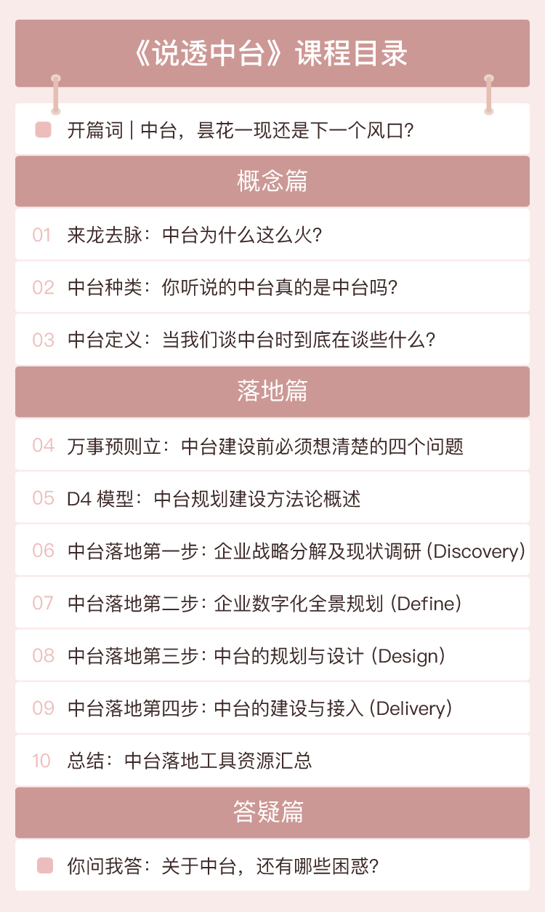

---
date: "2019-06-23"
---  
      
# 开篇词 | 中台，昙花一现还是下一个风口？
你好，我是王健，是ThoughtWorks的首席咨询师，目前专注在企业架构和解决方案的相关方向上。因为近几年沉迷中台无法自拔，同事朋友们也给我起了个花名，叫“台长”，如果你乐意也可以这么叫我，很高兴能在这个专栏与你见面。

## 我与中台

与中台的第一次邂逅是在2017年，当时作为首席咨询师和系统架构师第一次实际参与到了一个大型企业的中台规划和落地项目中。作为一个已经在行业里摸爬滚打了10多年的老鸟，并且无论是在分布式系统架构、微服务架构、平台化建设方面都也有了非常多年的经验和积累，面对“中台”这样一个当时在我看来不过是新瓶装旧酒的概念，坦白来讲，一开始我并没有把它放在眼里。

但结果就是被啪啪打脸。整个过程推进得非常困难，从头到尾无论是我对于中台的理解还是我们规划与建设的方法都受到了客户不断的质疑和挑战，项目的范围无论从系统的层面还是从组织的层面也被扩大到几近失控。

但也就是这次过程，才让我开始意识到，中台这个概念跟我之前想象的可能完全不是同一个物种。也自此，我对中台产生了浓厚的兴趣，日思夜想，遍访高人，并将所学所思所想落笔成文，期望与更多人一起探讨。

截止目前，我主导或参与过的中台相关项目大大小小也有10多个了，很多疑问和困扰也在这个不断学习、思考与实践的过程中一一解开。同时今年也开始与公司和社区的小伙伴们一起，尝试沉淀一套通用的中台规划与建设方法，来帮助更多企业在中台的规划与建设过程中，少走一些我们走过的弯路。

<!-- [[[read_end]]] -->

## 关于专栏

虽然我对于中台非常痴迷，但当极客时间约我做中台的专栏时，我的心情还是非常复杂的。

首先肯定是非常开心，因为很希望能借助这样一个平台将自己的所想所得分享给更多的人，并且更希望能听到你的观点，你的意见和你对于中台有哪些问题。我们一起努力将这个概念或是工具理解得更加透彻，并最终利用它帮助我们解决实际的问题。

但同时也有一些惶恐，因为中台这个概念不像其他的技术那样成熟和清晰。业界对于这个概念本身也仍然没有一个统一的认识。我相信，这也是今天中台被大家热议的一个原因吧，大家都在关注，但是又很难讲清楚。

还有中台这个概念，无论是从涉及领域的宽度还是从战略到落地的纵深高度来讲，都是非常非常大的，向上可以触及到行业趋势、企业使命愿景战略，向下又可以落地到分布式架构、遗留系统重构、架构演进与守护、质量保证等等各个方面。而且就算是同一个行业，每家企业还都不一样。

想要通过一个专栏，既要把概念讲清楚，又不飘在天上，还可以指导和帮助大家将中台落地，在我看来这几乎是一个不可能完成的任务。

但幸运的是，在极客时间同学专业的支持，以及不断激（催）励（稿）下，经过不断的打磨，这个专栏最终还是跟你见面了，感谢的话留到最后再讲，我先来简单讲讲我是怎么设计这门课程的。

## 这门课是怎么设计的？

今年IT圈中台的概念确实比较火，你可能在朋友圈或是各个媒体渠道上天天都能看到跟中台相关的文章和资讯。

但是大家讲的很多都是各个企业中台建设的结果，一张大大的线框图，对企业带来了怎样怎样的好处。

但中台到底是什么？从哪里来？又会到哪里去？具体又该怎么建设？这几个最基本的问题，谈到的其实并不是特别多，鲜有谈到的观点还都不太一致。

如果再将问题进一步展开，你就会发现有更多的问题仍然模糊不清。你可以跟我一起想一想，以下这些问题你有过同样的疑问吗？

* 中台与平台/微服务/SaaS的区别是什么？
* 中台与前台和后台的边界怎么界定？有了中台那后台是什么？
* 什么样的企业需要建中台，什么样的企业不需要建中台？对企业到底有哪些好处？
* 业务中台与数据中台的关系和区别又是什么？
* 中台建设有什么样的门槛，需要哪些准入条件？
* 中台该怎么建？分几个阶段？需要什么样的能力？
* 中台建设的结果好坏如何评估？谁来评估？
* ……

相信这样的问题还有很多很多。这些问题也曾困扰着我，所以我希望能通过这个专栏，为你一一解答这些困惑，或者至少能给你带来一些启发。

在专栏的课程设计上，我的主要思路是分成三个部分：概念篇、落地篇和最后的答疑篇。

**概念篇**

在概念篇里，我首先会带你时光穿梭，重走一遍中台的诞生和发展之路，从时间的维度重新梳理一遍中台诞生的背景和几个关键点，看看它究竟从哪里来？之后会通过列举目前市面上常见的中台种类，在空间的维度同样发散，看一看各类五花八门的中台。最终通过收敛和归纳，一起来探究一下中台的本质，即当我们谈论中台时我们到底在谈些什么，给中台下个定义。

**落地篇**

在落地篇里，我会从概念引申到落地，看看为了避开中台建设过程中的各种坑，在开始中台建设前需要先想清楚哪些问题？需要有什么样的准入条件？中台建设方法论的本质是什么？想清楚了这些问题后，又有哪些方法和套路可以帮我们实现中台的平滑落地。

但是这里有一个前提需要提前声明一下，因为我们之前也提到了，中台的种类太多了，不同企业不同种类的中台，它们的建设方式可能完全不同，但是背后的思想都是相通的。

在落地篇里的后半部分，关于一个中台产品的设计与实施的内容，我会用一个最常见的业务中台建设场景来展开介绍，但是其中提到的方法和工具，对于其他的中台类型也同样适用。

**答疑篇**

这个专栏的答疑篇是我额外设计的一个小模块。因为中台涉及的范围之广、问题之多、复杂度之高，是很难在几次课程中就完全讲清楚的。我也非常希望在我们一起学习交流的过程中，你可以把对于中台或是我这门课程的问题提出来，我们随时在留言区进行沟通和讨论，同时我也会针对每个人都比较关心的问题，单独在答疑篇里有针对性地统一给你做一些解答。

最后，跟你分享我最近一直在想一个问题。中台到底会不会成为下一个云计算，彻底改变我们思考问题和做事情的方式，还是它只是另一个昙花一现的新概念而已？

老实说，我现在还不能确定。但是通过这两年对于中台的学习和研究，至少对于我来讲，确实受益良多，无论是在视野、产品、架构还是在技术层面上都有了一个质的变化，上了一个台阶。

相信通过你我一起的学习，在了解了中台背后所代表的趋势或是理念之后，无论中台最终是两者中的哪个一个，你也一定都会有所收获。

最后，感谢你的关注。你对中台有哪些了解？又有哪些困惑？你现在已经参与到一个具体的中台建设中了吗？遇到了什么挑战？收获了哪些经验？欢迎写在留言区，我也很想听到你对这门课的期待。

很希望和你在专栏里再次相遇。这次，我们一起来说透中台！

