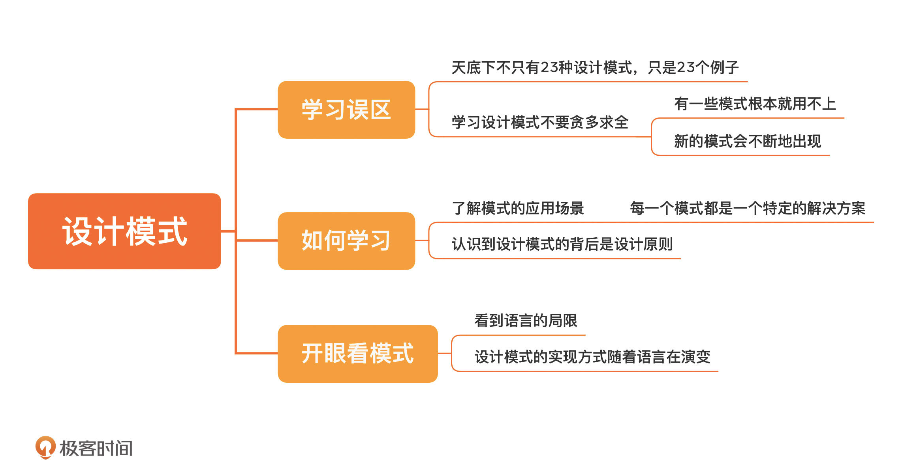

---
date: "2019-06-23"
---  
      
# 25 | 设计模式：每一种都是一个特定问题的解决方案
你好，我是郑晔！

今天，我们来聊聊设计模式。作为一个讲软件设计的专栏，不讲设计模式有些说不过去。现在的程序员，基本上在工作了一段时间之后，都会意识到学习设计模式的重要性。

因为随着工作经验的增多，大家会逐渐认识到，代码写不好会造成各种问题，而设计模式则是所有软件设计的知识中，市面上参考资料最多，最容易学习的知识。

但是，你也知道，设计模式的内容很多，多到可以单独地作为一本书或一个专栏的内容。如果我们要在这个专栏的篇幅里，细致地学习设计模式的内容就会显得有些局促。

所以，这一讲，我打算和你谈谈**如何理解和学习设计模式**，帮助你建立起对设计模式的一个整体认知。

## 设计模式：一种特定的解决方案

所谓模式，其实就是针对的就是一些普遍存在的问题给出的解决方案。模式这个说法起源于建筑领域，建筑师克里斯托佛·亚历山大曾把建筑中的一些模式汇集成册。结果却是墙里开花墙外香，模式这个说法却在软件行业流行了起来。

最早是Kent Beck和Ward Cunningham探索将模式这个想法应用于软件开发领域，之后，Erich Gamma把这一思想写入了其博士论文。而真正让建筑上的模式思想成了设计模式，在软件行业得到了广泛地接受，则是在《设计模式》这本书出版之后了。

<!-- [[[read_end]]] -->

这本书扩展了Erich Gamma的论文。四位作者Erich Gamma、Richard Helm、Ralph Johnson和John Vlissides也因此名声大噪，得到了GoF的称呼。我们今天大部分人知道的23种设计模式就是从这本书来的，而困惑也是从这里开始的。

因为，这23种设计模式只是在这本书里写的，并不是天底下只有23种设计模式。随着人们越发认识到设计模式这件事的重要性，越来越多的模式被发掘了出来，各种模式相关的书先后问世，比如，Martin Fowler 写过[《企业应用架构模式》](http://book.douban.com/subject/4826290/)，甚至还有人写了一套 5 卷本的[《面向模式的软件架构》](/https://book.douban.com/series/14666)。

但是，很多人从开始学习设计模式，就对设计模式的认知产生了偏差，所谓的23个模式其实就是23个例子。

还记得我们前面几讲学习的设计原则吗？如果用数学来比喻的话，**设计原则就像公理**，它们是我们讨论各种问题的基础，而**设计模式则是定理**，它们是在特定场景下，对于经常发生的问题给出的一个可复用的解决方案。

所以，你要想把所有已知的模式统统学一遍，即便不是不可能，也是会花费很多时间的，更何况还会有新的模式不断地出现。而且，虽然《设计模式》那本书上提到的大部分设计模式都很流行，但**有一些模式，如果你不是编写特定的代码，你很可能根本就用不上**。

比如Flyweight模式，如果你的系统中没有那么多小对象，可能就根本用不到它；而 Visitor 模式，在你设计自己系统的时候也很少会用到，因为你自己写的类常常都是可以拿到信息的，犯不上舍近求远。

所以，**学习设计模式不要贪多求全，那注定会是一件费力不讨好的事**。

想要有效地学习设计模式，首先我们要知道**每一个模式都是一个特定的解决方案**。关键点在于，我们要知道这个模式在解决什么问题。很多人强行应用设计模式会让代码不必要地复杂起来，原因就在于他在解决的问题，和设计模式本身要解决的问题并不一定匹配。**学习设计模式不仅仅要学习代码怎么写，更重要的是要了解模式的应用场景**。

## 从原则到模式

设计模式之所以能成为一个特定的解决方案，很大程度上是因为它是一种好的做法，符合软件设计原则，所以，**设计原则其实是这些模式背后的东西**。

我们前面花了大量的篇幅在讲各种编程范式、设计原则，因为它们是比设计模式更基础的东西。掌握这些内容，按照它们去写代码，可能你并没有在刻意使用一个设计模式，往往也能写出符合某个设计模式的代码。

我给你举个例子。比如，在用户注册完成之后，相关信息会发给后台的数据汇总模块，以便后面我们进行相关的数据分析。所以，我们会写出这样的代码：

```
    interface UserSender {
      void send(User user);
    }
    
    // 把用户信息发送给后台数据汇总模块
    class UserCollectorSender implements UserSender {
      private UserCollectorChannel channel;
      
      public void send(final User user) {
        channel.send(user);
      }
    }
    

```

同时，我们还要把用户注册成功的消息通过短信通知给用户，这里会用到第三方的服务，所以，我们这里要有一个APP的key和secret：

```
    // 通过短信发消息
    class UserSMSSender implements UserSender {
      private String appKey;
      private String appSecret;
      private UserSMSChannel channel;
      
      public void send(final User user) {
        channel.send(appKey, appSecret, user);
      }
    }
    

```

现在，我们要对用户的一些信息做处理，保证敏感信息不会泄漏，比如，用户密码。同时，我们还希望信息在发送成功之后，有一个统计，以便我们知道发出了多少的信息。

如果不假思索地加上这段逻辑，那两个类里必然都会有相同的处理，本着单一职责原则，我们把这个处理放到一个父类里面，于是，代码就变成这样：

```
    class BaseUserSender implements UserSender {
      // 敏感信息过滤
      protected User sanitize(final User user) {
        ...
      }
      
      // 收集消息发送信息
      protected void collectMessageSent(final User user) {
        ...
      }
    }
    
    class UserCollectorSender extends BaseUserSender {
      ...
      
      public void send(final User user) {
        User sanitizedUser = sanitize(user);
        channel.send(sanitizedUser);
        collectMessageSent(user);
      }
    }
    
    class UserSMSSender extends BaseUserSender {
      ...
      
      public void send(final User user) {
        User sanitizedUser = sanitize(user);
        channel.send(appKey, appSecret, user);
        collectMessageSent(user);
      }
    }
    

```

然而，这两段发送的代码除了发送的部分不一样，其他部分是完全一样的。所以，我们可以考虑把共性的东西提取出来，而差异的部分让子类各自实现：

```
    class BaseUserSender implements UserSender {
      // 发送用户信息
      public void send(final User user) {
        User sanitizedUser = sanitize(user);
        doSend(user);
        collectMessageSent(user);
      }
      
      // 敏感信息过滤
      private User sanitize(final User user) {
        ...
      }
      
      // 收集消息发送信息
      private void collectMessageSent(final User user) {
        ...
      }
    }
    
    
    class UserCollectorSender extends BaseUserSender {
      ...
      
      public void doSend(final User user) {
        channel.send(sanitizedUser);
      }
    }
    
    
    class UserSMSSender extends BaseUserSender {
      ...
      
      public void doSend(final User user) {
        channel.send(appKey, appSecret, user);
      }
    }
    

```

你是不是觉得这段代码有点眼熟了呢？没错，这就是Template Method的设计模式。我们只是遵循着单一职责原则，把重复的代码一点点地消除，结果，我们就得到了一个设计模式。在真实的项目中，你可能很难一眼就看出当前场景是否适合使用某个模式，更实际的做法就是这样遵循着设计原则一点点去调整代码。

其实，只要我们遵循着同样的原则，大多数设计模式都是可以这样一点点推演出来的。所以说，**设计模式只是设计原则在特定场景下的应用**。

## 开眼看模式

学习设计模式，我们还应该有一个更开阔的视角。首先是要看到**语言的局限**，虽然设计模式本身并不局限于语言，但很多模式之所以出现，就是受到了语言本身的限制。

比如，Visitor模式主要是因为C加加、Java之类的语言只支持单分发，也就是只能根据一个对象来决定调用哪个方法。而对于支持多分发的语言，Visitor模式存在的意义就不大了。

[Peter Norvig](http://norvig.com/)，Google 公司的研究总监，早在 1996 年就曾做过一个分享[《动态语言的设计模式》](http://www.norvig.com/design-patterns/)，他在其中也敏锐地指出，设计模式在某种意义上就是为了解决语言自身缺陷的一种权宜之计，其中列举了某些设计模式采用动态语言后的替代方案。

我们还应该知道，随着时代的发展，有一些设计模式**本身也在经历变化**。比如，Singleton 模式是很多面试官喜爱的一个模式，因为它能考察很多编程的技巧。比如，通过将构造函数私有化，保证不创建出更多的对象、在多线程模式下要进行双重检查锁定（double-check locking）等等。

然而，我在讲可测试性的时候说过，Singleton并不是一个好的设计模式，它会影响系统的可测试性。从概念上说，系统里只有一个实例和限制系统里只能构建出一个实例，这其实是两件事。

尤其是在DI容器普遍使用的今天，DI容器缺省情况下生成的对象就是只有一个实例。所以，在大部分情况下，我们完全没有必要使用Singleton模式。当然，如果你的场景非常特殊，那就另当别论了。

在讲语法和程序库时，我们曾经说过，一些好的做法会逐渐被吸收到程序库，甚至成为语法。设计模式常常就是好做法的来源，所以，一些程序库就把设计模式的工作做了。比如，Observer 模式早在1.0版本的时候就进入到 JDK，被监听的对象要继承自 [Observable](http://docs.oracle.com/javase/8/docs/api/java/util/Observable.html) 类就好，用来监听的对象实现一个 [Observer](http://docs.oracle.com/javase/8/docs/api/java/util/Observer.html) 接口就行。

当然，我们讲继承时说过，继承不是一个特别好的选择，Observable是一个要去继承的类，所以，它做得也并不好。从Java 9开始，这个实现就过时（deprecated）了，当然官方的理由会更充分一些，你要是有兴趣可以去了解一下。JDK中提供的替代方案是[PropertyChangeSupport](http://docs.oracle.com/javase/8/docs/api/java/beans/PropertyChangeSupport.html)，简言之，用组合替代了继承。

我个人更欣赏的替代方案是Guava的[EventBus](http://github.com/google/guava/wiki/EventBusExplained)，你甚至都不用实现一个接口，只要用一个Annotation标记一下就可以监听了。

Annotation可以说是消灭设计模式的一个利器。我们刚说过，语言本身的局限造成了一些设计模式的出现，这一点在Java上表现得尤其明显。随着Java自身的发展，随着Java世界的发展，有一些设计模式就越来越少的用到了。比如，Builder模式通过Lombok这个库的一个Annotation就可以做到：

```
    @Builder
    class Student {
      private String name;
      private int age;
      ...
    }
    

```

而Decorator模式也可以通过Annotation实现，比如，一种使用 Decorator 模式的典型场景，是实现事务，很多Java程序员熟悉的一种做法就是使用Spring的Transactional，就像下面这样：

```
    class Handler {
      @Transactional
      public void execute() {
        ...
      }
    }
    

```

随着Java 8引入Lambda，Command模式的写法也会得到简化，比如写一个文件操作的宏记录器，之前的版本需要声明很多类，类似下面这种：

```
    Macro macro = new Macro();
    macro.record(new OpenFile(fileReceiver));
    macro.record(new WriteFile(fileReceiver));
    macro.record(new CloseFile(fileReceiver));
    macro.run();
    

```

而有了Lambda，就可以简化一些，不用为每个命令声明一个类：

```
    Macro macro = new Macro();
    macro.record(() -> fileReceiver.openFile());
    macro.record(() -> fileReceiver.writeFile());
    macro.record(() -> fileReceiver.closeFile());
    macro.run();
    

```

甚至还可以用Method Reference再简化：

```
    Macro macro = new Macro();
    macro.record(fileReceiver::openFile);
    macro.record(fileReceiver::writeFile);
    macro.record(fileReceiver::closeFile);
    macro.run();
    

```

所以，我们学习设计模式除了学习标准写法的样子，还要知道，随着语言的不断发展，新的写法变成了什么样子。

## 总结时刻

今天，我们谈到了如何学习设计模式。学习设计模式，很多人的注意力都在模式的代码应该如何编写，却忽略了模式的使用场景。强行应用模式，就会有一种削足适履的感觉。

设计模式背后其实是各种设计原则，我们在实际的工作中，更应该按照设计原则去写代码，不一定要强求设计模式，而按照设计原则去写代码的结果，往往是变成了某个模式。

学习设计模式，我们也要抬头看路，比如，很多设计模式的出现是因为程序设计语言自身能力的不足，我们还要知道，随着时代的发展，一些模式已经不再适用了。

比如 Singleton 模式，还有些模式有了新的写法，比如，Observer、Decorator、Command 等等。我们对于设计模式的理解，也要随着程序设计语言的发展不断更新。

好，关于设计模式，我们就先谈到这里。下一讲，我会和你讨论一些很多人经常挂在嘴边的编程原则，虽然它们不像设计原则那么成体系，但依然会给你一些启发性的思考。

如果今天的内容你只能记住一件事，那请记住：**学习设计模式，从设计原则开始，不局限于模式。**



## 思考题

最后，我想请你谈谈你是怎么学习设计模式的，你现在对于设计模式的理解又是怎样的。欢迎在留言区分享你的想法。

感谢阅读，如果你觉得这一讲的内容对你有帮助的话，也欢迎把它分享给你的朋友。