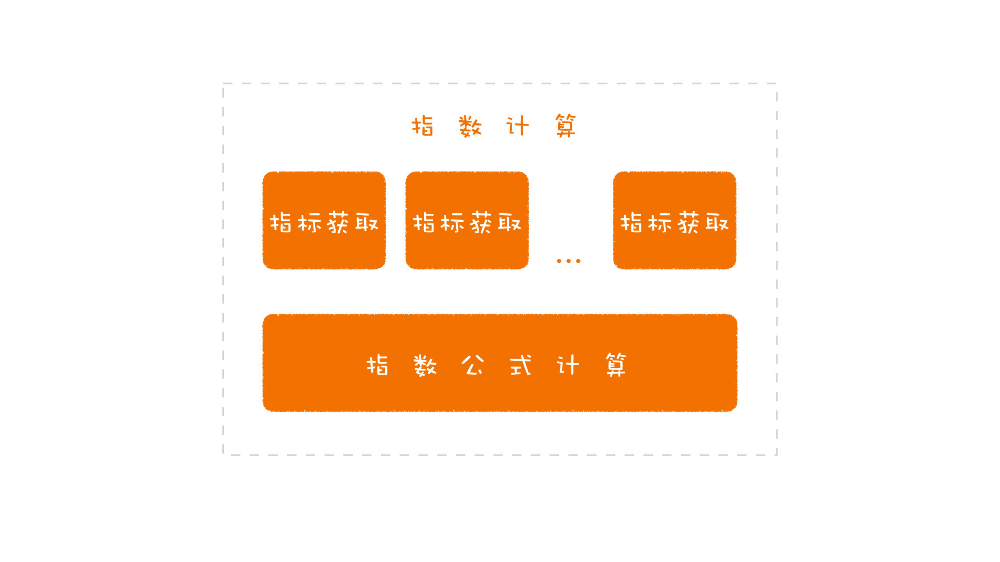
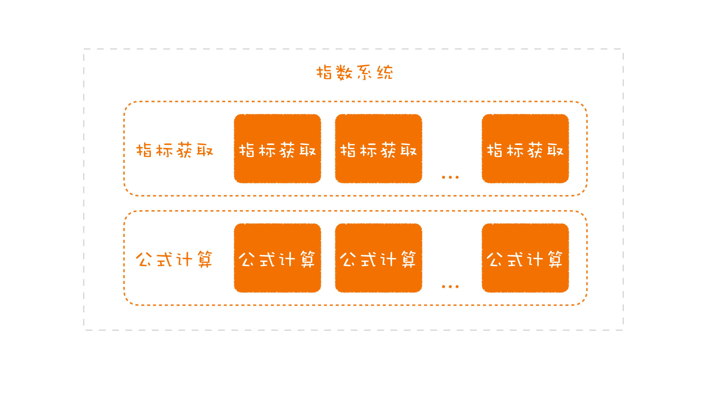
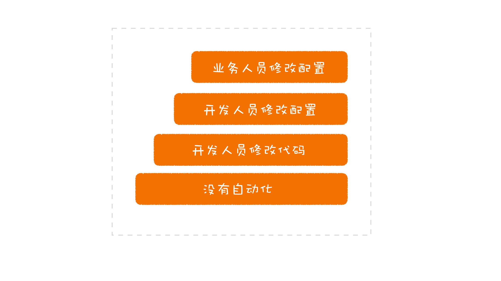
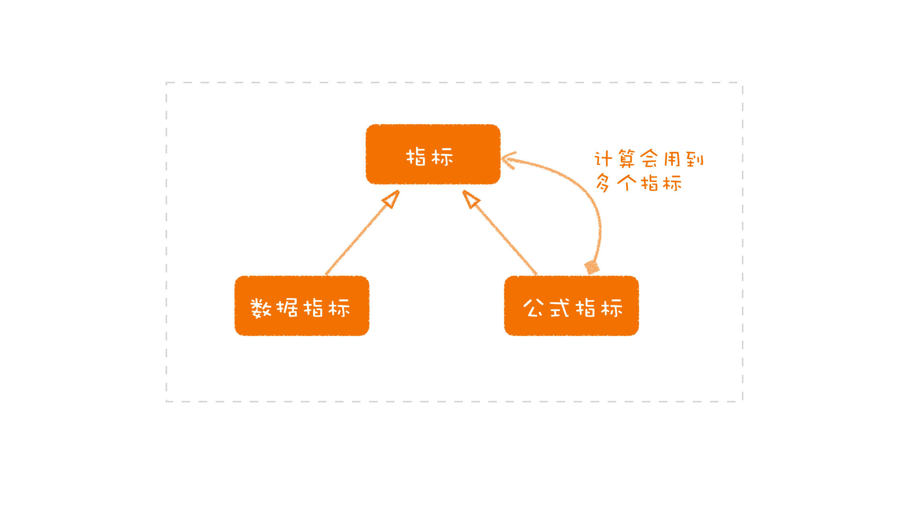
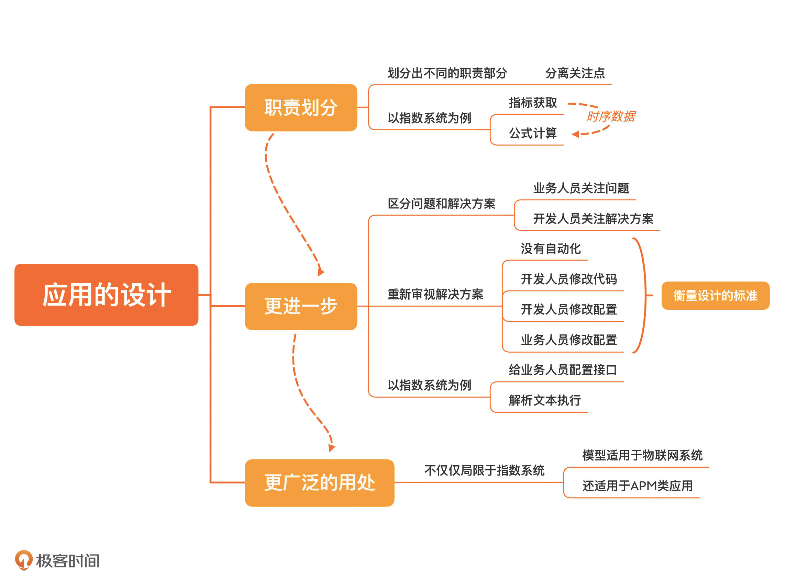

---
date: "2019-06-23"
---  
      
# 31 | 应用的设计：如何设计一个数据采集平台？
你好，我是郑晔！

上一讲，我给你讲了 Moco 的设计，这是一个程序库级别的设计。除了开发一个程序库，在日常工作中，还有一种工作是程序员们非常熟悉的，就是开发一个应用。与之对应的设计就是应用设计。

也许你会说，应用设计不就是按照之前讲的 DDD 的方法，先通过事件风暴建立通用语言，然后，再找出子域和划分出限界上下文，最后，再按照模板找出各种对象吗？

是的，设计的基本过程确实是这样的。不过，DDD 的方法只能保证我们设计出一个可以接受的方案。**如果你想有一个更有扩展性的设计方案，就需要多花一点时间去构建一个更好的模型**。

这一讲，我就以一个金融指数系统为例，给你讲一下如何更好地设计一个应用。

## 一个指数系统

在金融系统中，有一个概念叫指数，用来表示金融市场的活动，比如有股票指数、期货指数等等。比较著名的指数有道琼斯指数、标准普尔指数。这个世界上的指数多得数不胜数，每个金融机构都会有自己的指数，而且，它们还会不断推出新的指数。

那指数是怎么算出来的呢？如果以股票为例，就是获取一堆股票的价格，然后根据一个公式算出一个结果。比如，我们有一个公式，A_0.2+B_0.3+C\*0.5，我们把公式里的数据部分称为指标，也就是公式中的 A、B、C，这个公式表示这三种指标分别占比20\%、30\%和50\%。

<!-- [[[read_end]]] -->

这个公式就是三个不同的指标按照不同的占比进行求和。假设A指标的价格是5元、B指标是2元、C指标是1元，按照公式可以算出5_20\%+2_30\%+1\*50\%=2.1，这个算出来的2.1就是指数的值。

价格是实时变化的，而公式是固定的。指数在问世之初，我们需要不断调整这个公式里面各个指标的参数，以便能更好地反映市场的变化。问题来了，我们要怎样设计一个这样的指数系统呢？

一个不假思索的设计就是，针对一个具体的指数进行开发。我们就要把指数计算中涉及的各种数据实时取过来，然后根据设置的公式去做计算。

如果我们只有一个指数，这么做也许是可以接受的。但我们要开发的是一个指数系统，这意味着我们会有很多个指数。两个不同的指数可能会用到同样的指标，如果我们按照开发一个指数的方法，不同的指标数据要获取好多遍，从某种意义上来说，这就是一种重复。

所以，一个好的做法就是，**先做职责划分，把不同职责的部分划分出来**。正如我在这个专栏中一直说的，我们不能把各种不同的关注点混在一起，这是很多系统出问题的根源所在。

那从上面的需求描述中，我们可以把指数的计算过程分成两个部分：

* 一部分是需要实时获取的数据，比如，前面说到的各种价格；
* 一部分是根据公式进行计算出最终的结果，也就是指数最终的值。

这种拆分解决了前面设计中存在的问题，使得指标数据获取和公式计算分开了，同样的数据就可以用在多个公式中，数据的获取和公式的计算就不用同步进行了。

而且，把计算过程拆成了两个部分之后，我们就可以针对这两个部分，分别进行细化了：

* 对于指标数据获取的部分，我们要解决数据获取可能出现的问题，比如，不同的数据来源如何管理、不同数据源的数据格式是怎样的、如果数据源不可用，我们该怎么办等等；
* 对于公式计算的部分，我们关心的问题则是计算要用到哪些指标、每个指标当前可用的值是多少、如果公式中有不可用的指标数据时，系统该怎么处理等等。

既然我们把系统拆分成了两个部分，还有一个问题就是，如何把这两个部分连接起来。其实，指标数据获取部分的输出，就是公式计算部分的输入，那指标数据获取部分的输出是什么呢？

我们在前面分析过，指标数据获取要实时获取，无论采用轮询的方式，还是采用数据上报的方式。这种数据的特点就是，它有一个值，还有一个时间。正是因为这种特点，数据会形成一个序列，所以，我们将这种数据称为**时序数据**。

指标数据获取部分的输出其实就是这种时序数据，只不过，针对每一种指标都会产生一个时序数据序列，而这些不同的时序数据也正是公式计算部分的输入。

既然是时序数据，也就有了时间的信息，我们的公式计算部分就可以根据时序数据的时间做一些处理了。比如，怎么判定一个指标不可用呢？如果判断一个指标最新的数据与当前时间的差值过大，我们就可以判断在这次计算中，该指标的数据不可用。

有了对于时序数据的认识，结合前面所说的数据获取和公式计算不再是同步进行的这一点，指标数据获取和公式计算两个部分就完全解耦了，二者之间可以只通过时序数据进行交互。

## 更上一层楼

现在，我们已经把数据获取和公式计算分成了两个部分，这应该是常规设计中都可以想到的。很多设计者做设计也可能就此打住，开始动手写代码了。但是，有时候我们还可以更进一步。

我们可以继续分析一下，看看还有什么可以进一步改进的地方。

我先问你一个问题，公式计算你打算怎么做？你可能会想，这难道不是业务人员给我什么样的公式，我就用写代码的方式把它实现出来吗？

这么做肯定是可以把公式实现出来，这一点是毋庸置疑的。但是，正如我前面所说，指数往往要经过一个调整的过程。因为业务人员自己也常常不确定设置的参数是否合理。

用写代码的方式实现公式，也就意味着，每次业务人员要调整一个参数，你都需要去改代码。在可以预见的未来，你的工作基本上都会与调整参数相关，而这件事一点技术含量都没有。

对我们程序员而言，**一件事是不是有技术含量往往不取决于事情本身，而取决于我们怎么做它**。换言之，问题是一样的，但不同的解决方案却会带来不同的效果。**业务人员提出的是问题，解决方案是由技术人员给出的，千万别混淆问题和解决方案**。

当你可以预见一件事将来会很繁琐、会不断重复，而且会持续相当长的时间，这时候我们就需要重新审视我们的解决方案了。

最原始的解决方案是没有自动化的方案，对于任何一个系统而言，我们最好要知道没有自动化的时候，这个问题是如何解决的。这和我们前面说到的，理解一个模型来龙去脉的思路是一致的。

当然，我们现在大多数情况下接触的都是一个已经自动化的方案，但方案之间还是存在着差别。在自动化方案中，最原始的做法是开发人员自己修改代码的方案，这种做法会导致开发人员大量的时间投入，属于严重消耗时间的做法。

其次是开发人员修改配置，虽然这种做法只修改配置，但通常还会涉及到重新打包发布的过程，只能说它比修改代码要强一点。

比较好的做法是，业务人员修改配置，开发人员完全不参与其中。一方面，业务人员自己最知道自己想要什么；另一方面，没有开发人员的参与，反馈周期就缩短了。

虽然这几种方法在业务的角度是越来越好的，但在设计上，却是要求越来越高的。比起没有自动化的方案，自动化的方案需要投入一些力量去做设计。相比于修改代码，修改配置就意味着要留下扩展的接口。而能够做到让业务人员而不是开发人员修改配置，配置的接口就应该是一个业务的接口，比如，要有一个配置界面。

如果我们用这几个标准评估一下我们现在的方案，显然，我们现在的方案还处于开发人员修改代码的阶段，这说明我们还有向上努力的空间。不过，我们给出的只是一个衡量标准，并不意味着这个台阶要一步一步上，因为我们可以一步就提升到最高标准，一步到位给业务人员提供一个配置的接口。

问题来了，我们要给业务人员提供一个配置接口，它应该长啥样呢？

我们知道，这个指数设计的关键就是这个指数的公式。在前面的那个例子里面，它的公式是 A_0.2+B_0.3+C\*0.5。如果我们能够让业务人员在配置接口上这样配置，问题就解决了。

在这里，A、B、C 分别代表一个指标，也就是说，我们只要能够让业务人员指定指标以及指定计算公式，剩下的问题就简单了，就是根据公式计算出相应的结果就好了。

说起来很简单，但怎么把A_0.2+B_0.3+C\*0.5变成一个可执行的公式，对一些程序员来说，还是有一定难度的。解析文本执行这件事是编译原理的基本功，不过只要你能理解这里需要一点编译原理的知识就很可以了，如果欠缺知识，就去学习相关知识好了。

实际上，公式的解析是编译原理入门的知识，难度系数比设计一门程序设计语言要小多了。而且，现在有编译器前端的工具，比如，Java 世界的 [Antlr](https://www.antlr.org/)，它可以直接生成对应的语法树结构，我们只要负责去编写对应的执行部分就好了。

也许你发现了，我们实际上已经构建出了一门 DSL，一门属于指数计算这个特定领域的外部 DSL。前面讲 DSL 的时候，我们就说过，把设计做到极致就可以构建出一门 DSL。在这里，我们也看到了，了解 DSL，实际上也给我们增添了一个可以前进的方向。

把公式构建出来之后，我们仔细分析，还会有一个有趣的发现。你可以想一下，公式计算的结果是什么？因为我们说，它是在利用多个指标的时序数据做计算，所以它得到的结果，其实也是一个时序数据。

这样，我们发现了另一个有趣的事，公式计算的得到其实也是一个指标。如此一来，公式计算的结果也可以作为另外一个公式的输入，形成更为复杂的复合公式。显然，由于复合公式的出现，这个系统的处理能力又上了一个台阶。

不知道你是否想起了什么，没错，它和设计模式中的组合模式如出一辙。你看，我们学习到的基础知识在这里都用上了。

虽然我们这里讨论的是一个金融中会用到的指数系统，但当我们把模型经过一番整理之后，你会发现它不仅仅局限于指数系统中。比如，如果你在开发的是一个物联网系统，上报上来的数据，往往也要经过一些计算和聚合，那这个模型显然也是适用的。

再比如，你开发了一个 APM（Application Performance Management，应用性能管理）类的应用，采集上来的数据往往也要经过一番计算再展示出来，这个模型同样适用。

所以，当我们可以构建出一个好的模型时，它本身就有着更大的适用范围。

## 总结时刻

今天，我通过一个指数系统的应用给你讲了一个应用的设计过程。在这里，你知道了想要做好设计，目标就不能局限于只把功能实现出来，而是我们要去不断发现可能存在的各种问题。

简言之，只要你认为会出现重复，它就是一个值得我们去思考解决的问题。

我还给你讲了如何衡量应用的设计水平，就是看它符合下面哪个标准：

* 没有自动化；
* 开发员修改代码实现；
* 开发员修改配置实现；
* 业务员修改配置实现。

程序员常常给人写代码，实现自动化，却常常忽略了自己工作中可以自动化的部分。作为[一个懒惰的程序员](https://time.geekbang.org/column/article/86210)，我们需要发现日常工作中繁琐的地方，让自己从低水平的重复中解脱出来。**一件事是不是有技术含量往往不取决于事情本身，而取决于我们怎么做它**。

这两讲我们讲的都是怎么去设计一个新东西，但在实际工作中，有时候，我们还会面对一个既有的系统，这样的系统该如何改进呢？我们下一讲来谈。

如果今天的内容你只能记住一件事，那请记住：**一个更好的设计从拒绝低水平重复开始，把工作做成有技术含量的事情**。

## 思考题

最后，我想请你回想一下，参照今天的内容，在你现在的工作中，有哪些可以从设计上改进的内容呢？欢迎在留言区分享你的想法。

感谢阅读，如果你觉得这一讲的内容对你有帮助的话，也欢迎把它分享给你的朋友。