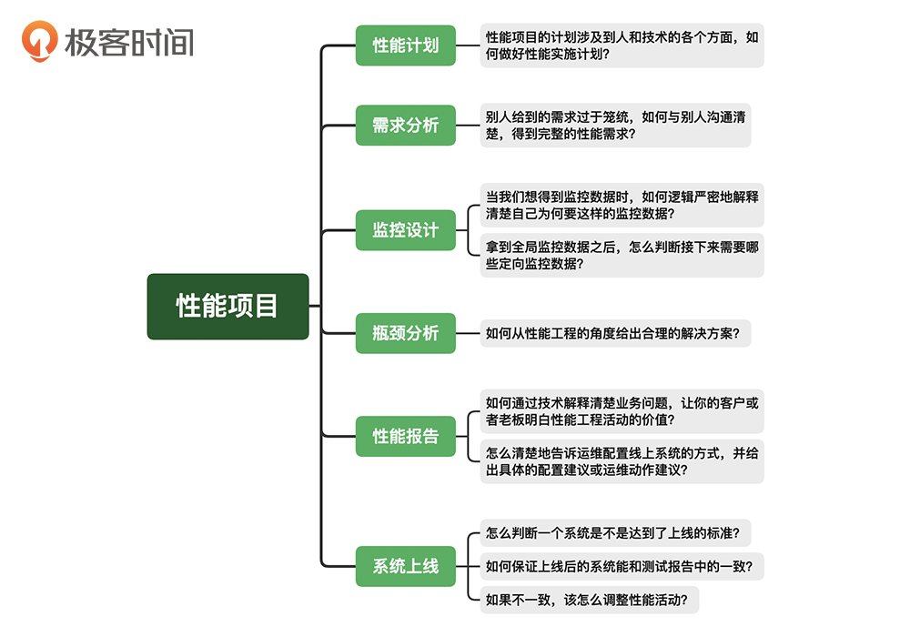
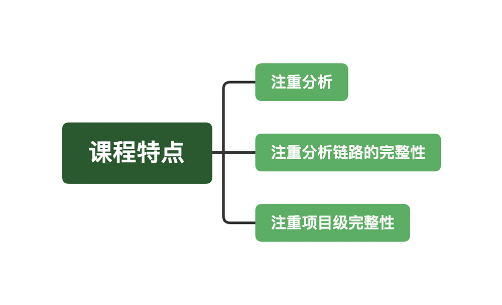

---
date: "2019-06-23"
---  
      
# 开篇词 | 打破四大认知局限，进阶高级性能工程师
你好，我是高楼。

从业十几年以来，我一直在做性能测试、性能分析、性能优化的工作。早年间我在各大测试论坛分享自己的工作经验，并形成了关于性能测试完整的知识链。后来，我开始自己带团队做项目，完整做过40多个项目，团队也从开始的四五个人发展到了现在的300 余人。与我合作过的人都了解，我做性能项目的宗旨就是上线不死，死了不收钱。

2019年，我在极客时间上线了第一个课程[《性能测试实战30讲》](https://time.geekbang.org/column/intro/100042501)。在这个课程中，我描述了自己认为在测试过程中重要的部分，比如整体概念梳理、性能分析思路等。我希望通过这个课程，可以抛出一个价值观——让性能变得有价值，以此刷新很多人对性能测试的认知，知道这个方向其实可以干很多事情。这也是我长期以来一直在做的事情。

## 性能工程师的四大认知局限

你可能会奇怪，为什么我还要写第二个课程呢？

因为我想**通过一个实战项目，为你展现性能项目工程级的落地思路以及真正的实施过程**。从一个性能工程师的角度来看，即使你掌握了第一个课程的内容后，也还是会在项目的各个环节中遇到其他挑战。比如下面这张图中展示的：

作为一个优秀的性能工程师，上面这张图中提到的性能计划、需求分析、瓶颈分析等问题的重要性不言而喻，但是它们却没有得到真正的重视，市面上也鲜少有对应的解决方案。

<!-- [[[read_end]]] -->

因此，我希望通过一个实战项目，从性能需求到最终的性能报告，带你走过整个完整的操作过程，让你透彻理解这些痛点问题，并一一攻克它们。

纵观现在的性能市场，我时常感觉悲哀，大家往往对性能有四大错误认知。

**1\. 过于关注性能中的某些工具**

在很多咨询或是培训的现场，我经常能看到有着好多年经验，却只会JMeter、LoadRunner等几个性能工具的性能工程师。在监控领域也是一样，不乏觉得会一些操作系统或是语言的监控分析工具就可以上天了的工程师。

**2\. 只浮在表面**

我看过很多性能项目、培训和演讲，一些人自恃有些背景经验，经常会在一些场合吹嘘。但是，当你问他如何落地以及具体的落地过程时，这些人就只会利用培训中的技巧来搪塞。

**3\. 只局限于性能团队，走不出去**

性能对我来说一直是一个工程级的工作。可是很多做性能的工程师，经常连自己的团队都走不出去。比如说当系统有了性能瓶颈，我们能不能走出自己的团队，有理有据地指着开发、运维的鼻子骂几句？（当然，我并不推荐这种不礼貌的举动，它只是一种夸张的表达手法。）

我给我带过的团队经常说的一句话就是，有了瓶颈出去跟开发打仗，一定要赢着回来！要不然就不要出去！

因为经常有一种情况是，当缺少可以证明瓶颈根本原因的证据时，性能工程师就会像皮球一样被踢来踢去，比如“这个可能是啥啥问题，你去问下谁谁谁”、“这个可能是啥原因，你再试一下”等等。面对这样的场景，你觉得做性能还有什么意义吗？

**4\. 无法体现到业务场面**

其实，老板们想要的，就是一个类似这样问题的明确答案：当1000万人在线的时候，这个系统会不会死？而你作为一个性能工程师或者性能团队的负责人，你敢拍着胸脯说“死了我负责，到时候我卷铺盖就走人”这样的话吗？

如果你敢这样说，那你得到的工资肯定是不一样的，就像买保险一样。可是在性能市场中，有谁敢给这样的业务保证呢？

基于这样的市场现状，我希望通过这个课程将性能分析的真正价值体现出来，改变你原有的一些错误认知，帮助你成为一名优秀的性能工程师。这就需要我们**把性能从“测试”引到“工程”的级别，因为只有这样，才是一个性能项目的真正价值可以体现的方式。**

## 我会怎么给你讲这个课程？

为了能让你更好地理解我要讲的内容，我专门搭建了一个完整的系统，我们课程所有的内容都将基于这个系统展开。

在这个项目中，我使用了Kubernetes+Docker+nginx\_ingress/Java 1.8/Spring Cloud微服务\(内置Tomcat\)/Grafana+Prometheus+Exporters+SkyWalking/Redis/MySQL/RabbitMQ等技术组件搭建起了整个服务。这样的服务规模需要不少的时间做环境搭建，从硬件上架、安装操作系统开始，我整体用了近一个月的时间，使用了62C140G的硬件资源。

在搭建的过程中，一开始我考虑使用OpenStack做基础设施，希望能覆盖当前技术栈中的全部主流技术。但最后我还是放弃了，因为这样的资源量级用OpenStack是浪费资源的。此外，我在搭建过程中也遇到了很多杂七杂八的问题，比如多网卡队列、硬件超分等带来的整体架构问题，好在最后都一一得到解决。

**我在这个系统中遇到的性能问题，以及我的分析过程都将在这个课程中呈现出来**。我会从一个完整的性能项目的角度，给你详细解析整个性能项目是怎么做的。我还会从完整的性能分析决策树和性能瓶颈证据链的角度，带你分析如何定位一个瓶颈。而这个项目的分析数据、性能结果也都将真实地呈现给你，让你看到我所讲的分析方法和路径都是能够一一落地的。

学习这个课程，我建议你最好能动手实践，对课程中所讲的分析思路和方法有一个深入的体会和理解。如果你想自己搭建这样一套环境，硬件资源可以不要那么多，技术组件也可以分批搭建，毕竟不是所有的场景都需要整体的环境。对于一些比较复杂、容易出现问题的环节，我也会为你提供相应的指导性文档，帮助你顺利完成搭建。

## 如果我做的项目与课程中的项目不同，怎么办？

你可能会有疑问，这门课讲的性能项目和你所做的项目不同怎么办？这一点你无需担心，因为**我会为你描述一个通用型的性能项目，而且我们重在逻辑上的理解**。所以这门课我会从以下三个关键点入手，这也是你接下来学习的主要方向。

**首先，我们会更重分析。**

对于性能来说，不会做脚本的团队还是非常少的。在这个课程中我将重分析，而不是重脚本。如果你是初学者，那我希望你能自学脚本等工具的基础操作。

那怎么理解“重分析”呢？简单来说就是从脚本开始，一直到具体的性能瓶颈，这样一个完整的分析过程。这也是我一直强调的性能技术的重心。

**其次，我们会更注重分析链路的完整性。**

在这门课程中，我不会详细去写一个个的技术点，比如Linux操作系统中输入top命令后的CPU信息`us`是什么意思，像这种度娘上都有的东西，就不用你再花钱学课程了。我在这门课里要讲的是，当us（用户态使用的CPU时间比）高了之后，应该怎么办？

可能有人会说这个问题很简单，us高了之后就是查进程——查线程——查栈——查代码，老套路了。能这样讲的人，证明是有经验的性能工程师，但不一定是非常有经验的性能工程师。因为从步骤上来看，套路确实是这样。不过，当遇到一个具体的问题点时，清楚套路的人并不见得知道该做什么动作。

我们就拿打印堆栈来说，针对不同的问题和现象，我们应该打印多少次堆栈呢？比如当cswch/s高的时候，该怎么打印堆栈？当nvcswch/s高的时候，又该怎么打印堆栈？像类似的问题，我都会在这门课中把思路给你讲清楚。

**最后，我们注重项目级完整性。**

一个项目中应该具有的关键性能动作，也都将在这个课程中得到体现。比如说：

* 脚本中哪些关键点会影响到最终的结果，具体是如何影响的？
* 业务模型到底能不能完全符合生产环境统计出来的数据？
* 性能报告到底应该如何下结论？
* 性能团队应该给运维什么样的具体建议？
* 上线之后，怎么评估性能项目做得好不好？
* ……

总之，我希望你能看到一个性能项目真实的落地过程，知道在一个性能项目的各个阶段应该做什么事情以及要做到什么样子，从一个更为宏观、全局的视角，真正吃透性能。这也是一名优秀的性能工程师必须要具备的能力。

最后，我想说，如果成为一名优秀的性能工程师是你的心之所向，如果你不甘于平庸，希望在性能这条路上走得更远，那就与我一起踏上这段旅程，我会把我从业十几年来的经验毫无保留地分享给你。

如果可以的话，你不妨在留言区聊聊你在性能测试方面的学习痛点，方便我在后续的课程里更有针对性地给你讲解。同时，也欢迎你把这一讲分享给身边志同道合的朋友，彼此加油打气，相互学习，更容易抵达终点。

**关于课程读者群**

点击课程详情页的链接，扫描二维码，就可以加入我们这个课程的读者群哦，希望这里的交流与思维碰撞能帮助你取得更大的进步，期待你的到来～