---
date: "2019-06-23"
---  
      
# 07 | 性能场景的数据到底应该做成什么样子？
你好，我是高楼。

在性能项目中，性能数据是非常重要的输入资源。但是我经常看到有人拿着少得可怜的数据，来做比较大的压力，这显然不符合真实的场景，虽然拿到的结果很好看，但并不会得到什么有价值的结果。所以，今天我们就来讲一下性能场景中的数据到底应该做成什么样子。

在RESAR性能工程中，场景里使用的数据需要满足两个方面：

* 第一，数据要符合真实环境中的数据分布，因为只有这样，我们才能模拟出相应的IO操作；
* 第二，要符合真实用户输入的数据，以真正模拟出真实环境中的用户操作。

而这两个方面分别对应着两类数据：铺底数据和参数化数据。我们先来看铺底数据。

## 铺底数据

在通常的线上系统架构中，系统中用到的数据分为两部分：静态数据（图中红色点）和动态数据（图中绿色点），这也是我们在性能场景中需要存入的铺底数据。  
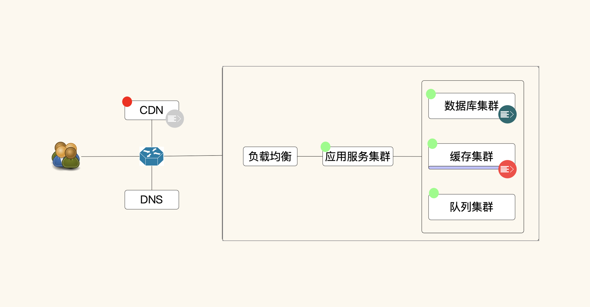

从这个简单的结构图中不难看出，如果没有铺底数据，那就相当于是一个空系统。但是在生产环境中，这个系统肯定不会是空的，所以要有足够的数据在里面。如果数据不真实，我们就无法模拟出生产上有真实数据的场景，比如应用的内存占用、数据库IO能力、网络吞吐能力等。

其中，对于静态数据而言，我们最容易出现的问题是，一想到它占的网络带宽大，就觉得要用CDN了 ；或者是觉得不模拟静态数据，就是不符合真实场景，不支持我们的优化结果了。其实，数据放在哪里，怎么做最合理，怎么做成本最低，这些都需要综合考虑，并不是一味跟风，别人怎么做我们就要怎么做。

<!-- [[[read_end]]] -->

我曾经看到有的官方门户网站明明没几个流量，却在做技术规划的时候，非要把零星的几个图片放到CDN上去，以显示自己设计的架构有多先进。

我也经常看到一些企业认为网站上的图片很重要，出于不懂技术又要寻找安全感的逻辑，非要把图片都放到自己的服务器里。本来图片就很大，一张有3～4M，用户一访问，自然就会吵吵着慢。

像这两种极端都不可取。要知道，当外行指使内行干活的时候，基本上没什么好结果，因为有些外行觉得只要压力发起就可以了，在细节上根本不在乎结果会怎么样。在我看来，处理这样问题的最合理的方式是先分析业务逻辑，再判断技术架构怎么实现。

我们知道，静态数据通常有两个可以存放的地方，一个是服务端的Web层，另一个是CDN。对于大系统而言，流量大，网络带宽自然就要求得多。在这种情况下，数据必然要放CDN，你也没有其他选择（当然了，你可以选择不同的CDN厂商）。

对于一些小的业务系统，由于用的人并不多，整体网络流量要求也少，那我们就可以把静态数据直接放到负载均衡服务器（比如Nginx）或应用服务器中去。用户访问一次之后，后续的访问直接走本地缓存就可以了，对系统的压力也不会产生多大的影响。

静态数据讲完了，我们再来看动态数据，这就需要我们好好分析一下了，因为有些动态数据是可以放到CDN中的。

还是前面那张图，在我们不用任何预热加载的情况下，这些动态数据都是存放在数据库中的。当我们使用预热加载时，这些数据就会转到缓存中去（当然，这也取决于架构设计和代码实现），变成下图中这样：

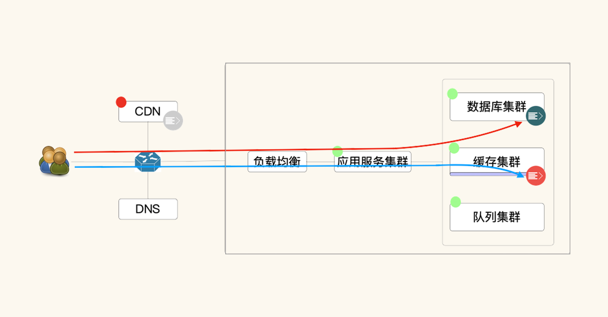

所以按照这样的逻辑，真实场景中业务操作的数据量实际有多少，我们就要模拟出多少，不然会出现一些问题。当模拟数据量与实际数据量差别较大时，会对数据库、缓存等造成不同的影响。下面我列出了五点，为你具体分析一下。

* **对数据库压力的区别**

假设线上系统中有100万的用户量，而我们在做压力测试时，由于没有生产数据，造数据又比较麻烦，所以就直接使用1000条甚至更低的用户量来做性能场景。那一个表里有100万条数据和1000条数据的差别是什么呢？我们来实际操作一下。

在这里，有一个前提条件：同样的硬件环境，同样的数据库，同样的表结构，同样的索引，只是两张表的数据不同。

两条SQL如下：

```
    select * from ob_tuning.temp1_1000 where id = '3959805';
    select * from ob_tuning.temp2_100w where id = '3959805';
    

```

因为表内的数据量不同，所以结果如下：


可以看到，查询时间一个是19ms，一个是732ms。我们不妨再来看一下表的操作细节。

第一个表（用户量为1000）的操作细节：

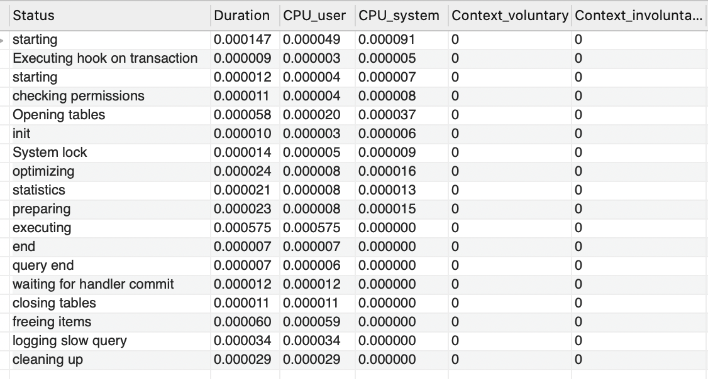

第二个表（用户量为100万）的操作细节：

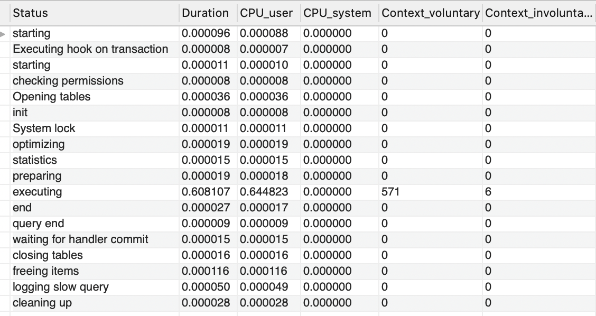

这里我们只需要对比“executing”这一行就能看到明显的差距，它告诉我们当执行这个语句时，需要的CPU时间明显因为数据量的增加而增加了。所以我们不难发现，如果你没有足够的铺底数据放在性能场景中，那一开始便注定了悲剧的结果。

* **缓存的区别**

数据量的多少在缓存中有很明显的区别，如下图所示：


也就是说，场景中用的数据量越多，缓存必然要求越大。

* **压力工具使用的区别**

压力工具中使用的数据多少，不仅影响着压力工具本身需要的内存，同时也影响着性能场景的执行结果。这一点，我们会在后面的课程中详细讲到。

* **网络的区别**

其实不同的数据量，不管是走缓存，还是数据库，对客户端和服务器之间的网络消耗都是差不多的。只要不是缓存在客户那边，都是要走到服务器里转一圈的。所以我们认为，数据量是多还是少，对客户端和服务器之间的网络的压力没有什么区别。如果你用的是CDN，那可以做另外的考虑。

* **应用的区别**

如果不是在应用中直接缓存数据，我们也认为对应用没什么区别，反正不管是什么样的请求过来，都是要到缓存或数据库中去取数据的，应用的Self Time不会有什么差别，方法依旧要执行。但是，如果你的应用是直接在应用的缓存中存数据的，那就有区别了，同样也是数据量越大，对内存的要求就越大。

基于以上几点，**我们可以看到****有两个****比较重要****的****环节：数据库****和****缓存****，****这是直接的影响。**

那间接的影响有什么呢？比如说，数据在数据库中执行得慢了，在同步调用的应用中必然需要更多的应用线程来处理。

我们假设有一个100TPS的系统，先忽略其他时间，只看数据库时间。如果数据库执行需要10ms，那应用只需要一个线程就能处理完了。如果数据库需要100ms，而我们仍然想达到100TPS，那应用就得有10个线程来同时处理。

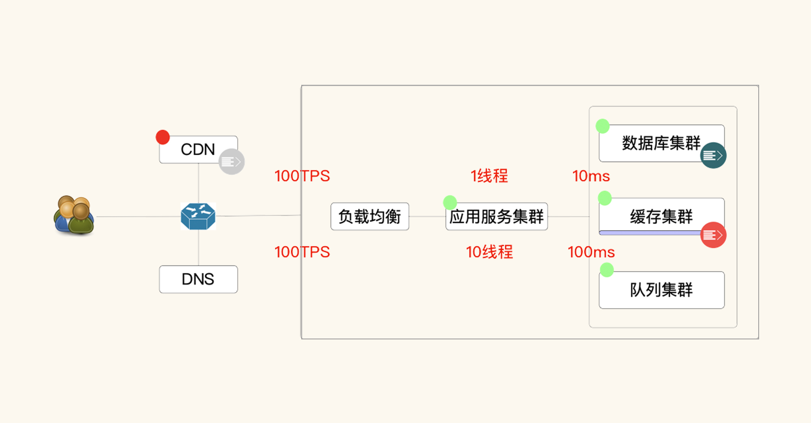

与此同时，整个链路上的所有线程、队列、超时等都会因为受到数据量的影响而产生大的变化。所以，我们要想模拟出生产时候的样子，在铺底数据上一定不能含糊。

## 参数化数据

有了前面铺底数据的分析，我们在做参数化的时候就会明确很多。不过，在场景中应该用多少量的数据，是性能场景中最容易出问题的一个环节。

参数化数据量应该是多少，取决于场景运行多长时间。而在场景运行中，我们通常要用到两类数据：唯一性数据和可重复使用的数据。

对于唯一性数据（比如用户数据）来说，我们需要使用多少参数化数据是非常容易计算的。比如一个运行半小时的场景，TPS如果是100的话，那就需要18万的数据量，计算过程如下：

\$数据量 = 30min \\times 60s \\times 100TPS = 18w\$

对于可重复使用的数据量，我们需要分析真实业务场景中是如何重复的，比如说电商系统中商品的数据量，我们在做参数化的时候就可以重复，毕竟多个人是可以同时购买同一个商品的。我们假设平均有1000个用户在10个商品中，那当我们有18万个用户时，就需要1800个商品：

\$商品数量 = 18w用户 \\div 1000用户 \\times 10 商品 = 1800 商品\$

上述就是唯一性数据量和可重复使用数据量的计算方式。

你可能会问，如果参数化数据量太大，在压力工具中处理不了怎么办？比如说我们在用JMeter处理文件参数化数据时，如果参数化文件太长，会导致JMeter消耗更多的时间。其实像这种参数化数据量要求多的情况，我们可以采用连接远程缓存（比如Redis）或数据库（比如MySQL）的方式来做参数化。

* **连接Redis做参数化**

**方法一**：直接在JMeter中写Beanshell连接Redis取数据。

```
    import redis.clients.jedis.Jedis;
      //连接本地的 Redis 服务
    Jedis jedis = new Jedis("172.16.106.130",30379);
    log.info("服务正在运行: "+jedis.ping());
    String key = vars.get("username");
    String value = vars.get("token");
    vars.put("tokenredis",jedis.get(key));
    

```

**方法二**：使用Redis Data Set组件。

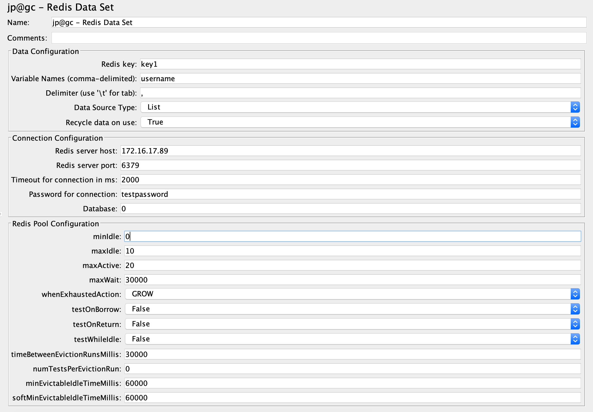

这两种方式都可以用Redis做参数化的数据源。

* **连接MySQL做参数化**

**第一步**：创建一个JDBC Connection Configuration。

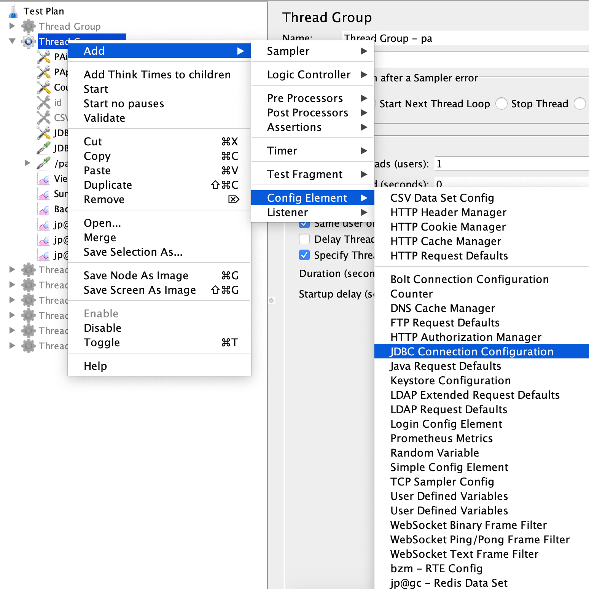

同时，配置好连接信息，比如用户名密码等：  
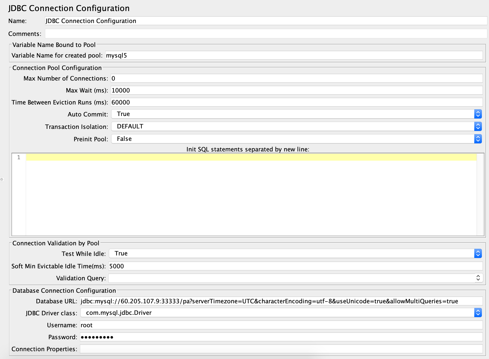

**第二步**：创建一个JDBC Request。

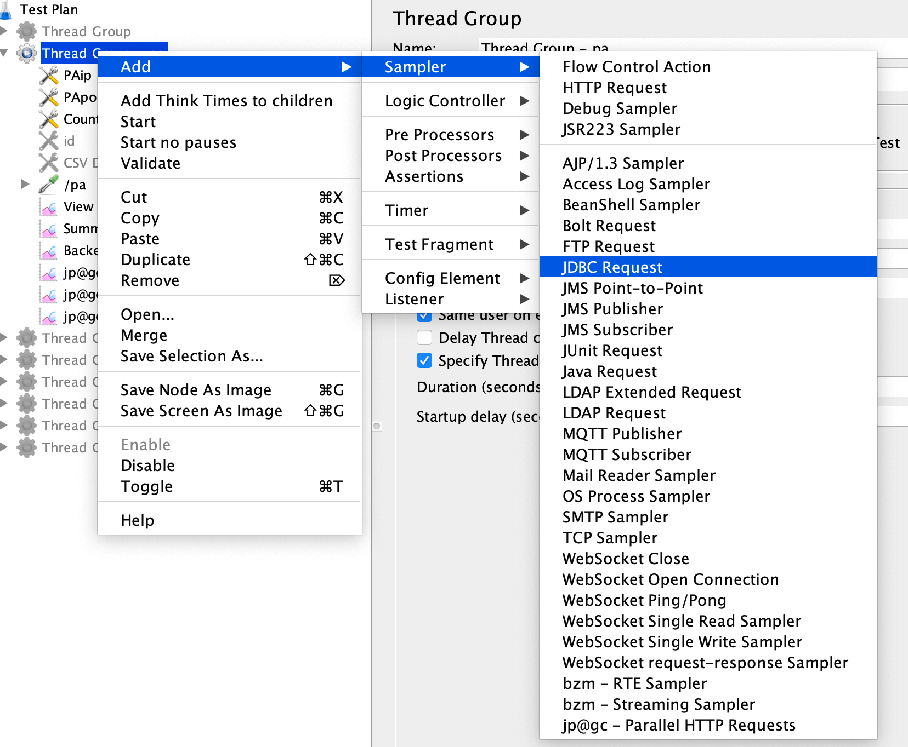

用JDBC Request把数据取回来：

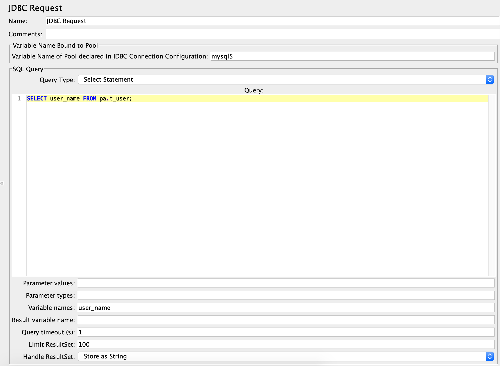

**第三步**：用\$\{user\_name\}引用参数。

完成上述三步，我们就实现了用数据库的方式做参数化。

知道了RESAR性能工程中需要什么样的数据后，我们接下来聊一下如何造数据。

## 如何造数据？

因为我们这个项目中的电商平台是开源的，数据库也完全是空的，系统中没有任何的数据。所以，我们虽然只是实现了电商的主流程，但需要的数据量仍然不少。这些数据包括：

* 用户数据；
* 地址数据；
* 商品数据；
* 订单数据。

下面我们具体考虑一下数据量应该怎么设置。

根据我们[第5讲](https://time.geekbang.org/column/article/357539)中的性能方案，登录TPS如果是每秒150，并且如果按容量场景的需求，在场景连续递增时，大概在20分钟内（这是一个经验值，在具体的场景执行中也会有变化）会递增到最大值，然后再执行10分钟，也就是说总时间大概为30分钟。

但是因为场景是递增的，一开始我们并没有要求达到150TPS，同时登录场景TPS最大值能达到多少，我们现在也没法预知。根据经验来看的话，登录的TPS在当前的硬件环境中，就算是不走缓存，达到三、四百应该是没有多大问题的。

如果按最大400TPS来算，跑半个小时，需要的数据量就是54万，而我们造出来的用户量要远远大于这个量级。这里我们就先造200万的用户量，因为地址的数据量肯定大于用户的数据量，所以会多于200万。

我们先查一下当前的数据库中有多少数据量，再确定要造多少数据。

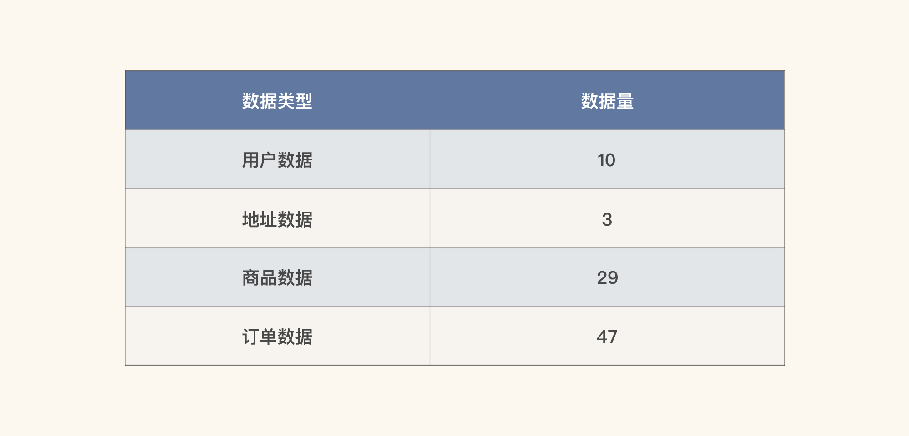

这个数据量级明显是不够的，太少了。下面我们来看看怎么造出那么多的数据量。

我们造的数据主要分为两种：用户数据和订单数据。

* **登陆用户**

对于登陆用户数据而言，我们要先了解表结构，因为造出来的数据只有符合业务逻辑才能使用。我们先看一下用户表结构和数据。

用户表：

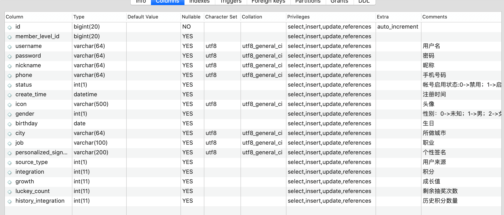  
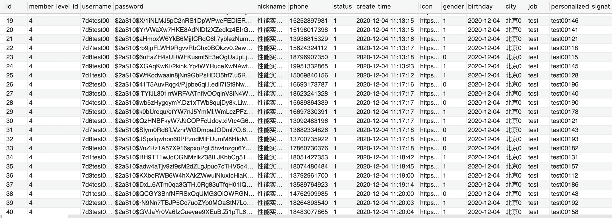

地址表：

  
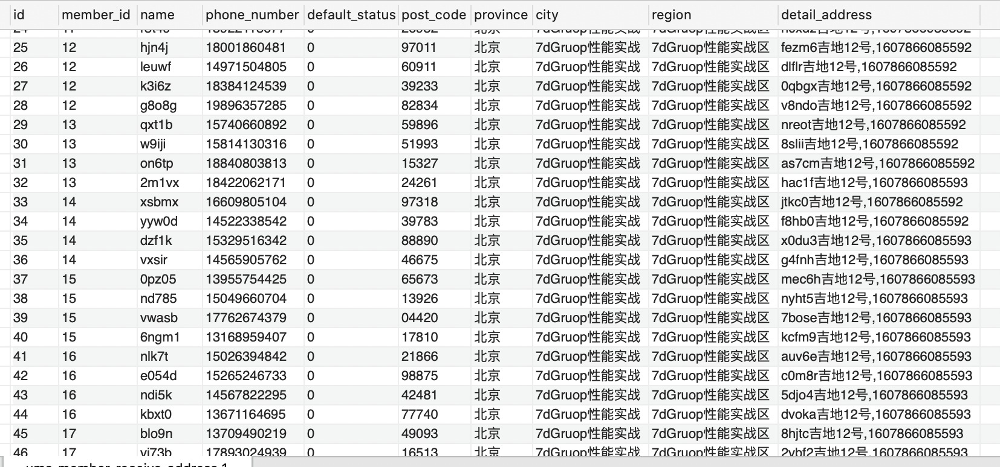

根据我的经验，**造数据时不要往数据库里直接写存储过程插数据，除非你非常清楚表之间的关系，并且存储过程又写得非常溜**。否则你会把数据库弄得一团乱，最后不得不在数据库的表里改数据，这是非常被动的做法。在这里，我推荐你使用接口直接调用来造数据，这个操作比较简单，也比较安全。

如果你想用代码来造数据，那就需要做下面这些分析。

在这里，我们的用户表和地址表之间是有对应关系的，你可以通过下面这段代码查看到，地址表中的MemberID就是用户ID号。

```
    @Override
    public int add(UmsMemberReceiveAddress address) {
        UmsMember currentMember = memberService.getCurrentMember();
        address.setMemberId(currentMember.getId());
        return addressMapper.insert(address);
    }
    

```

其实造用户数据就是实现注册流程。你可以先分析下用户注册的代码，直接把其中的注册代码部分拿过来用就行了。具体调用代码如下：

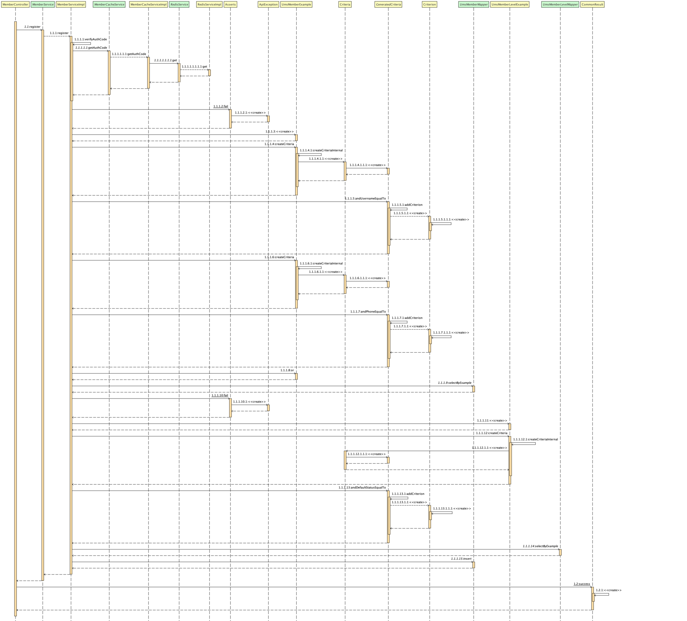

看到这里，你可能会想，造数据需要关心注册流程吗？其实如果我们是调接口造数据，就不需要；但如果写代码开启了多线程来造数据，我们就需要了解接口之间的调用关系了。

下面我们截出中间一部分来分析它们的调用关系：


因为注册用户表中的密码都是加密的，所以我们可以通过注册用户实现类代码，如下:

```
    @Override
    public void register(String username, String password, String telephone, String authCode) {
    ...............................
        //获取默认会员等级并设置
        UmsMemberLevelExample levelExample = new UmsMemberLevelExample();
        levelExample.createCriteria().andDefaultStatusEqualTo(1)  ;
        List<UmsMemberLevel> memberLevelList = memberLevelMapper.selectByExample(levelExample);
        if (!CollectionUtils.isEmpty(memberLevelList)) {
            umsMember.setMemberLevelId(memberLevelList.get(0).getId());
        }
        //插入用户
        memberMapper.insert(umsMember);
        umsMember.setPassword(null);
    }
    

```

了解了上面的内容之后，我们就可以直接写一段代码来造用户数据了，具体请见：[《造用户代码.java》](https://github.com/ZeeBJ/-/blob/main/%E9%80%A0%E7%94%A8%E6%88%B7%E4%BB%A3%E7%A0%81.java)

有了用户数据，我们还需要下单用户的地址等详细信息，只有这样才能完成下单。所以，接下来我们就开始分析怎么造出可以下单的地址数据。

* **用户地址**

首先，我们要根据用户地址资源路径找到Controller层，查看用户地址的代码调用关系，如下：

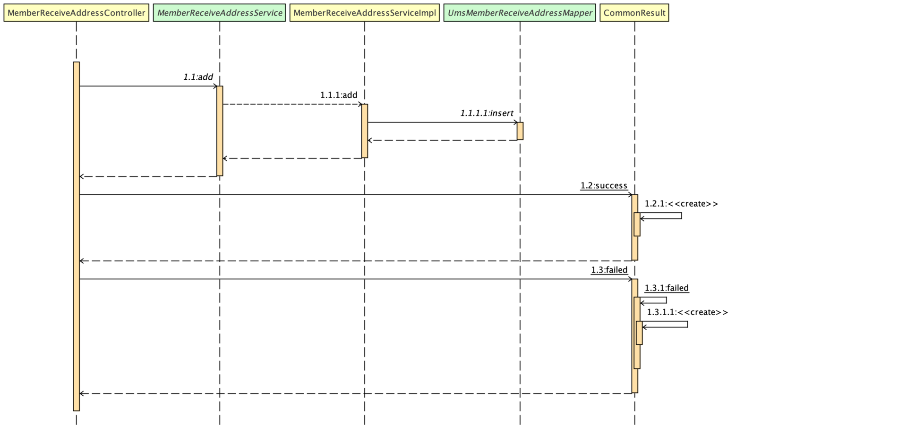

然后找到用户地址的关键代码：

```
    @Override
    public int add(UmsMemberReceiveAddress address) {
        UmsMember currentMember = memberService.getCurrentMember();
        address.setMemberId(currentMember.getId());
        //插入地址
        return addressMapper.insert(address);
    }
    

```

从这段代码中，我们可以观察到这几个信息：

* 调用地址接口需要用户登陆态，通过登陆态来解析用户ID号；
* 用户ID号是地址代码中的MemberID号；
* 用户ID号是自增加。

具体参考请见[《造用户地址代码.java》](https://github.com/ZeeBJ/-/blob/main/%E9%80%A0%E7%94%A8%E6%88%B7%E5%9C%B0%E5%9D%80%E4%BB%A3%E7%A0%81.java)。

通过上面的代码编写，然后再开启Java线程池与多线程，我们就可以把基础数据快速造完了。下面是造用户地址数据的时间记录（每台电脑配置不一样，用的数据也许会有差异）：

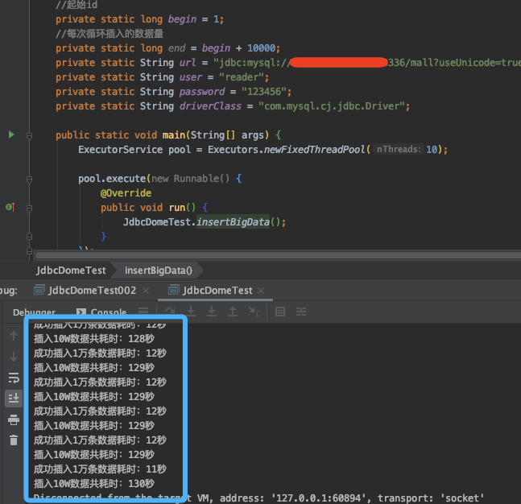

通过以上手段，我们最后造出如下数据量：

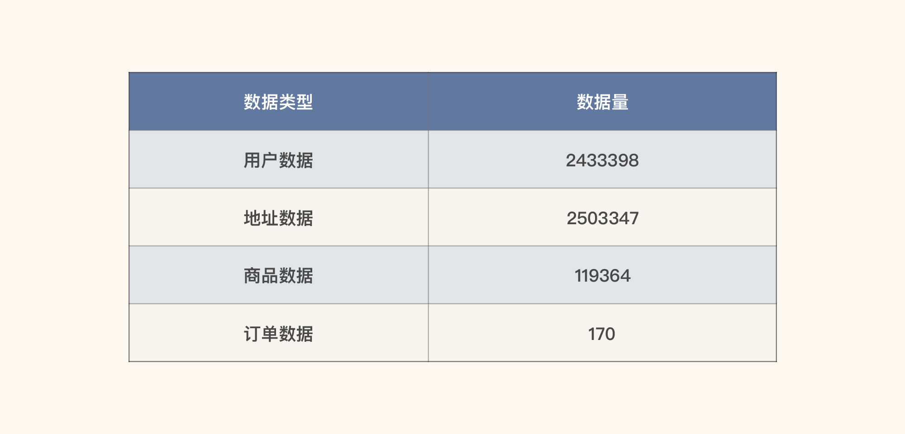

表中的订单数据会在做基准场景时补充上去。等这些数据量都有了，我们在容量场景中就有了足够的铺底数据。

## 总结

在这节课里，我们一起学习了性能场景中的数据到底应该做成什么样子。对于造数据而言，方法有很多，我们不用拘泥于某种造数据的手段，只要能快速造出足够的数据量就好。在RESAR性能工程中，性能场景需要两类数据：铺底数据和参数化数据。其中，铺底数据需要满足这三个条件：

* 一定要造出符合生产量级的数据量；
* 数据量要真实模拟出生产的数据分布；
* 数据要真实可用。

参数化数据需要满足这两个条件：

* 参数化数据量要足够；
* 要符合真实用户的输入数据。

有了以上这些知识，我们就不会在造数据时出现混乱的情况了。

## 课后作业

这就是今天的全部内容，最后给你留两个思考题吧：

1.  为什么要造出符合生产量级的数据量？
2.  为什么参数化时要用符合真实用户的输入数据？

记得在留言区和我讨论、交流你的想法，每一次思考都会让你更进一步。

如果这节课让你有所收获，也欢迎你分享给你的朋友，共同学习进步。我们下一讲再见！