---
date: "2019-06-23"
---  
      
# 13 | 用户登录：怎么判断线程中的Block原因？
你好，我是高楼。

这节课我们接着来“玩”一下用户登录。在[第10讲](https://time.geekbang.org/column/article/362010)的课程中，我们以登录功能为例做了一些分析，来说明基准场景中的一些要点。但是，我们还没有把它优化完，所以这节课还要接着来折腾它。

用户登录说起来只是一个很普通的功能，不过它的逻辑一点也不简单。因为登录过程要对个人的信息进行对比验证，验证过程中又要调用相应的加密算法，而加密算法是对性能要求很高的一种功能。复杂的加密算法安全性高，但性能就差；不复杂的加密算法性能好，但安全性低，这是一个取舍的问题。

另外，还有Session存储和同步。对于个大型的系统来说，不管你在哪个系统访问，在调用其他系统时如果需要验证身份就要同步Session信息，并且在做业务时，我们也要把相应的Session信息带上，不然就识别不了。

你看，登录功能实际上会涉及到很多的业务，它其实一点也不简单。所以，这节课我会带着你好好分析用户登录功能，并带你了解在压力过程中业务逻辑链路和整体TPS之间的关系。同时，也希望你能学会判断线程中的BLOCKED原因。

## 修改加密算法

还记得在[第10讲](https://time.geekbang.org/column/article/362010)中，我们在基准场景中对登录业务的测试结果吗？在10个压力线程下，TPS达到了100左右。


同时，在[第10](https://time.geekbang.org/column/article/362010)[讲](https://time.geekbang.org/column/article/362010)中，我们发现了加密算法BCrypt效率低之后，讨论了两种优化方式：一种是用更快的加密方式，另一种是去掉这个加密算法。当时，我选择把加密算法BCrypt直接去掉。在这节课中，我们来试试第一种方式，把它改为MD5，具体有两个动作：

<!-- [[[read_end]]] -->

* 更改加密算法。之前的BCrypt加密算法虽然安全性高，但性能差，所以建议改成MD5。
* 加载所有用户到Redis中。

我们再跑一遍压力场景。注意，在跑这一遍之前，我们只是更改了加密算法，并没有执行加载缓存的动作。我希望一次只做一个动作来判断结果（但是上面两个动作我们都要做哦，请你接着看下去），结果如下：


从上面的结果来看，性能有些上升了，但是还没达到我想要的样子。我希望性能有突飞猛进的增加，而不是现在这样不温不火的样子，看着就来气。所以，我们还是要继续“收拾收拾”这个接口，使用缓存，看下效果如何。

## 检验缓存的效果

为了确定缓存对后续的性能优化产生了效果，我们可以用两个手段来检验效果：

* 把参数化数据量降下来，只用少量的数据测试一下（请注意，我们只是尝试一下，并不是说用少量的数据来运行场景是对的）；
* 直接加载全部缓存。

我们得到这样的结果：


从曲线上看，登录接口能达到300TPS左右了。但是，我还是觉得不够好，因为从硬件资源上来看，再根据我以往的经验，它应该还能达到更高才对。

而在分析的过程中，再也没有[第11](https://time.geekbang.org/column/article/362940)[讲](https://time.geekbang.org/column/article/362940)和[第](https://time.geekbang.org/column/article/363736)[12讲](https://time.geekbang.org/column/article/363736)中提到的硬件资源的问题，但是在这里我们通过查看全局监控数据，看到的是us cpu高，说明确实都是业务逻辑在消耗CPU资源了。所以，我们就只有从登陆逻辑入手，来优化这个问题了。

## 修改登录的逻辑

通过阅读源代码，我整理了这个系统的原登录逻辑：

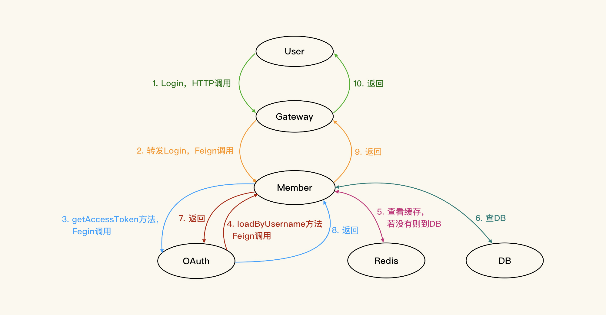

这个逻辑看着比较啰嗦，其中Member服务调auth服务，倒还能理解。可是，Auth服务为什么还要到Member里取用户名呢？自己直接查缓存或DB不香吗？从架构设计的角度来看，为了避免共享数据库，这样的设计似乎也没啥。只是在我们的优化过程中，需要根据实际环境来做判断。

在我们这个环境中，需要把DB共用，这样Auth服务就可以直接使用数据库，而不用再从Member绕一圈。所以，我们先改成下面这种新的登录逻辑，这样就可以减少一次调用。

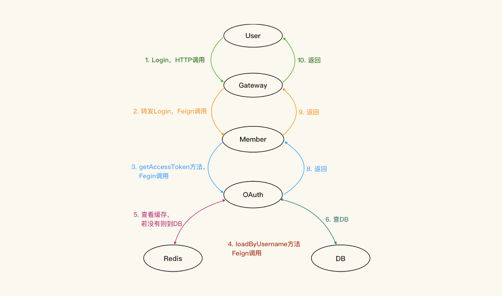

修改之后，登录TPS如下：

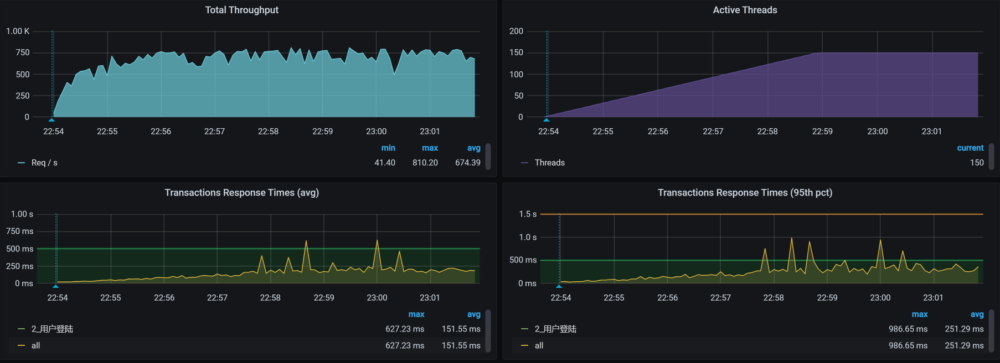

从结果上来看，TPS确实有增加，已经到700以上了。很好。

这时候是不是就可以结束分析了呢？不是，我们还需要知道当前的瓶颈点在哪，因为根据我的性能理念，每个业务都会有瓶颈点，不管优化到什么程度，除非一直把硬件资源耗光。所以，我们继续接着分析。

## 看架构图

还是一样，在分析性能瓶颈之前，我们先来看架构图，了解用户登录接口会涉及到哪些服务和技术组件。

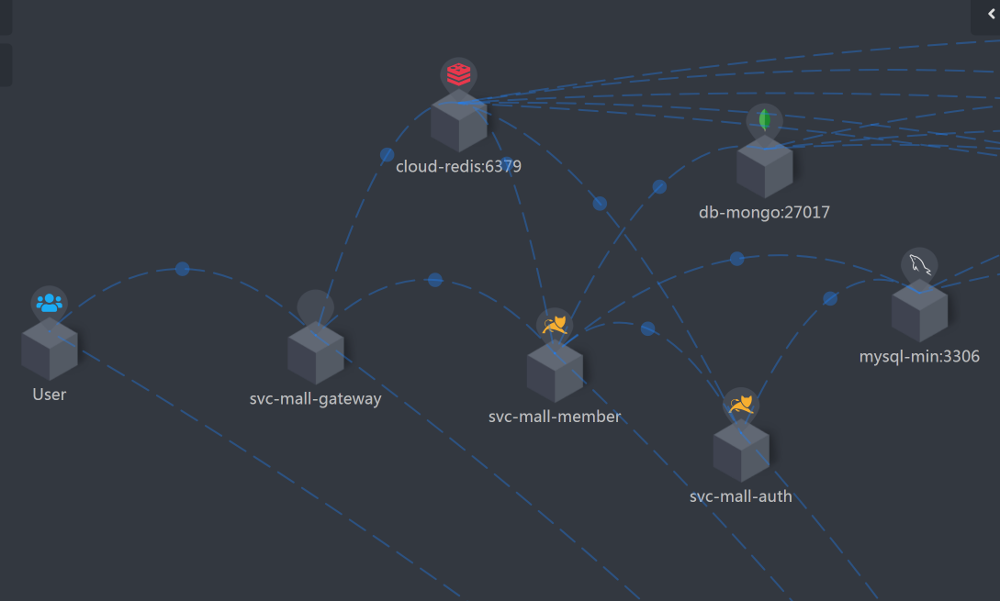

从这个架构图中可以看到，登录操作跨了Gateway/Member/Auth三个服务，连接了Redis/MySQL两个组件。图中的MongoDB虽然看上去有线，但实际上登录并没有用上。

了解这些信息之后，我们按照分析逻辑，一步步来分析问题。

## 拆分时间

我们前面提到，修改登录逻辑后的TPS如下：


可以看到，响应时间已经上升到了100ms左右，所以，我们现在要找出这个时间消耗在了哪里。你可能已经注意到，图中的用户增加到了150。这是为了把响应时间拉大，便于我们分析。下面我们把这个响应时间拆分一下，看看问题出在哪里。

* **Gateway服务上的时间**

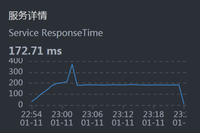

* **Member服务上的时间**

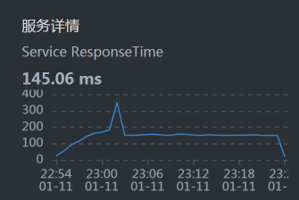

* **Auth服务上的时间**

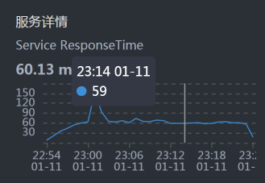

我们看到，Member服务上的时间消耗是150ms左右，Auth服务上的时间消耗有60ms左右。Member服务是我们要着重分析的，因为它的响应时间更长。而Auth上虽然时间不太长，但是也达到了60ms左右，从经验上来说，我觉得还是有点稍长了，最好平均能到50ms以下，所以我们也要稍微关心一下。

## 全局监控

我们的分析逻辑雷打不动，依旧是**先看全局监控，后看定向监控**。从下面这张全局监控图的数据来看，worker-7和worker-8的CPU使用率比其他的要高。


既然worker-7/8的CPU使用率要高一点，那我们就要查一下这两个节点上跑着什么样的服务。所以我们来看一下POD的分布，大概看一下每个POD在哪个worker节点上，以便后面分析POD相互之间的影响：


原来，在worker-7和worker-8上，分别运行着响应时间稍高的Auth服务和Member服务。对于这两个服务，我们都要分析，只是得一个一个来，那我们就从auth服务开始。

你可能会问：为什么要先从Auth服务下手呢？没啥原因，就是看它的CPU更红一点。你还可能奇怪：图中其他地方也红了，为什么不关注呢？我来逐一给你分析一下。

* 图中的worker-1和worker-2，内存使用率相对较大，达到了70\%以上。从经验上来说，我几乎没有怎么关心过Linux的内存使用率，除非出现大量的page faults。因为Linux内存在分配给应用程序使用之后，是会体现在Cache当中的。被应用程序Cache住的内存在操作系统上来看都是被使用的，但实际上可能并未真的被使用，这时操作系统会把这部分Cache内存计算到available内存当中，所以说，我们直接看操作系统级别的空闲内存是分析不出问题来的。

* 在worker-2上，我们看到TCP的Time Wait达到近3万，不过这也不是我关心的点，因为Time Wait是正常的TCP状态，只有端口不够用、内存严重不足，我才会稍微看一眼。

* 至于worker-1和worker-2的上下行带宽，看起来真是不大。在内网结构中，我们在测试的时候，内网带宽达到过好几Gbps，这点带宽还不足以引起我们的重视。

所以，我们要“收拾”的还是worker-7和worker-8。

既然Auth服务在worker-7上，member服务在worker-8上，就像前面说的，我们不如就从Auth服务开始。

## Auth服务定向分析

对于Auth服务，我们从哪里开始分析呢？其实，我们可以按部就班。既然是Auth服务导致worker-7的CPU使用率偏高，那我们就可以走下面这个证据链：

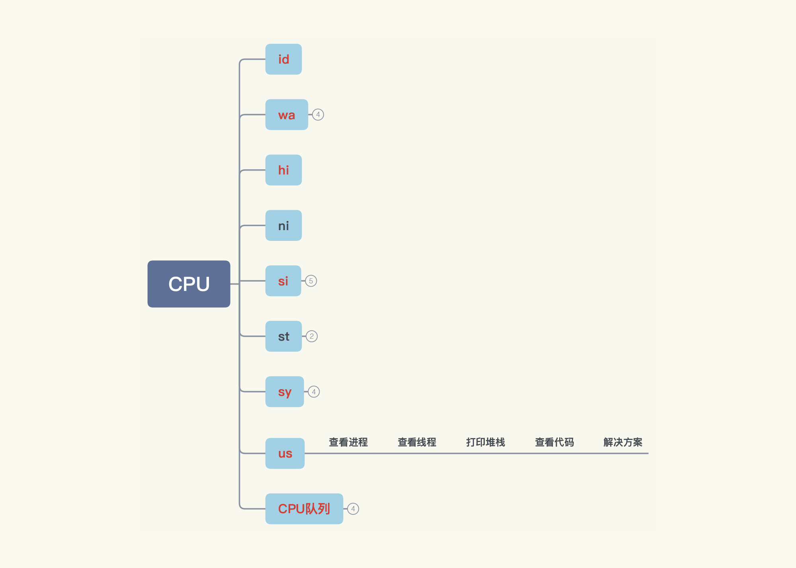

按照这个证据链，我们应该先看进程。不过，仗着傻小子火气壮（俗称：艺高人胆大），我直接就去看线程状态了，想看看能不能凭经验蒙对一把。于是，我打开了Spring Boot Admin的线程页面：


有没有满目疮痍的感觉？人生就是这样，到处都有惊吓。

在我颤抖着手点开一些红色的地方之后，看到了类似这样的信息：

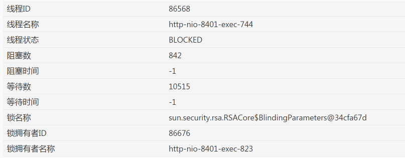

可以看到，阻塞数非常大，达到了842。此外，锁拥有者ID是86676，锁拥有者名称是线程823。

我们抓两段栈出来看一下，找一下锁之间的关系：

```
    -- 第一处：
    "http-nio-8401-exec-884" #86813 daemon prio=5 os_prio=0 tid=0x00007f2868073000 nid=0x559e waiting for monitor entry [0x00007f2800c6d000]
       ​java.lang.Thread.State: BLOCKED (on object monitor
    	at java.security.Provider.getService(Provider.java:1035)
    	- waiting to lock <0x000000071ab1a5d8> (a sun.security.provider.Sun)
    	at sun.security.jca.ProviderList.getService(ProviderList.java:332)
    .....................
    	at com.dunshan.mall.auth.util.MD5Util.toMD5(MD5Util.java:11)
    	at com.dunshan.mall.auth.config.MyPasswordEncoder.matches(MyPasswordEncoder.java:23)
    .....................
      ​at com.dunshan.mall.auth.controller.AuthController.postAccessToken$original$sWMe48t2(AuthController.java:46
    	at com.dunshan.mall.auth.controller.AuthController.postAccessToken$original$sWMe48t2$accessor$jl0WbQJB(AuthController.java)
    	at com.dunshan.mall.auth.controller.AuthController$auxiliary$z8kF9l34.call(Unknown Source)
    .....................
    	at com.dunshan.mall.auth.controller.AuthController.postAccessToken(AuthController.java)
    .....................
    
    
    -- 第二处：
    "http-nio-8401-exec-862" #86728 daemon prio=5 os_prio=0 tid=0x00007f28680d6000 nid=0x553a waiting for monitor entry [0x00007f2802b8c000]
       ​java.lang.Thread.State: BLOCKED (on object monitor
    	at sun.security.rsa.RSACore$BlindingParameters.getBlindingRandomPair(RSACore.java:404)
    	- waiting to lock <0x000000071ddad410> (a sun.security.rsa.RSACore$BlindingParameters)
    	at sun.security.rsa.RSACore.getBlindingRandomPair(RSACore.java:443)
    	.....................
    	at com.dunshan.mall.auth.controller.AuthController.postAccessToken$original$sWMe48t2(AuthController.java:46)
    	at com.dunshan.mall.auth.controller.AuthController.postAccessToken$original$sWMe48t2$accessor$jl0WbQJB(AuthController.java)
    	at com.dunshan.mall.auth.controller.AuthController$auxiliary$z8kF9l34.call(Unknown Source)
    .....................
    	at com.dunshan.mall.auth.controller.AuthController.postAccessToken(AuthController.java)
    .....................
    

```

这两个栈的内容并不是同一时刻出现的，说明这个BLOCKED一直存在。但是不管怎么样，这个栈在做RSA加密，它和Token部分有关。

其中，线程http-nio-8401-exec-884是BLOCKED状态，那就说明有其他线程持有这个锁，所以我们自然要看一下线程栈中的waiting to lock \<0x000000071ab1a5d8>。其实，如果你有经验的话，一下子就能知道这里面是什么问题。不过，我们做性能分析的人要讲逻辑。

我在这里啰嗦几句，**当你碰到这种锁问题，又不知道具体原因的时候，要下意识地去打印一个完整的栈来看，而不是再到Spring Boot Admin里胡乱点**。为什么不建议你这么做？原因有这么几个：

* 由于线程太多，点着看逻辑关系比较累；
* 不断在刷，眼晕；
* 我不喜欢。

所以，对于前面遇到的锁问题，我们首先要做的就是到容器中的jstack里打印一下栈，把它下载下来，然后祭出工具打开看一眼。

你可能会问，为什么不用Arthas之类的工具直接在容器里看？主要是因为Arthas的Dashboard在Thread比较多的时候，看起来真心累。

下面这张图就是jstack打印出来的栈，在下载之后用工具打开的效果。

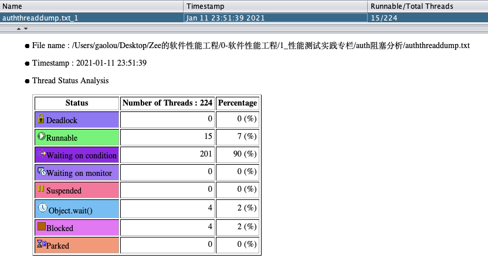

是不是有种买彩票的感觉？看起来有那么多的BLOCKED状态的线程（多达842个），居然一个都没蒙到！我本来想抓BLOCKED状态的线程，并且线程描述是“Waiting on monitor”，但是，从上面的线程描述统计来看，一个也没见。哼，真生气。

这时候，身为一个做性能分析的人，我们一定要记得倒杯茶，静静心，默默地把jstack连续再执行几遍。我在这里就连续执行了10遍，然后再找每个栈的状态。

终于，Waiting on monitor来了：

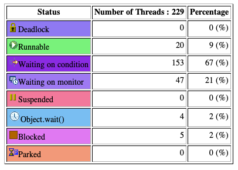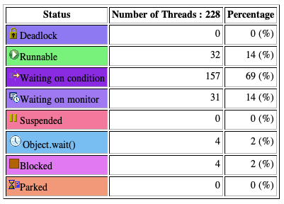

看起来有得玩了！接下来让我们看看究竟是谁阻塞住了上面的线程。

我们先在相应的栈里，找到对应的持有锁的栈。下面是栈中的阻塞关系。

* **第一个栈**

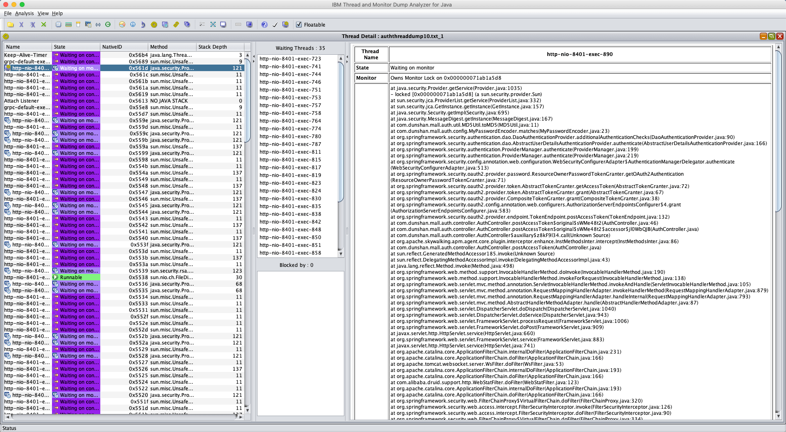

* **第二个栈**

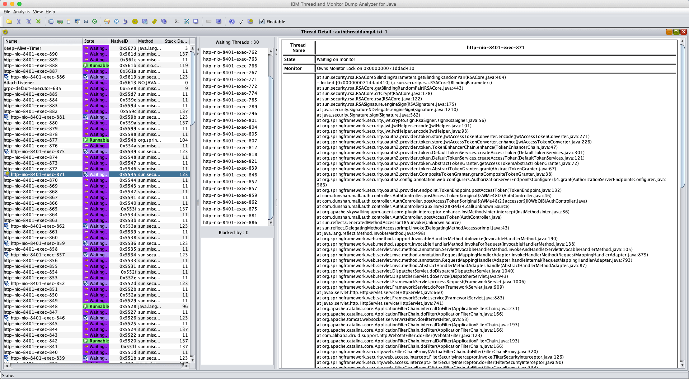

你要注意，这是两个栈文件。所以，我们要分别从这两个栈文件里找到各自的对应等待关系。下面这段代码就对应了上面的Waiting线程。

```
    -- 第一处
    "http-nio-8401-exec-890" #86930 daemon prio=5 os_prio=0 tid=0x00007f28680a5800 nid=0x561d waiting for monitor entry [0x00007f2800263000]
       ​java.lang.Thread.State: BLOCKED (on object monitor
    	at java.security.Provider.getService(Provider.java:1035)
    	- locked <0x000000071ab1a5d8> (a sun.security.provider.Sun)
    	at sun.security.jca.ProviderList.getService(ProviderList.java:332)
    	.....................
    	at com.dunshan.mall.auth.util.MD5Util.toMD5(MD5Util.java:11)
    	at com.dunshan.mall.auth.config.MyPasswordEncoder.matches(MyPasswordEncoder.java:23)
    .....................
    	at com.dunshan.mall.auth.controller.AuthController.postAccessToken$original$sWMe48t2(AuthController.java:46)
    	at com.dunshan.mall.auth.controller.AuthController.postAccessToken$original$sWMe48t2$accessor$jl0WbQJB(AuthController.java)
    	at com.dunshan.mall.auth.controller.AuthController$auxiliary$z8kF9l34.call(Unknown Source)
    	at org.apache.skywalking.apm.agent.core.plugin.interceptor.enhance.InstMethodsInter.intercept(InstMethodsInter.java:86)
    	at com.dunshan.mall.auth.controller.AuthController.postAccessToken(AuthController.java)
    
    
    -- 第二处
    "http-nio-8401-exec-871" #86739 daemon prio=5 os_prio=0 tid=0x00007f28681d6800 nid=0x5545 waiting for monitor entry [0x00007f2801a7b000]
       ​java.lang.Thread.State: BLOCKED (on object monitor
    	at sun.security.rsa.RSACore$BlindingParameters.getBlindingRandomPair(RSACore.java:404)
    	- locked <0x000000071ddad410> (a sun.security.rsa.RSACore$BlindingParameters)
    	at sun.security.rsa.RSACore.getBlindingRandomPair(RSACore.java:443)
    .....................	
    	at com.dunshan.mall.auth.controller.AuthController.postAccessToken$original$sWMe48t2(AuthController.java:46)
    	at com.dunshan.mall.auth.controller.AuthController.postAccessToken$original$sWMe48t2$accessor$jl0WbQJB(AuthController.java)
    	at com.dunshan.mall.auth.controller.AuthController$auxiliary$z8kF9l34.call(Unknown Source)
    	at org.apache.skywalking.apm.agent.core.plugin.interceptor.enhance.InstMethodsInter.intercept(InstMethodsInter.java:86)
    	at com.dunshan.mall.auth.controller.AuthController.postAccessToken(AuthController.java)
    

```

你看上面locked这一行的锁ID，既然找到了这两处持有锁的栈，那我们就通过上面的栈，到源码中找到这两处栈的代码：

```
    -- 第一处同步代码块
        public synchronized Service getService(String type, String algorithm) {
            ​checkInitialized()
            // avoid allocating a new key object if possible
            ​ServiceKey key = previousKey
            if (key.matches(type, algorithm) == false) {
                key = new ServiceKey(type, algorithm, false);
                ​previousKey = key
            ​
            if (serviceMap != null) {
                ​Service service = serviceMap.get(key)
                if (service != null) {
                    return service;
                ​
            ​
            ​ensureLegacyParsed()
            return (legacyMap != null) ? legacyMap.get(key) : null;
        ​
    
    
    -- 第二处同步代码块
            // return null if need to reset the parameters
            BlindingRandomPair getBlindingRandomPair(
                    BigInteger e, BigInteger d, BigInteger n) {
    
    
                if ((this.e != null && this.e.equals(e)) ||
                    (this.d != null && this.d.equals(d))) {
    
    
                    BlindingRandomPair brp = null;
                    synchronized (this) {
                        if (!u.equals(BigInteger.ZERO) &&
                            ​!v.equals(BigInteger.ZERO)) 
    
    
                            brp = new BlindingRandomPair(u, v);
                            if (u.compareTo(BigInteger.ONE) <= 0 ||
                                v.compareTo(BigInteger.ONE) <= 0) {
    
    
                                // need to reset the random pair next time
                                ​u = BigInteger.ZERO
                                ​v = BigInteger.ZERO
                            } else {
                                ​u = u.modPow(BIG_TWO, n)
                                ​v = v.modPow(BIG_TWO, n)
                            ​
                        } // Otherwise, need to reset the random pair.
                    ​
                    return brp;
                ​
    
    
                return null;
    

```

你可以看到，第一处是JDK中提供的getService类采用了全局同步锁定，导致的分配key时产生争用，这个其实在JDK的Bug List中有过描述，详见[JDK-7092821](https://bugs.openjdk.java.net/browse/JDK-7092821)。准确来说，它不算是Bug，如果你想改的话，可以换一个库。

第二处是JDK中提供的RSA方法，是为了防范时序攻击特意设计成这样的。RSA中有大素数的计算，为了线程安全，RSA又加了锁。关于RSA的逻辑，你可以去看下源代码的/sun/security/rsa/RSACore.java中的逻辑。

不过，RSA是一种低效的加密方法，当压力发起来的时候，这样的synchronized类必然会导致BLOCKED出现。对此，在源码中有下面这样一段注释，其中建议先计算u/v，可以提高加密效率。

```
     ​* Computing inverses mod n and random number generation is slow, s
     * it is often not practical to generate a new random (u, v) pair for
     * each new exponentiation.  The calculation of parameters might even be
     * subject to timing attacks.  However, (u, v) pairs should not be
     * reused since they themselves might be compromised by timing attacks,
     * leaving the private exponent vulnerable.  An efficient solution to
     * this problem is update u and v before each modular exponentiation
     * step by computing:
     *
     *     u = u ^ 2
     *     v = v ^ 2
     ​
     ​* The total performance cost is small
    

```

既然我们已经知道了这两个BLOCKED产生的原因，那下一步的操作就比较简单了。

* 针对第一处锁：实现自己的方法，比如说实现一个自己的分布式锁。
* 针对第二处锁：换一个高效的实现。

至此，我们就找到了应用中BLOCKED的逻辑。因为我们这是一个性能专栏，所以我就不再接着整下去了。如果你是在一个项目中，分析到这里就可以把问题扔给开发，然后去喝茶了，让他们伤脑筋去，哈哈。

不过，这只是一句玩笑而已，你可别当真。作为性能分析人员，我们要给出合情合理并且有证据链的分析过程，这样我们和其他团队成员沟通的时候，才会更加简单、高效。

## Member服务定向分析

分析完Auth服务后，我们再来看看Member服务的性能怎么样。因为全局监控数据前面我们已经展示了，所以这里不再重复说明，我们直接来拆分一下对Member服务调用时的响应时间。

* **Gateway上的响应时间**


* **Member上的响应时间**

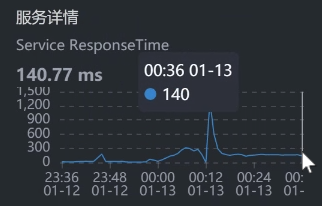

* **Auth上的响应时间**

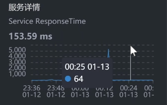

从上面的信息来看，这几段都有不同的时间消耗：Member服务上有80毫秒左右，Auth服务上已经有60毫秒左右，明显是有点高了。

我们登录到Member这个服务中，先看整体的资源使用情况。这里我用了最经典传统的top命令：

```
    %Cpu0  : 63.8 us, 12.4 sy,  0.0 ni,  9.2 id,  0.0 wa,  0.0 hi, 14.2 si,  0.4 st
    %Cpu1  : 60.3 us, 11.7 sy,  0.0 ni, 11.0 id,  0.0 wa,  0.0 hi, 16.6 si,  0.3 st
    %Cpu2  : 59.4 us, 12.0 sy,  0.0 ni, 14.1 id,  0.0 wa,  0.0 hi, 13.8 si,  0.7 st
    %Cpu3  : 59.8 us, 12.1 sy,  0.0 ni, 11.7 id,  0.0 wa,  0.0 hi, 15.7 si,  0.7 st
    

```

从CPU使用分布上来看，其他计数器都还正常，只是si有点高。这是一个网络中断的问题，虽然有优化的空间，但是受基础架构所限，性能提升得不太多，这也是为什么现在很多企业都放弃了虚拟化，直接选择容器化的一个原因。

针对这个网络中断的问题，我将在后面的课程中仔细给你扒一扒，这节课我们暂且不做过多的讲解。

## 总结

这节课我用登录功能给你串了一个完整的性能分析场景。

在前面代码修改的部分，性能分析过程是比较快的，我们就是看看哪里的代码逻辑会消耗更多的时间。这个思路就是前面提到的us cpu的证据链。

而接下来我们在分析Auth服务的时候，是先从拆分时间开始一步步走到代码里的，其中最核心的部分是从CPU到栈，再到BLOCKED的判断。当我们看到栈上有BLOCKED的时候，要记得打印栈信息。但是因为有些锁会非常快速地获取和释放，所以就可能会出现打印栈时，看到等某个锁的栈信息，但是整个栈文件中却没有这把锁的情况。这个时候，你就要注意了，**我们一定要去连续地多打几次栈，直到抓到对应的锁。**

这是分析栈中锁的一个关键，因为我们经常会看到等锁的栈信息，看不到持有锁的栈信息。而连续多打几次栈，就是为了把持有锁和等待锁的栈同时打印出来，否则我们就找不出分析的逻辑了。

接着，当我们看到了持有锁的栈之后，就根据自己业务代码的调用逻辑，一层层地去找是哪里加的锁。至于这个锁加的合理不合理，就和业务逻辑有关了。作为性能分析人员，这个时候我们就可以把开发、业务、架构等人拉到一起讨论。这个锁要不要改，不是做性能的人说了算，而是大家一起说了算。

通过上述的分析，相信你可以看到，在我的性能分析逻辑中，从现象到原理，都需要搞清楚。

## 课后作业

最后，我给你留几个思考题来巩固今日所学。

1.  为什么看到BLOCKED的栈时要连续多打几次栈信息？
2.  为什么从性能分析中要从现象到原理？
3.  低效的代码有什么优化思路？

记得在留言区和我讨论、交流你的想法，每一次思考都会让你更进一步。

如果你读完这篇文章有所收获，也欢迎你分享给你的朋友，共同学习进步。我们下一讲再见！